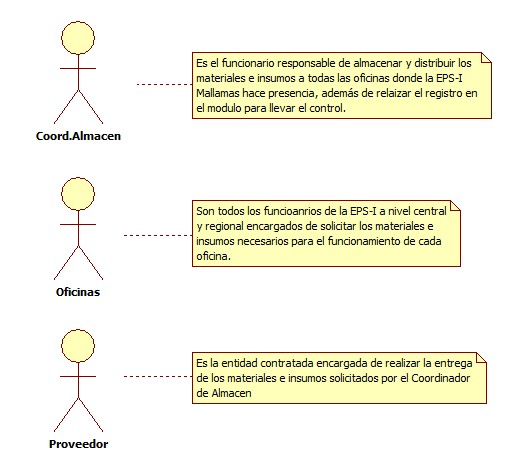
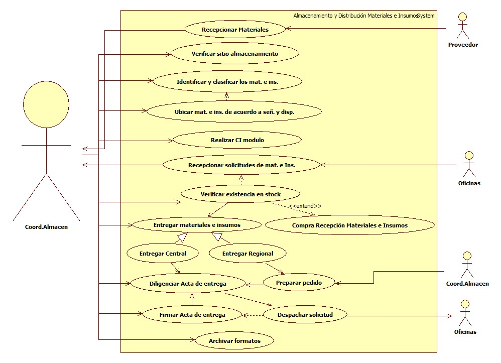

# SISTEMA DE INFORMACIÓN ALMACENAMIENTO Y DISTRIBUCIÓN DE MATERIALES E INSUMOS

Garantizar el adecuado almacenamiento de materiales e insumos, con el fin de distribuir a las oficinas de mallamas EPS-I elementos de calidad

## 1. MODELADO DEL SISTEMA DE INFORMACIÓN

### 1.1 ACTORES ALMACENAMIENTO Y DISTRIBUCIÓN DE MATERIALES E INSUMOS

### 1.2 IDENTIFICACIÓN DE LOS CASOS DE USO ALMACENAMIENTO Y DISTRIBUCIÓN DE MATERIALES E INSUMOS

| Número | Procesos del Sistema de Información |
| ------ | ----------------------------------- |
| 1      | Recepcionar Materiales             |
| 2      | Verificar sitio almacenamiento            |
| 3      | Identificar y clasificar los mat. e ins.   |
| 4      | Ubicar mat. e ins. de acuerdo a señ. y disp.   |
| 5      | Realizar CI modulo            |
| 6      | Recepcionar solicitudes de mat. e Ins.          |
| 7      | Verificar existencia en stock             |
| 8      | Entregar materiales e insumos             |
| 9      | Compra Recepción Materiales e Insumos            |
| 10     | Entregar Central             |
| 11     | Entregar Regional             |
| 12     | Diligenciar Acta de entrega             |
| 13     | Preparar pedido            |
| 14     | Firmar Acta de entrega             |
| 15     | Despachar solicitud             |
| 16     | Archivar formatos             |

### 1.3 DESCRIPCIÓN DEL DIAGRAMA DE CASOS DE USO ALMACENAMIENTO Y DISTRIBUCIÓN DE MATERIALES E INSUMOS

| **1. Caso de Uso** | Alamacenamineto y Distribución de Materiales e Insumos |
| - | - |
| **2. Descripción** | Distribuir materiales e insumos de buena calidad al realizar un buen proceso de almacenamiento |
| **3. Actor(es)**   | Coordinador de Almacen, Oficinas y Proveedor |
| **4. Pre Condiciones** | Contar con materiales comprados y recepcionados |
| **5. Pos Condiciones** | Acta de entrega de materiales e insumos|
| **6. Flujo de Eventos** |
| *Actor(es)* | *Sistema* |
| 1. El coordinador de Almacen realiza la recepción de materiales e insumos |  |
| 2. El coordinador de Almacen verifica el sitio de almacenamiento |  |
| 3. El coordinador de Almacen identifica y clasifica los materiales e insumos |  |
| 4. El coordinador de Almacen ubica los materiales e insumos de acuerdo a señalización y disposición | 5. Ingresa al modulo de inventarios y da click en reportes (ver I001) |
|  | 6. Registra las fechas a verificar y da click en generar reporte e imprime (ver I002, I003) |
|  | 7. Recepciona las solicitudes de materiales e insumos de las oficinas |
| 8. El coordinador de Almacen con el inventario del sistema verifica existencia en stock|  |
| 8.1. El coordinador de Almacen constata que no hay todo lo requerido y pasa a proceso de Compra y Recpeción de Materiales e Insumos |  |
| 9. El coordinador de Almacen realiza la entrega de materiales e insumos de manera directa para los funcionarios de la central |  |
| 10. El coordinador de Almacen prepara pedido si la solicitud es de una regional |  |
|  | 11. Diligencia acta de entrega en modulo Inventarios (ver I004, I005, I006, I007, I008, I009, I010, I011) |
| 12. El coordinador de Almacen firma el acta de entrega junto con la persona que recibe |  |
| 13. El coordinador de Almacen despacha los materiales e insumos a la regional que solicitó |  |
| 14. El coordinador de Almacen archiva todos los formatos que se utilizaron en el proceos |  |
| **7. Requerimiento Asociado** | R001, R002 |
| **8. Interfaz de Usuario Asociada** | I001, I004, I005, I006, I007, I008, I009, I010, I011 |
| **9. Formato de Usuario Asociado** | F001 |

### 1.4 MODELADO VISUAL DEL CASO DE USO ALMACENAMIENTO Y DISTRIBUCIÓN DE MATERIALES E INSUMOS

## 2. ESPECIFICACIÓN DEL SISTEMA DE INFORMACIÓN ALMACENAMIENTO Y DISTRIBUCIÓN DE MATERIALES E INSUMOS

| Término | Descripción |
| ------- | ----------- |
| Mat. | Meteriales               |
| Ins. | Insumos              |
| Señ. | Señalización             |
| Disp. | Disposición              |
| CI | Control de inventarios            |

## 3. ESPECIFICACIÓN DE REQUERIMIENTOS

| **N°** | **Tipo** | **Descripción** |
| - | - | - |
| R001 | Proceso | Solicitud de materiales e insumos |
| R002 | Proceso | Acta de entrega |

## 4. ESPECIFICACIÓN DE LA INTERFACE DE USUARIO

| **1. Número** |
| - |
| I001 |
| **2. Propósito de la Interfaz** |
| Mostrar como ingresar para reporte de inventarios  |
| **3. Gráfica de la Interfaz**|
|  |

| **1. Número** |
| - |
| I002 |
| **2. Propósito de la Interfaz** |
| Mostrar como generar un reporte de inventarios  |
| **3. Gráfica de la Interfaz**|
|  |

| **1. Número** |
| - |
| I003 |
| **2. Propósito de la Interfaz** |
| Indicar el listado de inventario a imprimir |
| **3. Gráfica de la Interfaz**|
|  |

| **1. Número** |
| - |
| I004 |
| **2. Propósito de la Interfaz** |
| Mostar el registro de movimientos|
| **3. Gráfica de la Interfaz**|
|  |

| **1. Número** |
| - |
| I005 |
| **2. Propósito de la Interfaz** |
| Indicar la selección que se debe realizar |
| **3. Gráfica de la Interfaz**|
|  |

| **1. Número** |
| - |
| I006 |
| **2. Propósito de la Interfaz** |
| Indicar como seleccionar una dependencia u oficina |
| **3. Gráfica de la Interfaz**|
|  |

| **1. Número** |
| - |
| I007 |
| **2. Propósito de la Interfaz** |
| Indica como ingresar articulos al acta de entrega |
| **3. Gráfica de la Interfaz**|
|  |

| **1. Número** |
| - |
| I008 |
| **2. Propósito de la Interfaz** |
| Indica como buscar los elementos|
| **3. Gráfica de la Interfaz**|
|  |

| **1. Número** |
| - |
| I009 |
| **2. Propósito de la Interfaz** |
| Agregar elementos seleccionados |
| **3. Gráfica de la Interfaz**|
|  |

| **1. Número** |
| - |
| I010 |
| **2. Propósito de la Interfaz** |
| Confirmar, guardar e imprimir acta |
| **3. Gráfica de la Interfaz**|
|  |

| **1. Número** |
| - |
| I011 |
| **2. Propósito de la Interfaz** |
| Indica como imprimir acta de entrega |
| **3. Gráfica de la Interfaz**|
|  |

### 4.1 IDENTIFICACIÓN DE PERFILES Y DIÁLOGOS

| **1. Nombre del Perfil** |
| - |
| Administrador |
| **2. Opciones a las que tiene Acceso**|
| Parametrizar, Ingresar información, generar consolidados y eliminar |
| **3. Tipo de Acceso** |
| Editar, guardar, eliminar y generar reportes|

### 4.2 ESPECIFICACIÓN DE FORMATOS DE USUARIO

| Número | Nombre del Formato |
| ------ | ----------------------------------- |
| F001   | Consolidado Plan de necesidades            |