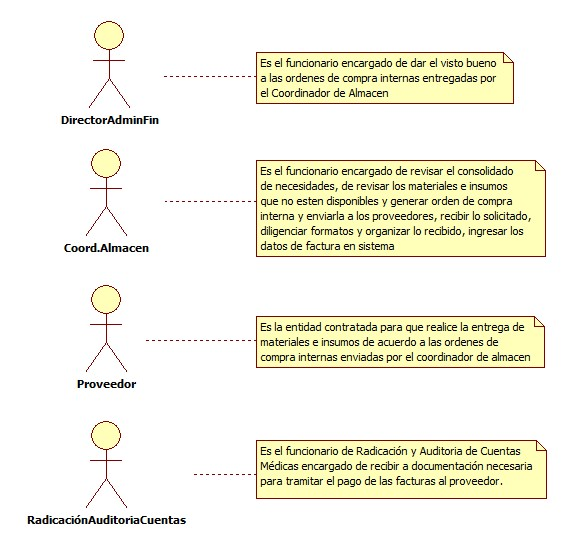
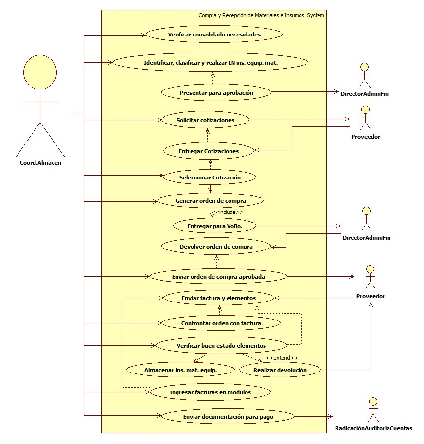

# SISTEMA DE INFORMACIÓN COMPRA Y RECEPCIÓN DE MATERIALES E INSUMOS

Contar con suficientes materiales e insumos para distribuir a los funcionarios de todas las oficinas donde Mallamas EPS-I hace presencia, además de que el mismo cuente con buenas condiciones de calidad.

## 1. MODELADO DEL SISTEMA DE INFORMACIÓN

### 1.1 ACTORES COMPRA Y RECEPCIÓN DE MATERIALES E INSUMOS

### 1.2 IDENTIFICACIÓN DE LOS CASOS DE USO COMPRA Y RECEPCIÓN DE MATERIALES E INSUMOS

| Número | Procesos del Sistema de Información |
| ------ | ----------------------------------- |
| 1      | Verificar consolidado necesidades              |
| 2      | Identificar, clasificar y realizar LN ins. equip. mat.             |
| 3      | Presentar para aprobación             |
| 4      | Solicitar cotizaciones             |
| 5      | Entregar Cotizaciones             |
| 6      | Seleccionar Cotización             |
| 7      | Generar orden de compra             |
| 8      | Entregar para VoBo.             |
| 9      | Devolver orden de compra             |
| 10     | Enviar orden de compra aprobada             |
| 11     | Enviar factura y elementos             |
| 12     | Confrontar orden con factura             |
| 13     | Verificar buen estado elementos             |
| 14     | Almacenar insumos             |
| 15     | Realizar devolución             |
| 16     | Ingresar facturas en modulos             |
| 17     | Enviar documentación para pago             |

### 1.3 DESCRIPCIÓN DEL DIAGRAMA DE CASOS DE USO COMPRA Y RECEPCIÓN DE MATERIALES E INSUMOS

| **1. Caso de Uso** | Compra y Recepción de Materiales e Insumos |
| - | - |
| **2. Descripción** | Disponer de materiales en insumos de buena calidad para dotar a todas las oficinas de Mallamas EPS-I |
| **3. Actor(es)**   | Coordinador de Almacen, Director Administrativo y Financiero, Radicación y Auditoria de Cuentas y Proveedor |
| **4. Pre Condiciones** | Contar con evaluación y selección de proveedores |
| **5. Pos Condiciones** | Acta de recepción de materiales e insumos|
| **6. Flujo de Eventos** |
| *Actor(es)* | *Sistema* |
| 1. El Coordinador de Almacen verifica el consolidado de necesidades|  |
| 2. El Coordinador de Almacen identifica, clasifica y realizar el listado de nuevos insumos, equipos, materiales según la lista de necesidades y presenta a Director Adminsitrativo y Financiero para aprobación |  |
| 3. El Coordinador de Almacen realiza cotizaciones de materiales, insumos, equipos a los proveedores | 4. El proveedor enviá por correo electrónico las cotizaciones |
| 5. El Coordinador de Almacen selecciona las cotizaciones | 6. Genera e imprime Orden de Compra interna (Exce) |
| 7. El Coordinador de Almacen presenta orden de compra interna a Director Administrativo y Financiero para que sea aprobada| 8. Enviá orden de compra interna aprobada al proveedor |
| 9. El Coordinador de Almacen verifica orden de compra interna con factura entregada por proveedor|  |
| 10. El Coordinador de Almacen verifica que los elementos comprados se encuentren en condiciones de calidad, cantidad y funcionalidad |  |
| 11. El Coordinador de Almacen realiza devolución de los elementos que no cumplan las condiciones contratadas| 12. Diligencia formato de devolución (excel) |
| 13. El Coordinador de Almacen almacena los insumos,  materiales y equipos | 14. Ingresa facturas en modulo (ver I001, I002, I003, I004)|
| 15. El Coordinador de Almacen envia a Radicación y Auditoria de Cuentas documentación para pago de facturas|  |
| **7. Requerimiento Asociado** | R001, R002, R003 |
| **8. Interfaz de Usuario Asociada** | I001, I002, I003, I004, I005  |
| **9. Formato de Usuario Asociado** | F001, F002  |

### 1.4 MODELADO VISUAL DEL CASO DE USO COMPRA Y RECEPCIÓN DE MATERIALES E INSUMOS

## 2. ESPECIFICACIÓN DEL SISTEMA DE INFORMACIÓN COMPRA Y RECEPCIÓN DE MATERIALES E INSUMOS

| Término | Descripción |
| ------- | ----------- |
| LN  | Listado de Nuevos              |
| Ins. | Insumos             |
| Equip.| Equipos               |
| Mat. | Materiales              |
| VoBo. | Visto Bueno              |

## 3. ESPECIFICACIÓN DE REQUERIMIENTOS

| **N°** | **Tipo** | **Descripción** |
| - | - | - |
| R001 | Proceso | Selección y Evaluación de  Proveedores|
| R002 | Físico | Recepción de materiales. insumos y equipos |

## 4. ESPECIFICACIÓN DE LA INTERFACE DE USUARIO

| **1. Número** |
| - |
| I001 |
| **2. Propósito de la Interfaz** |
| Indicar los pasos para hacer el ingreso de compra |
| **3. Gráfica de la Interfaz**|
|  |

| **1. Número** |
| - |
| I002 |
| **2. Propósito de la Interfaz** |
| Indicar como acceder para realizar el ingreso de compra |
| **3. Gráfica de la Interfaz**|
|  |

| **1. Número** |
| - |
| I003 |
| **2. Propósito de la Interfaz** |
| Confirmar el ingreso de compra |
| **3. Gráfica de la Interfaz**|
|  |

| **1. Número** |
| - |
| I004 |
| **2. Propósito de la Interfaz** |
| Mostrar el acta de ingreso |
| **3. Gráfica de la Interfaz**|
|  |

### 4.1 IDENTIFICACIÓN DE PERFILES Y DIÁLOGOS

| **1. Nombre del Perfil** |
| - |
| Administrador |
| **2. Opciones a las que tiene Acceso**|
| Parametrizar, Ingresar información, generar consolidados y eliminar |
| **3. Tipo de Acceso** |
| Editar, guardar, eliminar y generar reportes |

### 4.2 ESPECIFICACIÓN DE FORMATOS DE USUARIO

| Número | Nombre del Formato |
| ------ | ----------------------------------- |
| F001   | Consolidado Necesidades             |
| F002   | Devolución de Materiales, Insumos y Equipos       |
| F003   | Acta de reunión              |