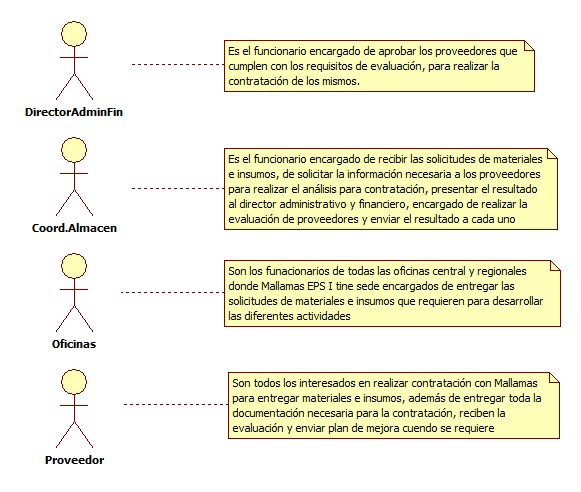
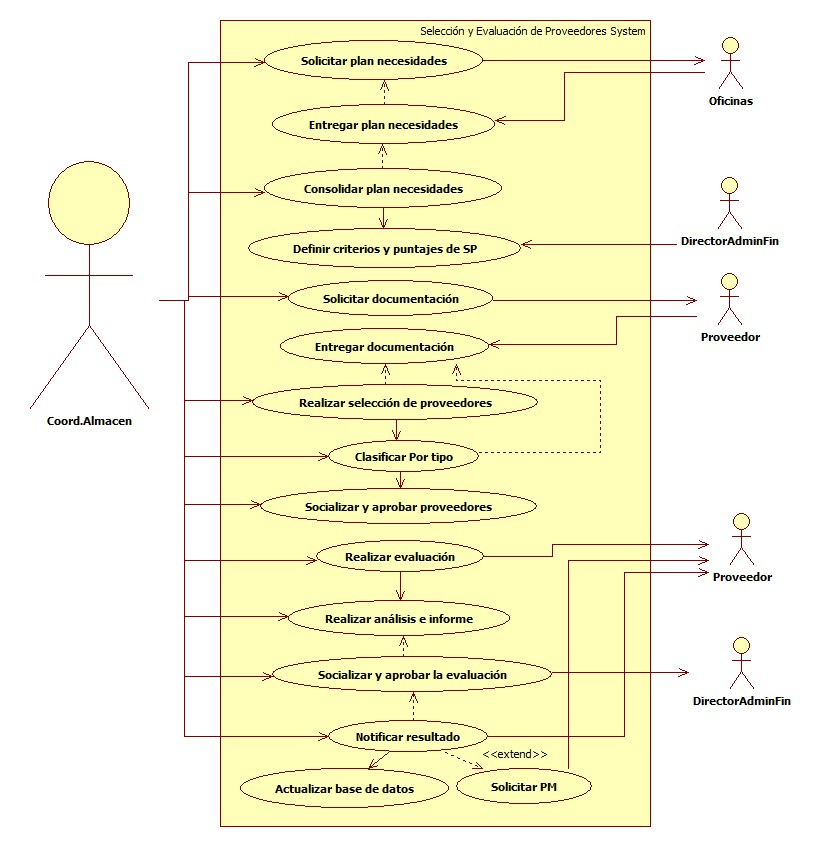

# SISTEMA DE INFORMACIÓN SELECCIÓN Y EVALUACIÓN DE PROVEEDORES

Seleccionar y evaluar los proveedores de productos y servicios que cumplan con los criterios establecidos por la EPS para la contratación.

## 1. MODELADO DEL SISTEMA DE INFORMACIÓN

### 1.1 ACTORES SELECCIÓN Y EVALUACIÓN DE PROVEEDORES

### 1.2 IDENTIFICACIÓN DE LOS CASOS DE USO SELECCIÓN Y EVALUACIÓN DE PROVEEDORES

| Número | Procesos del Sistema de Información |
| ------ | ----------------------------------- |
| 1      | Solicitar plan necesidades             |
| 2      | Entregar plan necesidades             |
| 3      | Consolidar plan necesidades            |
| 4      | Definir criterios y puntajes de SP             |
| 5      | Solicitar documentación             |
| 6      | Entregar documentación             |
| 7      | Realizar selección de proveedores             |
| 8      | Clasificar Por tipo             |
| 9      | Socializar y aprobar proveedores             |
| 10     | Realizar evaluación             |
| 11     | Realizar análisis e informe             |
| 12     | Socializar y aprobar la evaluación            |
| 13     | Notificar resultado            |
| 14     | Actualizar base de datos            |
| 15     | Solicitar PM            |

### 1.3 DESCRIPCIÓN DEL DIAGRAMA DE CASOS DE USO SELECCIÓN Y EVALUACIÓN DE PROVEEDORES

| **1. Caso de Uso** | Selección y Evaluación de Proveedores |
| - | - |
| **2. Descripción** | Realizar una buena selección de proveedores de materiales, insumos y equipos, con el fin de garantizar oportunidad en la entrega de los mismos a los diferentes procesos de la EPS |
| **3. Actor(es)**   | Coordinador de Almacen, Director Administrativo y Financiero, Oficinas y Proveedores |
| **4. Pre Condiciones** | Contar con solicitudes de insumos, materiales y equipos |
| **5. Pos Condiciones** | Informe de evaluación de proveedores |
| **6. Flujo de Eventos** |
| *Actor(es)* | *Sistema* |
| 1. El Coordinador de Almacen solicita el plan de necesidades a todas las oficinas sede central| 2. Enviá por correo electrónico solicitudes de plan de necesidades a oficinas regionales |
| 3. Los funcionarios diligencian el plan de necesidades | 4. Envián por correo electrónico el plan de necesidades diligenciado |
| 5. El Coordinador de Almacen recepciona las solicitudes | 6. Consolida todas las solicitudes (excel) |
| 7. El Coordinador de Almacen solicita a Director Administrativo y Financiero el visto bueno |   |
| 8. El Director Administrativo y Financiero define los cirterios de evaluación para seleccionar los proveedores   | 9. Diligencia formato Selección de proveedores (Excel) |
| 10. El Coordinador de Almacen solicita a los posibles proveedores la documentación requerida de acuerdo a los criterios de selección de proveedores  | 11. Realiza la evaluación de selección de proveedores  de acuerdo a criterios definidos |
| 12. El Coordinador de Almacen clasifica a los proveedores por tipo de insumos o servicios |  |
| 13. El Coordinador de Almacen socializa al Director Administrativo y Financiero el resultado de la selección y solicita aprobación de proveedores seleccionados| |
| 14. El Coordinador de Almacen realiza acta de reunión  |  |
| 15. El Coordinador de Almacen define criterios de evaluación de cumplimiento de proveedores  | 16. Diligencia campos en formato de evaluación de proveedores (Excel) |
|  | 17. Realiza análisis de evaluación de proveedores e informe |
| 18. El Coordinador de Almacen solicializa a Director Administrativo y Financiero el resultado de evaluación de proveedores |  |
| 19. El Director Administrativo y Financiero aprueba evaluación | |
| 20. El Coordinador de Almacen realiza oficios para notificar a proveedor el resultado  | 21. Notifica por correo electrónico el resultado de evaluación y solicita plan de mejora de acuerdoa resultado |
|  | 22. Actualiza base de datos de proveedores (Excel) |
| **7. Requerimiento Asociado** | R001, R002 |
| **8. Interfaz de Usuario Asociada** |  |
| **9. Formato de Usuario Asociado** | F001, F002, F003, F004, F005 |

### 1.4 MODELADO VISUAL DEL CASO DE USO SELECCIÓN Y EVALUACIÓN DE PROVEEDORES

## 2. ESPECIFICACIÓN DEL SISTEMA DE INFORMACIÓN SELECCIÓN Y EVALUACIÓN DE PROVEEDORES

| Término | Descripción |
| ------- | ----------- |
| SP | Selección de Proveedores              |
| PM | Plan de Mejora            |

## 3. ESPECIFICACIÓN DE REQUERIMIENTOS

| **N°** | **Tipo** | **Descripción** |
| - | - | - |
| R001  | Físico  | Plan de Necesidades  |
| R002  | Proceso  | Plan de mejora  |

## 4. ESPECIFICACIÓN DE LA INTERFACE DE USUARIO

| **1. Número** |
| - |
|  |
| **2. Propósito de la Interfaz** |
|  |
| **3. Gráfica de la Interfaz**|
|  |

### 4.1 IDENTIFICACIÓN DE PERFILES Y DIÁLOGOS

| **1. Nombre del Perfil** |
| - |
|  |
| **2. Opciones a las que tiene Acceso**|
|  |
| **3. Tipo de Acceso** |
|  |

### 4.2 ESPECIFICACIÓN DE FORMATOS DE USUARIO

| Número | Nombre del Formato |
| ------ | ----------------------------------- |
| F001   | Plan de Necesidades            |
| F002   | Consolidado Plan de Necesidades       |
| F003   | Selección de Proveedores              |
| F004   | Acta de reunión              |
| F005   | Evaluación proveedores             |