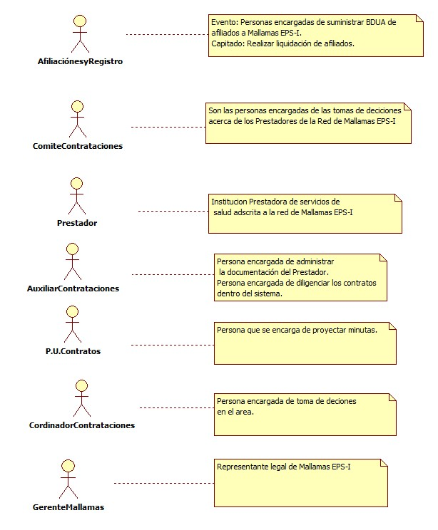
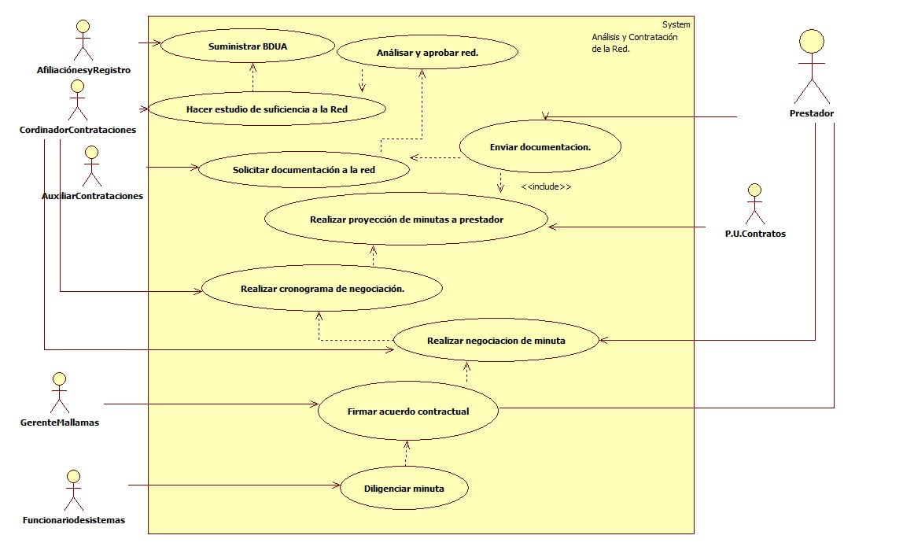

# SISTEMA DE INFORMACIÓN ANÁLISIS Y CONTRATACIÓN DE LA RED

Se revisa los prestadores que van a formar parte de la red de la próxima vigencia y se analiza la suficiencia a la hora de prestar los servicios a nuestros afiliados,una vez se tenga establecida la red se procede a hacer la contratación contractual.

## 1. MODELADO DEL SISTEMA DE INFORMACIÓN

### 1.1 ACTORES ANÁLISIS Y CONTRATACIÓN DE LA RED

### 1.2 IDENTIFICACIÓN DE LOS CASOS DE USO ANÁLISIS Y CONTRATACIÓN DE LA RED

| Número | Procesos del Sistema de Información |
| ------ | ----------------------------------- |
| 1      |Suministro de BDUA.  |
| 2      | Hacer estudio de suficiencia de la red            |
| 3 | Analizar y aprobar la red |
| 4 | Solicitar documentación a la red |
| 5 | Enviar documentación por parte de lso prestadores. |
| 6 | Realizar proyección y envió de minutas contractuales.|
| 7 | Realizar cronograma de negociación |
| 8 | Realizar negociación de la minuta |
| 9 | Firmar acuerdo contractual.|
| 10 | Diligenciar minuta dentro del sistema de contrataciones.|

### 1.3 DESCRIPCIÓN DEL DIAGRAMA DE CASOS DE USO ANÁLISIS Y CONTRATACIÓN DE LA RED

| | |
| - | - |
| **1. Caso de Uso** | Análisis y contratación de la red. |
| **2. Descripción** | Realizar análisis de suficiencia a la red para verificar si es suficiente para la atención a la población afiliada y poder estabalecer la red para contratación. |
| **3. Actor(es)**   | Afiliaciones y registro, Cordinador de Contrataciones, Comite de Contrataciones, auxiliar de contrataciones, Profesion universitario de Contratos, Prestador,Gerente de Mallamas EPS-I |
| **4. Pre Condiciones** | Tener BDUA de Mallamas EPS-I |
| **5. Pos Condiciones** | Red establecida para la prestación de servicios para afiliados de Mallamas EPS-I.|
| **6. Flujo de Eventos** |
| *Actor(es)* | *Sistema* |
| 1. Cordinador de contrataciones solicita BDUA a aseguramiento.|  |
| 2. Cordinador de  contrataciones realiza el estudio de suficiencia a la red |  |
| 3.El comité de contrataciones aprueba la red para inicar la contratación  |  |
| | 4.Presentar formato de solicitud de documentacion para el Prestador.| 
| 5. El Auxiliar de archivo diligencia la solicitud de la documentación contractual a los Prestadores||
| 6.El Prestador enviá la documentación solicitada .| |
|7. Desde el area de contrataciones se proyecta y enviá la minuta al prestador teniendo encuenta lo etnocultural de la entidad.| 8. Se llenan todos los datos del prestador dentro del Sistema de Contrataciones para poder generar el numero del contrato y enviar al Prestador. | 
| 9. Se realiza un cronograma para asignar fechas a los prestadores para realizar concertaciones de las tarifas y actividades a contratar. | |
|10.Por parte de contraciones se invita a el Prestador para concertar tarifas y actividades para la minuta contractual | |
|11. Se firma la minuta del acuerdo contractual por parte de los dos representantes legales. |
|12. Se carga la minuta dentro del sistema de contrataciónes. | 13. Se parametriza la minuta con todo los acuerdos contractuales. | |
| **7. Requerimiento Asociado** | R001, R002. |
| **8. Interfaz de Usuario Asociada** |  |
| **9. Formato de Usuario Asociado** | F001, F002. |

### 1.4 MODELADO VISUAL DEL CASO DE USO ANÁLISIS Y CONTRATACIÓN DE LA RED

## 2. ESPECIFICACIÓN DEL SISTEMA DE INFORMACIÓN ANÁLISIS Y CONTRATACIÓN DE LA RED

| Término | Descripción |
| ------- | ----------- |
| BDUA | Base de Datos Única de Afiliados|
| MINUTA | Documento que se realiza para el acuerdo precontractual. |

## 3. ESPECIFICACIÓN DE REQUERIMIENTOS

| | | |
| - | - | - |
| **N°** | **Tipo** | **Descripción** |
| R001 | Proceso | BDUA de afiliados a Mallamas EPS-I |
| R002 | Físico | Formato de Solicitud de documentación actualizada para prestadores.  |

## 4. ESPECIFICACIÓN DE LA INTERFACE DE USUARIO

| |
| - |
| **1. Número** |
| |
| **2. Propósito de la Interfaz** |
|  |
| **3. Gráfica de la Interfaz**|
|  |

### 4.1 IDENTIFICACIÓN DE PERFILES Y DIÁLOGOS

| **1. Nombre del Perfil** |
| - |
| Cordinadorcontrataciones |
| **2. Opciones a las que tiene Acceso**|
| Acceso a Contratos,manuales,tarifas,servicios,cobertura,|
| **3. Tipo de Acceso** |
| Consultar,Crear,Editar,Exportar e Imprimir | 

| **1. Nombre del Perfil** |
| - |
| AuxiliarContrataciones |
| **2. Opciones a las que tiene Acceso**|
| Acceso subir soportes |
| **3. Tipo de Acceso** |
| Escanear,Guardar,Eliminar. |

| **1. Nombre del Perfil** |
| - |
| Administrador contrataciones |
| **2. Opciones a las que tiene Acceso**|
| Acceso a Contratos,manuales,tarifas,servicios,cobertura,asignar ips,cerrar contratos.|
| **3. Tipo de Acceso** |
| Consultar,Crear,Editar, cargar actividades,Eliminar,Cerrar,Exportar e Imprimir. ||

### 4.2 ESPECIFICACIÓN DE FORMATOS DE USUARIO

| Número | Nombre del Formato |
| ------ | ----------------------------------- |
| F001   | Acta de reunión con el Comité |
| F002 |   Minuta contractual | 