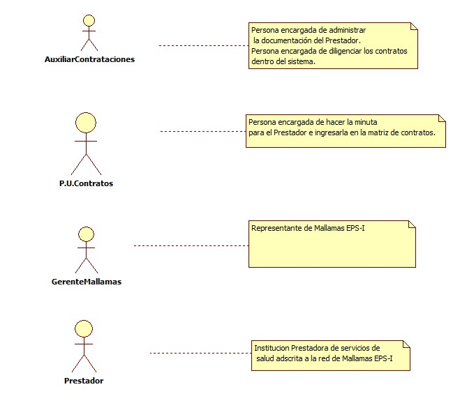
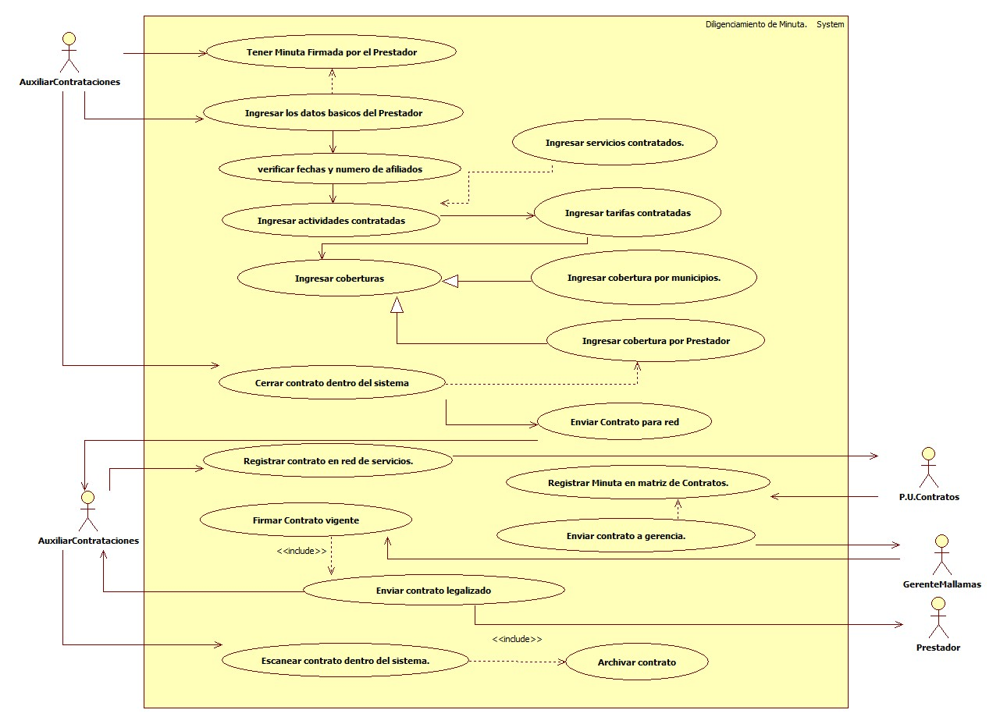
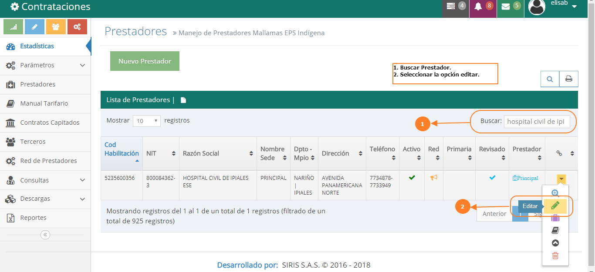
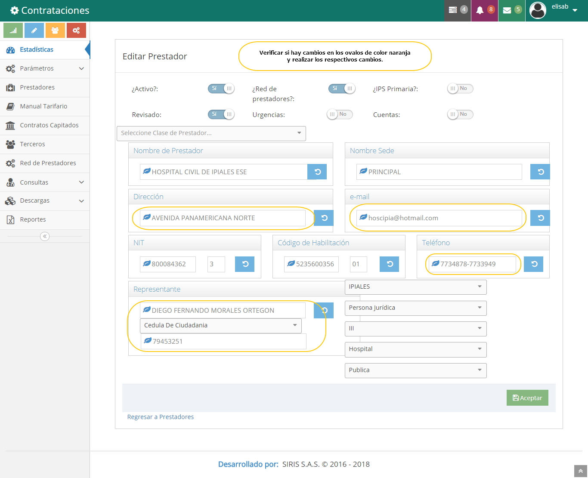
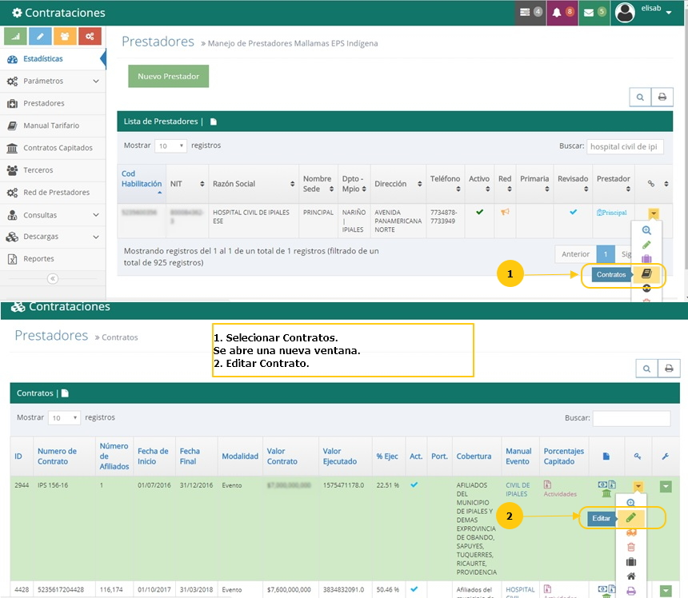
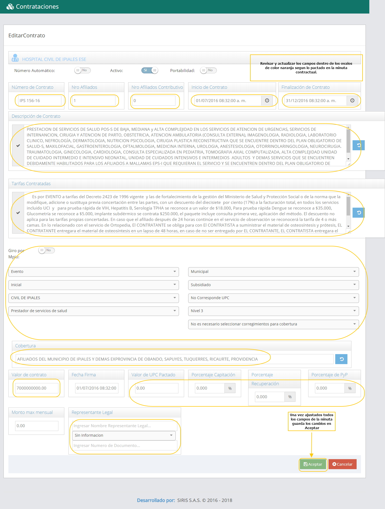
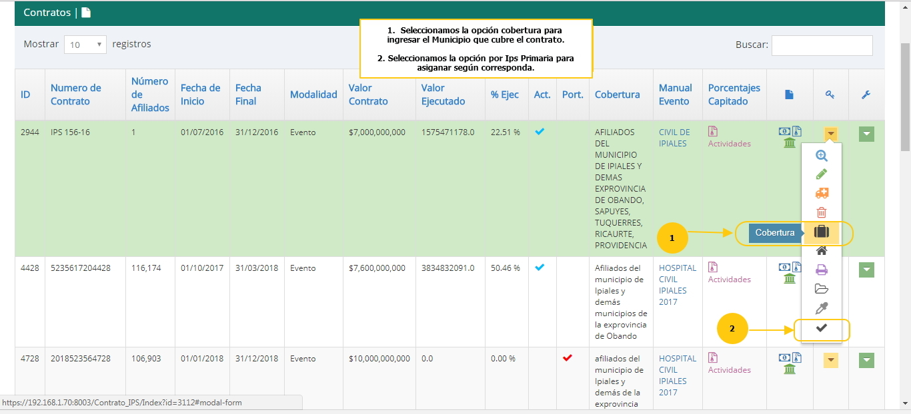
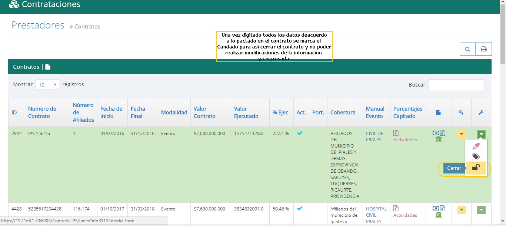

# SISTEMA DE INFORMACIÓN INFORMACIÓN DILIGENCIAMINETO DE MINUTA.

Se realiza el cargue de la minuta dentro del Sistema de Contrataciones para que asi la puedan ver los demás procesos y se pueda generar autorizaciones para las prestaciones de servicios en salud y ademas se pueda identificar las actividades y tarifas contratadas.

## 1. MODELADO DEL SISTEMA DE INFORMACIÓN DILIGENCIAMINETO DE MINUTA.

### 1.1 ACTORES DILIGENCIAMINETO DE MINUTA

### 1.2 IDENTIFICACIÓN DE LOS CASOS DE USO DILIGENCIAMINETO DE MINUTA.

| Número | Procesos del Sistema de Información |
| ------ | ----------------------------------- |
| 1      |Tener minuta firmada por el Prestador             |
| 2      |Ingresar los datos básicos del Prestador     |
| 3 | Verificar fechas y números de afiliados |
| 4 | Ingresar actividades de contrato |
| 5 | Ingresar servicios contratados |
| 6 | Ingresar tarifas contratadas |
| 7 | Ingresar cobertura |
| 8 | Ingresar cobertura por municipios |
| 9 | Ingresar cobertura por Prestador |
| 10 | Crear contrato dentro del Sistema |
| 11 | Enviar contrato para red |
| 12 | Registrar contrato en red de servicios |
| 13 | Registrar minuta en matriz de contratos |
| 14 | Enviar contrato a gerencia |
| 15 | Firmar contrato vigente |
| 16 | Enviár  contrato legalizado a Contrataciones y al Prestador. |
| 17 | Escanear contrato dentro del Sistema de Contrataciones |
| 18 | Archivar Contrato |

### 1.3 DESCRIPCIÓN DEL DIAGRAMA DE CASOS DE USO  DILIGENCIAMINETO DE MINUTA.
| | |
| - | - |
| **1. Caso de Uso** | Diligenciamiento Minuta |
| **2. Descripción** | Realizar el ingreso de la minuta, actividades y tarifas contratadas con los Prestadores de la Red adscrita a Mallamas EPS-I. |
| **3. Actor(es)**   | Auxiliar de Contrataciones, Profesional Universitario de Contrataciones, Gerencia y Prestadores. |
| **4. Pre Condiciones** | Contar con Minuta Firmada. |
| **5. Pos Condiciones** | Parametrizar la minuta dentro del sistema de contrataciones para que todos los proceso la puedan ver y hacer sus actividades correspondientes.|
| **6. Flujo de Eventos**||
| *Actor(es)* | *Sistema* |
| 1. Auxiliar de Contrataciones recibe el contrato firmado por parte del Prestador para cargarlo dentro del Sistema Siris.(Ver interfaz I001)|  |
| 2. Auxiliar de Contrataciones actualiza y registra dentro del Sistema los datos básicos. |  3. Se  muestra nit, codigo de habilitación,dirección, teléfonos, correo y representante legal.(Ver interfaz I002) |
| 4. Auxiliar de contrataciones verifica afiliados y fechas. | 5. Se configura la fecha de inicio,fecha de finalización del contrato y el número de afiliados subsidiados y contributivos correspondientes a el contrato.(Ver interfaz I003)|
| 6. Auxiliar de Contrataciones ingresa las actividades que se le contrata al Prestador.| 7.Ingresamos al contrato y se diligencia el cuadro de texto de Descripción del Contrato y el cuadro de texto de Tarifas Contratadas.(Ver interfaz I004)| 
| 8.Auxiliar de Contrataciones dilegencia todos los datos de coberturas dentro del Sistema. | 9. Se ingresa en el item de cobertura y se seleciona los municipios corresponde a la cobertura de este contrato,luego de esto se selecciona la cobertura por municipio.(Ver interfaz I005)|
| 10. Auxiliar de Contrataciones una vez ingresado todos estos datos cierra el contrato.| 11. Auxiliar de contrataciones cierra el contrato para que se no se pueda generar ninguna modificación más. (Ver interfaz I006) |  
| 12. Auxiliar de Contrataciones pasa el contrato para que se alimente la red de servicios.| |
|13. Auxiliar de contrataciones incluye el contrato ya firmado en la red de servicios y lo pasa al profesional universitario de contratos.||
|14. El profesional Universitario de Contrataciones registra dentro de la matriz de contratos la minuta del Prestador y posteriormente se remite a gerencia para la firma correpondiente del gerente de Mallamas EPS-I.   | |
| 15. Gerencia recibe el contrato para ser firmado por el gerente de Mallamas EPS-I y se despacha un contrato en original al Prestador ya firmado por Mallamas y el otro se devuelve a contrataciones con las dos firmas para ser archivado.  ||
|16. Auxiliar de Contrataciones recibe el contrato firmado por las dos partes y escanea dentro del Sistema el Contrato y lo archiva en su carpeta correspondientemente. | 17. Se marca en el Sistema en soportes y se digitaliza el contrato en el Prestador segun correponda en el Sistema.|
| **7. Requerimiento Asociado** | R001. |
| **8. Interfaz de Usuario Asociada** | I001,I002, I003, I004, I005, I006. |
| **9. Formato de Usuario Asociado** | F001. |

### 1.4 MODELADO VISUAL DEL CASO DE USO  DILIGENCIAMINETO DE MINUTA.

## 2. ESPECIFICACIÓN DEL SISTEMA DE INFORMACIÓN  DILIGENCIAMINETO DE MINUTA.

| Término | Descripción |
| ------- | ----------- |
| Minuta |Contrato de Prestación de Servicios.              |
| Item | Icono dentro del Sistema que muestra algo.         |

## 3. ESPECIFICACIÓN DE REQUERIMIENTOS

| | | |
| - | - | - |
| **N°** | **Tipo** | **Descripción** |
| R001 | Físico | Contrato firmado |

## 4. ESPECIFICACIÓN DE LA INTERFACE DE USUARIO

| |
| - |
| **1. Número** |
| I001 |
| **2. Propósito de la Interfaz** |
| Buscar el Prestador que se va actualizar la información y se marca en editar para ingresar a la pagina principal del Prestador..|
| **3. Gráfica de la Interfaz**|
|  |
| **1. Número** |
| I002 |
| **2. Propósito de la Interfaz** |
| Se actualiza los ovalos de color naranja con la nueva información del contrato vigente.|
| **3. Gráfica de la Interfaz**|
|  |
| **1. Número** |
| I003 |
| **2. Propósito de la Interfaz** |
| Se marca en contratos para poder ingresar a la pagina siguiente de los contratos, y una vez estemos en ella seleccionamos el item de editar para ingresar en el contrato..|
| **3. Gráfica de la Interfaz**|
|  |
| **1. Número** |
| I004 |
| **2. Propósito de la Interfaz** |
| Se inica a editar o actualizar todos los datos de los ovalos de color naranja con la información actualizada..|
| **3. Gráfica de la Interfaz**|
|  |
| **1. Número** |
| I005 |
| **2. Propósito de la Interfaz** |
| Se ingresa cobertura por IPS primaria y por Municipio según se observa en los ovalos de la imagen.|
| **3. Gráfica de la Interfaz**|
|  |
| **1. Número** |
| I006 |
| **2. Propósito de la Interfaz** |
| Una vez este todo ingresado se marca el candado como se muestra en la imagen para cerra el contrato y no se puede modificar nada de loq ue que ya se haya ingresado.|
| **3. Gráfica de la Interfaz**|
|  |

### 4.1 IDENTIFICACIÓN DE PERFILES Y DIÁLOGOS

| |
| - |
| **1. Nombre del Perfil** |
| Administrador contrataciones |
| **2. Opciones a las que tiene Acceso**|
| Acceso a Contratos,manuales,tarifas,servicios,cobertura,asignar ips y cerrar contratos.|
| **3. Tipo de Acceso** |
| Consultar,Crear,Editar, cargar actividades,Eliminar,Cerrar,Exportar e Imprimir. ||

### 4.2 ESPECIFICACIÓN DE FORMATOS DE USUARIO

| Número | Nombre del Formato |
| ------ | ----------------------------------- |
| F001   | Anexo de Tarifas  |
|