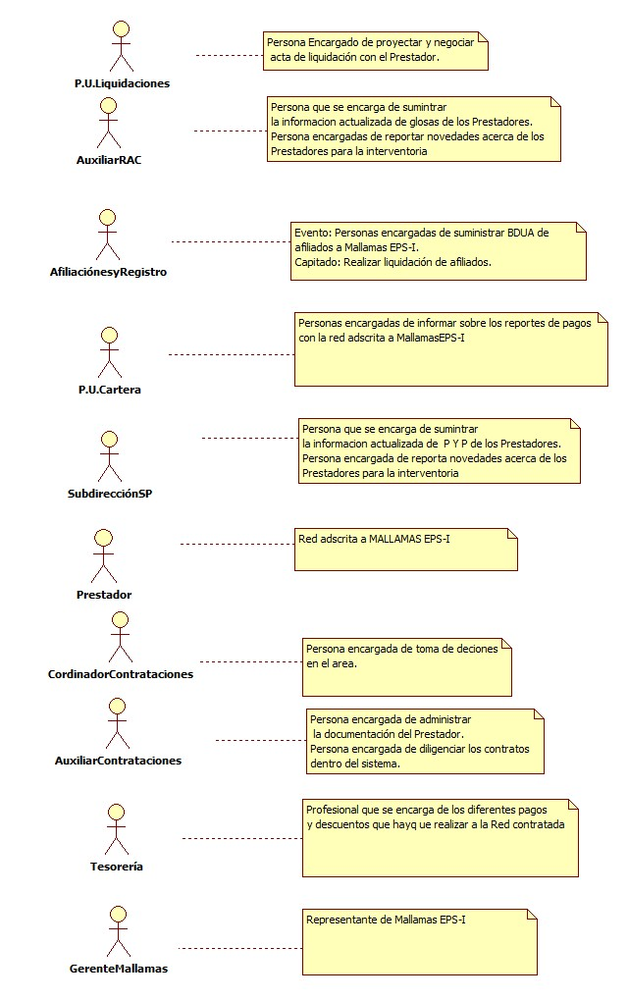
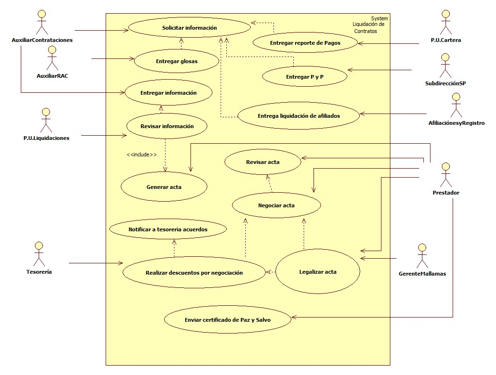

# SISTEMA DE INFORMACIÓN LIQUIDACIÓN DE CONTRATOS.

Realizar la liquidación oportuna y efectiva de los contratos de acuerdo a las vigencias de la Prestación de los servicios.

      
 ## 1. MODELADO DEL SISTEMA DE INFORMACIÓN

### 1.1 ACTORES LIQUIDACIÓN DE CONTRATOS.

### 1.2 IDENTIFICACIÓN DE LOS CASOS DE USO LIQUIDACIÓN DE ONTRATOS.

| Número | Procesos del Sistema de Información |
| ------ | ----------------------------------- |
| 1.     | Solicitar información           |
| 2.      | Entregar información de glosas | 
| 3. |  Entregar información de P Y P |
| 4. | Entregar información de liquidación de afiliados.|
| 5. | Entregar reporte de pagos.|
| 6. | Entregar información consolidada |
| 7. | Revisar información          |
| 8. | Generar acta por parte de Mallamas EPS-I y enviarla al Prestador |
| 9. | Revisar acta por parte del Prestador |
| 10. | Negociar el acta y llegar a un acuerdo de la liquidación contractual |
| 11. | Notificar a Tesorería acuerdos contractuales para descuentos. |
| 12. | Revisar acuerdos por parte de tesorería para posibles descuentos o pagos por parte de Mallamas EPS-I |
| 13. | Legalizar acta con firmas de las dos partes Prestador y Gerente de Mallamas EPS- I |
| 14. | Enviar certificado de paz y salvo. |

### 1.3 DESCRIPCIÓN DEL DIAGRAMA DE CASOS DE USO Liquidación de contratos

| | |
| - | - |
| **1. Caso de Uso** | Liquidación de contratos |
| **2. Descripción** | Realizar la liquidación efectiva y oportuna de los contratos celebrados con la red prestadora de servicios de salud y Mallamas EPS-I. |
| **3. Actor(es)**   | P.U.Liquidaciones, Auxiliar RAC, Afiliaciónes y registro, P.U. Cartera, Subdirección SP, Gerente Mallamas,Prestador, Coordinador de contrataciónes,Auxiliar Contrataciones, Tesoreria.|
| **4. Pre Condiciones** | Tener la red para liquidar |
| **5. Pos Condiciones** | Tener los contratos liquidados de la red de servicios.|
| **6. Flujo de Eventos** ||
| *Actor(es)* | *Sistema* |
| 1. Auxiliar de Contrataciones solicita la información a P y P, Auditoria Medica,Afiliaciones y Cartera. |  |
| 2. Auditoria Medica, P y P,Cartera y afiliaciones entregan la información solicitada a Liquidaciones |  |
| 3. Auxiliar de contrataciones consolida y entrega la información solicitada al P.U. de Liquidaciones.|  |
| 4. El Profesional de Liquidaciones revisa la información y proyecta el acta para enviar al Prestador | 5. Se diligencia el acta y el formato de liquidación de acuerdo a los criterios de Mallamas EPS-I.| 
|6. Se enviá por parte de Liquidaciones la proyección del acta al Prestador para su revisión.| |
| 7. El Prestador revisa los documentos enviados por parte de Mallamas EPS-I y se inicia la negociación del acta por las dos partes. | 8. Se guarda la negociación realizada por las dos partes consolidando la legalización del acta. |
|9. Tesorería procede a realizar los pagos o descuentos según los acuerdos contractuales que se haya realizado con el Prestador||
| 10. Una vez se haya negociado el acta y las dos partes estén de acuerdo se procede a legalizar el acta de liquidación con las dos firmas.| |
| 11. Se recibe por parte de el Prestador el certificado de paz y salvo.| |
| **7. Requerimiento Asociado** | R001, R002 |
| **8. Interfaz de Usuario Asociada** |  |
| **9. Formato de Usuario Asociado** | F001,F002 ,F003. |

### 1.4 MODELADO VISUAL DE LOS CASOS DE USO

## 2. ESPECIFICACIÓN DEL SISTEMA DE INFORMACIÓN

| Término | Descripción |
| ------- | ----------- |
| PYP | Promoción y Prevención.           |
| Glosas | Es una no conformidad que afecta en forma parcial o total el valor de la factura por prestación de servicios de salud.               |

## 3. ESPECIFICACIÓN DE REQUERIMIENTOS

| | | |
| - | - | - |
| **N°** | **Tipo** | **Descripción** |
| R001 | Proceso | Solicitar Red prestadora para liquidar.|
| R002 | Proceso | Solicitar información de glosas,pyp,cartera y afiliacónes. |

## 4. ESPECIFICACIÓN DE LA INTERFACE DE USUARIO

| |
| - |
| **1. Número** |
| |
| **2. Propósito de la Interfaz** |
|  |
| **3. Gráfica de la Interfaz**|
|  |

### 4.1 IDENTIFICACIÓN DE PERFILES Y DIÁLOGOS

| |
| - |
| **1. Nombre del Perfil** |
| <Colocar_Nombre> |
| **2. Opciones a las que tiene Acceso**|
| <Describir_Las_Opciones_a_las_que_tiene_Acceso_el_perfil> |
| **3. Tipo de Acceso** |
| <Colocar_Tipo_Acceso> |

### 4.2 ESPECIFICACIÓN DE FORMATOS OFIMATICOS

| Número | Nombre del Formato |
| ------ | ----------------------------------- |
| F001 | Formato de la red para liquidar |
| F002 | Formato de acta de liquidación |
| F003 | Formato de valores para liquidar |
