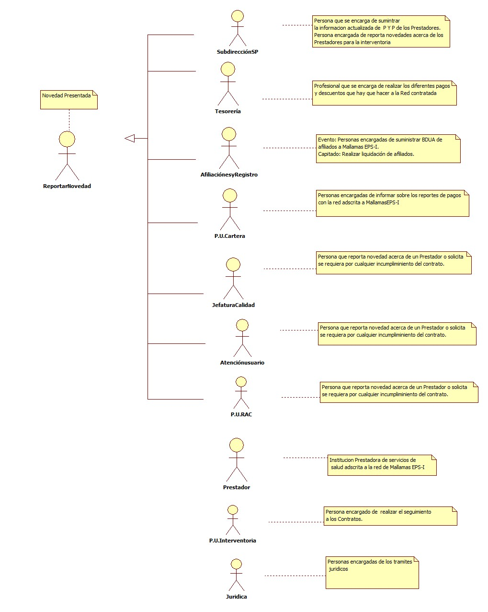
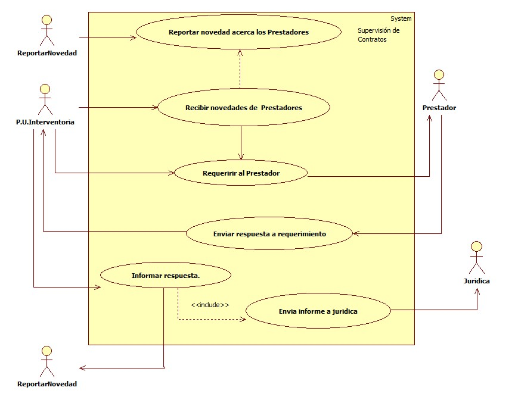

# SISTEMA DE INFORMACIÓN  SUPERVISIÓN DE CONTRATOS.
Realizar la supervisión efectiva y oportuna de los contratos celebrados con la red prestadora de servicios de salud y Mallamas EPS-I.

## 1. MODELADO DEL SISTEMA DE INFORMACIÓN

### 1.1 ACTORES SUPERVISIÓN DE CONTRATOS.

### 1.2 IDENTIFICACIÓN DE LOS CASOS DE USO SUPERVISIÓN DE CONTRATOS.

| Número | Procesos del Sistema de Información |
| ------ | ----------------------------------- |
| 1      | Reportar novedades acerca del Prestador  |
| 2      | Recibir novedades acerca del Prestador   |
| 3 | Requerir al Prestador |
| 4 | E l prestador enviar la respuesta al requerimiento |
| 5 | Informar respuesta acerca de requerimiento |
| 6 | Enviar reporte a jurídica para su tramite legal correspondiente. |

### 1.3 DESCRIPCIÓN DEL DIAGRAMA DE CASOS DE USO SUPERVISIÓN DE CONTRATOS

| | |
| - | - |
| **1. Caso de Uso** | Supervisión de contratos |
| **2. Descripción** | Realizar la supervisión efectiva y oportuna de los contratos celebrados con la red prestadora de servicios de salud y Mallamas EPS-I. |
| **3. Actor(es)**   | Reportar Novedad,Profesional universitario de interventoria,Prestadores,Jurídica. |
| **4. Pre Condiciones** | Contar con red legalizada |
| **5. Pos Condiciones** | Hacer cumplir los acuerdos pactados.|
| **6. Flujo de Eventos** ||
| *Actor(es)* | *Sistema* |
| 1. Se hace el reporte de las novedades que se hayan presentado o se esten presentando con el Prestador a el Profesional de Interventoria.| |
| 2. El Profesional de Interventoria recibe los reportes de novedades y hace un análisis para realizar el requerimeinto  al prestador y la pertinencia del mismo. | |
| 3. El profesional de Interventoria requiere al prestador se informe de la inconsistencias que se notificaron. |  |
| 4. El Prestador da respuesta a la solicitud que se le realizo por parte de Mallamas EPS-I.|  |
| 5. Un a vez el Profesional Universitario tenga la respuesta por parte del Prestador se retroalimenta a el reporte de novedades.||
| 6. De ser necesario según el reporte de la novedad y la respuesta del Prestador se enviá a la oficina de Jurídica para que realice los tramites legales según corresponda.||
| **7. Requerimiento Asociado** | |
| **8. Interfaz de Usuario Asociada** | |
| **9. Formato de Usuario Asociado** | ||

### 1.4 MODELADO VISUAL DEL CASO DE USO SUPERVISIÓN DE CONTRATOS.

## 2. ESPECIFICACIÓN DEL SISTEMA DE INFORMACIÓN 
SUPERVISIÓN DE CONTRATOS

| Término | Descripción |
| ------- | ----------- |
| <Colocar_termino1> | <Colocar_Descripción_1>  |
               

## 3. ESPECIFICACIÓN DE REQUERIMIENTOS

| | | |
| - | - | - |
| **N°** | **Tipo** | **Descripción** |
|  | <Físico/Proceso> | Red prestadora |
| |

## 4. ESPECIFICACIÓN DE LA INTERFACE DE USUARIO

| |
| - |
| **1. Número** |
| |
| **2. Propósito de la Interfaz** |
| <Colocar_Propósito> |
| **3. Gráfica de la Interfaz**|
| |

### 4.1 IDENTIFICACIÓN DE PERFILES Y DIÁLOGOS

| |
| - |
| **1. Nombre del Perfil** |
| |
| **2. Opciones a las que tiene Acceso**|
| |
| **3. Tipo de Acceso** | |

### 4.2 ESPECIFICACIÓN DE FORMATOS DE USUARIO

| Número | Nombre del Formato |
| ------ | ----------------------------------- |
|  |              |
|  |              |
