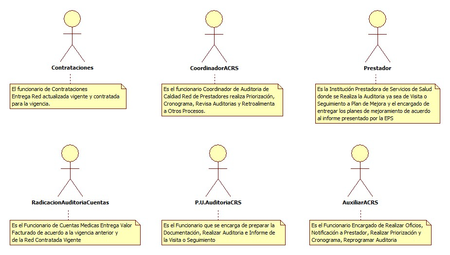
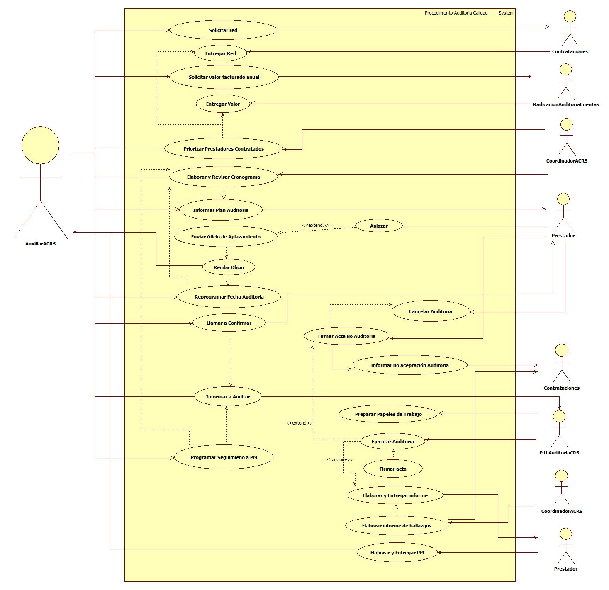

# SISTEMA DE INFORMACIÓN GESTIÓN EVALUACIÓN SERVICIOS DE SALUD

Hacer seguimiento a la calidad en la prestación de los servicios a la red prestadora, a través de auditoria y evaluación de indicadores con el fin de garantizar que la red de prestadores cumpla lo establecido en el SOGC

## 1. MODELADO DEL SISTEMA DE INFORMACIÓN

### 1.1 ACTORES AUDITORIA DE CALIDAD

### 1.2 IDENTIFICACIÓN DE LOS CASOS DE USO AUDITORIA DE CALIDAD

| Número | Procesos del Sistema de Información |
| ------ | ----------------------------------- |
| 1      | Solicitar red              |
| 2      | Solicitar valor facturado              |
| 3      | Solicitar valor facturado              |
| 4      | Priorizar Prestadores Contratados              |
| 5      | Elaborar y Revisar Cronograma              |
| 6      | Informar Plan de Auditoria              |
| 7      | Informar Plan de Auditoria              |
| 8      | Enviar Oficio de Aplazamiento           |
| 9      | Recibir Oficio          |
| 10     | Reprogramar Fecha Auditoria          |
| 11     | Llamar a Confirmar           |
| 12     | Informar a Auditor           |
| 13     | Preparar Papeles de Trabajo          |
| 14     | Cancelar Auditoria          |
| 15     | Firmar Acta No Auditoria         |
| 16     | Informar No Aceptación de Auditoria         |
| 17     | Ejecutar Auditoria         |
| 18     | Firmar acta         |
| 19     | Elaborar y Entregar informe           |
| 20     | Elaborar informe de Hallazgos         |
| 21     | Elaborar y Entregar Plan de Mejora         |
| 22     | Programar Seguimiento a Plan de Mejora           |
| 23     | Aplazar          |

### 1.3 DESCRIPCIÓN DEL DIAGRAMA DE CASOS DE USO AUDITORIA DE CALIDAD

| | |
| - | - |
| **1. Caso de Uso** | Auditoria de Calidad |
| **2. Descripción** | Realizar auditoria a la red para medir la calidad en la prestación de los servicios de salud |
| **3. Actor(es)**   | Coordinador de auditoria de calidad red de servicios, Auxiliar de calidad red de servicios, Profesional Universitario de auditoria de calidad red de servicios, Prestadores, Contrataciones, Cuentas Médicas |
| **4. Pre Condiciones** | Contar con red contratada |
| **5. Pos Condiciones** | Informe de auditoria a prestador|
| **6. Flujo de Eventos** |
| *Actor(es)* | *Sistema* |
| 1. El funcionario Auxiliar de Calidad red de servicios solicita red prestadora a contrataciones|  |
| 2. El funcionario de Contrataciones, entrega la red de prestadores |  |
| 3. El funcionario Auxiliar de calidad red de serviciossolicita el valor facturado a Radicación y Auditoria de Cuentas |  |
| 4. El funcionario de Radicación y Auditoria de Cuentas, entrega los valores facturados | 5. Generar priorización IPS formato excel  |
| | 6. Generar Cronograma de Visitas Formato excel |
| 7. el Funcionario Auxiliar de Calidad red de servicios Revisa cronograma y Notifica a Prestador  |  |
| 8. Respuesta a notificación por el prestador  en caso de que aplace actividad programada y confirmar visita |  |
| 9. El Profesional Universitario de auditoria de calidad red de servicios Prepara documentación para visita |  10. Ejecuta la auditoria con listas de chequeo|
| | 11. Presentar resultados auditoria por medio de un informe|
| | 12. Generar Acta de Auditoria|
| 13. El Prestador genera plan de mejora con los hallazgos |14. Realizar seguimiento a plan de mejora |
| 15. El Coordinador de auditoria de calidad red de servicios De acuerdo a resultado de auditoria y/o seguimiento notifica a Contrataciones las novedades | |
| **7. Requerimiento Asociado** | R001, R002, R003 |
| **8. Interfaz de Usuario Asociada** |  |
| **9. Formato de Usuario Asociado** | F001, F002, F003, F004, F005, F006, F007, F008 |

### 1.4 MODELADO VISUAL DE LOS CASOS DE USO

## 2. ESPECIFICACIÓN DEL SISTEMA DE INFORMACIÓN

| Término | Descripción |
| ------- | ----------- |
| SOGC | Sistema Obligatorio de Garantía de Calidad.         |
| PM | Plan de Mejora               |
| Prestador    | Institución de Servicios de Salud contratada que garantiza la atención del usuario       |
| Priorización | Elegir las instituciones prestadoras a las cuales se les realizará auditoria             |
| Susceptible  | Que tiene las condiciones necesarias para que suceda o se realice aquello que se indica. |
| IPS          | Institución Prestadora de Servicios| 
| ACRS         | Auditoria de Calidad Red de Servicios| 
| P.U.         | Profesional Universitario| 

## 3. ESPECIFICACIÓN DE REQUERIMIENTOS

| | | |
| - | - | - |
| **N°** | **Tipo** | **Descripción** |
| R001 | Proceso | Red prestadora |
| R002 | Proceso | Valores Facturados |
| R003 | Proceso | Plan de Mejora |

## 4. ESPECIFICACIÓN DE LA INTERFACE DE USUARIO

| |
| - |
| **1. Número** |
| |
| **2. Propósito de la Interfaz** |
| |
| **3. Gráfica de la Interfaz**|
| |

### 4.1 IDENTIFICACIÓN DE PERFILES Y DIÁLOGOS

| |
| - |
| **1. Nombre del Perfil** |
| |
| **2. Opciones a las que tiene Acceso**|
| |
| **3. Tipo de Acceso** |
| |

### 4.2 ESPECIFICACIÓN DE FORMATOS OFIMATICOS

| Número | Nombre del Formato |
| ------ | ----------------------------------- |
| F001      | Auditoria de Calidad             |
| F002      | Acta de visita              |
| F003      | Seguimiento a IPS              |
| F004      | Evaluación de Historia Clínica             |
| F005      | Evaluación de Historia Clínica Partos            |
| F006      | Evaluación de Historia Clínica PYP            |
| F007      | Priorización IPS            |
| F008      | Cronograma de Visitas y Seguimientos            |