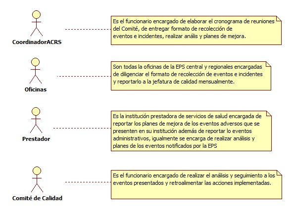

# SISTEMA DE INFORMACIÓN GESTIÓN EVALUACIÓN SERVICIOS DE SALUD

Hacer seguimiento a la calidad en la prestación de los servicios a la red prestadora, a través de auditoria y evaluación de indicadores con el fin de garantizar que la red de prestadores cumpla lo establecido en el SOGC

## 1. MODELADO DEL SISTEMA DE INFORMACIÓN

### 1.1 ACTORES EVENTOS ADVERSOS

### 1.2 IDENTIFICACIÓN DE LOS CASOS DE USO EVENTOS ADVERSOS

| Número | Procesos del Sistema de Información |
| ------ | ----------------------------------- |
| 1      | Elaborar Cronograma de Reuniones             |
| 2      | Entregar Formato Recolección Eventos Adversos e Incidente               |
| 3      | Diligenciar Formato Eventos Adversos e Incidente      |
| 4      | Recibir y Analizar la Información              |
| 5      | Entregar Plan de Mejora de Eventos Adversos              |
| 6      | Recibir Plan de Mejora             |
| 7      | Elaborar Plan de Mejora              |
| 8      | Realizar Seguimiento a Plan de Mejora           |
| 9      | Realizar Informe de Eventos Adversos y Plan ed Mejora    |
| 10     | Citar a Reunión          |
| 11     | Retroalimentar Acciones           |
| 12     | Solicitar Plan de Mejoramiento          |

### 1.3 DESCRIPCIÓN DEL DIAGRAMA DE CASOS DE USO EVENTOS ADVERSOS

| | |
| - | - |
| **1. Caso de Uso** | Eventos Adversos |
| **2. Descripción** | Realizar seguimiento a los eventos adversos con el fin de evitar que se continúen presentando ya sea en la parte administrativa de la EPS o durante la prestación de servicios de salud |
| **3. Actor(es)**   | Coordinador de auditoria de calidad red de servicios, oficinas, Prestadores, Comité de Calidad |
| **4. Pre Condiciones** | Contar con red contratada |
| **5. Pos Condiciones** | Informe de eventos adversos y planes de mejora|
| **6. Flujo de Eventos** |
| *Actor(es)* | *Sistema* |
| 1. El coordinador de auditoria de Calidad red de servicios elabora cronograma de reuniones|  |
| 2. El coordinador de auditoria de Calidad red de servicios entrega formato recolección de eventos adversos e incidentes a los funcionarios |  4. Se diligencia y entrega formato de eventos adversos e incidentes en excel|
| 5. El coordinador de auditoria de Calidad red de servicios recibe y analiza información | 5. Solicitud plan de mejora a prestador mediante correo electrónico |
| 6. El prestador entrega la plan de mejora de los eventos adversos presentados |  |
| 7. El coordinador de auditoria de Calidad red de servicios recibe plan de mejora y programa seguimiento  | 8. Se diligencia formato de seguimiento en excel |
| 9. El coordinador de auditoria de Calidad red de servicios elabora plan de mejora de los casos administrativos y programa seguimiento  |  10. Se diligencia formato de seguimiento en excel|
| 11. El coordinador de auditoria de Calidad red de servicios realiza informe de eventos adversos y cumplimiento a plan de mejora  |  |
| 12. El coordinador de auditoria de Calidad red de servicios convoca a comité de calidad a reunión para presentar informe  |  |
| 13. Retroalimenta acciones  |  |
| **7. Requerimiento Asociado** | R001, R002, R003 |
| **8. Interfaz de Usuario Asociada** |  |
| **9. Formato de Usuario Asociado** | F001, F002, F003, F004, F005 |

### 1.4 MODELADO VISUAL DE LOS CASOS DE USO

## 2. ESPECIFICACIÓN DEL SISTEMA DE INFORMACIÓN

| Término | Descripción |
| ------- | ----------- |
| SOGC | Sistema Obligatorio de Garantía de Calidad.         |
| PM | Plan de Mejora               |
| Prestador | Institución de Servicios de Salud contratada que garantiza la atención del usuario       |
| EV | Eventos adversos             |
| ACRS  | Auditoria de Calidad Red de Servicios |
| IPS   | Institución Prestadora de Servicios 

## 3. ESPECIFICACIÓN DE REQUERIMIENTOS

| | | |
| - | - | - |
| **N°** | **Tipo** | **Descripción** |
| R001 | Proceso | Red prestadora |
| R002 | Proceso | Reporte de Eventos |
| R003 | Proceso | Plan de Mejora |

## 4. ESPECIFICACIÓN DE LA INTERFACE DE USUARIO

| |
| - |
| **1. Número** |
| |
| **2. Propósito de la Interfaz** |
| |
| **3. Gráfica de la Interfaz**|
| |

### 4.1 IDENTIFICACIÓN DE PERFILES Y DIÁLOGOS

| |
| - |
| **1. Nombre del Perfil** |
| |
| **2. Opciones a las que tiene Acceso**|
| |
| **3. Tipo de Acceso** |
| |

### 4.2 ESPECIFICACIÓN DE FORMATOS OFIMATICOS

| Número | Nombre del Formato |
| ------ | ----------------------------------- |
| F001      | Acta de visita             |
| F002      | Seguimiento a IPS               |
| F003      | Plan de mejoramiento             |
| F004      | Recolección de Eventos Adversos e Incidentes  |         
| F005      | Acta de reunión          |
