# SISTEMA DE INFORMACIÓN GESTIÓN EVALUACIÓN SERVICIOS DE SALUD

Hacer seguimiento a la calidad en la prestación de los servicios a la red prestadora, a través de auditoria y evaluación de indicadores con el fin de garantizar que la red de prestadores cumpla lo establecido en el SOGC

## 1. MODELADO DEL SISTEMA DE INFORMACIÓN

### 1.1 ACTORES PROGRAMAR E INGRESAR INDICADORES DE CALIDAD

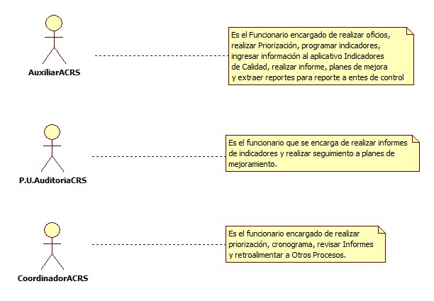

### 1.2 IDENTIFICACIÓN DE LOS CASOS DE USO PROGRAMAR E INGRESAR INDICADORES DE CALIDAD

| Número | Procesos del Sistema de Información |
| ------ | ----------------------------------- |
| 1      | Parametrizar Indicadores              |
| 2      | programar Indicadores              |
| 3      | Programar Prestador              |
| 4      | Programar Municipio              |
| 5      | Seleccionar Indicadores              |
| 6      | Guardar Información              |
| 7      | Ingresar Indicadores             |
| 8      | Ingresar por Prestador          |
| 9      | Ingresar por Municipio          |
| 10     | Generar Reporte           |
| 11     | Elaborar Informe y Plan de Mejora           |
| 12     | Realizar Seguimiento a Plan de Mejora         |

### 1.3 DESCRIPCIÓN DEL DIAGRAMA DE CASOS DE USO PROGRAMAR E INGRESAR INDICADORES DE CALIDAD

| | |
| - | - |
| **1. Caso de Uso** | Programar e Ingresar Indicadores de Calidad|
| **2. Descripción** | Establecer la forma como se va a realizar la parametrización, programación, ingreso y reportes de los indicadores de calidad |
| **3. Actor(es)**   | Coordinador de auditoria de calidad red de servicios, Auxiliar de calidad red de servicios y Profesional Universitario de auditoria de calidad red de servicios |
| **4. Pre Condiciones** | Contar con toda la información solicitada en requerimientos de indicadores de calidad |
| **5. Pos Condiciones** | Disponer del seguimiento a plan de mejora|
| **6. Flujo de Eventos** |
| *Actor(es)* | *Sistema* |
| 1. El funcionario Auxiliar de Calidad red de servicios cuenta con toda la información solicitada para programar los indicadores de calidad|  |
| 2. El funcionario Auxiliar de Calidad red de servicios ingresa al programa de Indicadores de Calidad|  |
|  | 3. Parametrizar los datos que llevará un indicador: fuente, periodo, unidad de medida, proceso, norma y acciones de mejoramiento (ver interfaz I001 a I007) |
|  | 4. Generar nuevo indicador, diligenciar campos solicitados y guardar. (Ver interfaz I008 y I009)|
|  | 5. Programar indicadores para prestador y/o municipio |
|  | 6. Seleccionar el periodo a programar |
|  | 7. Seleccionar Prestador o municipio |
|  | 8. Seleccionar uno o varios prestadores y municipios si tienen los mismos indicadores |
|  | 9. Seleccionar el proceso y los indicadores que apliquen al prestador o municipio |
|  | 10. Guardar programación |
| 11. El funcionario auxiliar de calidad red de servicios verifica las programaciones creadas | 12. Seleccionar programaciones IPS y/o municipio. (Ver interfaz I010) |
|  | 13.  Seleccionar todos los prestadores y/o municipios o un solo prestador o municipio y buscar. (Ver interfaz I011)|
| 14. El auxiliar de calidad red de servicios verifica de que mes reportan información | 15.  Seleccionar el periodo a ingresar la información. (Ver interfaz I011)|
|  | 16.  Seleccionar editar programación, ingresar datos y guardar. (Ver interfaz I012)|
| 17. El auxiliar de calidad red de servicios verifica los requerimientos de los entes de control | 18. Seleccionar consolidado y establecer el periodo a consultar. (Ver interfaz I013)|
|  | 19. Seleccionar si es por prestador, municipio, departamento o nacional. (Ver interfaz I013)|
|  | 20. Seleccionar exportar y guardar en el formato que desee (pdf, excel, word, block de notas|
|  | 21. Seleccionar exportar y guardar en el formato que desee (pdf, excel, word, block de notas|
| 22. El funcionario auxiliar de calidad verifica que norma tiene actualización o se derogó y que indicadores tienen modificaciones |  23. Seleccionar en la pestaña configurar seguido norma, finalmente editar y guardar. (Ver interfaz I014)|
| 24. El funcionario auxiliar de calidad red de servicios verifica si hay nuevas normas y que indicadores ingresaron a la misma | 25. Seleccionar en la pestaña configurar seguido de norma y nueva configuración. (Ver interfaz I014)|
|  | 26. Buscar el indicador, seleccionar norma, escribir el código que tiene en la nueva norma y guardar. (Ver interfaz I015)|
| 27. El funcionario auxiliar de calidad red de servicios verifica que indicadores no cumplen con el estándar e informa al jefe de calidad | 28. Seleccionar planes de mejoramiento y nuevo. (Ver interfaz I016)|
|  | 29. Diligenciar el plan de mejoramiento, guardar y exportar. |
| 30. El coordinador de auditoria de calidad red de servicios remite los planes a los prestadores e informa al auditor para que realice el seguimiento | |
| 31. El profesional universitario de auditoria de calidad red de servicios recibe planes de mejora y programa fecha de seguimiento al prestador | |
| 32. El profesional universitario de auditoria de calidad red de servicios se desplaza al prestador y ejecuta el seguimiento | 33. Se diligencia el formato de seguimiento a plan de mejora.|
| **7. Requerimiento Asociado** | R001, R002, R003 |
| **8. Interfaz de Usuario Asociada** | I001, I002, I003, I004, I005, I006, I007, I008, I009, I010, I011, I012, I013, I014, I015, I016 |
| **9. Formato de Usuario Asociado** | F001, F002, F003 |

### 1.4 MODELADO VISUAL DE LOS CASOS DE USO

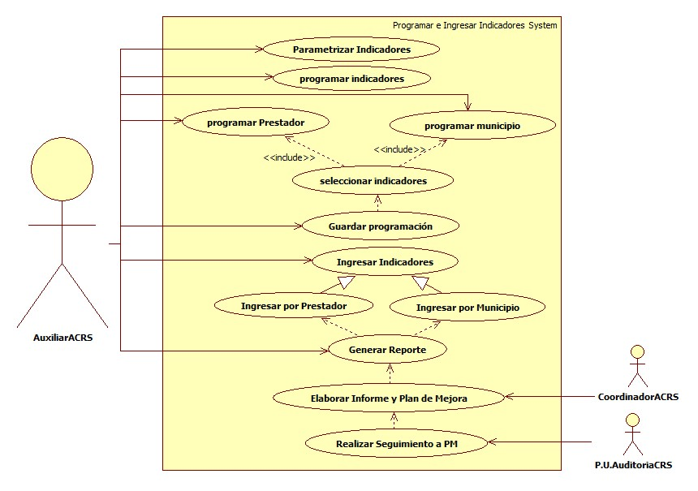

## 2. ESPECIFICACIÓN DEL SISTEMA DE INFORMACIÓN

| Término | Descripción |
| ------- | ----------- |
| SOGC | Sistema Obligatorio de Garantía de Calidad.         |
| Prestador    | Institución de Servicios de Salud contratada que garantiza la atención del usuario       |
| Priorización | Elegir las instituciones prestadoras a las cuales se les realizará auditoria             |
| Susceptible  | Que tiene las condiciones necesarias para que suceda o se realice aquello que se indica. |
| FC        | Formatos de Captura |
| Inf       | Información |
| NC        | Niveles de Complejidad |
| RYC       | Referencia y Contrarreferencia|
| PQRS      | Peticiones, Quejas, Reclamos y Sugerencias|
| VE        | Vigilancia Epidemiológica|
| AC        | Alto Costo |
| EAPB      | Empresa Administradora de Plan de Beneficios |
| CTC       | Comité Técnico Científico |
| SP        | Salud Pública |
| AU        | Atención al Usuario |
| ACRS      | Auditoria de Calidad Red de Servicios| 
| P.U.      | Profesional Universitario|  |

## 3. ESPECIFICACIÓN DE REQUERIMIENTOS

| | | |
| - | - | - |
| **N°** | **Tipo** | **Descripción** |
| R001 | Proceso | Red prestadora |
| R002 | Proceso | Valores Facturados |
| R003 | Proceso | Total de Atenciones |

## 4. ESPECIFICACIÓN DE LA INTERFACE DE USUARIO

| |
| - |
| **1. Número** |
| I001 |
| **2. Propósito de la Interfaz** |
| Mostrar los tipos de parametros que se deben definir antes de crear un nuevo indicador |
| **3. Gráfica de la Interfaz**|
| 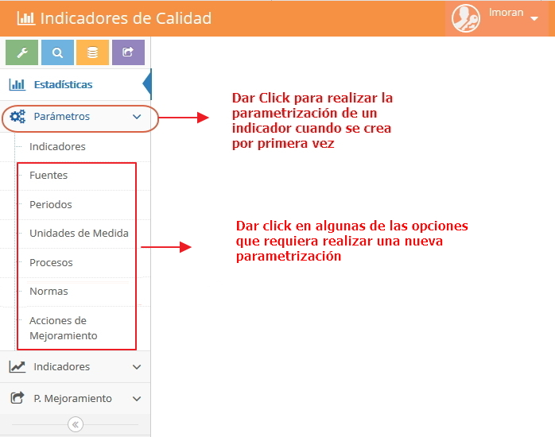|

| |
| - |
| **1. Número** |
| I002 |
| **2. Propósito de la Interfaz** |
| Parametrizar fuentes, donde se establecen las fuentes de donde se alimentará cada indicador|
| **3. Gráfica de la Interfaz**|
| 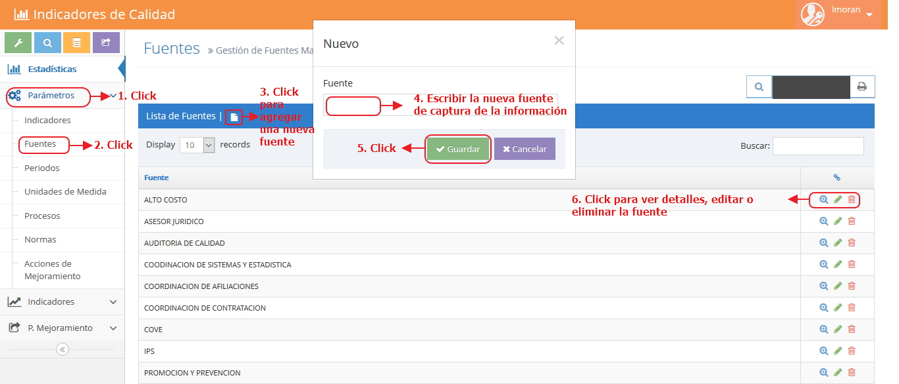|

| |
| - |
| **1. Número** |
| I003 |
| **2. Propósito de la Interfaz** |
| Parametrizar periodos, se establece la periodicidad con la cual se alimentará el indicador |
| **3. Gráfica de la Interfaz**|
| 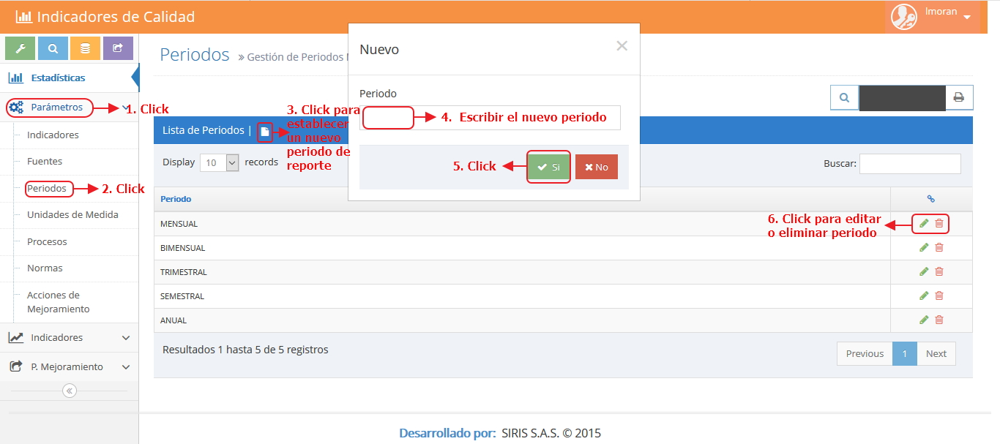|

| |
| - |
| **1. Número** |
| I004 |
| **2. Propósito de la Interfaz** |
| Parametrizar Unidad de Medida, se establece cual será la forma como se medirá el indicador|
| **3. Gráfica de la Interfaz**|
| 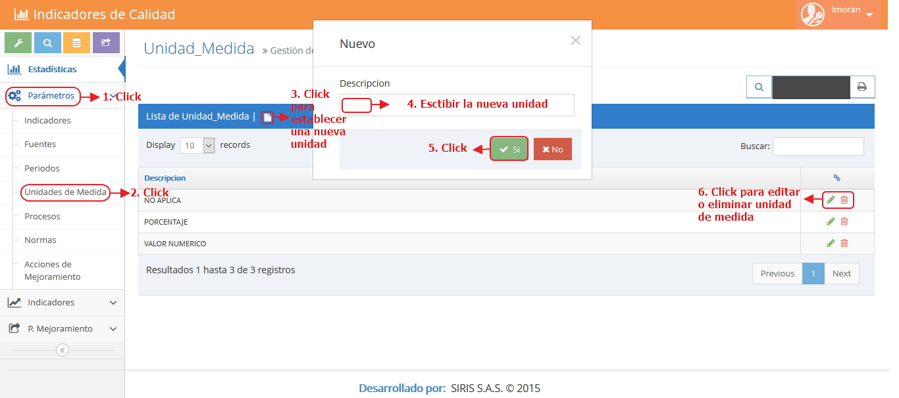|

| |
| - |
| **1. Número** |
| I005 |
| **2. Propósito de la Interfaz** |
| Parametrizar procesos, establecer cuales son los procesos que aplican a varios indicadores|
| **3. Gráfica de la Interfaz**|
| 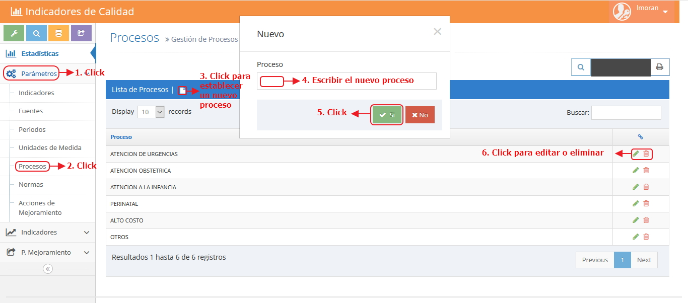|

| |
| - |
| **1. Número** |
| I006 |
| **2. Propósito de la Interfaz** |
| Parametrizar normas, se establecen las normas que rigen los indicadores de calidad|
| **3. Gráfica de la Interfaz**|
| 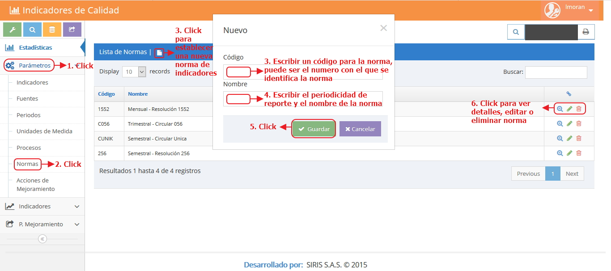|

| |
| - |
| **1. Número** |
| I007 |
| **2. Propósito de la Interfaz** |
| Parametrizar acciones de mejora, se establecen las acciones de mejora que se implementaran en el plan de mejora.|
| **3. Gráfica de la Interfaz**|
| 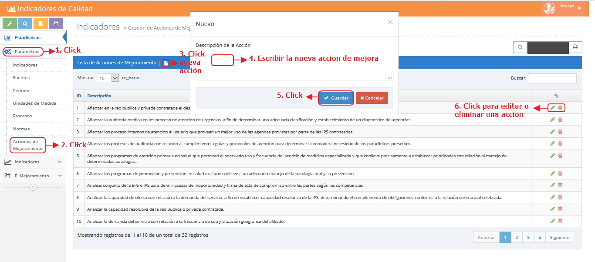|

| |
| - |
| **1. Número** |
| I008 |
| **2. Propósito de la Interfaz** |
| Parametrizar Indicadores, para crear, editar o eliminar un indicador existente |
| **3. Gráfica de la Interfaz**|
| 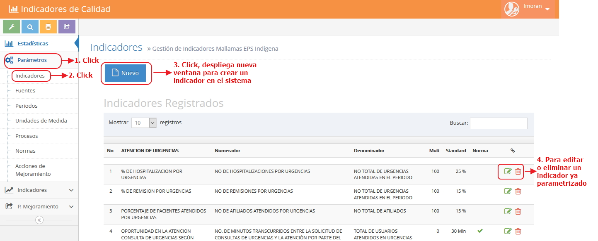|

| |
| - |
| **1. Número** |
| I009 |
| **2. Propósito de la Interfaz** |
| Explicación de como se crea un indicador|
| **3. Gráfica de la Interfaz**|
| 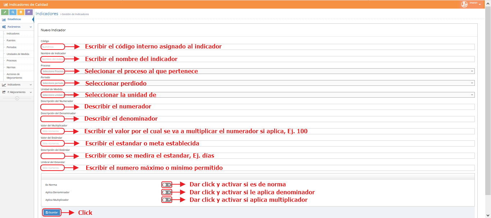|

| |
| - |
| **1. Número** |
| I010 |
| **2. Propósito de la Interfaz** |
| Explicar como se hace una programación nueva|
| **3. Gráfica de la Interfaz**|
| 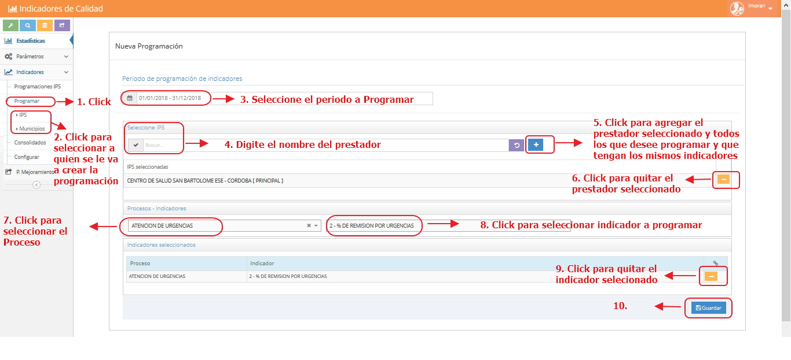|

| |
| - |
| **1. Número** |
| I011 |
| **2. Propósito de la Interfaz** |
| Indicar las programaciones existentes|
| **3. Gráfica de la Interfaz**|
| 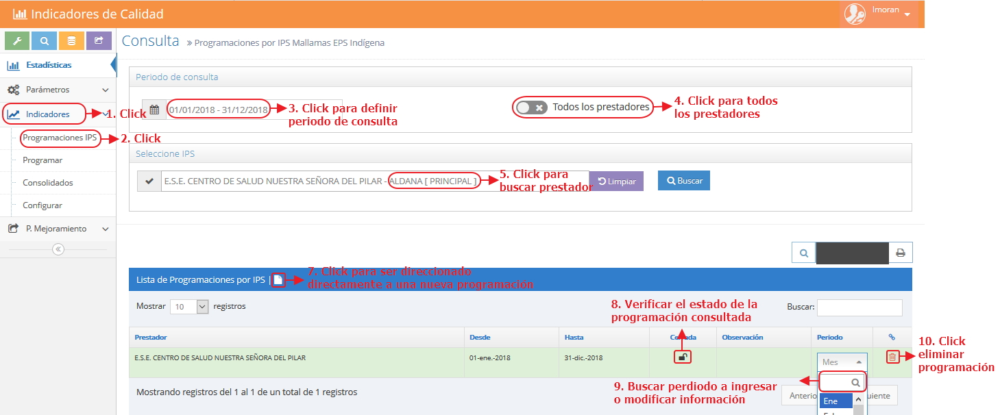|

| |
| - |
| **1. Número** |
| I012 |
| **2. Propósito de la Interfaz** |
| Indicar como se ingresa la información a un indicador|
| **3. Gráfica de la Interfaz**|
| 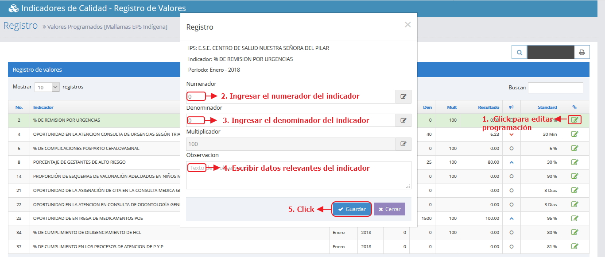|

| |
| - |
| **1. Número** |
| I013 |
| **2. Propósito de la Interfaz** |
| Indicar como se genera un consolidado o reporte de indicadores|
| **3. Gráfica de la Interfaz**|
| 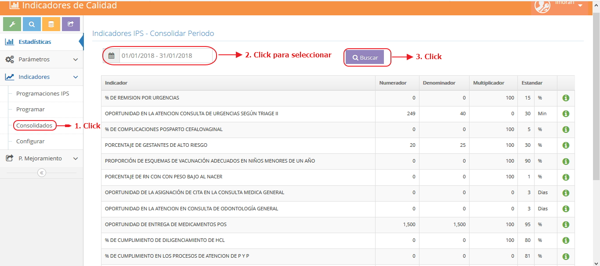|

| |
| - |
| **1. Número** |
| I014 |
| **2. Propósito de la Interfaz** |
| Indicar las normas configuradas a un indicador|
| **3. Gráfica de la Interfaz**|
| 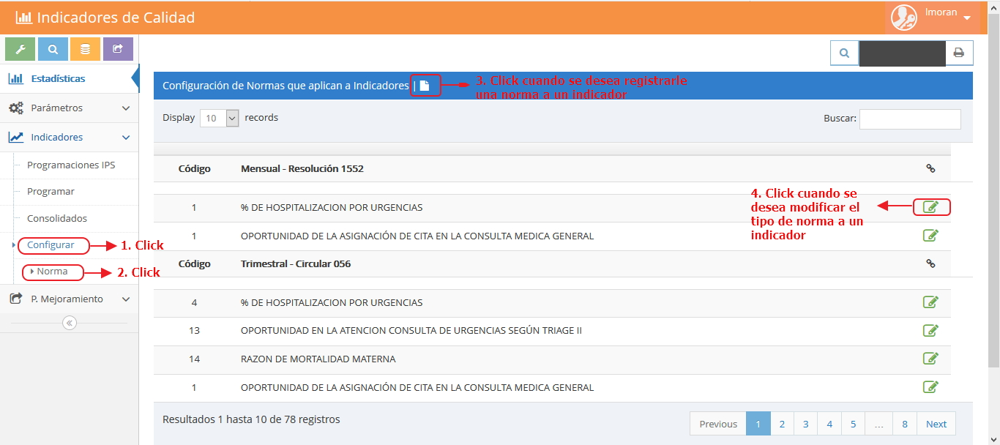|

| |
| - |
| **1. Número** |
| I015 |
| **2. Propósito de la Interfaz** |
| Indicar como configurar una norma a un indicador|
| **3. Gráfica de la Interfaz**|
| 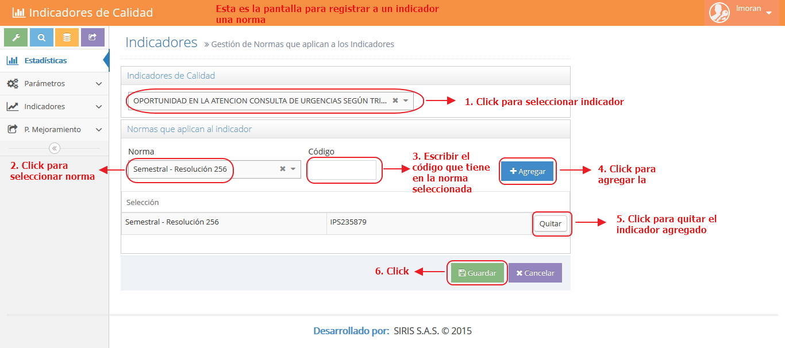|

| |
| - |
| **1. Número** |
| I016 |
| **2. Propósito de la Interfaz** |
| Indicar como crear un plan de mejora|
| **3. Gráfica de la Interfaz**|
| 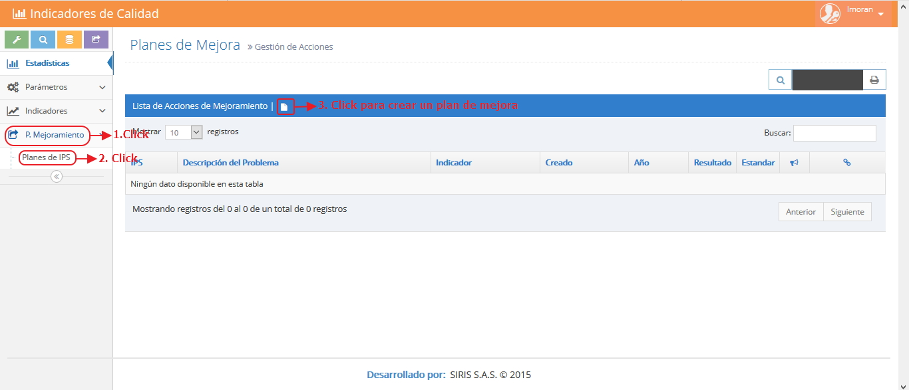|

### 4.1 IDENTIFICACIÓN DE PERFILES Y DIÁLOGOS

| |
| - |
| **1. Nombre del Perfil** |
| Administrador |
| **2. Opciones a las que tiene Acceso**|
|  Parametrizar, Ingresar información, generar consolidados, plan de mejora y eliminar|
| **3. Tipo de Acceso** |
| Editar, guardar, eliminar y generar reportes |

### 4.2 ESPECIFICACIÓN DE FORMATOS OFIMATICOS

| Número | Nombre del Formato |
| ------ | ----------------------------------- |
| F001      | Priorización IPS              |
| F002      | Formatos Indicadores              |
| F003      | Registro Diario de Referencia          |
