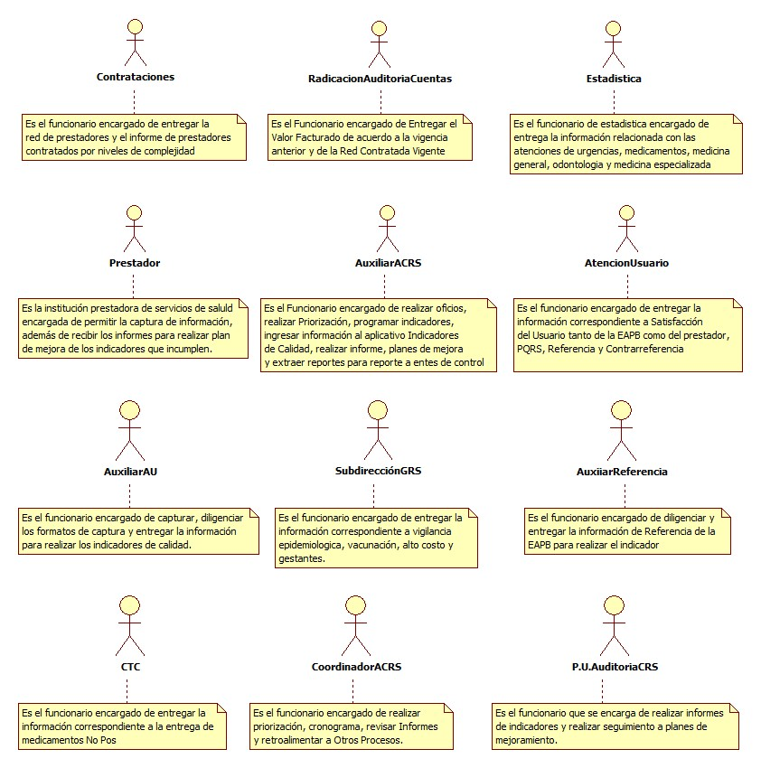
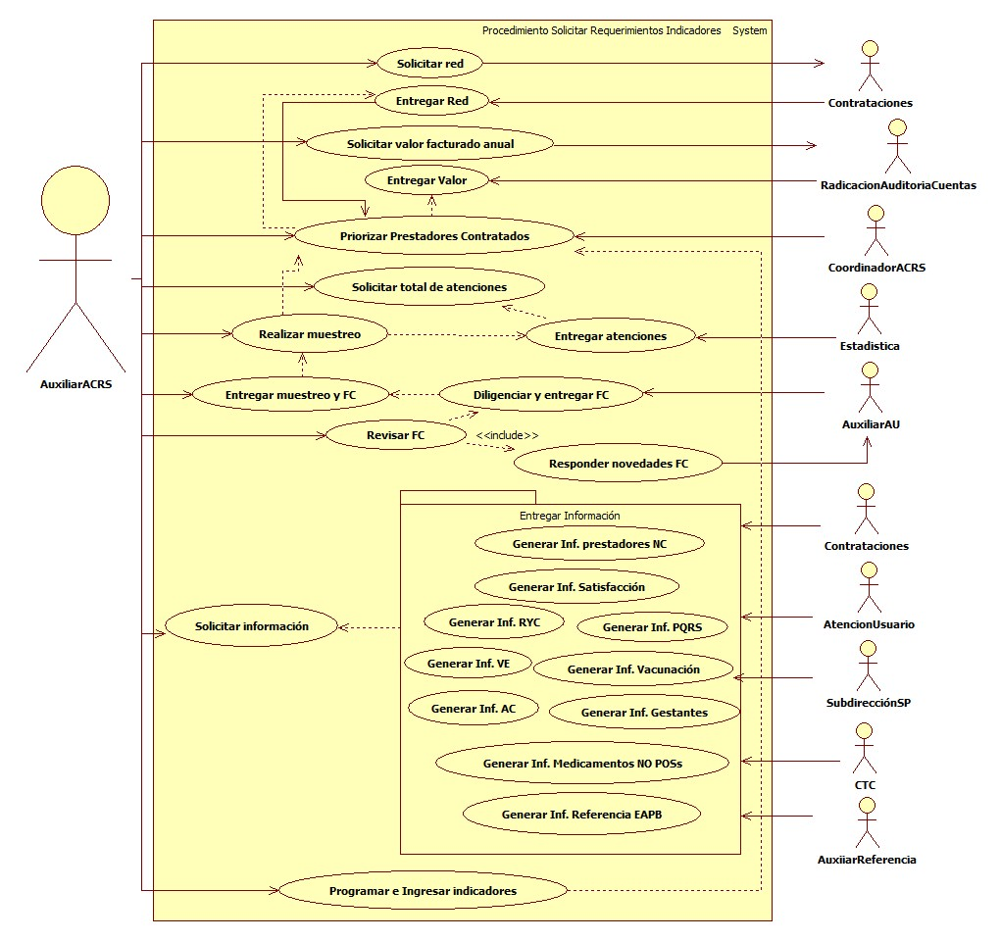

# SISTEMA DE INFORMACIÓN GESTIÓN EVALUACIÓN SERVICIOS DE SALUD

Hacer seguimiento a la calidad en la prestación de los servicios a la red prestadora, a través de auditoria y evaluación de indicadores con el fin de garantizar que la red de prestadores cumpla lo establecido en el SOGC

## 1. MODELADO DEL SISTEMA DE INFORMACIÓN

### 1.1 ACTORES SOLICITAR REQUERIMIENTOS INCADORES DE CALIDAD

### 1.2 IDENTIFICACIÓN DE LOS CASOS DE USO SOLICITAR REQUERIMIENTOS INDICADORES DE CALIDAD

| Número | Procesos del Sistema de Información |
| ------ | ----------------------------------- |
| 1      | Solicitar red              |
| 2      | Entregar red              |
| 3      | Solicitar valor facturado              |
| 4      | Entregar valor              |
| 5      | Priorizar Prestadores Contratados              |
| 6      | Solicitar Total de Atenciones              |
| 7      | Entregar Atenciones              |
| 8      | Realizar Muestreo           |
| 9      | Entregar Muestreo y FC          |
| 10     | Diligenciar y entregar FC           |
| 11     | Revisar FC           |
| 12     | Responder Novedades FC          |
| 13     | Solicitar Información        |
| 14     | Generar Información Prestadores por Niveles de Complejidad   |
| 15     | Programar Indicadores en Programa Indicadores de Calidad     |
| 16     | Generar Información Satisfacción          |
| 17     | Generar Información Referencia y Contrarreferencia          |
| 18     | Generar Información Peticiones, Quejas, Reclamos y Sugerencias         |
| 19     | Generar Información Vigilancia Epidemiológica         |
| 20     | Generar Información Vacunación         |
| 21     | Generar Información Alto Costo         |
| 22     | Generar Información Gestantes         |
| 23     | Generar Información Medicamentos NO POSs         |
| 24     | Generar Información Referencia EAPB         |

### 1.3 DESCRIPCIÓN DEL DIAGRAMA DE CASOS DE USO SOLICITAR REQUERIMIENTOS INDICADORES DE CALIDAD

| | |
| - | - |
| **1. Caso de Uso** | Solicitar Requerimientos Indicadores de Calidad|
| **2. Descripción** | Disponer de información necesaria para construir los indicadores de calidad e ingresarlos al sistema de Indicadores de Calidad |
| **3. Actor(es)**   | Coordinador de auditoria de calidad red de servicios, Auxiliar de calidad red de servicios, Prestadores, Profesional Universitario de auditoria de calidad red de servicios, Coordinación de Contrataciones, Coordinación de radicación y auditoria de Cuentas Médicas, Auxiliares de atención al usuario, auxiliar de referencia, Coordinación de Comité técnico científico, Subdirección gestión del riesgo en salud, Coordinación de Atención al Usuario y Estadistica |
| **4. Pre Condiciones** | Contar con red contratada |
| **5. Pos Condiciones** | Información para hacer indicadores|
| **6. Flujo de Eventos** |
| *Actor(es)* | *Sistema* |
| 1. El funcionario Auxiliar de Calidad red de servicios solicita red prestadora a contrataciones|  |
| 2. El funcionario de Contrataciones, entrega la red de prestadores |  |
| 3. El funcionario Auxiliar de calidad red de servicios solicita el valor facturado a Radicación y Auditoria de Cuentas |  |
| 4. El funcionario de Radicación y Auditoria de Cuentas, entrega los valores facturados | 5. Generar priorización IPS formato excel  |
| 6. El Funcionario Auxiliar de Calidad red de servicios solicita total de atenciones de consulta médica, odontologíca, medicamentos, urgencias y consulta especializada  |  |
| 7. El funcionario de Estadística, entrega el total de consultas | 8. Generar muestreo para captura de información de indicadores de calidad Formato excel |
| 9. El funcionario Auxiliar de Calidad red de servicios entrega formatos de captura y muestreo a auxiliares de atención al usuario |  10. Diligenciar y entregar formatos de captura|
| | 11. Revisar formatos de captura |
|   | 12. Responder novedades de formatos de captura|
|  13. El funcionario Auxiliar de Calidad red de servicios solicita a Contrataciones información de los prestadores por niveles de complejidad por municipio | |
|  14. El funcionario de Contrataciones entrega la información de los prestadores por niveles de complejidad por municipio | |
|  15. El funcionario Auxiliar de Calidad red de servicios solicita a Coordinación de Atención al Usuario información sobre satisfacción, quejas y reclamos, referencia y contrarreferencia  | |
|  16. El funcionario de Atención al Usuario entrega la información sobre satisfacción, quejas y reclamos, referencia y contrarreferencia | |
|  17. El funcionario Auxiliar de Calidad red de servicios solicita Subdirección de Salud Pública información sobre vigilancia epidemiológica, vacunación, alto costo y gestantes | |
|  18. El funcionario de la Subdirección de Salud Pública entrega información sobre vigilancia epidemiológica, vacunación, alto costo y gestantes | |
|  19. El funcionario Auxiliar de Calidad red de servicios solicita a Coordinación de Comité Técnico Científico información sobre medicamentos NO POSs | |
|  20. El funcionario de la Coordinación de Comité Técnico Científico entrega información sobre medicamentos NO POSs | |
|  21. El funcionario Auxiliar de Calidad red de servicios solicita a auxiliar de referencia información sobre referencia de la EAPB |22. Diligencia y entrega registro diario de referencia formato excel|
|  23. Se programa indicadores en programa Indicadores de Calidad | |
| **7. Requerimiento Asociado** | R001, R002, R003 |
| **8. Interfaz de Usuario Asociada** |  |
| **9. Formato de Usuario Asociado** | F001, F002, F003, F004 |

### 1.4 MODELADO VISUAL DE LOS CASOS DE USO

## 2. ESPECIFICACIÓN DEL SISTEMA DE INFORMACIÓN

| Término | Descripción |
| ------- | ----------- |
| SOGC         | Sistema Obligatorio de Garantía de Calidad.         |
| Prestador    | Institución de Servicios de Salud contratada que garantiza la atención del usuario       |
| Priorización | Elegir las instituciones prestadoras a las cuales se les realizará auditoria             |
| Susceptible  | Que tiene las condiciones necesarias para que suceda o se realice aquello que se indica. |
| FC           | Formatos de Captura |
| Inf          | Información |
| NC           | Niveles de Complejidad |
| RYC          | Referencia y Contrarreferencia|
| PQRS         | Peticiones, Quejas, Reclamos y Sugerencias|
| VE           | Vigilancia Epidemiológica|
| AC           | Alto Costo |
| EAPB         | Empresa Administradora de Plan de Beneficios |
| CTC          | Comité Técnico Científico |
| SP           | Salud Pública |
| AU           | Atención al Usuario |
| ACRS         | Auditoria de Calidad Red de Servicios| 
| P.U.         | Profesional Universitario| 

## 3. ESPECIFICACIÓN DE REQUERIMIENTOS

| | | |
| - | - | - |
| **N°** | **Tipo** | **Descripción** |
| R001 | Proceso | Red prestadora |
| R002 | Proceso | Valores Facturados |
| R003 | Proceso | Total de Atenciones |

## 4. ESPECIFICACIÓN DE LA INTERFACE DE USUARIO

| |
| - |
| **1. Número** |
|  |
| **2. Propósito de la Interfaz** |
| |
| **3. Gráfica de la Interfaz**|
| |

### 4.1 IDENTIFICACIÓN DE PERFILES Y DIÁLOGOS

| |
| - |
| **1. Nombre del Perfil** |
|  |
| **2. Opciones a las que tiene Acceso**|
|  |
| **3. Tipo de Acceso** |
|  |

### 4.2 ESPECIFICACIÓN DE FORMATOS OFIMATICOS

| Número | Nombre del Formato |
| ------ | ----------------------------------- |
| F001      | Priorización IPS              |
| F002      | Formatos Indicadores              |
| F003      | Registro Diario de Referencia          |
| F004      | Muestreo para Captura de Información de Indicadores de Calidad          |
