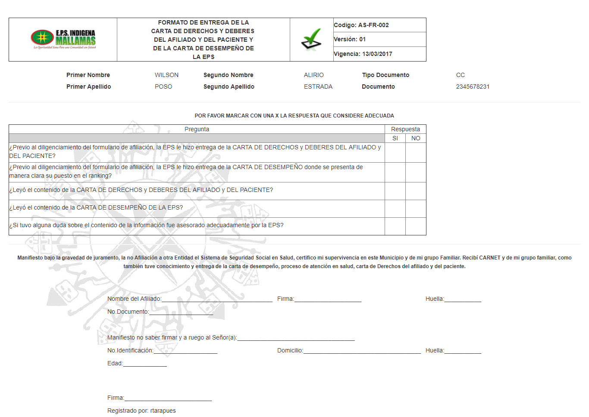

# SISTEMA DE INFORMACIÓN AFILIACION Y ADMINISTRACION DE BASE DATOS

Sistema de información encargado de Registro,Validación Actualización y Reporte de los Afiliados pertenecientes a Mallamas EPS.I

## 1. MODELADO DEL SISTEMA DE INFORMACIÓN

### 1.1 ACTORES 

### 1.2 IDENTIFICACIÓN DE LOS CASOS DE USO

| N° | Procesos del Sistema de Información |
| ------ | ----------------------------------- |
| 1 |Solicitar Afiliacion              |
| 2 |Solicitar documentacion requerida             |
| 3 |Generar reporte adres              |
| 4 |Ingresar al sistema              |
| 5 |Presentar modulo de novedad              |
| 6 |Diligenciar Datos              |
| 7 |Escoger Prestador             |
| 8 |Validar informacion              |
| 9 |Realizar auditoria              |
| 10 |Imprimir formulario y encuesta            |
| 11 |Digitalizar soportes              |
| 12 |Realizar auditoria             |
| 13 |Imprimir y entregar carnet              |
### 1.3 DESCRIPCIÓN DE LOS CASOS DE USO NUEVA AFILIACION

| | |
| - | - |
| **1. Caso de Uso** | Nueva Afiliación |
| **2. Descripción** | Sistema ecargado de Afiliar a usuarios pertenecientes a poblacion Indigena. |
| **3. Actor(es)**   | Usuario, FuncionarioAseguramiento y ADRES |
| **4. Pre Condiciones** |Pertenecer a Población Indigena |
| **5. Pos Condiciones** | Afiliado a Mallamas EPS-I |
| **6. Flujo de Eventos** |
| *Actor(es)* | *Sistema* |
| 1. El usuario solicita la nueva afiliacion a Mallamas EPS I ||
| 2. EL funcionario de Aseguramiento solicita documentacion requerida para Nueva Afiliacion||
|3. El funcionario consulta el estado de Afiliacion del usuario y genera reporte desde la pagina de ADRES. ||
|4. El funcionario de aseguramiento autorizado valida su usuario y contraseña para ingreso al sistema|5.Presenta modulo y formulario de novedad de Nueva  Afiliación|
| 6. Funcionario informa al usuario a que Prestador desea pertenecer||
| 7. El funcionario diligecia los datos de la Nueva Afiliacion y graba la novedad | 8.Valida y guarda la  Nueva Afiliacion. y genera encuesta y formulario ||
|9. El funcionario de aseguramiento  envia orden de impresion de Nueva Afiliacion. |10. Imprime encuesta y formulario|
|10. Se firma formulario y encuesta por parte del usuario, el funcionario digitaliza los soportes y guarda en el sistema de Novedades|11. Escanear soportes y almacena informacion.|
|12. El funcionario realiza la auditoria novedades| 13. Presenta pantalla de auditoria de novedades donde se acepta la nueva afiliacion|
|  | 14.Genera carnet de afiliacion a Mallamas EPS I listo para imprimir. 
|15. El funcionario de aseguramiento imprime y entrega carnet al nuevo afiliado a Mallamas EPS I.||
| **7. Requerimiento Asociado** | R001 y R002 |
| **8. Interfaz de Usuario Asociada** | I001 |

### 1.4 MODELADO VISUAL DE LOS CASOS DE USO NUEVA AFILIACION

## 2. ESPECIFICACIÓN DEL SISTEMA DE INFORMACIÓN

| Término | Descripción |
| ------- | ----------- |
| BD | Base de datos  |
| ADRES | Administrdora de los Recursos del Sistema General de Seguridad Social en Salud. |

## 3. ESPECIFICACIÓN DE REQUERIMIENTOS

| | | |
| - | - | - |
| **N°** | **Tipo** | **Descripción** |
| R001 | Físico | Fotocopia del documento de identificación. |
| R002 | Físico | Certificado de pertenencia a Comunidades Indígenas. |

## 4. ESPECIFICACIÓN DE LA INTERFACE DE USUARIO

| |
| - |
| **1. Número** |
| I001 |
| **2. Propósito de la Interfaz** |
| Mostrar Módulo del Sistema|
| **3. Gráfica de la Interfaz**|
|  |
| |
| - |
| **1. Número** |
| I002 |
| **2. Propósito de la Interfaz** |
| Mostrar Formulario para diligenciamiento de datos en sistema de Mallamas de la Nueva Afiliación|
| **3. Gráfica de la Interfaz**|
|  |
| |
| - |
| **1. Número** |
| I003 |
| **2. Propósito de la Interfaz** |
| Mostrar Formato de carta de derechos y deberes|
| **3. Gráfica de la Interfaz**|
|  
### 4.1 IDENTIFICACIÓN DE PERFILES Y DIÁLOGOS

| |
| - |
| **1. Nombre del Perfil** |
| Auxiliar de Aseguramiento|
| **2. Opciones a las que tiene Acceso**|
| Afiliación, Novedades, Auditoria Novedad, Impresión y consultas|
| **3. Tipo de Acceso** |
| Crear, Modificar, Aceptar, Rechazar y Glosar |