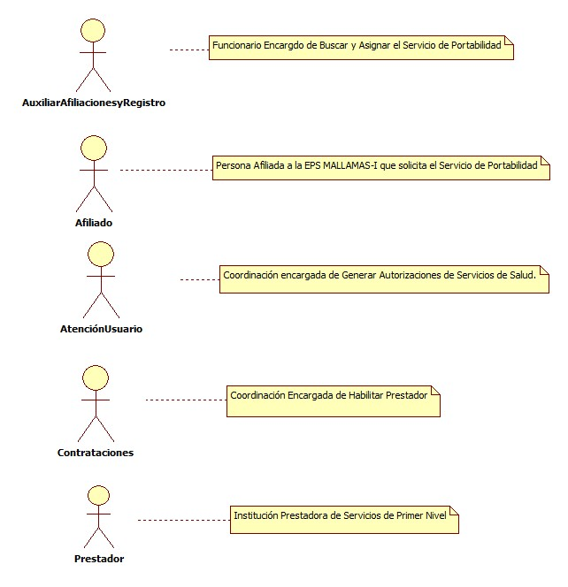
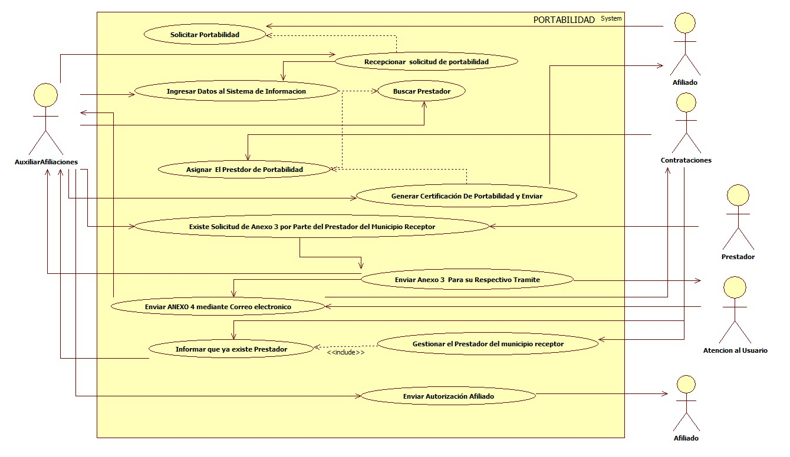
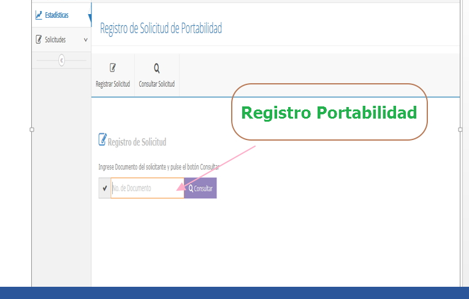
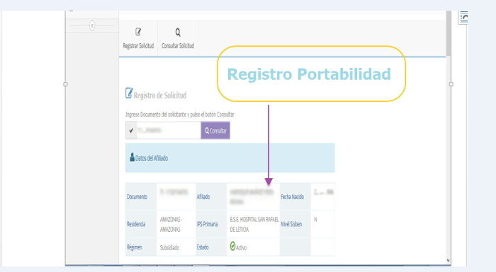
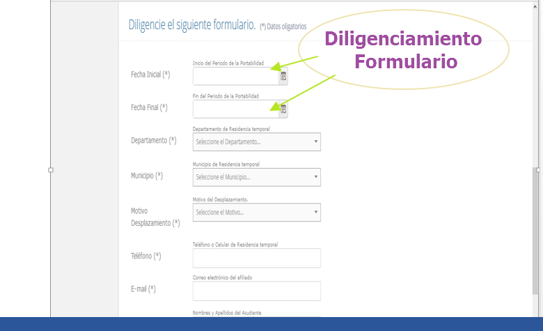
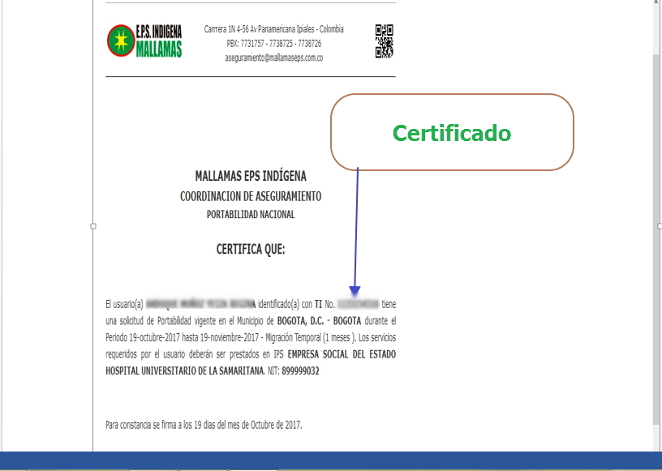
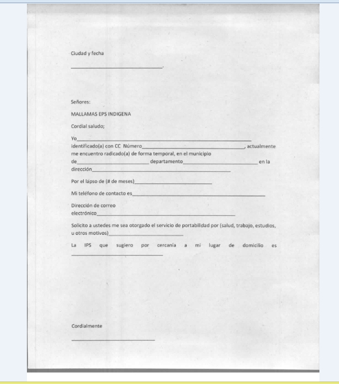

# SISTEMA DE INFORMACIÓN DE PORTABILIDAD

Gestionar de manera Oportuna las solicitudes de Portabilidad en todo el Territorio Nacional

## 1. MODELADO DEL SISTEMA DE INFORMACIÓN DE PORTABILIDAD

### 1.1 ACTORES 

### 1.2 IDENTIFICACIÓN DE LOS CASOS DE USO

| N° | Procesos del Sistema de Información |
| ------ | ----------------------------------- |
| 1 |Solicitar Portabilidad|
| 2 |Recepcionar  solicitud de portabilidad |
| 3 |Ingresar Datos al Sistema de Informacion  |
| 4 |Buscar Prestador|
| 5 |Asignar  El Prestdor de Portabilidad|
| 6 |Generar Certificación De Portabilidad y Enviar|
| 7 |Existe Solicitud de Anexo 3 por Parte del Prestador del              Municipio Receptor|    
| 8 |Enviar Anexo 3  Para su Respectivo Tramite    |
| 9 |Enviar ANEXO 4 mediante Correo electronico|
| 10 |Gestionar el Prestador del municipio receptor  |
| 11 |Informar que ya existe Prestador |
| 12 |Enviar Autorización Afiliado|
### 1.3 DESCRIPCIÓN DE LOS CASOS DE USO PORTABILIDAD

| | |
| - | - |
| **1. Caso de Uso** |Portabilidad|
| **2. Descripción** |Afiliados a MALLAMAS EPS-I que necesiten realizar tramite de Portabilidad. |
| **3. Actor(es)**   |Afiliado, Auxiliar Afiliaciones, atencion al Usuario, Contrataciones y  Prestador|
| **4. Pre Condiciones** |Afiliados pertenecientes a la Base de Datos de Mallamas EPS I. |
| **5. Pos Condiciones** | Comunicar al afiliado que la solicitud del tramite fue exitosa|
| **6. Flujo de Eventos** |
| *Actor(es)* | *Sistema* |
| 1. Afiliado solicita portabilidad en fisico, correo electrinico o mediante llamada. | |
| 2. Auxiliar de Afiliaciones Recepciona  solicitud de portabilidad en fisico, correo electrinico o mediante llamada | |
||3. Ingresar Información al Sistema de Información de Portabilidad|
|4. EL Auxiliar de Afiliaciones Busca el Prestador en el Municipio donde solicite el Afiliado.|
|5.Contrataciones Asigna  El Prestador Disponible de Portabilidad en el Sistema de Informacion|
|6. EL Auxiliar de Afiliaciones Genera Certificacion De Portabilidad.|7. Muestra Certificdo de Portabilidad y se Envia al Afiliado mediante correo electronico.|
|8.Cuando Exista Solicitud de Anexo 3 donde el Auxiliar de Afiliaciones recibe solicitud de Autorización para otros Niveles de Complegidad por Parte del Prestador del Municipio Receptor, se raliza la Busqueda del prestador y se envia atencion al Auxiliar de Atención al usuario |
|9. Atención al usuario envia a Auxiliar de Afiliaciones la respuesta del anexo 3 |10. Se envia por correo electronico. ANEXO 4 a los prestadores|
|11. Auxiliar de Afiliaciones Enviar solicitud al area de contrataciones para gestionar el Prestador del municipio receptor cuando exede el tiempo de los 10 días establecidos por norma|
|12. La Coordinacion de Contrataciones Informa a la Coordinacion de Afiliaciones que ya existe Prestador|13. Auxiliar de Afiliaciones envia autorización  para Procedimiento al Afiliado|
| **7. Requerimiento Asociado** | R001, R002|
| **8. Interfaz de Usuario Asociada** | I001, I002,I003, I004, I005 |

### 1.4 MODELADO VISUAL DE LOS CASOS DE PORTABILIDAD

## 2. ESPECIFICACIÓN DEL SISTEMA DE INFORMACIÓN

| Término | Descripción |
| ------- | ----------- |
| BD | Base de datos     
| PORTABILIDAD | La portabilidad es un mecanismo con que cuentan los afiliados a una entidad promotora de salud –EPS, para tener acceso a los servicios de salud en una institución prestadora de servicios de salud -IPS primaria, en cualquier municipio del territorio nacional diferente a aquel donde se encuentra su sitio habitual de residencia. Fuente:Https://www.minsalud.gov.co/proteccionsocial/Paginas/portabilidad-en-atencion-en-salud.aspx

## 3. ESPECIFICACIÓN DE REQUERIMIENTOS

| | | |
| - | - | - |
| **N°** | **Tipo** | **Descripción** |
| R001 | Proceso | Solicitud Portabilidad|
| R002 | Proceso | Recepcion de Información|  
## 4. ESPECIFICACIÓN DE LA INTERFACE DE USUARIO

| |
| - |
| **1. Número** |
| I001 |
| **2. Propósito de la Interfaz** |
| Registrar de solicitud de portabilidad.|
| **3. Gráfica de la Interfaz**|
| 

| |
| - |
| **1. Número** |
| I002 |
| **2. Propósito de la Interfaz** |
| Registrar datos de usuario que Solicita Potabilidad.
| **3. Gráfica de la Interfaz**|
|  |

| |
| - |
| **1. Número** |
| I003 |
| **2. Propósito de la Interfaz** |
| Diligenciar formulario con los datos completos para solicitud|
| **3. Gráfica de la Interfaz**|
|  

| |
| - |
| **1. Número** |
| I004 |
| **2. Propósito de la Interfaz** |
| Generar Certificado.|
| **3. Gráfica de la Interfaz**|
|  

| |
| - |
| **1. Número** |
| I005 |
| **2. Propósito de la Interfaz** |
| Registrar de solicitud de portabilidad en Fisico|
| **3. Gráfica de la Interfaz**|
|  

### 4.1 IDENTIFICACIÓN DE PERFILES Y DIÁLOGOS

| |
| - |
| **1. Nombre del Perfil** |
| Auxiliar Afiliaciones|
| **2. Opciones a las que tiene Acceso**|
|Estadisticas, Solicitudes  |
| **3. Tipo de Acceso** |
|Consultar, Registrar, Actualizar, Enviar |

### 4.2 ESPECIFICACION DE FORMATOS DE USUARIO

| | | |
| - | - | - |
| **Número** | **Nombre del Formato** | 
|F001| Formato de Solicitud de Portabilidad|
