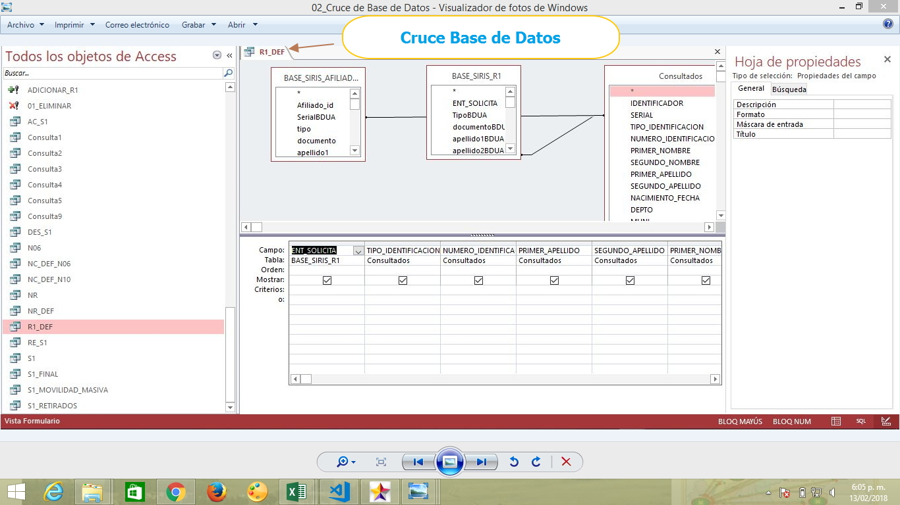

# SISTEMA DE RECEPCION Y REPORTE BDUA RÉGIMEN CONTRIBUTIVO

Sistema de información encargado de Realizar el reporte oportuno y con calidad de las novedades de los afiliados a la BDUA, que se encuentran en Regimen Contributivo y/o en Proceso de Movilidad

## 1. MODELADO DEL SISTEMA DE INFORMACIÓN

### 1.1 ACTORES 

### 1.2 IDENTIFICACIÓN DE LOS CASOS DE USO

| N° | Procesos de Recepción y Reporte BDUA Regimen Contributivo |
| ------ | ----------------------------------- |
| 1 |Enviar Archivos Planos |
| 2 |Recibir Archivos Planos              |
| 3 |Cruzar Archivos Planos con BDUA            |
| 4 |Generar y Enviar Archivos del Reporte de Novedades|
| 5 |Recibir Archivos del Reporte de Novedades  |
| 6 |Enviar Glosas              |
| 7 |Revision y Solucion de Glosas     |
### 1.3 DESCRIPCIÓN DE LOS CASOS DE USO RECEPCION Y REPORTE BDUA REGIMEN CONTRIBUTIO

| | |
| - | - |
| **1. Caso de Uso** | Recepción y Reporte BDUA Regimen Contributivo |
| **2. Descripción** | Aplica a la información de los afiliados presente en la base de datos Empresarial del Régimen Contributivo|
| **3. Actor(es)**   | P.U.Afiliaciones y Registro y Adres |
| **4. Pre Condiciones** |Recibir Archivos R, 2-6, MA, NC,  Base de datos Empresarial Actualizada, reporte generado del pagina web del Adres. |
| **5. Pos Condiciones** | Solucion de glosas y actualizacion en el software empresarial y Nacional de los datos de los afiliados |
| **6. Flujo de Eventos** |
| *Actor(es)* | *Sistema* |
| 1. El P.U. Afiliaciones y Registro Recibe nformación Base de Datos| 2. Adres Genera y envía Archivos R, 2-6, MA, NC, Base de datos Empresarial Actualizada, reporte generado del pagina web del Adres  | 
|3. El P.U. Afiliaciones y Registro Cruza Base de Datos ( ver Interfaz I006)|
|4. El P.U. Afiliaciones y Registro Genera  Reporte y Envia Base de Datos|5. Muestra y envia Reporte a la pagina de Adres
|6. El P.U. Afiliaciones y Registro Recibe Base de Datos del Reporte de Novedades (ver Interfaz I010 )|7. ADRES envia Glosas
|8. El P.U. Afiliaciones y Registro Revisa y Soluciona Glosas|
| **7. Requerimiento Asociado** | R001, R002, R003, R004 y R005|  
| **8. Interfaz de Usuario Asociada** | I001, I002,I003, I004, I005, I006, I007,I008, I009, I010|  |

### 1.4 MODELADO VISUAL DE LOS CASOS DE RECEPCION Y REPORTE BDUA CONTRIBUTIVO

## 2. ESPECIFICACIÓN DEL SISTEMA DE INFORMACIÓN

| Término | Descripción |
| ------- | ----------- |
| BD | Base de datos     
| ADRES |Administrador de los recursos del sistema    de salud |
| R | Archivo de Movilidad a Regimen Contributivo
| 2-6 |Archivo de estructura de datos para            correcciones de Registros con inconcistencias |
| MA |Archivo Maestro de Aportantes|
| NC |Archivo de Novedades de Actualización y         Correccion de Información|
| SFTP |Servidor para Transferencia de Archivos|
| NR | Novedad Retroactiva |
| R1 | Novedad Movilidad |
## 3. ESPECIFICACIÓN DE REQUERIMIENTOS

| | | |
| - | - | - |
| **N°** | **Tipo** | **Descripción** |
| R001 | Proceso | Envio de Información |
| R002 | Proceso | Recepcion de Información |
| R003 | Proceso | R|
| R004 | Proceso | 2-6|
| R004 | Proceso | MA| 
| R005 | Proceso | NC| 
## 4. ESPECIFICACIÓN DE LA INTERFACE DE USUARIO

| |
| - |
| **1. Número** |
| I001 |
| **2. Propósito de la Interfaz** |
| Recepción Base de Datos|
| **3. Gráfica de la Interfaz**|
| 

| |
| - |
| **1. Número** |
| I002 |
| **2. Propósito de la Interfaz** |
| Cargue de la Base de Datos
| **3. Gráfica de la Interfaz**|
|  |

| |
| - |
| **1. Número** |
| I003 |
| **2. Propósito de la Interfaz** |
| Resultado Cruce Base de Datos|
| **3. Gráfica de la Interfaz**|
|  

| |
| - |
| **1. Número** |
| I004 |
| **2. Propósito de la Interfaz** |
| Archivo Reportado SFTP|
| **3. Gráfica de la Interfaz**|
|  

| |
| - |
| **1. Número** |
| I005 |
| **2. Propósito de la Interfaz** |
| Consulta en Sistema de Informacion R1|
| **3. Gráfica de la Interfaz**|
| 

| |
| - |
| **1. Número** |
| I006 |
| **2. Propósito de la Interfaz** |
| Cruce de Base de Datos|
| **3. Gráfica de la Interfaz**|
| 

| |
| - |
| **1. Número** |
| I007 |
| **2. Propósito de la Interfaz** |
| Resultado Cruce Base de Datos|
| **3. Gráfica de la Interfaz**|
| 

| |
| - |
| **1. Número** |
| I008|
| **2. Propósito de la Interfaz** |
| Resultado Archivo NR|
| **3. Gráfica de la Interfaz**|
| 

| |
| - |
| **1. Número** |
| I009 |
| **2. Propósito de la Interfaz** |
| Resultado Archivo R1|
| **3. Gráfica de la Interfaz**|
| 

| |
| - |
| **1. Número** |
| I010 |
| **2. Propósito de la Interfaz** |
| Actualizacion Sistema de Información|
| **3. Gráfica de la Interfaz**|
| 
### 4.1 IDENTIFICACIÓN DE PERFILES Y DIÁLOGOS

| |
| - |
| **1. Nombre del Perfil** |
| Administrador de la Base de Datos del Regimen Contributivo|
| **2. Opciones a las que tiene Acceso**|
|Conexión con servidores SFTP (servidor para Transferencia de Archivos),Acceso a BDUA, Conexión a Base de Datos con permisos especiales, Nuevo Afiliado Masivo, Actualización de estado, Actualización de Datos Masivos  |
| **3. Tipo de Acceso** |
| Enviar, Recibir,Actualizar, consultar, Modificar    Registros en la Base de Datos Regimen               Contributivo|
### 4.2 ESPECIFICACION DE FORMATOS DE USUARIO

|Numero|Nombre del formato|
| - | - | 
|F001| EXEL MALLA VALIDADORA|