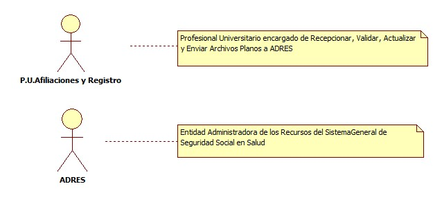
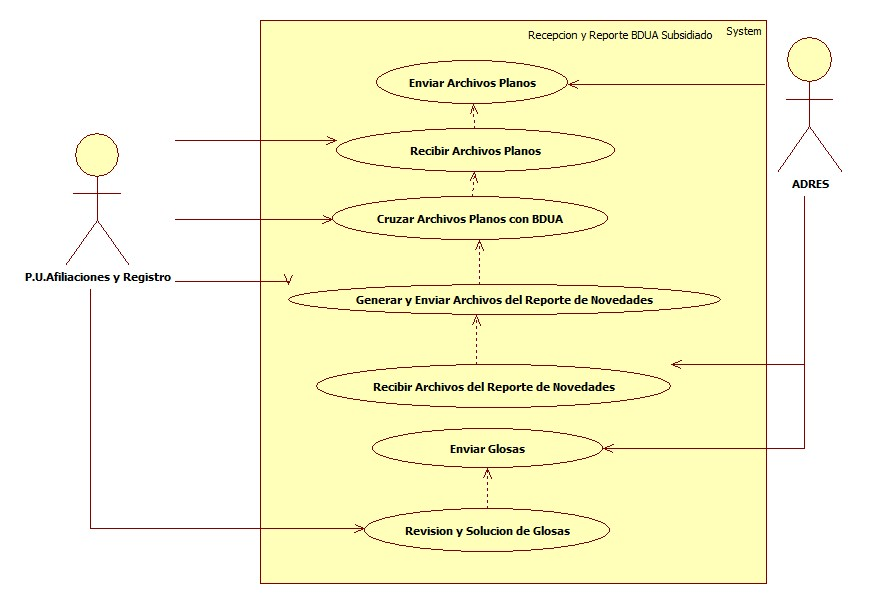
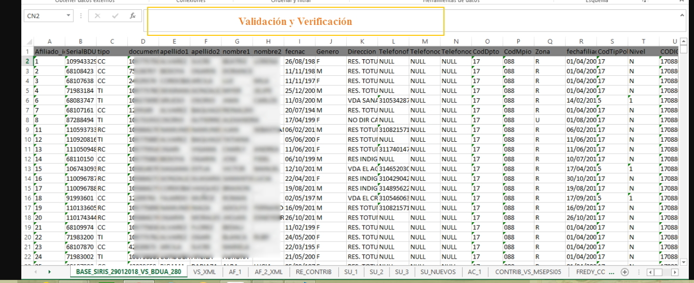
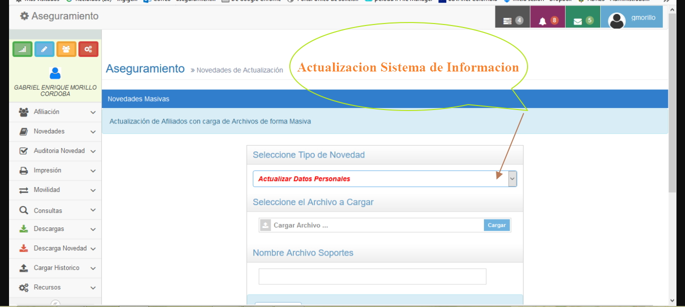

# SISTEMA DE RECEPCION Y REPORTE BDUA RÉGIMEN SUBSIDIADO

Sistema de información encargado de Realizar el Reporte Oportuno y con Calidad de las Novedades de los Afiliados a la BDUA

## 1. MODELADO DEL SISTEMA DE INFORMACIÓN

### 1.1 ACTORES 

### 1.2 IDENTIFICACIÓN DE LOS CASOS DE USO

| N° | Procesos de Recepcion y Reporte BDUA Regimen Subsidiado |
| ------ | ----------------------------------- |
| 1 |Enviar Archivos Planos |
| 2 |Recibir Archivos Planos              |
| 3 |Cruzar Archivos Planos con BDUA            |
| 4 |Generar y Enviar Archivos del Reporte de Novedades|
| 5 |Recibir Archivos del Reporte de Novedades  |
| 6 |Enviar Glosas              |
| 7 |Revision y Solucion de Glosas     |
### 1.3 DESCRIPCIÓN DE LOS CASOS DE USO RECEPCION Y REPORTE BDUA REGIMEN SUBSIDIADO

| | |
| - | - |
| **1. Caso de Uso** | Recepción y Reporte BDUA Regimen Subsidiado |
| **2. Descripción** |Proceso que Aplica a la información de los afiliados presente en la base de datos empresarial del régimen Subsidiado |
| **3. Actor(es)**   | P.U.Afiliaciones y Registro y Adres |
| **4. Pre Condiciones** |Recibir archivos S, MS, NS, Base de datos empresarial actualizada, Reportes de cargue de la pagina web del Adres. |
| **5. Pos Condiciones** | Solucion de glosas y actualizacion en el software empresarial y Nacional de los datos de los afiliados |
| **6. Flujo de Eventos** |
| *Actor(es)* | *Sistema* |
| 1. Adres Genera y envía archivos Archivos S, MS, NS, Base de datos Empresarial actualizada, Reportes de cargue de la pagina web de Adres  | |
|2. El P.U.Afiliaciones y Registro Recibe Archivos Planos|
|3. El P.U.Afiliaciones y Registro Cruza Archivos Planos|4. Realiza Cruce de Archivos en Access (Ver Interfaz I003)|
|5. El P.U.Afiliaciones y Registro Genera y Envia Archivos del Reporte de Novedades|
|6. El P.U.Afiliaciones y Registro Recibe Archivos del Reporte de Novedades | 7. Valida y Verifica en Base de Datos (Ver Interfaz I004)|
|8. ADRES envia Glosas|
|9. El P.U.Afiliaciones y Registro Revisa y Soluciona Glosas| 10. Actualizacion del Sistema (Ver Interfaz I005)| 
| **7. Requerimiento Asociado** | R001, R002, R003, R004 y R005 |
| **8. Interfaz de Usuario Asociada** | I001, I002,I003, I004 |

### 1.4 MODELADO VISUAL DE LOS CASOS DE RECEPCIO Y REPORTE BDUA SUBSIDIADO

## 2. ESPECIFICACIÓN DEL SISTEMA DE INFORMACIÓN

| Término | Descripción |
| ------- | ----------- |
| BD | Base de datos     
| ADRES |Administrador de los recursos del sistema     de salud |
| S1 |Archivo Novedad de Traslado|
| MS |Archivo Maestro Subsidiado|
| NS |Archivo Novedades Sudsidiado|

## 3. ESPECIFICACIÓN DE REQUERIMIENTOS

| | | |
| - | - | - |
| **N°** | **Tipo** | **Descripción** |
| R001 | Proceso | Envio de Información Archivos       Planos|
| R002 | Proceso | Recepcion de Información Archivos   Planos|
| R003 | Proceso | S1|
| R004 | Proceso | MS| 
| R005 | Proceso | NS| 
## 4. ESPECIFICACIÓN DE LA INTERFACE DE USUARIO

| |
| - |
| **1. Número** |
| I001 |
| **2. Propósito de la Interfaz** |
| Recepcion Base de Datos|
| **3. Gráfica de la Interfaz**|
| 
|  

| |
| - |
| **1. Número** |
| I002 |
| **2. Propósito de la Interfaz** |
| Mostrar Cruce|
| **3. Gráfica de la Interfaz**|
|  

| |
| - |
| **1. Número** |
| I003 |
| **2. Propósito de la Interfaz** |
| Validación y Verificación|
| **3. Gráfica de la Interfaz**|
|  

| |
| - |
| **1. Número** |
| I004 |
| **2. Propósito de la Interfaz** |
| Actualizacion Sistema de Informacion|
| **3. Gráfica de la Interfaz**|
|  

### 4.1 IDENTIFICACIÓN DE PERFILES Y DIÁLOGOS

| |
| - |
| **1. Nombre del Perfil** |
| Administrador de la Base de Datos del Regimen Subsidiado|
| **2. Opciones a las que tiene Acceso**|
|Conexión con servidores SFTP (servidor para Transferencia de Archivos),Acceso a BDUA, Conexión a Base de Datos con permisos especiales, Nuevo Afiliado Masivo, Actualización de estado, Actualización de Datos Masivos  |
| **3. Tipo de Acceso** |
| Actualizar, consultar, Modificar Registros en la Base de Datos Regimen Subsidiado|

### 4.2 ESPECIFICACION DE FORMATOS DE USUARIO

| **Número** | **Nombre del Formato** | 
| - | - | - |
|F001| Archivos Planos|
|F002| Archivos Excel|
|F003| Archivos Acces|
