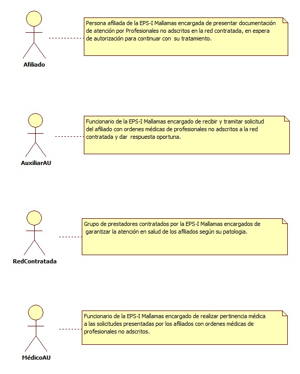
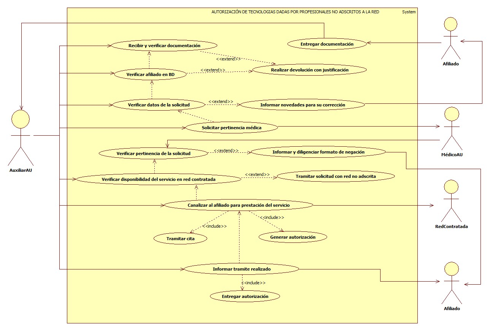

# SISTEMA DE INFORMACIÓN AUTORIZACIÓN DE TECNOLOGÍAS DADAS POR PROFESIONALES NO ADSCRITOS A LA RED.

Garantizar la oportunidad en los servicios de salud a los afiliados  de la EPS-I Mallamas, cuando sean pertinentes las tecnologías solicitadas por profesionales no adscritos a la red prestadora cuyo concepto no fue desvirtuado por la EPS-I.

## 1. MODELADO DEL SISTEMA DE INFORMACIÓN

### 1.1 ACTORES AUTORIZACIÓN DE TECNOLOGÍAS DADAS POR PROFESIONALES NO ADSCRITOS A LA RED.

### 1.2 IDENTIFICACIÓN DE LOS CASOS DE USO AUTORIZACIÓN DE TECNOLOGÍAS DADAS POR PROFESIONALES NO ADSCRITOS A LA RED.

| Número | Procesos del Sistema de Información                      |
| ------ | -------------------------------------------------------- |
| 1      | Entregar documentacion.                                  |
| 2      | Recibir y verificar documentacion.                       |
| 3      | Verificar afiliado en BD.                                |
| 4      | Realizar devolución con justificación.                   |
| 5      | Verificar datos de la solicitud.                         |
| 6      | Informar novedades para su corrección.                   |
| 7      | Solicitar pertinencia médica.                            |
| 8      | Verificar pertinencia de la solicitud.                   |
| 9      | Informar y diligenciar formato de negación.              |
| 10     | Verificar disponibilidad del servicio en red contratada. |
| 11     | Tramitar solicitud con red no adscrita.                  |
| 12     | Canalizar al afiliado para prestación del servicio.      |
| 13     | Tramitar cita.                                           |
| 14     | Generar autorización.                                    |
| 15     | Informar tramite realizado.                              |
| 16     | Entregar autorización.                                   |

### 1.3 DESCRIPCIÓN DEL DIAGRAMA DE CASOS DE USO AUTORIZACIÓN DE TECNOLOGÍAS DADAS POR PROFESIONALES NO ADSCRITOS A LA RED.

| **1. Caso de Uso** | Autorización de tecnologías dadas por profesionales no adscritos a la red. |
| - | - |
| **2. Descripción** | Garantizar la oportunidad en los servicios de salud a los afiliados  de la EPS-I Mallamas, cuando sean pertinentes las tecnologías solicitadas por profesionales no adscritos a la red prestadora cuyo concepto no fue desvirtuado por la EPS-I. |
| **3. Actor(es)**   | Afiliado, Auxiliar AU, Red contratada y Médico AU. |
| **4. Pre Condiciones** | Contar con base de datos de afiliados, contar con red contratada, contar con soportes de solicitud y contar con  normatividad vigente. |
| **5. Pos Condiciones** | Garantizar el tramite y autorización de tecnologías dadas por profesionales no adscritos a la red según pertinencia médica.|
| **6. Flujo de Eventos** |
| *Actor(es)* | *Sistema* |
| 1. El afiliado entrega documentos de solicitud de tecnologías dadas por profesionales no adscritos a la red.|  |
| 2. El Auxiliar AU recibe y verifica documentación (Documentación corresponda al afiliado solicitante, servicio solicitado tenga cobertura en el POS, ordenes medicas estén diligenciadas con letra legible). |  |
| 3. El Auxiliar AU verifica afiliado en base de datos. | 4. El sistema muestra estado de afiliación. |
| 5. El Auxiliar AU realiza devolución de documentación al afiliado con su respectiva justificación. |  |
| 6. El Auxiliar AU verifica datos de la solicitud (Fecha vigente, datos del afiliado, firma del medico solicitante, diagnostico, justificación medica). |  |
| 7. El Auxiliar AU informa al afiliado las novedades encontradas en la solicitud y entrega documentos para su respectiva corrección.  |  |
| 8. El Auxiliar AU una vez verificado que los documentos estén con todos los requerimientos necesarios solicita pertinente médica. |  |
| 9. El Médico AU Verifica documentación y confirma si la solicitud es pertinente para la patología del afiliado. |  |
| 10. El Médico AU si considera que la tecnología solicitada no es pertinente informa al afiliado diligenciando formato de negación de servicios. | |
| 11. El Médico AU una vez realizada la verificación si considera que es pertinente dar tramite a la solicitud entrega documentacion al Auxiliar AU para respectivo tramite.   | |
| 12. El Auxiliar AU verifica disponibilidad del servicio solicitado en la red contratada por la EPS-I Mallamas. (En caso de no encontrarse en red contratada se pasa al procedimiento de red no adscrita).  | |
| 13.El Auxiliar AU canaliza al afiliado para la prestación del servicio en red contratada informando la disponibilidad del servicio para su elección.| |
| 14. El Auxiliar AU tramita cita del afiliado y genera autorización para la prestación del servicio solicitado. | 16 El sistema muestra autorización. |
| 15. El Auxiliar AU informa al afiliado el tramite realizada (Institución que prestara el servicio, Fecha y hora de la cita, preparación cuando requiera). | |
| 16. El Auxiliar AU entrega autorización al afiliado con todas las recomendaciones necesarias. | |
| **7. Requerimiento Asociado** | R001, R002, R003 y R004. |
| **8. Interfaz de Usuario Asociada** | I001 y I002. |
| **9. Formato de Usuario Asociado** | F001. |

### 1.4 MODELADO VISUAL DEL CASO DE USO AUTORIZACIÓN DE TECNOLOGÍAS DADAS POR PROFESIONALES NO ADSCRITOS A LA RED.

## 2. ESPECIFICACIÓN DEL SISTEMA DE INFORMACIÓN AUTORIZACIÓN DE TECNOLOGÍAS DADAS POR PROFESIONALES NO ADSCRITOS A LA RED.

| Término    | Descripción                      |
| ---------- | -------------------------------- |
| POS        | Plan Obligatorio de salud.       |
| BD         | Base de datos de afiliados.      |
| MédicoAU   | Médico de atención al usuario.   |
| AuxiliarAU | Auxiliar de atención al usuario. |

## 3. ESPECIFICACIÓN DE REQUERIMIENTOS

| **N°** | **Tipo** | **Descripción** |
| - | - | - |
| R001 | Proceso | Red prestadora. |
| R002 | Proceso | Base de datos de afiliados. |
| R003 | Físico  | Documentos. |
| R004 | Físico  | Normatividad vigente. |

## 4. ESPECIFICACIÓN DE LA INTERFACE DE USUARIO

| **1. Número** |
| - |
| I001 |
| **2. Propósito de la Interfaz** |
| Mostrar verificación del afiliado en BD |
| **3. Gráfica de la Interfaz**|
|  |

| **1. Número** |
| - |
| I002 |
| **2. Propósito de la Interfaz** |
| Mostrar autorización. |
| **3. Gráfica de la Interfaz**|
|  |

### 4.1 IDENTIFICACIÓN DE PERFILES Y DIÁLOGOS

| **1. Nombre del Perfil** |
| - |
| Auxiliar del sistema de autorizaciones |
| **2. Opciones a las que tiene Acceso**|
| Nueva autorización y consultar autorizaciones. |
| **3. Tipo de Acceso** |
| Ingresar, anular, Consultar, Imprimir y Registrar.   |

### 4.2 ESPECIFICACIÓN DE FORMATOS DE USUARIO

| Número | Nombre del Formato                |
| ------ | --------------------------------- |
| F001   | Formato de negación de servicios y/o medicamentos. |