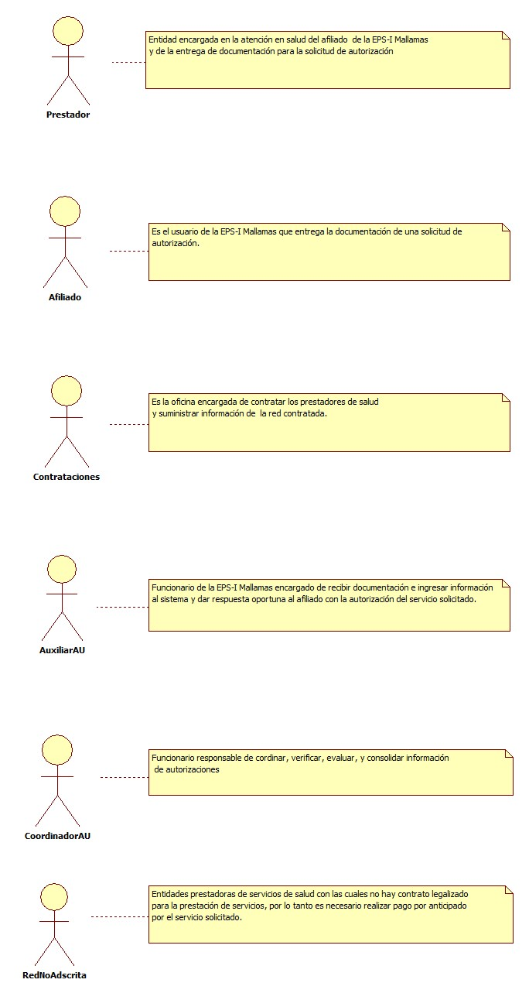
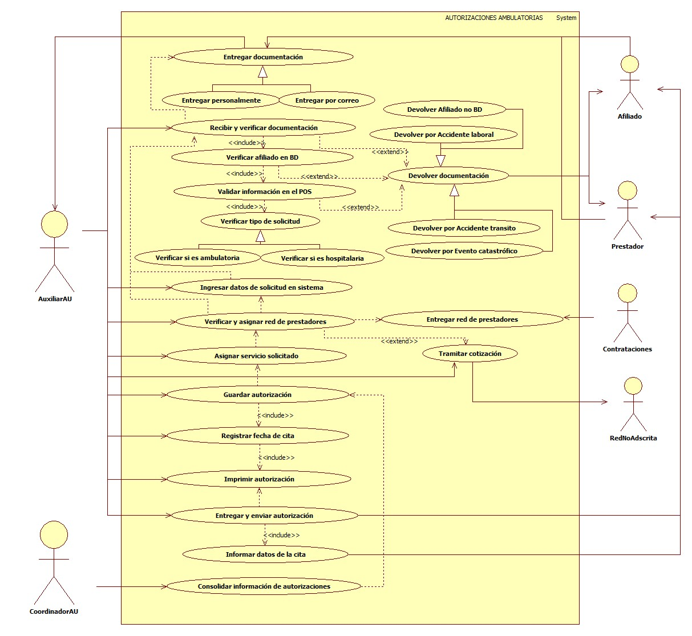
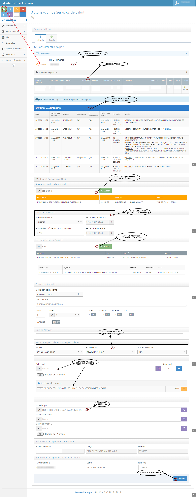

# SISTEMA DE INFORMACIÓN AUTORIZACIONES AMBULATORIAS Y HOSPITALARIAS.

Garantizar la atención de tecnologías ambulatorias y hospitalarias establecidas en el plan de beneficios con oportunidad, calidad e integralidad.

## 1. MODELADO DEL SISTEMA DE INFORMACIÓN

### 1.1 ACTORES AUTORIZACIONES AMBULATORIAS Y HOSPITALARIAS

### 1.2 IDENTIFICACIÓN DE LOS CASOS DE USO AUTORIZACIONES AMBULATORIAS  Y HOSPITALARIAS

| Número | Procesos del Sistema de Información |
| ------ | ---------------------------------------- |
| 1      | Entregar documentación.                  |
| 2      | Entregar personalmente.                  |
| 3      | Entregar por correo.                     |
| 4      | Recibir y verificar documentación.       |
| 5      | Verificar afiliado en BD.                |
| 6      | Validar información en el POS.        |
| 7      | Verificar tipo de solicitud.        |
| 8      | Verificar si es ambulatoria.        |
| 9      | Verificar si es hospitalaria.        |
| 10      | Devolver documentación.               |
| 11      | Devolver por Afiliado no BD.             |
| 12      | Devolver por Accidente Laboral.          |
| 13     | Devolver por Accidente de transito.      |
| 14     | Devolver por Evento Catastrófico.        |
| 15     | Ingresar datos de solicitud en sistema.  |
| 16     | Entregar red de prestadores.             |
| 17     | Verificar y asignar red de prestadores.  |
| 18     | Tramitar cotización.  |
| 19     | Asignar servicio solicitado.             |
| 20     | Guardar autorización.                    |
| 21     | Registrar fecha de cita.                 |
| 22     | Imprimir autorización.                   |
| 23     | Entregar autorización.                   |
| 24     | Informar al afiliado datos de la cita.   |
| 25     | Consolidar información de autorizaciones.|
            
### 1.3 DESCRIPCIÓN DEL DIAGRAMA DE CASOS DE USO AUTORIZACIONES AMBULATORIAS Y HOSPITALARIAS.

| **1. Caso de Uso** | Autorizaciones Ambulatorias y hospitalarias. |
| -- | -- |
| **2. Descripción** | Garantizar la atención de servicios de salud del afiliado según el POS, verificando la documentacion y validando la información.|
| **3. Actor(es)**   | Coordinador de AU, Auxiliar de AU, Contrataciones, El Afiliado, Prestador.|
| **4. Pre Condiciones** | Inicio de sesión en el sistema de autorizaciones, Solicitud de soportes, Verificación BD, Verificación de normatividad, verificación de red contratada.|
| **5. Pos Condiciones** | Generar y entregar  Autorización.|
| **6. Flujo de Eventos** |
| *Actor(es)* | *Sistema* |
| 1. El afiliado entrega documentación (anexo 3, remisión, orden medica, historia clínica)con solicitud de autorización o el prestador envia solicitud por correo electronico.| |
| 2. El Auxiliar de AU recibe y verifica documentación (anexo 3, remisión, orden medica, historia clínica) priorizando pacientes de alto costo, menores de 18 años, gestantes, victimas de conflicto armado, población en situación de discapacidad y mayores de 60 años.| |
| 3. El Auxiliar de AU ingresa al sistema de autorizaciones y verifica afiliado en base de datos. | 4.  El sistema confirma estado de afiliación (ver interfaz I001). |
| 5. El Auxiliar de AU Verifica servicio solicitado en el POS (Consultas especializadas, Laboratorios, Ayudas diagnosticas, Radiología,medicamentos, procedimientos quirúrgicos entre otros). | | 
| 6. El Auxiliar de AU realiza devolución de documentos al afiliado según sea el caso ( Accidente de transito, afiliado no registra en BD, Accidente laboral, Evento catastrófico, documentación incompleta). | |
| 7. El Auxiliar de AU después de verificar que que solicitud presentada por el afiliado cumpla con los requerimientos necesarios, ingresa datos del usuario al sistema de autorizaciones.| 8. El sistema muestra formulario de autorización (ver Interfaz I002). |
| 9. El Auxiliar de AU solicita red contratada. | |
| 10. Contrataciones entrega red contratada. | | 
| 11. El Auxiliar de AU verifica disponibilidad del servicio en red contratada (en caso de no contar con disponibilidad del servicio en red contratada se tramita cotización con red no adscrita para garantizar la prestación del servicio). | |
| 12. El Auxiliar de AU informa al afiliado disponibilidad del servicio en red contratada para la elección de su preferencia. | |
| 13. El Auxiliar de AU selecciona prestador de servicios e ingresa código según servicio solicitado. | 14. El sistema muestra formato de autorización diligenciado ( ver interfaz I002). |
| 15. El Auxiliar de AU guarda autorización|16. El sistema muestra formato para selección de fecha de cita (ver interfaz I003). |
| 17. El Auxiliar de AU registra fecha y hora de cita. |18. El sistema muestra formato de autorización anexo 4 (ver interfaz I004). |
||19. El sistema imprime autorización (ver interfaz I004). |
| 20. El auxiliar AU entrega autorización al usuario y enviá autorización por correo al prestador (si la solicitud de autorización es ambulatoria la respuesta se da durante los 5 días hábiles, si la solicitud es hospitalaria la respuesta se da durante las 6 horas posteriores a la atención y si la solicitud es por urgencias la respuesta es durante las 2 horas posteriores a la atención).| |
| 21. El Auxiliar de AU informa al afiliado datos de la cita o enviá información por correo al prestador (fecha, hora, lugar, nombre del especialista) donde recibirá la prestación del servicio.| |
| 22. El coordinador AU genera consolidado de autorizaciones.|23. El sistema reporta consolidado.|
| **7. Requerimiento Asociado** | R001, R002, R003 y R004 |
| **8. Interfaz de Usuario Asociada** | I001, I002, I003 y I004. |
| **9. Formato de Usuario Asociado** | F001 y F002. |

### 1.4 MODELADO VISUAL DE LOS CASOS DE USO AUTORIZACIONES AMBULATORIAS Y HOSPITALARIA.

## 2. ESPECIFICACIÓN DEL SISTEMA DE INFORMACIÓN AUTORIZACIONES AMBULATORIAS Y HOSPITALARIA.

| Término        | Descripción                                                                   |
| -------------- | ----------------------------------------------------------------------------- |
| BD             | Base de datos                                                                 |
| Coordinador AU | Coordinador atención al usuario                                               |
| Auxiliar AU    | Auxiliar de atención al usuario                                               |
| Red contratada | Conjunto de instituciones prestadoras de salud                                |
| Pos-s          | PLan obligatorio de salud                                                     |
| Anexo 3        | Solicitud de autorización de servicios posteriores a la atención de urgencias |
| Anexo 4        | Respuesta de autorización de servicios                                        |

## 3. ESPECIFICACIÓN DE REQUERIMIENTOS

| **N°** | **Tipo** | **Descripción** |
| - | - | - |
| R001 | Proceso | Red prestadora |
| R002 | Proceso | Normatividad |
| R003 | Físico | Documentos |
| R004 | Proceso | Base de datos |

## 4. ESPECIFICACIÓN DE LA INTERFACE DE USUARIO

| **1. Número** |
| - |
| I001 |
| **2. Propósito de la Interfaz** |
| Mostrar verificación del afiliado |
| **3. Gráfica de la Interfaz**|
|  |

| **1. Número** |
| - |
| I002 |
| **2. Propósito de la Interfaz** |
| Mostrar formulario de autorización. |
| **3. Gráfica de la Interfaz**|
|  |

| **1. Número** |
| - |
| I003 |
| **2. Propósito de la Interfaz** |
| Registras fecha y hora de cita |
| **3. Gráfica de la Interfaz**|
|  |

| **1. Número** |
| - |
| I004 |
| **2. Propósito de la Interfaz** |
| Imprimir Autorización |
| **3. Gráfica de la Interfaz**|
|  |

### 4.1 IDENTIFICACIÓN DE PERFILES Y DIÁLOGOS

| **1. Nombre del Perfil** |
| - |
| Auxiliar del sistema de autorizaciones. |
| **2. Opciones a las que tiene Acceso**|
| Nueva autorización, Consultar Autorizaciones. |
| **3. Tipo de Acceso** |
| Crear, Eliminar, Consultar, Modificar, Imprimir. |

### 4.2 ESPECIFICACIÓN DE FORMATOS OFIMATICOS

| Número | Nombre del Formato |
| ------ | ------------------ |
| F001  | Anexo 3  |
| F002  | Anexo 4  |