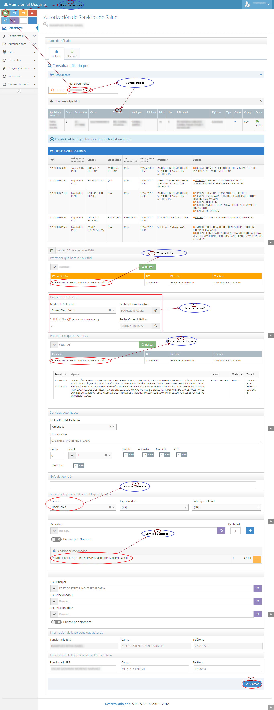

# SISTEMA DE INFORMACIÓN AUTORIZACIONES SERVICIOS DE URGENCIAS

Garantizar la atención  de urgencias y sus derivados establecidos en el plan de beneficios con oportunidad, calidad e integralidad, dentro de las instituciones prestadoras de servicios de salud dentro y fuera de la red de servicios en los diferentes niveles de atención.

## 1. MODELADO DEL SISTEMA DE INFORMACIÓN

### 1.1 ACTORES AUTORIZACIONES SERVICIOS DE URGENCIAS

### 1.2 IDENTIFICACIÓN DE LOS CASOS DE USO AUTORIZACIONES SERVICIOS DE URGENCIAS

| Número | Procesos del Sistema de Información                  |
| ------ | ---------------------------------------------------- |
| 1      | Enviar reporte de anexo 2.                           |
| 2      | Recibir solicitud de anexo 2.                        |
| 3      | Verificar afiliado en BD.                            |
| 4      | Verificar datos de solicitud anexo 2.                |
| 5      | Realizar devolución de documentación.                |
| 6      | Devolver por accidente de transito.                  |
| 7      | Devolver por evento catastrófico.                    |
| 8      | Devolver por accidente laboral.                      |
| 9      | Devolver por afiliado no BD.                         |
| 10     | Seleccionar y asignar prestador.                     |
| 11     | Ingresar información de anexo 2 al sistema.          |
| 12     | Seleccionar servicio solicitado.                     |
| 13     | Generar autorización.                                |
| 14     | Enviar autorización.                                 |
| 15     | Consolidar informe de atención inicial de urgencias. |

### 1.3 DESCRIPCIÓN DEL DIAGRAMA DE CASOS DE USO AUTORIZACIONES SERVICIOS DE URGENCIAS

| **1. Caso de Uso** | Autorizaciones servicios de urgencias. |
| - | - |
| **2. Descripción** | Garantizar la atención  de urgencias y sus derivados establecidos en el plan de beneficios con oportunidad, calidad e integralidad, dentro de las instituciones prestadoras de servicios de salud dentro y fuera de la red de servicios en los diferentes niveles de atención. |
| **3. Actor(es)**   | Coordinador AU, Auxiliar AU, Prestador de servicios de salud. |
| **4. Pre Condiciones** | Correo electrónico institucional, inicio de sección al sistema de autorizaciones, Verificación BD, Anexo técnico según normatividad, Prestadores de servicios de salud.  |
| **5. Pos Condiciones** | Generar autorizaciones de servicios de urgencias. |
| **6. Flujo de Eventos** |
| *Actor(es)* | *Sistema* |
| 1. El prestador envía anexo 2 por correo electrónico.| |
| 2. El auxiliar ingresa al correo electrónico y descarga anexo 2.  | 3. El sistema muestra información de  anexo 2.|
| 4. El auxiliar AU inicia sesión en sistema de autorizaciones. ||
| 5. El auxiliar AU digita numero de documento del afiliado en sistema. | 6. El sistema verifica afiliado en BD. |
| 7. El auxiliar AU verifica información de anexo 2 que cumpla con normatividad vigente y realiza devolución con justificación según sea el caso (Accidente de transito, Accidente laboral, Accidente catastrófico, Afiliado no registra en base de datos, Anexo 2 supera las 24 horas previo al ingreso del paciente y anexo 2 no vigente). ||
| 8. El auxiliar AU digita información de anexo 2 en sistema de autorizaciones. | 9. El sistema muestra formulario de autorización. |
| 10. El auxiliar AU selecciona y asigna prestador de servicios de salud.  ||
| 11. El auxiliar AU selecciona servicio solicitado. | 12. El sistema muestra formato de autorización de servicios de urgencias diligenciado.|
| 13. El auxiliar AU guarda autorización.  ||
| 14. El auxiliar AU envía autorización por correo electrónico al prestador. ||
| 15. El coordinador AU genera consolidado de autorizaciones de servicios de urgencias. | 16. El sistema muestra consolidado.|
| **7. Requerimiento Asociado** | R001, R002, R003, R004 y R005 |
| **8. Interfaz de Usuario Asociada** | I001 |
| **9. Formato de Usuario Asociado** |F001 y F002. |

### 1.4 MODELADO VISUAL DEL CASO DE USO AUTORIZACIONES SERVICIOS DE URGENCIAS

## 2. ESPECIFICACIÓN DEL SISTEMA DE INFORMACIÓN AUTORIZACIONES SERVICIOS DE URGENCIAS

| Término          | Descripción                                                                          |
| ---------------- | ------------------------------------------------------------------------------------ |
| BD               | Base de datos.                                                                       |
| Coordinador AU   | Coordinador de atención al usuario.                                                  |
| Auxiliar AU      | Auxiliar de atención al usuario.                                                     |
| Anexo 2          | Reporte de atención  inicial de urgencias.                                           |
| Red de servicios | Instituciones prestadoras de servicios de salud (IPS, Hospitales, Centros de salud). |
| Anexo 4          | Respuesta de autorización de servicios de salud.                                     |

## 3. ESPECIFICACIÓN DE REQUERIMIENTOS

| **N°** | **Tipo** | **Descripción** |
| - | - | - |
| R001 | Proceso | Correo electrónico.|
| R002 | Proceso | Base de datos.|
| R003 | Proceso | Normatividad vigente.|
| R004 | Físico  | Anexo técnico 2.|
| R005 | Proceso | Red de prestadores.|

## 4. ESPECIFICACIÓN DE LA INTERFACE DE USUARIO

| **1. Número** |
| - |
| I001 |
| **2. Propósito de la Interfaz** |
| Generar autorización de servicios de urgencias. |
| **3. Gráfica de la Interfaz**|
|  |

### 4.1 IDENTIFICACIÓN DE PERFILES Y DIÁLOGOS

| **1. Nombre del Perfil** |
| - |
| Auxiliar del sistema de autorizaciones |
| **2. Opciones a las que tiene Acceso**|
| Nueva autorización, Consultar autorizaciones.  |
| **3. Tipo de Acceso** |
| Ingresar, Modificar, Imprimir, Cancelar, Consultar.|

### 4.2 ESPECIFICACIÓN DE FORMATOS DE USUARIO
| Número | Nombre del Formato |
| ------ | ------------------ |
| F001  | Anexo 2   |
| F002  | Anexo 4   |