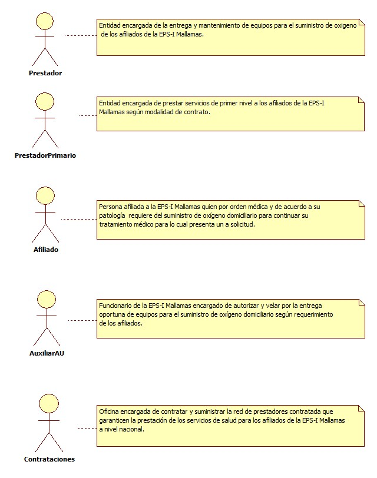
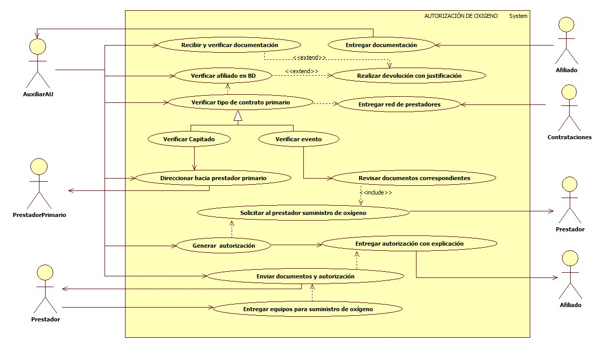

# SISTEMA DE INFORMACIÓN AUTORIZACIÓN DE OXIGENO

Garantizar de manera oportuna a los afiliados de la EPS-I Mallamas el tramite de oxígeno domiciliario y la autorización para la prestación de un servicio con calidad.

## 1. MODELADO DEL SISTEMA DE INFORMACIÓN

### 1.1 ACTORES AUTORIZACIÓN DE OXIGENO.

### 1.2 IDENTIFICACIÓN DE LOS CASOS DE USO AUTORIZACIÓN DE OXIGENO.

| Número | Procesos del Sistema de Información            |
| ------ | ---------------------------------------------- |
| 1      | Entregar documentación.                        |
| 2      | Recibir y verificar documentación.             |
| 3      | Verificar afiliado en BD.                      |
| 4      | Realizar devolución con justificación.         |
| 5      | Entregar red de prestadores.                   |
| 6      | Verificar tipo de contrato primario.           |
| 7      | Verificar capitado.                            |
| 8      | Verifica evento.                               |
| 9      | Direccionar hacia prestador primario.          |
| 10     | Revisar documentos correspondientes.           |
| 11     | Solicitar al prestador suministro de oxígeno.  |
| 12     | Generar autorización.                          |
| 13     | Entregar autorización con explicación.         |
| 14     | Enviar documentos y autorización al prestador. |
| 15     | Entregar equipos para el suministro de oxígeno. |

### 1.3 DESCRIPCIÓN DEL DIAGRAMA DE CASOS DE USO AUTORIZACIÓN DE OXIGENO.

| **1. Caso de Uso** | Autorización de oxígeno. |
| - | - |
| **2. Descripción** | Garantizar de manera oportuna a los afiliados de la EPS-I Mallamas el tramite de oxigeno domiciliario y la autorización para la prestación de un servicio con calidad. |
| **3. Actor(es)**   | Prestador, Prestador primario, Afiliado, Auxiliar de AU y Contrataciones. |
| **4. Pre Condiciones** | Contar con red contratada y contar con base de datos de afiliados. |
| **5. Pos Condiciones** | Entregar autorización para el suministro de oxígeno.|
| **6. Flujo de Eventos** |
| *Actor(es)* | *Sistema* |
| 1. El afiliado entrega documentación para tramite de oxigeno domiciliario (Orden medica, Historia clínica, copia de documentos).|  |
| 2. El Auxiliar AU recibe y verifica documentación que cumpla con los requerimientos para la solicitud de oxígeno (Orden medica de especialista con justificación, Orden medica vigente y Diagnostico). |  |
| 3. El Auxiliar verifica afiliado en base de datos. | 4. El sistema muestra estado de afiliación (ver interfaz I001). |
| 5. El Auxiliar AU realiza devolución de la documentacion explicando al afiliado el motivo en caso de que no registre en base de datos o documentacion no cumpla con los requerimientos necesarios. |  |
| 6. El Auxiliar AU Verifica tipo de contratación con prestador de servicios primarios del afiliado (Contrato capitado o contrato por evento).  | |
| 7. El Auxiliar AU verifica si contrato es capitado informa al afiliado que debe de acercarse hasta el prestador primario para el tramite y entrega de oxigeno domiciliario por parte del prestador primario.   |  |
| 8. El Auxiliar AU verifica si contrato es por evento revisa la documentación que este completa y se comunica con el prestador contratado para solicitar el suministro de oxígeno domiciliario.  |  |
| 9. El Auxiliar AU ingresa al sistema y genera autorización para oxígeno domiciliario en caso de contrato por evento.
|  | 10. El sistema muestra autorización anexo 4 (ver interfaz I002). |
| 11. El Auxiliar AU entrega autorización al afiliado informando que debe acercarse con toda la documentacion y autorización hasta donde el prestador para el suministro de oxígeno domiciliario.  | |
| 12. El Auxiliar AU envía por via correo electrónico la documentacion, autorización y datos del afiliado al prestador con el fin de que garantice la entrega oportuna y a domicilio de los equipos para el suministro de oxígeno.
| 13. El prestador se comunica directamente con el afiliado para coordinar la entrega oportuna e instalación de los equipos para el suministro de oxígeno domiciliario. | |
| **7. Requerimiento Asociado** | R001, R002 y R003. |
| **8. Interfaz de Usuario Asociada** | I001 y I002. |
| **9. Formato de Usuario Asociado** |F001 |

### 1.4 MODELADO VISUAL DEL CASO DE USO AUTORIZACIÓN DE OXIGENO

## 2. ESPECIFICACIÓN DEL SISTEMA DE INFORMACIÓN AUTORIZACIÓN DE OXIGENO.

| Término     | Descripción                      |
| ----------- | -------------------------------- |
| BD          | Base de datos de afiliados.      |
| Auxiliar AU | Auxiliar de atención al usuario. |

## 3. ESPECIFICACIÓN DE REQUERIMIENTOS

| **N°** | **Tipo** | **Descripción** |
| - | - | - |
| R001 | Proceso | Red prestadora |
| R002 | Proceso | Base de datos de afiliados. |
| R003 | Físico  | Documentos |

## 4. ESPECIFICACIÓN DE LA INTERFACE DE USUARIO

| **1. Número** |
| - |
| I001 |
| **2. Propósito de la Interfaz** |
| Mostrar verificación del afiliado en base de datos. |
| **3. Gráfica de la Interfaz**|
|  |

| **1. Número** |
| - |
| I002 |
| **2. Propósito de la Interfaz** |
| Mostrar autorización. |
| **3. Gráfica de la Interfaz**|
|  |

### 4.1 IDENTIFICACIÓN DE PERFILES Y DIÁLOGOS

| **1. Nombre del Perfil** |
| - |
| Auxiliar del sistema de autorizaciones. |
| **2. Opciones a las que tiene Acceso**|
| Nueva autorización, Verificar base de datos. |
| **3. Tipo de Acceso** |
| Ingresar, Consultar, Imprimir y Eliminar. |

### 4.2 ESPECIFICACIÓN DE FORMATOS DE USUARIO

| Número | Nombre del Formato |
| ------ | ------------------ |
|   F001     |   Anexo 4                 |
|        |                    |