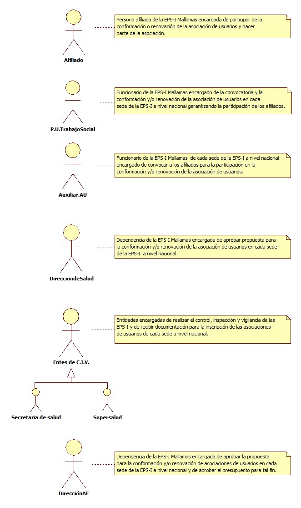
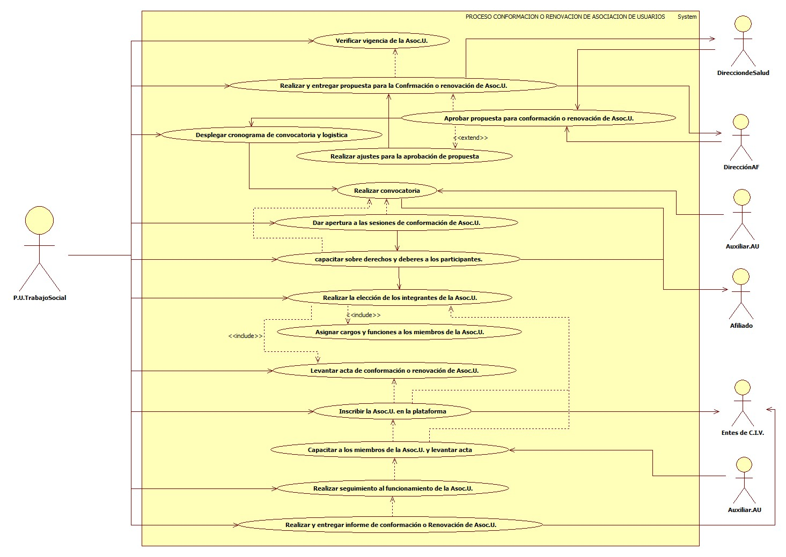
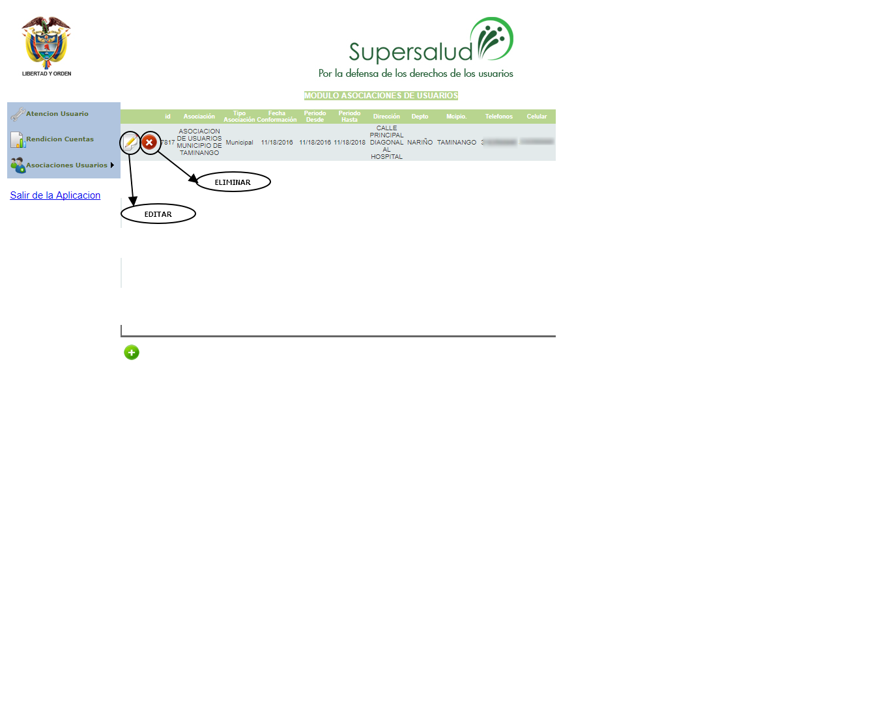

# SISTEMA DE INFORMACIÓN CONFORMACIÓN O RENOVACIÓN DE ASOCIACIONES DE USUARIOS.

Promover la participación social por medio de la conformación de las ligas o asociaciones de usuarios en la población afiliada a la EPS-I Mallamas, promoviendo el ejercicio de control social por la defensa y divulgación de los deberes y derechos de la población afiliada indígena y no indígena.

## 1. MODELADO DEL SISTEMA DE INFORMACIÓN

### 1.1 ACTORES CONFORMACIÓN O RENOVACIÓN DE ASOCIACIONES DE USUARIOS.

### 1.2 IDENTIFICACIÓN DE LOS CASOS DE USO CONFORMACIÓN O RENOVACIÓN DE ASOCIACIONES DE USUARIOS.

| Número | Procesos del Sistema de Información |
| ------ | ----------------------------------- |
| 1      | Verificar vigencia de la Asociación de usuarios. |
| 2      | Realizar y entregar propuesta para la Conformación o Renovación de asociación de usuarios. |
| 3      | Aprobar propuesta para conformación o renovación de asociación de usuarios. |
| 4      | Realizar ajustes para la aprobación de la propuesta. |
| 5      | Desplegar cronograma de convocatoria y logística. |
| 6      | Realizar convocatoria de afiliados de la EPS-I Mallamas. |
| 7      | Dar apertura a las sesiones de conformación o renovación de asociaciones de usuarios. |
| 8      | Capacitar sobre derechos y deberes a los participantes. |
| 9      | Realizar la elección de los integrantes de la asociación de usuarios. |
| 10     | Asignar cargos y funciones a los miembros de la asociación de usuarios. |
| 11     | Levantar acta de conformación o renovación de asociación de usuarios. |
| 12     | Inscribir la asociación de usuarios en la plataforma de la supersalud y secretarias de salud. |
| 13     | Capacitar a los miembros de la asociación de usuarios y levantar acta. |
| 14     | Realizar seguimiento al funcionamiento de las asociaciones de usuarios.  |
| 15     | Realizar y entregar informe de conformación o renovación de asociaciones de usuarios. |

### 1.3 DESCRIPCIÓN DEL DIAGRAMA DE CASOS DE USO CONFORMACIÓN O RENOVACIÓN DE ASOCIACIONES DE USUARIOS.

| **1. Caso de Uso** | Conformación o renovación de asociaciones de usuarios. |
| - | - |
| **2. Descripción** | Promover la participación social por medio de la conformación de las ligas o asociaciones de usuarios en la población afiliada a la EPS-I Mallamas, promoviendo el ejercicio de control social por la defensa y divulgación de los deberes y derechos de la población afiliada indígena y no indígena. |
| **3. Actor(es)**   | Afiliado, P.U Trabajo social, Auxiliar AU, Dirección de salud, Dirección administrativa y financiera y entes de C.I.V. |
| **4. Pre Condiciones** | Contar con población afiliada indígena y no indígena. |
| **5. Pos Condiciones** | Conformación o renovación de asociación de usuarios.|
| **6. Flujo de Eventos** |
| *Actor(es)* | *Sistema* |
| 1. P.U. de Trabajo Social esta pendiente de la vigencia de funcionamiento de las asociaciones de usuarios cada dos años según normatividad vigente. |  |
| 2. P.U. de Trabajo Social entrega propuesta (cronograma y presupuesto), para la conformación o renovación de las asociaciones de usuarios a nivel departamental. |  |
| 3. La Dirección de salud junto con la Dirección administrativa y financiera revisan y aprueban propuesta para la conformación o renovación de las asociaciones de usuarios. |  |
| 4. P.U. de Trabajo social realiza ajustes a la propuesta en caso de no ser aprobada la presentada inicialmente. |  |
| 5. P.U. de Trabajo Social realiza cronograma de convocatoria y logística para desplazarse a los diferentes municipios del departamento de nariño donde la EPS-I Mallamas hace presencia. |  |
| 6. El Auxiliar de atención al usuario de cada sede de la EPS-I Mallamas realiza convocatoria de los afiliados para la participación de la conformación o renovación de las asociaciones de usuarios.  |  |
| 7. Los afiliados de la EPS-I Mallamas asisten a convocatoria. |  |
| 8. P.U. de Trabajo Social da apertura a la sesión de conformación de asociaciones de usuarios explicando el objetivo principal. |  |
| 9. P.U. de Trabajo Social realiza la elección de los integrantes que conformaran  la asociación de usuarios dicha elección se realiza con los afiliados indígenas y no indígenas participantes del evento.   |  |
| 10. P.U. de Trabajo Social realiza capacitación sobre derechos y deberes a los miembros de la asociación de usuarios elegidos y a los demás afiliados participantes. | |
| 11. P.U. de Trabajo Social junto con la Asociación de usuarios elegida designa cargos y funciones. | |
| 12. P.U. de Trabajo social levanta acta de conformación o renovación de asociaciones de usuarios. | |
| 13. P.U de Trabajo Social realiza la inscripción de asociaciones de usuarios en la plataforma de la supersalud y en las secretarias de salud de cada municipio. | 14. El sistema muestra plataforma para la inscripción de la asociación de usuarios (ver interfaz I001). |
| 15. El Auxiliar de Atención al usuario de cada sede de la EPS-I Mallamas realiza capacitación a los integrantes de la asociación de usuarios cada 2 meses y levanta acta de capacitación. | |
| 16. P.U. de Trabajo social realiza seguimiento a la entrega de actas de capacitación por parte de los auxiliares de atención al usuario de cada sede para verificar el funcionamiento de las asociaciones de usuarios.| |
| 17. P.U. de Trabajo social realiza y entrega informe de la conformación o renovación de asociaciones de usuarios y su funcionamiento a los entes de C.I.V cuando lo requieran.| |
| **7. Requerimiento Asociado** | R001 y R002. |
| **8. Interfaz de Usuario Asociada** | I001 y I002. |
| **9. Formato de Usuario Asociado** | F001, F002, F003 y F004. |

### 1.4 MODELADO VISUAL DEL CASO DE USO CONFORMACIÓN O RENOVACIÓN DE ASOCIACIONES DE USUARIOS.

## 2. ESPECIFICACIÓN DEL SISTEMA DE INFORMACIÓN CONFORMACIÓN O RENOVACIÓN DE ASOCIACIONES DE USUARIOS.

| Término | Descripción |
| ------- | ----------- |
| P.U. | Profesional Universitario           |
| Auxiliar AU | Auxiliar de Atención al Usuario |
| Entes de C.I.V. | Entes de control, inspección y vigilancia. |
| Supersalud | Super intendencia nacional de salud. |
| Dirección AF | Dirección administrativa y financiera. |
| Asoc.U. | Asociación de usuarios. |

## 3. ESPECIFICACIÓN DE REQUERIMIENTOS

| **N°** | **Tipo** | **Descripción** |
| - | - | - |
| R001 | Proceso | Base de datos de afiliados. |
| R002 | Físico  | Propuesta de conformación o renovación de asociación de usuarios. |

## 4. ESPECIFICACIÓN DE LA INTERFACE DE USUARIO

| **1. Número** |
| - |
| I001 |
| **2. Propósito de la Interfaz** |
| Mostrar plataforma de la supersalud para la inscripción de la asociación de usuarios. |
| **3. Gráfica de la Interfaz**|
|  |

| **1. Número** |
| - |
| I002 |
| **2. Propósito de la Interfaz** |
| Mostrar la asociación de usuarios inscrita. |
| **3. Gráfica de la Interfaz**|
|  |

### 4.1 IDENTIFICACIÓN DE PERFILES Y DIÁLOGOS

| **1. Nombre del Perfil** |
| - |
|  |
| **2. Opciones a las que tiene Acceso**|
|  |
| **3. Tipo de Acceso** |
|  |

### 4.2 ESPECIFICACIÓN DE FORMATOS DE USUARIO

| Número | Nombre del Formato |
| ------ | ----------------------------------- |
| F001   | Acta de conformación o renovación de asociación de usuarios.              |
| F002   | Formato de asistencia conformación o renovación de asociación de usuarios.         |
| F003   | Propuesta de conformación o renovación de asociación de usuarios.              |
| F004   | Acta de capacitación de asociación de usuarios.             |