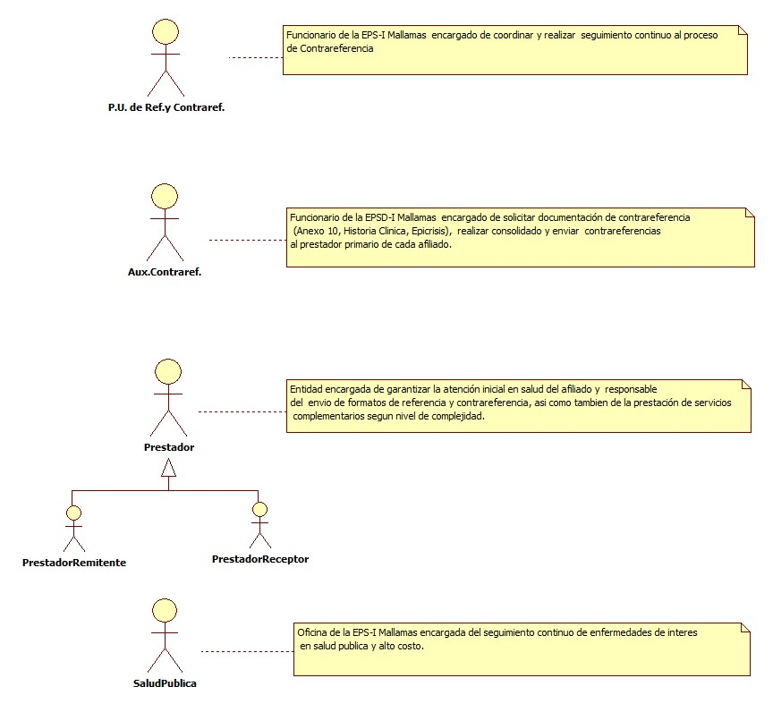
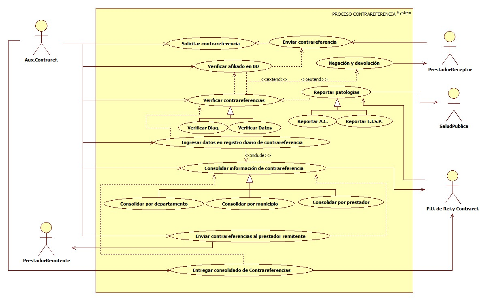

# SISTEMA DE INFORMACIÓN CONTRAREFERENCIA

Es el resultado de una referencia con el fin de garantizar la continuidad de la atención, la contrareferencia se diligencia una vez terminada la interconsulta o el tratamiento objeto de la referencia.

## 1. MODELADO DEL SISTEMA DE INFORMACIÓN

### 1.1 ACTORES CONTRAREFERENCIA

### 1.2 IDENTIFICACIÓN DE LOS CASOS DE USO CONTRAREFEREENCIA

| Número | Procesos del Sistema de Información                    |
| ------ | ------------------------------------------------------ |
| 1      | Solicitar contrareferencia.                            |
| 2      | Enviar contrareferencia.                               |
| 3      | Verificar afiliado en BD.                              |
| 4      | Verificar contrareferencia.                            |
| 5      | Verificar diagnostico.                                 |
| 6      | Verificar datos.                                       |
| 7      | Negación y devolución.                                 |
| 8      | Reportar patologías.                                   |
| 9      | Reportar A.C.                                          |
| 10     | Reportar E.I.S.P.                                      |
| 11     | Ingresar datos en registro diario de contrareferencia. |
| 12     | Consolidar información de contrareferencia.            |
| 13     | Consolidar por departamento.                           |
| 14     | Consolidar por municipio.                              |
| 15     | Consolidar por prestador.                              |
| 16     | Enviar contrareferencia al prestador remitente.        |

### 1.3 DESCRIPCIÓN DEL DIAGRAMA DE CASOS DE USO CONTRAREFERENCIA

| **1. Caso de Uso** | Contrareferencia |
| - | - |
| **2. Descripción** | Es el resultado de una referencia con el fin de garantizar la continuidad de la atención, la contrareferencia se diligencia una vez terminada la interconsulta o el tratamiento objeto de la referencia. |
| **3. Actor(es)**   | P.U. de Ref. y Contraref., Aux.Contraref.   Prestadores (Remitente y Receptor) y Salud pública. |
| **4. Pre Condiciones** | Contar con red contratada, Contar con base de datos y Contar con referencias. |
| **5. Pos Condiciones** | Contrareferencia del afiliado.|
| **6. Flujo de Eventos** |
| *Actor(es)* | *Sistema* |
| 1. El Aux. de Contraref. solicita contrareferencia al prestador receptor.||
| 2. El Prestador receptor envía contrareferencia a la EPS-I Mallamas. ||
| 3. El Aux. de Contraref. verifica el afiliado en BD. | 4. El sistema muestra estado de afiliación. |
| 5. El Aux. de Contraref. verifica documentacion de contrareferencia que coincidan con datos del afiliado, fechas vigentes, letra legible y firma del medico tratante. ||
| 6. El Aux. de Contraref. realiza devolución de contrareferencia al prestador receptor en caso de que el afiliado no registre en base de datos o la contrareferencia este mal diligenciada.  ||
| 7. El Aux. de Contraref. verifica diagnósticos y entrega patologías de alto costo y enfermedades de interés en salud publica al P.U. de Referencia y Contrareferencia.  ||
| 8. El P.U de Referencia y Contraref. Verifica diagnósticos y reporta patologías de enfermedades de interés en salud publica y alto costo al área de salud publica de la EPS-I Mallamas.  ||
| 9. El Aux. de Contraref. ingresa datos en registro diario de contrareferencia. ||
| 10. El Aux. de Contraref. consolida información de contrareferencia por departamento, por municipio y por prestador.||
| 11. El Aux. de Contraref. envía contrareferencias al prestador remitente. ||
| 12. El Aux. de Contraref. entrega consolidado de  contrareferencias a P.U. de Referencia y Contrareferencia. ||
| **7. Requerimiento Asociado** | R001, R002, R003. |
| **8. Interfaz de Usuario Asociada** | I001. |
| **9. Formato de Usuario Asociado** | F001 y F002.|

### 1.4 MODELADO VISUAL DEL CASO DE USO CONTRAREFERENCIA

## 2. ESPECIFICACIÓN DEL SISTEMA DE INFORMACIÓN CONTRAREFERENCIA

| Término                   | Descripción                                                                                                           |
| ------------------------- | --------------------------------------------------------------------------------------------------------------------- |
| BD                        | Base de datos.                                                                                                        |
| Aux.                      | Auxiliar.                                                                                                             |
| Contraref.                | Contrareferencia.                                                                                                     |
| Diag.                     | Diagnostico                                                                                                           |
| A.C.                      | Alto Costo                                                                                                            |
| E.I.S.P.                  | Enfermedades de interés en salud publica                                                                              |
| P.U. de Ref. y Contraref. | Profesional Universitario de Referencia y Contrareferencia.                                                           |
| EPS-I                     | Entidad Promotora de Salud Indígena.                                                                                  |
| Anexo 10                  | Formato de contrareferencia registra la información clínica relacionada con la atención  resultado de una referencia. |

## 3. ESPECIFICACIÓN DE REQUERIMIENTOS

| **N°** | **Tipo** | **Descripción** |
| - | - | - |
| R001 | Proceso | Red prestadora |
| R002 | Proceso | Base de datos |
| R003 | Físico  | Anexo 10 |

## 4. ESPECIFICACIÓN DE LA INTERFACE DE USUARIO

| **1. Número** |
| - |
| I001 |
| **2. Propósito de la Interfaz** |
| Mostrar la consulta del afiliado en BD |
| **3. Gráfica de la Interfaz**|
|  |

### 4.1 IDENTIFICACIÓN DE PERFILES Y DIÁLOGOS

| **1. Nombre del Perfil** |
| - |
| Auxiliar del sistema de contrareferencia. |
| **2. Opciones a las que tiene Acceso**|
| Verificar afiliados. |
| **3. Tipo de Acceso** |
| Consultar. |

### 4.2 ESPECIFICACIÓN DE FORMATOS DE USUARIO

| Número | Nombre del Formato                   |
| ------ | ------------------------------------ |
| F001   | Registro diario de contrareferencia. |
| F002   | Anexo 10                             |