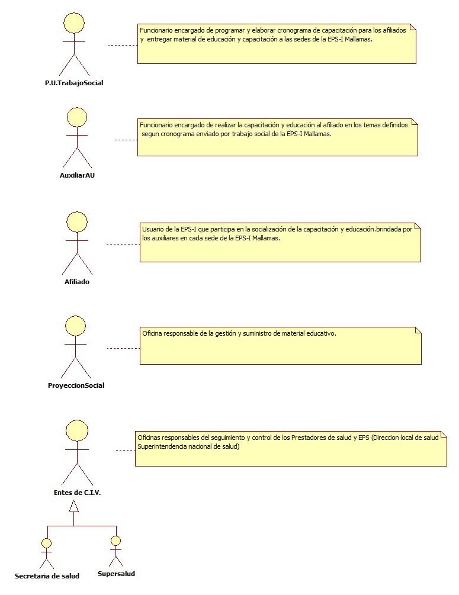

# SISTEMA DE INFORMACIÓN EDUCACIÓN Y/O CAPACITACIÓN AL AFILIADO

Capacitar e informar a los afiliados en temas de interés que contribuyan al adecuado funcionamiento del SGSSS

## 1. MODELADO DEL SISTEMA DE INFORMACIÓN

### 1.1 ACTORES EDUCACIÓN Y/O CAPACITACIÓN AL AFILIADO

### 1.2 IDENTIFICACIÓN DE LOS CASOS DE USO EDUCACIÓN Y/O CAPACITACIÓN AL AFILIADO

| Número | Procesos del Sistema de Información                                           |
| ------ | ----------------------------------------------------------------------------- |
| 1      | Identificar y programar los temas de Educación y/o capacitación del afiliado. |
| 2      | Solicitar material de educación y capacitación.                               |
| 3      | Entregar material de educación y capacitación.                                |
| 4      | Recibir y revisar material elaborado.                                         |
| 5      | Realizar y enviar cronograma a las sedes.                                     |
| 6      | Analizar y plantear estrategias a utilizar.                                   |
| 7      | Realizar educación y capacitación                                             |
| 8      | Participar de la educación y capacitación                                     |
| 9      | Realizar actas de capacitación  y educación.                                  |
| 10     | Enviar actas, informes y soportes                                             |
| 11     | Recibir y consolidar información                                              |
| 12     | Entregar informe de educación y capacitación                                  |

### 1.3 DESCRIPCIÓN DEL DIAGRAMA DE CASOS DE USO EDUCACIÓN Y/O CAPACITACIÓN AL AFILIADO

| **1. Caso de Uso** | Educación y/o capacitación a afiliado |
| - | - |
| **2. Descripción** | Capacitar e informar a los afiliados en temas de interés que contribuyan al adecuado funcionamiento del SGSSS |
| **3. Actor(es)**   | P.U. de Trabajo Social, Auxiliar de AU, Entes de control, Proyección social y Afiliado |
| **4. Pre Condiciones** | Material educativo, Disponibilidad y participación del afiliado, Plantear estrategias de educación y capacitación |
| **5. Pos Condiciones** | Educar y/o capacitar al afiliado en temas de importancia|
| **6. Flujo de Eventos** |
| *Actor(es)* | *Sistema* |
| 1. P.U. de Trabajo Social identifica y programa temas de educación y/o capacitación. | |
| 2. P.U. de Trabajo Social solicita material educativo. | |
| 3. Proyección social adquiere y entrega material educativo (cartillas y plegables de derechos y deberes, Plegables trato digno entre otros). | |
| 4. P.U. de Trabajo SociaL realiza cronograma y envía material educativo a las sedes de la EPS-I en nariño. |  |
| 5. Auxiliar de AU recibe cronograma y material educativo y plantea estrategias para la educación y/o capacitación del afiliado (Para comunidades indígenas se solicita un espacio  en las asambleas de dicha institucionalidad). | |
| 6. Auxiliar de AU dicta educación y/o capacitación, realiza acta y entrega material educativo soportando con firmas de los participantes.  | |
| 7. Auxiliar de AU envía informe de educación y/o capacitación soportando con acta y firmas de los participantes. | |
| 8. P.U. de Trabajo Social recibe información y formatos de educación y capacitación de cada sede por correo electrónico. | |
| 9. P.U. de Trabajo Social entrega informe de Educación y/o Capacitación con soportes al ente de C.I.V  cuando lo requieran. | |
|  | |
| **7. Requerimiento Asociado** | R001, R002, R003 y R004 |
| **8. Interfaz de Usuario Asociada** | |
| **9. Formato de Usuario Asociado** | F001, F002 y F003. |

### 1.4 MODELADO VISUAL DEL CASO DE USO EDUCACIÓN Y/O CAPACITACIÓN AL AFILIADO

## 2. ESPECIFICACIÓN DEL SISTEMA DE INFORMACIÓN EDUCACIÓN Y/O CAPACITACIÓN AL AFILIADO

| Término         | Descripción                                  |
| --------------- | -------------------------------------------- |
| SGSSS           | Sistema General de Seguridad Social en Salud |
| Entes de C.I.V. | Entes de control, inspección y vigilancia.   |
| EPS-I           | Entidad promotora de salud Indígena          |
| Auxiliar AU     | Auxiliar de atención al usuario              |
| P.U.            | AProfesional Universitario                   |
              

## 3. ESPECIFICACIÓN DE REQUERIMIENTOS

| **N°** | **Tipo** | **Descripción** |
| - | - | - |
| R001 | Físico | Cronograma  |
| R002 | Físico | Temas de educación y/o capacitación  |
| R003 | Físico | Material educativo |
| R004 | Físico | Actas y formatos |

## 4. ESPECIFICACIÓN DE LA INTERFACE DE USUARIO

| **1. Número** |
| - |
|  |
| **2. Propósito de la Interfaz** |
|  |
| **3. Gráfica de la Interfaz**|
|  |

### 4.1 IDENTIFICACIÓN DE PERFILES Y DIÁLOGOS

| **1. Nombre del Perfil** |
| - |
|  |
| **2. Opciones a las que tiene Acceso**|
|  |
| **3. Tipo de Acceso** |
|  |

### 4.2 ESPECIFICACIÓN DE FORMATOS DE USUARIO

| Número | Nombre del Formato                                |
| ------ | ------------------------------------------------- |
| F001   | Cronograma de capacitaciones.    |
| F002   | Entrega de material educativo.    |
| F003   | Acta de educación y/o capacitación al afiliado.    |

