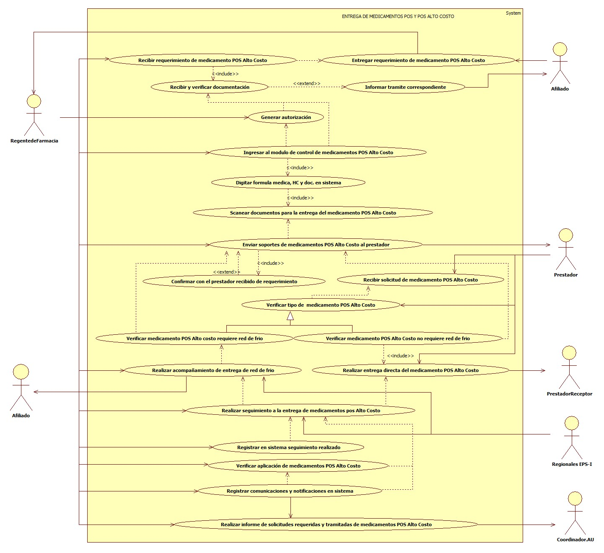

# SISTEMA DE INFORMACIÓN ENTREGA DE MEDICAMENTOS POS ALTO COSTO.

Garantizar la entrega oportuna y segura de medicamentos POS y POS alto costo, requeridos por los afiliados de la EPS-I Mallamas.

## 1. MODELADO DEL SISTEMA DE INFORMACIÓN

### 1.1 ACTORES ENTREGA DE MEDICAMENTOS POS Y POS ALTO COSTO.

### 1.2 IDENTIFICACIÓN DE LOS CASOS DE USO ENTREGA DE MEDICAMENTOS POS ALTO COSTO.

| Número | Procesos del Sistema de Información                                              |
| ------ | -------------------------------------------------------------------------------- |
| 1      | Entregar requerimientos de medicamentos POS Alto Costo.                                     |
| 2      | Recibir requerimiento de medicamentos POS Alto Costo.                                       |
| 3      | Recibir y verificar documentación.                                               |
| 4      | Informar tramite correspondiente.                                                |
| 5      | Generar autorización.                                                            |
| 6      | Ingresar al modulo de control de medicamentos POS Alto Costo.                               |
| 7      | Digitar formula medica, HC y documento en sistema de control de medicamentos POS Alto Costo.    |
| 8      | Escanear documentos para la entrega de medicamentos POS Alto Costo.                         |
| 9      | Enviar soportes de medicamentos POS Alto Costo al prestador.                                    |
| 10     | Confirmar con el prestador recibido de requerimiento.                            |
| 11     | Recibir solicitud de medicamentos POS Alto Costo.                                           |
| 12     | Verificar tipo de medicamentos POS Alto Costo.                                              |
| 13     | Verificar medicamento POS Alto Costo requiere red de frio.                                      |
| 14     | Verificar medicamento POS Alto Costo no requiere red de frio.                                   |
| 15     | Realizar acompañamiento de entrega de red de frio de medicamentos POS Alto Costo.           |
| 16     | Realizar entrega directa de medicamentos POS Alto Costo.                                    |
| 17     | Realizar seguimiento a la entrega de medicamentos POS Alto Costo.                           |
| 18     | Registrar en sistema de control de medicamentos POS Alto Costo seguimiento realizado.           |
| 19     | Verificar aplicación de medicamentos POS Alto Costo.                                            |
| 20     | Registrar comunicaciones y notificaciones en sistema de control de medicamentos POS Alto Costo. |
| 21     | Realizar informe de solicitudes requeridas y tramitadasCosto.                         |

### 1.3 DESCRIPCIÓN DEL DIAGRAMA DE CASOS DE USO ENTREGA DE MEDICAMENTOS  POS ALTO COSTO.

| **1. Caso de Uso** | Entrega de Medicamentos POS Alto Costo. |
| - | - |
| **2. Descripción** | Garantizar la entrega oportuna y segura de medicamentos  POS alto costo, requeridos por los afiliados de la EPS-I Mallamas. |
| **3. Actor(es)**   | Regente, Afiliado, Prestador, Regionales EPS-I y Coordinador AU. |
| **4. Pre Condiciones** | Contar con red contratada y contar con sistema de control de medicamentos POS alto costo. |
| **5. Pos Condiciones** | Garantizar la entrega oportuna de medicamentos POS alto costo. |
| **6. Flujo de Eventos** |
| *Actor(es)* | *Sistema* |
| 1. El afiliado de la EPS-I Mallamas entrega requerimiento de medicamentos POS  alto costo. |  |
| 2. El Regente de farmacia recibe requerimiento de medicamentos POS Alto Costo priorizando afiliados de alto costo y menores de edad. |  |
| 3. El Regente de farmacia verifica documentación de requerimiento de medicamentos POS Alto Costo.  |  |
| 4. El Regente de farmacia informa al afiliado en caso de no contar con documentos completos para la solicitud de medicamentos y direcciona al área correspondiente. | |
| 5. El Regente de farmacia genera autorización de medicamentos POS Alto Costo (Anexo 4). | 6. EL sistema muestra autorización. |
| 7. El Regente de farmacia inicia sesión en modulo de control de entrega de medicamentos POS Alto Costo.  |  |
| 8. El Regente de farmacia digita formula medica, historia clínica y documento del afiliado en el modulo del sistema de información. | 9. El sistema muestra registro de medicamentos POS Alto Costo ingresados (ver interfaz I001). |
| 10. El Regente de farmacia escanea documentos para la entrega de medicamentos POS Alto Costo. | |
| 11. El Regente de farmacia envía documentos al prestador para la adquisición de medicamentos POS Alto Costo y registra en sistema de control de medicamentos detallando cada medicamento. | 12. El sistema muestra registro de envío de medicamentos detallado ( ver interfaz I002 - I003). |
| 13. El Regente de farmacia confirma con el prestador la recepción de documentos para medicamentos POS Alto Costo.  | |
| 14. El Prestador recibe y verifica solicitud de medicamentos POS Alto Costo y verifica si medicamentos requiere o no de red de frio.  | |
| 15. El Prestador realiza la entrega  de medicamentos POS Alto Costo directamente al prestador donde se encuentra hospitalizado o en tratamiento ambulatorio el afiliado, con las debidas recomendaciones. |
| 16. El Regente de farmacia y/o regionales de la EPS-I Mallamas realizan acompañamiento personalizado de entrega de red de frio de medicamentos de afiliados.  | |
| 17.  El Regente de farmacia y/o regionales de la EPS-I Mallamas realizan seguimiento a la entrega de medicamentos  POS alto costo y registran notificaciones en sistema. | 18. El sistema muestra registro de comunicados y notificaciones (ver interfaz I004). |
| 19.  El Regente de farmacia y/o regionales de la EPS-I Mallamas Verifican la aplicación de medicamentos  POS alto costo y registran comunicados y notificaciones en el sistema de control. | |
| 21.  El Regente de farmacia realiza informe de las solicitudes requeridas y tramitadas de medicamentos POS Alto Costo y entrega a la coordinación de atención al usuario.| |
| **7. Requerimiento Asociado** | R001, R002, R003 y R004. |
| **8. Interfaz de Usuario Asociada** | I001, I002, I003, I004 y I005. |
| **9. Formato de Usuario Asociado** | F001 y F002. |

### 1.4 MODELADO VISUAL DEL CASO DE USO ENTREGA DE MEDICAMENTOS POS Y POS ALTO COSTO.

## 2. ESPECIFICACIÓN DEL SISTEMA DE INFORMACIÓN ENTREGA DE MEDICAMENTOS POS Y POS ALTO COSTO.

| Término | Descripción               |
| ------- | ------------------------- |
| POS     | Plan Obligatorio de salud |
| HC      | Historia clínica          |
| Doc.    | Documento                 |

## 3. ESPECIFICACIÓN DE REQUERIMIENTOS

| **N°** | **Tipo** | **Descripción** |
| - | - | - |
| R001 | Proceso | Red prestadora |
| R002 | Físico  | Acta de entrega de medicamentos |
| R003 | Proceso | Base de datos de afiliados. |
| R004 | Físico  | Documentos. |

## 4. ESPECIFICACIÓN DE LA INTERFACE DE USUARIO

| **1. Número** |
| - |
| I001 |
| **2. Propósito de la Interfaz** |
| Mostrar el registro de medicamentos  |
| **3. Gráfica de la Interfaz**|
|  |

| **1. Número** |
| - |
| I002 |
| **2. Propósito de la Interfaz** |
| Mostrar el registro detallado de  medicamentos para envío.  |
| **3. Gráfica de la Interfaz**|
|  |

| **1. Número** |
| - |
| I003 |
| **2. Propósito de la Interfaz** |
| Mostrar el formulario de envío de medicamentos  a prestador.  |
| **3. Gráfica de la Interfaz**|
|  |

| **1. Número** |
| - |
| I004 |
| **2. Propósito de la Interfaz** |
| Mostrar el registro de comunicados o notificaciones de envío.  |
| **3. Gráfica de la Interfaz**|
|  |

| **1. Número** |
| - |
| I005 |
| **2. Propósito de la Interfaz** |
| Mostrar los soportes adjuntados.  |
| **3. Gráfica de la Interfaz**|
|  |

### 4.1 IDENTIFICACIÓN DE PERFILES Y DIÁLOGOS

| **1. Nombre del Perfil** |
| - |
| Auxiliar del sistema de control de medicamentos POS y POS alto costo. |
| **2. Opciones a las que tiene Acceso**|
| Registro de control de adquisición de medicamentos POS.  |
| **3. Tipo de Acceso** |
| Registrar, Adjuntar, Eliminar, Consultar y Enviar. |

### 4.2 ESPECIFICACIÓN DE FORMATOS DE USUARIO

| Número | Nombre del Formato              |
| ------ | ------------------------------- |
| F001   | Acta de entrega de medicamentos. |
| F002   | Acta de red de frio. |