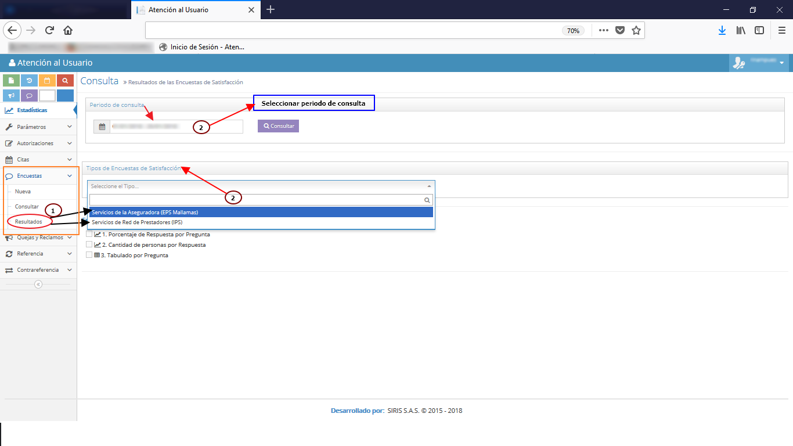

# SISTEMA DE INFORMACIÓN EVALUACIÓN DE SATISFACCIÓN

Evaluar y analizar la percepción que tienen los afiliados respecto a los servicios ofrecidos por la EPS-I MALLAMAS y la prestación del servicio de salud por parte de la Red Contratada, buscando mejorar la calidad en la atención garantizando el cumplimiento de los derechos de la población afiliada Indígena y no indígena.

## 1. MODELADO DEL SISTEMA DE INFORMACIÓN

### 1.1 ACTORES EVALUACIÓN DE SATISFACCIÓN

### 1.2 IDENTIFICACIÓN DE LOS CASOS DE USO EVALUACIÓN DE SATISFACCIÓN

| Número | Procesos del Sistema de Información                   |
| ------ | ----------------------------------------------------- |
| 1      | Enviar encuestas a sedes.                             |
| 2      | Entregar y aplicar encuestas.                         |
| 3      | Diligenciar encuestas.                                |
| 4      | Ingresar al modulo de encuestas en sistema.           |
| 5      | Buscar y seleccionar afiliado.                        |
| 6      | Transcribir y guardar encuesta.                       |
| 7      | Consultar encuesta.                                   |
| 9      | Buscar por periodo.                                   |
| 10     | Listar encuesta.                                      |
| 11     | Ver encuesta.                                         |
| 12     | Editar encuesta.                                      |
| 13     | Anular encuesta.                                      |
| 14     | Mostrar resultado.                                    |
| 15     | Buscar  por EPS.                                      |
| 16     | Buscar  por Prestador.                                |
| 17     | Ver estadística.                                      |
| 18     | Elaborar consolidado.                                 |
| 19     | Entregar informe nacional.                            |
| 20     | Generar plan de acción.                               |
| 21     | Publicar informe de satisfacción en cartelera de EPS. |

### 1.3 DESCRIPCIÓN DEL DIAGRAMA DE CASOS DE USO EVALUACIÓN DE SATISFACCIÓN

| **1. Caso de Uso** | Evaluación de satisfacción. |
| - | - |
| **2. Descripción** | Evaluar y analizar la percepción del afiliado respecto a los servicios ofrecidos por la EPS y la prestación de los servicios de salud por parte de la red contratada. |
| **3. Actor(es)**   | P.U.Trabajo Social, Dirección de salud, Auxiliar AU y Afiliado. |
| **4. Pre Condiciones** | Contar con formato de encuesta aprobado, Contar con auxiliares capacitados en cada sede, Contar con la colaboración del afiliado. |
| **5. Pos Condiciones** | Evaluar satisfacción del afiliado con respecto a la EPS y al Prestador.|
| **6. Flujo de Eventos** |
| *Actor(es)* | *Sistema* |
| 1. P.U. de Trabajo Social envía encuestas a las sedes de la EPS-I.||
| 2. El auxiliar AU  entrega y aplica encuestas a los afiliados del municipio. ||
| 3. El afiliado diligencia formato de encuesta de satisfacción y entrega al auxiliar.||
| 4. El auxiliar AU inicia sesión en el sistema e ingresa al modulo de encuestas. | 5. El sistema muestra formulario de encuesta de satisfacción (ver interfaz I001) |
| 6. El auxiliar  AU transcribe formulario de encuestas.  | 7. El sistema muestra formulario de encuestas de satisfacción diligenciado (ver interfaz I001).|
| 8. El auxiliar  AU  guarda formulario de encuestas de satisfacción diligenciado.  ||
| 9. El auxiliar  AU  diligencia formato de consolidación de encuestas de satisfacción y enviá a P.U. de Trabajo social.  ||
| 10. P.U. de Trabajo social consulta encuestas ingresadas en sistema. | 11. El sistema muestra consulta de encuestas (ver interfaz I003).|
| 12. P.U. de Trabajo Social realiza consolidado de encuestas de satisfacción.  | 13. El sistema genera consolidado (ver interfaz I004).|
| 14. P.U. de Trabajo social genera informe nacional de encuestas. | 
| 15. P.U. de Trabajo social entrega informe de encuestas a dirección de salud. ||
| 16. P.U. de Trabajo social realiza plan de acción en caso requerido. ||
| 17. P.U. de Trabajo Social o auxiliar de AU publica resultado de encuestas de satisfacción  en cartelera de la EPS-I Mallamas. ||  
| **7. Requerimiento Asociado** | R001, R002, R003, R004 y R005 |
| **8. Interfaz de Usuario Asociada** | I001, I002, I003 y I004. |
| **9. Formato de Usuario Asociado** |F001, F002, F003 y F004.  |

### 1.4 MODELADO VISUAL DEL CASO DE USO EVALUACIÓN DE SATISFACCION

## 2. ESPECIFICACIÓN DEL SISTEMA DE INFORMACIÓN EVALUACIÓN DE SATISFACCION

| Término | Descripción                |
| ------- | -------------------------- |
| EPS     | Empresa promotora de salud |
| P.U.    | Profesional Universitario  |
| AU      | Atención al usuario        |

## 3. ESPECIFICACIÓN DE REQUERIMIENTOS

| **N°** | **Tipo** | **Descripción** |
| - | - | - |
| R001 | Proceso | Red prestadora |
| R002 | Físico | Encuesta de satisfacción |
| R003 | Proceso | Base de datos |
| R004 | Proceso | Sistema de información |
| R005 | Físico | Cartelera informativa |

## 4. ESPECIFICACIÓN DE LA INTERFACE DE USUARIO

| **1. Número** |
| - |
| I001 |
| **2. Propósito de la Interfaz** |
| Mostrar formato de encuesta.|
| **3. Gráfica de la Interfaz**|
|  |

| **1. Número** |
| - |
| I002 |
| **2. Propósito de la Interfaz** |
| Mostrar el registro de una encuesta diligenciada. |
| **3. Gráfica de la Interfaz**|
|  |

| **1. Número** |
| - |
| I003 |
| **2. Propósito de la Interfaz** |
| Mostrar la consulta detallada de encuestas registradas. |
| **3. Gráfica de la Interfaz**|
|  |

| **1. Número** |
| - |
| I004 |
| **2. Propósito de la Interfaz** |
| Mostrar el resultado de encuestas realizadas.|
| **3. Gráfica de la Interfaz**|
|  |

### 4.1 IDENTIFICACIÓN DE PERFILES Y DIÁLOGOS

| **1. Nombre del Perfil** |
| - |
| Auxiliar del sistema de encuestas. |
| **2. Opciones a las que tiene Acceso**|
| Nueva encuesta. |
| **3. Tipo de Acceso** |
| Registrar, Consultar, Consolidar.|

### 4.2 ESPECIFICACIÓN DE FORMATOS DE USUARIO

| Número | Nombre del Formato       |
| ------ | ------------------------ |
| F001   | Encuesta de satisfacción. |
| F002   | Consolidado de encuestas. |
| F003   | Consolidado informe nacional. |
| F004   | Plan de acción. |