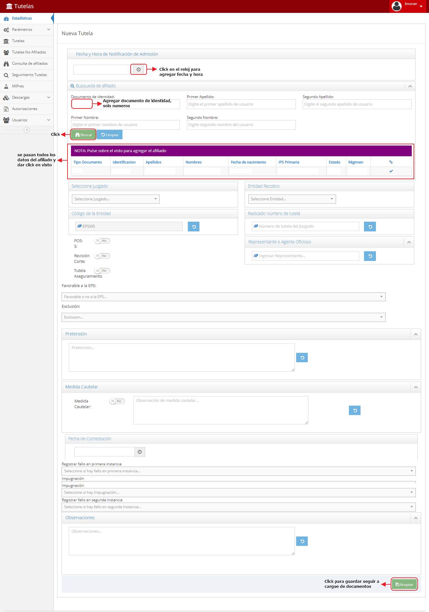

# SISTEMA DE INFORMACIÓN GESTIÓN AL CUMPLIMIENTO DE TUTELAS

Garantizar la prestación de servicios de manera oportuna a través de la realización de autorizaciones en los tiempos establecidos para las tutelas

## 1. MODELADO DEL SISTEMA DE INFORMACIÓN

### 1.1 ACTORES GESTIÓN AL CUMPLIMIENTO DE TUTELAS

### 1.2 IDENTIFICACIÓN DE LOS CASOS DE USO GESTIÓN AL CUMPLIMIENTO DE TUTELAS

| Número | Procesos del Sistema de Información |
| ------ | ----------------------------------- |
| 1      | Notificar admisión tutela            |
| 2      | Recibir y enviar notificación            |
| 3      | Recibir y enviar notificación            |
| 4      | Entregar informe            |
| 5      | Recibir y enviar informe            |
| 6      | Recibir fallo            |
| 7      | Solicitar documentos            |
| 8      | Verificar lista de chequeo            |
| 9      | Verificar fallo            |
| 10     | Verificar en contra        |
| 11     | Enviar documentación       |
| 12     | Verificar a favor             |
| 13     | Verificar si es No Pos o POS            |
| 14     | Solicitar autorización            |
| 15     | Verificar si no es tto integral            |
| 16     | Realizar autorización            |
| 17     | Verificar si es de acuerdo a dx          |
| 18     | Realizar devolución          |
| 19     | Enviar para elaborar acta         |
| 20     | Recibir acta          |
| 21     | Entregar acta          |
| 22     | Verificar lista de chequeo          |
| 23     | Registrar en modulo S.Tutelas          |
| 24     | Entregar doc. para suministro          |
| 25     | Realizar seguimiento a prestación          |
| 26     | Gestionar la inmediata prestación          |
| 27     | Verificar en modulo seg. tutelas          |

### 1.3 DESCRIPCIÓN DEL DIAGRAMA DE CASOS DE USO GESTIÓN AL CUMPLIMIENTO DE TUTELAS

| **1. Caso de Uso** | Gestión al Cumplimiento de Tutelas |
| - | - |
| **2. Descripción** | Realizar el trámite y la entrega oportuna de las solicitudes realizadas por el afiliado a través de la tutela |
| **3. Actor(es)**   | Profesional Universitario Seguimiento Tutelas, Auxiliar Tutelas, Jurídica, Atención al Usuario, Prestador, Ente Territorial y Afiliado |
| **4. Pre Condiciones** | Acción de tutela  |
| **5. Pos Condiciones** | Seguimiento al cumplimiento de la tutela|
| **6. Flujo de Eventos** |
| *Actor(es)* | *Sistema* |
| 1. La oficina jurídica notifica la admisión de tutela |  |
| 2. El profesional universitario de seguimiento a tutelas recibe admisión  | 3. Enviá por correo electronico al auxiliar de atención al usuario la admisión de tutelas |
| 4. El auxiliar busca soportes y realiza informe  | 5. Enviá informe |
| 6. El Profesional universitario de seguimiento a tutelas recibe soportes e informe | 7. Enviá por correo electrónico a jurídica el informe con soportes |
| 8. Juridica entrega fallo de tutela en físico  | 9. Ingresa información del fallo en el modulo de tutelas (ver I001, I002, I003, I004,I005,I006) |
|  | 10. Ingresa información al mudulo si el afiliado no es de la EPS (ver I007, I008) |
| 11. El profesional universitario de seguimiento a tutelas recibe fallo de tutela  | 12. Solicita documentos por correo electrónico a auxiliar atención al usuario y jurídica |
| 13. Llama al afiliado a solicitar documentación pendiente  |  |
| 14. El profesional universitario de seguimiento a tutelas verifica lista de chequeo de tutelas items 1, 2, 3 y  5  |  |
| 15. El profesional universitario de seguimiento a tutelas verifica fallo |  |
| 16. El profesional universitario de seguimiento a tutelas si el fallo es a favor  | 17. Remite por correo electrónico toda la documentación al Ente Territorial |
| 18. El profesional universitario de seguimiento a tutelas verifica si el fallo es encontra. Verificar si corresponde a un servicio no POS o POS  | 19. Enviá a auxiliar de atención al usuario para que realice autorización si el servicio es POS |
| 20. El profesional universitario de seguimiento a tutelas verifica si el fallo **No** es tratamiento integral | 21. Realiza autorización en modulo de autorizaciones |
| 22. El profesional universitario de seguimiento a tutelas verifica si el fallo es tratamiento integral  |  |
| 23. El profesional universitario de seguimiento a tutelas verifica se las ordenes corresponden al diagnostico de fallo | 24. Envía a atención al usuario para que realice acta|
| 25. El profesional universitario de seguimiento a tutelas devuelve los documentos al afiliado si las ordenes no coresponden al diagnostico del fallo de tutela  |  |
| 26. Atención al usuario elabora acta de no POS y la entrega al profesional univeritario |  |
| 27. El profesional universitario de seguimiento a tutelas recibe el acta |  |
| 28. El profesional universitario de seguimiento a tutelas verifica lista de chequeo ítem 4 | 29. Realiza autorización en modulo de autorizaciones|
|  | 30. Registra en modulo tutelas (ver I001, I002, I003, I004,I005,I006) |
| 31. El profesional universitario de seguimiento a tutelas entrega documentos al prestador para que garantice la prestación del servicio | 32. Realiza seguimiento a la prestación |
|  | 33. Gestiona la inmediata prestación del servicio si en el seguimiento se evidencia que no se realiza |
|  | 34. Registra seguimiento a la prestación en módulo tutelas (ver I009) |
| **7. Requerimiento Asociado** | R001, R002, R003 |
| **8. Interfaz de Usuario Asociada** | I001, I002, I003, I004, I005, I006, I007, I008, I009, I010, I011 |
| **9. Formato de Usuario Asociado** | F001 |

### 1.4 MODELADO VISUAL DEL CASO DE USO GESTIÓN AL CUMPLIMIENTO DE TUTELAS

## 2. ESPECIFICACIÓN DEL SISTEMA DE INFORMACIÓN GESTIÓN AL CUMPLIMIENTO DE TUTELAS

| Término | Descripción |
| ------- | ----------- |
| CTC | Comité Técnico Científico               |
| MSPS | Ministerio de Salud y Protección Social               |
| Med. | Medicamentos               |
| ET | Ente Territorial              |
| No POS | No cubierto en el Plan Obligatorio de Salud             |

## 3. ESPECIFICACIÓN DE REQUERIMIENTOS

| **N°** | **Tipo** | **Descripción** |
| - | - | - |
| R001 | Proceso | Base de datos de afiliados |
| R002 | Físico | Acción de Tutela |
| R003 | Físico | Fallo de Tutela |

## 4. ESPECIFICACIÓN DE LA INTERFACE DE USUARIO

| **1. Número** |
| - |
| I001 |
| **2. Propósito de la Interfaz** |
| Mostrar las opciones del modulo Tutelas |
| **3. Gráfica de la Interfaz**|
|  |

| **1. Número** |
| - |
| I002 |
| **2. Propósito de la Interfaz** |
| Buscar afiliado en la base de datos de afiliados |
| **3. Gráfica de la Interfaz**|
|  |

| **1. Número** |
| - |
| I003 |
| **2. Propósito de la Interfaz** |
| Mostrar opciones de editar una tutela o crear nueva |
| **3. Gráfica de la Interfaz**|
|  |

| **1. Número** |
| - |
| I004 |
| **2. Propósito de la Interfaz** |
| Mostrar los pasos para crear tutela nueva|
| **3. Gráfica de la Interfaz**|
|  |

| **1. Número** |
| - |
| I005 |
| **2. Propósito de la Interfaz** |
| Mostrar cargue de soportes, opción de eliminar lo adjuntado o descargarlo |
| **3. Gráfica de la Interfaz**|
|  |

| **1. Número** |
| - |
| I006 |
| **2. Propósito de la Interfaz** |
| Mostrar como se sube los soportes |
| **3. Gráfica de la Interfaz**|
|  |

| **1. Número** |
| - |
| I007 |
| **2. Propósito de la Interfaz** |
| Mostrar opciones de editar una tutela de un no afiliado a la EPS Mallamas o crear nueva |
| **3. Gráfica de la Interfaz**|
|  |

| **1. Número** |
| - |
| I008 |
| **2. Propósito de la Interfaz** |
|  Mostrar los pasos para crear un nevo caso de tutela de un no afiliado |
| **3. Gráfica de la Interfaz**|
|  |

| **1. Número** |
| - |
| I009 |
| **2. Propósito de la Interfaz** |
| Mostrar las opciones para hacer seguimiento |
| **3. Gráfica de la Interfaz**|
|  |

| **1. Número** |
| - |
| I010 |
| **2. Propósito de la Interfaz** |
| Mostrar las opciones para buscar en MIPRES |
| **3. Gráfica de la Interfaz**|
|  |

| **1. Número** |
| - |
| I011 |
| **2. Propósito de la Interfaz** |
| Mostrar otras opciones del sistema |
| **3. Gráfica de la Interfaz**|
|  |

### 4.1 IDENTIFICACIÓN DE PERFILES Y DIÁLOGOS

| **1. Nombre del Perfil** |
| - |
| P.U.Seguimiento Tutelas |
| **2. Opciones a las que tiene Acceso**|
| Seguimiento Tutelas |
| **3. Tipo de Acceso** |
| Consultar, anular, crear |

| **1. Nombre del Perfil** |
| - |
|  Jurídica |
| **2. Opciones a las que tiene Acceso**|
| Nueva Tutela|
| **3. Tipo de Acceso** |
| Consultar, anular, crear |

### 4.2 ESPECIFICACIÓN DE FORMATOS DE USUARIO

| Número | Nombre del Formato |
| ------ | ----------------------------------- |
|  F001  | Lista de chequeo para tramite por tutelas            |
