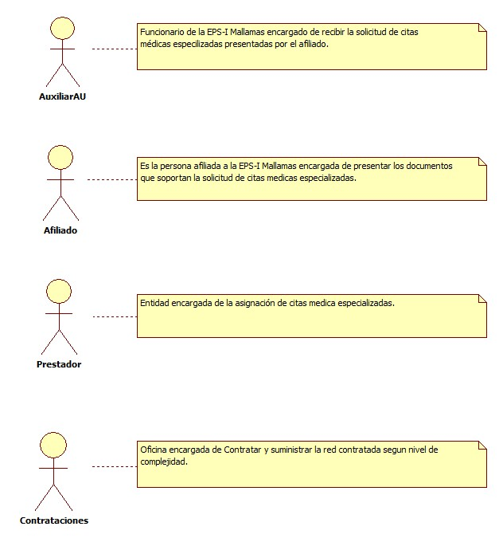
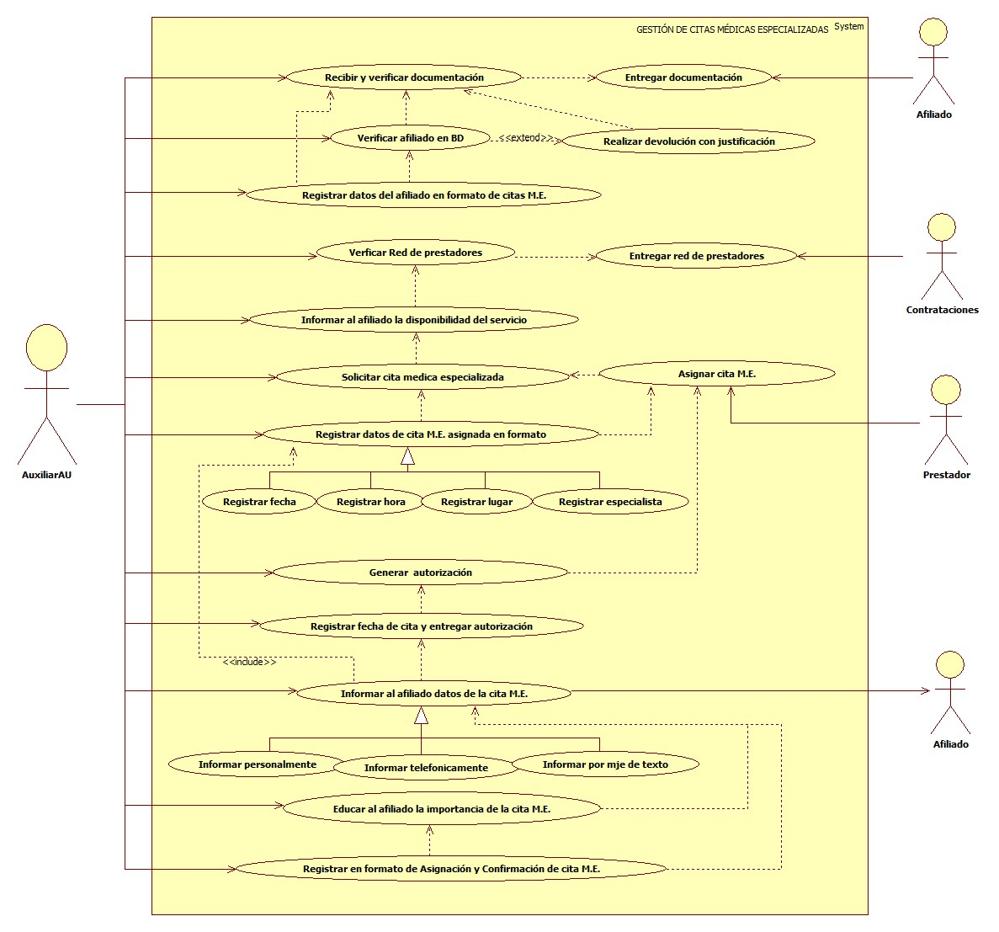

# SISTEMA DE INFORMACIÓN GESTIÓN DE CITAS MÉDICAS ESPECIALIZADAS

Garantizar el acceso al servicio de salud ambulatorio requerido por el afiliado coordinando las acciones entre los actores EPS-I y Prestadores permitiendo minimizar las barreras administrativas.

## 1. MODELADO DEL SISTEMA DE INFORMACIÓN

### 1.1 ACTORES GESTIÓN DE CITAS MÉDICAS ESPECIALIZADAS

### 1.2 IDENTIFICACIÓN DE LOS CASOS DE USO GESTIÓN DE CITAS MÉDICAS ESPECIALIZADAS.

| Número | Procesos del Sistema de Información                         |
| ------ | ----------------------------------------------------------- |
| 1      | Entregar documentación.                                     |
| 2      | Recibir y verificar documentación.                          |
| 3      | Verificar afiliado en BD.                                   |
| 4      | Realizar devolución con justificación.                      |
| 5      | Registrar datos del afiliado en formato de citas.           |
| 6      | Entregar red de prestadores.                                |
| 7      | Verificar red de prestadores.                               |
| 8      | Informar al afiliado la disponibilidad del servicio.        |
| 9      | Solicitar cita médica especializada.                        |
| 10     | Asignar cita médica especializada.                          |
| 11     | Registrar datos de cita asignada en formato.                |
| 12     | Registrar fecha.                                            |
| 13     | Registrar hora.                                             |
| 14     | Registrar lugar.                                            |
| 15     | Registrar especialista.                                     |
| 16     | Generar autorización.                                       |
| 17     | Registrar fecha de cita y entregar autorización.            |
| 18     | Informar al afiliado datos de la cita.                      |
| 19     | Informar personalmente.                                     |
| 20     | Informar telefónicamente.                                   |
| 21     | Informar por mensaje de texto.                              |
| 22     | Informar al afiliado la importancia de la cita.             |
| 23     | Registrar en formato de asignación y confirmación de citas. |

### 1.3 DESCRIPCIÓN DEL DIAGRAMA DE CASOS DE USO GESTIÓN DE CITAS MÉDICAS ESPECIALIZADAS.

| **1. Caso de Uso** | Gestión de citas médicas especializadas.|
| - | - |
| **2. Descripción** | Garantizar el acceso al servicio de salud ambulatorio requerido por el afiliado coordinando las acciones entre los actores EPS-I y Prestadores permitiendo minimizar las barreras administrativas.|
| **3. Actor(es)**   | Auxiliar AU, Afiliado, Prestador y contrataciones.|
| **4. Pre Condiciones** | Contar con red contratada, Contar con BD de afiliados y contar con medios de telecomunicación. |
| **5. Pos Condiciones** | Garantizar la asignación de citas a los afiliados de la EPS-I|
| **6. Flujo de Eventos** |
| *Actor(es)* | *Sistema* |
| 1. El afiliado entrega documentación (Remisión, Epicrisis, Historia clínica o anexo 3).| |
| 2. El Auxiliar de AU recibe y verifica documentación priorizando pacientes de alto costo, menores de 18 años, adulto mayor de 60 años, gestantes y afiliados con discapacidad. | |
| 3. El Auxiliar de AU verifica afiliado en BD.  | 4. El sistema muestra estado de afiliación (ver interfaz I001). |
| 5. El Auxiliar de AU informa al afiliado, devuelve documentación si aplica y se direcciona al área correspondiente.  | |
| 6. El Auxiliar de AU registra datos del afiliado en formato de solicitud, asignación y confirmación  de citas.   | |
| 7. El Auxiliar de AU revisa la red de servicios contratada con el fin de verificar donde se puede prestar el servicio de salud que requiere el afiliado según diagnostico.  | |
| 8. El Auxiliar de AU  informa al afiliado o acompañante las instituciones o profesionales donde existe la disponibilidad del servicio para  elección de su preferencia.  | |
| 9. El Auxiliar de AU gestiona con el prestador la solicitud de cita especializada mediante el diligenciamiento de formatos institucionales cuando aplica  o telefónicamente. | |
| 10. El Auxiliar de AU registra en el formato de solicitud, asignación y confirmación de citas la fecha, hora, lugar y nombre del especialista.  | |
| 11. El Auxiliar de AU genera autorización y registra fecha y hora de cita en el sistema (ver interfaz I001).  | 12. El sistema muestra registro de asignación de cita e imprime autorización (ver interfaz I002-I003).|
| 13. El Auxiliar de AU entrega autorización al afiliado para su atención en la entidad donde se le asigno la cita. | |
| 14. El Auxiliar de AU informa al afiliado y/o acompañante los datos de la cita tramitada (fecha, hora, lugar y nombre del especialista), la información se da personalmente, telefónicamente y/o por mensaje de texto. | |
|  15. Auxiliar de AU educa al afiliado y/o acompañante la importancia de la asistencia a la cita solicitada. ||
|  16. Auxiliar de AU Registra en el formato de solicitud, asignación y confirmación de cita los datos del afiliado y/o acompañante a quien se da información de la cita soportando con la firma de quien recibe la información.  ||
| **7. Requerimiento Asociado** | R001, R002 y R003.|
| **8. Interfaz de Usuario Asociada** | I001 |
| **9. Formato de Usuario Asociado** | F001 y F002. |

### 1.4 MODELADO VISUAL DEL CASO DE USO GESTIÓN DE CITAS MÉDICAS ESPECIALIZADAS.

## 2. ESPECIFICACIÓN DEL SISTEMA DE INFORMACIÓN GESTIÓN DE CITAS MÉDICAS ESPECIALIZADAS.

| Término | Descripción                          |
| ------- | ------------------------------------ |
| EPS-I   | Empresa Promotora de Salud Indígena. |
| BD      | Base de datos de afiliados.          |
| M.E.    | Médica Especializada.                |

## 3. ESPECIFICACIÓN DE REQUERIMIENTOS

| **N°** | **Tipo** | **Descripción** |
| - | - | - |
| R001 | Proceso | Red prestadora. |
| R002 | Proceso | BD de afiliados. |
| R003 | Físico  | Documentos. |

## 4. ESPECIFICACIÓN DE LA INTERFACE DE USUARIO

| **1. Número** |
| - |
| I001 |
| **2. Propósito de la Interfaz** |
| Mostrar formulario de autorización diligenciado.|
| **3. Gráfica de la Interfaz**|
|  |

| **1. Número** |
| - |
| I002 |
| **2. Propósito de la Interfaz** |
| Mostrar registro de cita medica.|
| **3. Gráfica de la Interfaz**|
|  |

| **1. Número** |
| - |
| I003 |
| **2. Propósito de la Interfaz** |
| Mostrar autorización.|
| **3. Gráfica de la Interfaz**|
|  |

### 4.1 IDENTIFICACIÓN DE PERFILES Y DIÁLOGOS

| **1. Nombre del Perfil** |
| - |
| Auxiliar del sistema de autorizaciones. |
| **2. Opciones a las que tiene Acceso**|
| Nueva autorización. |
| **3. Tipo de Acceso** |
| Registrar, Modificar, Anular, Imprimir y Consultar. |

### 4.2 ESPECIFICACIÓN DE FORMATOS DE USUARIO
| Número | Nombre del Formato                                                               |
| ------ | -------------------------------------------------------------------------------- |
| F001   | Formato de solicitud, asignación y confirmación de citas médicas especializadas. |
| F002   | Anexo 4. |