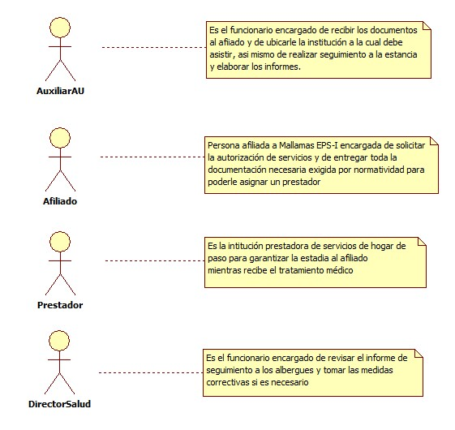
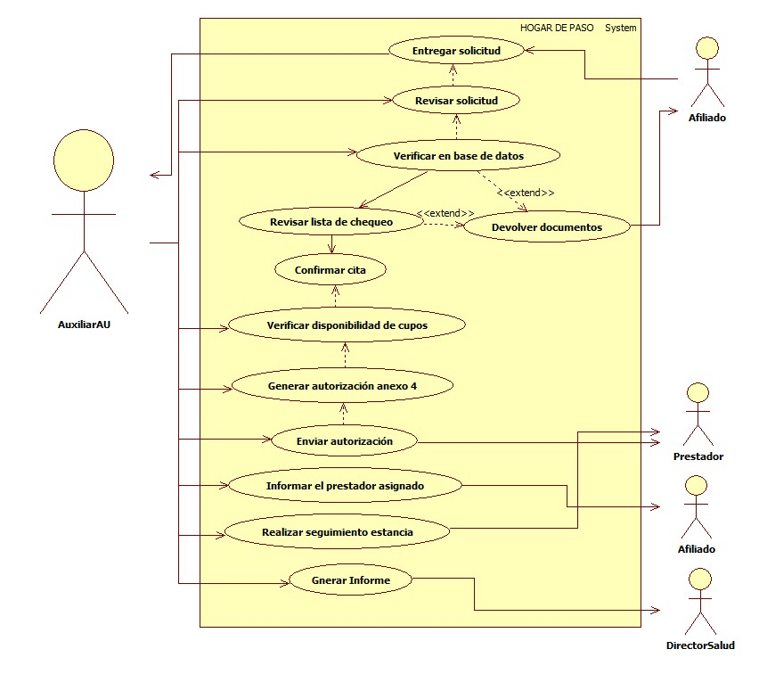

# SISTEMA DE INFORMACIÓN HOGAR DE PASO

Garantizar la prestación de servicios de manera oportuna a través de la realización de autorizaciones en los tiempos establecidos para los servicios complementarios.

## 1. MODELADO DEL SISTEMA DE INFORMACIÓN

### 1.1 ACTORES HOGAR DE PASO

### 1.2 IDENTIFICACIÓN DE LOS CASOS DE USO HOGAR DE PASO

| Número | Procesos del Sistema de Información |
| ------ | ----------------------------------- |
| 1      | Entregar Solicitud              |
| 2      | Revisar Solicitud               |
| 3      | Verificar en Base de Datos      |
| 4      | Revisar Lista de Chequeo        |
| 5      | Devolver Documentos             |
| 6      | Confirmar Cita                  |
| 7      | Verificar Disponibilidad de Cupos  |
| 8      | Generar Autorización Anexo 4    |
| 9      | Enviar Autorización             |
| 10     | Informar la Institución Asignada   |
| 11     | Realizar Seguimiento Estancia   |
| 12     | Generar Informe                 |

### 1.3 DESCRIPCIÓN DEL DIAGRAMA DE CASOS DE USO HOGAR DE PASO

| **1. Caso de Uso** | Hogar de Paso |
| - | - |
| **2. Descripción** | Realizar autorización y seguimiento a la prestación de los servicios de hogar de paso |
| **3. Actor(es)**   | Auxiliar Autorizaciones, Afiliado, Prestador y Director de Salud |
| **4. Pre Condiciones** | Contar con red contratada |
| **5. Pos Condiciones** | Informe de seguimiento estancia |
| **6. Flujo de Eventos** |
| *Actor(es)* | *Sistema* |
| 1. El afiliado entrega solicitud de hogar de paso |  |
| 2. El auxiliar de autorizaciones revisa la solicitud  | 3. Verifica en base de datos si el afiliado esta activo |
|  | 4. Verifica en lista de chequeo si la información esta completa (Formato Excel)|
| 5. El Auxiliar de autorizaciones llama a confirmar cita |  |
| 6. El auxiliar de autorizaciones verifica si hay cupos disponibles con el prestador | 7. Genera autorización anexo 4 (ver I001)|
|  | 8. Enviar autorización al prestador por correo electrónico |
| 9. El auxiliar de autorizaciones informa al afiliado el prestador asignado  |  |
| 10. El auxiliar de autorizaciones realiza seguimiento a la estancia del afiliado en el prestador asignado  | 11. Presentar informe del seguimiento realizado |
| **7. Requerimiento Asociado** | R001, R002 |
| **8. Interfaz de Usuario Asociada** | I001 |
| **9. Formato de Usuario Asociado** | F001 |

### 1.4 MODELADO VISUAL DEL CASO DE USO HOGAR DE PASO

## 2. ESPECIFICACIÓN DEL SISTEMA DE INFORMACIÓN HOGAR DE PASO

| Término | Descripción |
| ------- | ----------- |
| Auxiliar AU | Auxiliar Autorizaciones        |
|         |             |

## 3. ESPECIFICACIÓN DE REQUERIMIENTOS

| **N°** | **Tipo** | **Descripción** |
| - | - | - |
| R001 | Proceso | Red prestadora |
| R002 | Proceso | Base de datos afiliados       |

## 4. ESPECIFICACIÓN DE LA INTERFACE DE USUARIO

| **1. Número** |
| - |
| I001 |
| **2. Propósito de la Interfaz** |
| Mostrar la autorización del anexo 4 |
| **3. Gráfica de la Interfaz**|
|  |

### 4.1 IDENTIFICACIÓN DE PERFILES Y DIÁLOGOS

| **1. Nombre del Perfil** |
| - |
| Auxiliar Autorizaciones |
| **2. Opciones a las que tiene Acceso**|
| Nueva autorización |
| **3. Tipo de Acceso** |
| Consultar, anular, crear |

### 4.2 ESPECIFICACIÓN DE FORMATOS DE USUARIO

| Número | Nombre del Formato |
| ------ | ----------------------------------- |
| F001   | solicitud hogares de paso            |
