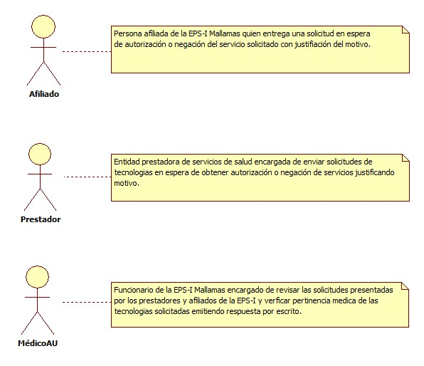
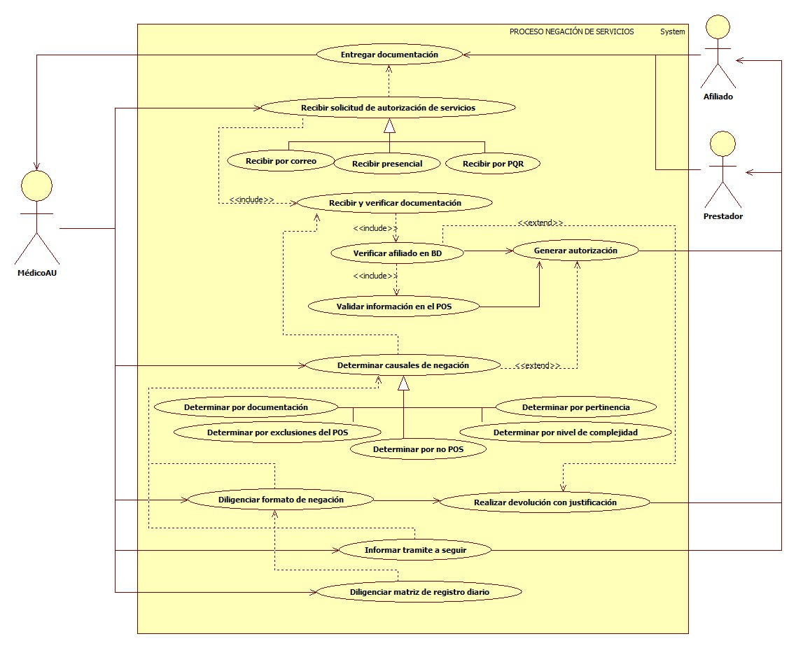

# SISTEMA DE INFORMACIÓN NEGACIÓN DE SERVICIOS.

Informar de manera oportuna a los afiliados sobre los servicios no autorizados por la EPS-I Mallamas y su tramite a seguir de acuerdo a la pertinencia.

## 1. MODELADO DEL SISTEMA DE INFORMACIÓN

### 1.1 ACTORES NEGACIÓN DE SERVICIOS.

### 1.2 IDENTIFICACIÓN DE LOS CASOS DE USO NEGACIÓN DE SERVICIOS.

| Número | Procesos del Sistema de Información             |
| ------ | ----------------------------------------------- |
| 1      | Entregar documentación.                         |
| 2      | Recibir solicitud de autorización de servicios. |
| 3      | Recibir por correo.                             |
| 4      | Recibir presencial.                             |
| 5      | Recibir por PQR                                 |
| 6      | Recibir y verificar documentación.              |
| 7      | Verificar afiliado en BD.                       |
| 8      | Validar información en el POS.                  |
| 9      | Generar autorización.                           |
| 10     | Determinar causales de negación.                |
| 11     | Determinar por documentación.                   |
| 12     | Determinar por exclusiones del POS.             |
| 13     | Determinar por no POS.                          |
| 14     | Determinar por nivel de complejidad.            |
| 15     | Determinar por pertinencia.                     |
| 16     | Diligenciar formato de negación.                |
| 17     | Realizar devolución con justificación.          |
| 18     | Informar tramite a seguir.                      |
| 19     | Diligenciar matriz de registro diario.          |

### 1.3 DESCRIPCIÓN DEL DIAGRAMA DE CASOS DE USO NEGACIÓN DE SERVICIOS.

| **1. Caso de Uso** | Negación de servicios. |
| - | - |
| **2. Descripción** | Informar de manera oportuna a los afiliados sobre los servicios no autorizados por la EPS-I Mallamas y su tramite a seguir de acuerdo a la pertinencia. |
| **3. Actor(es)**   | Afiliado, Prestador y Médico AU. |
| **4. Pre Condiciones** | Contar con red contratada, contar con base de datos de afiliados y contar con documentación. |
| **5. Pos Condiciones** | Diligenciar y entregar formato de negación de servicios al afiliado.|
| **6. Flujo de Eventos** |
| *Actor(es)* | *Sistema* |
| 1. El Afiliado entrega documentos con solicitud de autorización.|  |
| 2. El Médico AU recibe solicitud de servicios por correo electrónico enviados directamente por el prestador, personalmente entregados por el afiliado o por PQR. |  |
| 3. El Médico AU verifica el afiliado en base de datos. | 4. El sistema muestra estado de afiliación (ver interfaz I001). |
| 5. El Médico AU realiza devolución de documentacion en caso de no registrar activo en base de datos el usuario. |   |
| 6. El Médico AU confirma que el afiliado este activo en BD.   | |
| 7. El Médico AU verifica si los servicios solicitados están incluidos en el POS y cuenta con la documentación (historia clínica, orden medica datos correctos del afiliado) necesaria según normatividad vigente.  | |
| 8. El Médico AU genera autorización para los servicios incluidos en el POS  y da respuesta al prestador o al afiliado entregando autorización del servicio solicitado. | 9. El sistema muestra autorización (ver interfaz I002). |
| 9. El Médico AU en caso de que la solicitud no este incluida en el POS, la documentación este incompleta (historia clínica, orden medica datos correctos del afiliado), sea una exclusión del POS, sea un servicio no POS, no corresponde según nivel de complejidad y  por diagnostico no es pertinente el servicio solicitado determina causal de negación. | |
| 10. El médico AU una vez terminado causal de negación diligencia formato de negación de servicios justificando la causa. | |
| 11. El Médico AU realiza devolución de documentación soportando con formato de negación de servicios.  | |
| 12. El Médico AU da información clara sobre el tramite a seguir por parte del afiliado.   | |
| 13. El Médico AU diligencia formato de Seguimiento de negación de servicios y/o Medicamentos. | |
| **7. Requerimiento Asociado** | R001, R002, R003 y R004. |
| **8. Interfaz de Usuario Asociada** | I001 y I002 |
| **9. Formato de Usuario Asociado** | F001 y F002. |

### 1.4 MODELADO VISUAL DEL CASO DE USO NEGACIÓN DE SERVICIOS.

## 2. ESPECIFICACIÓN DEL SISTEMA DE INFORMACIÓN NEGACIÓN DE SERVICIOS.

| Término   | Descripción                    |
| --------- | ------------------------------ |
| POS       | Plan obligatorio de salud.     |
| Médico AU | Médico de atención al usuario. |

## 3. ESPECIFICACIÓN DE REQUERIMIENTOS

| **N°** | **Tipo** | **Descripción** |
| - | - | - |
| R001 | Proceso | Red prestadora. |
| R002 | Proceso | Base de datos de afiliados. |
| R003 | Físico  | Documentos. |
| R004 | Físico  | Normatividad. |

## 4. ESPECIFICACIÓN DE LA INTERFACE DE USUARIO

| **1. Número** |
| - |
| I001 |
| **2. Propósito de la Interfaz** |
| Mostrar la verificación del afiliado en base de datos. |
| **3. Gráfica de la Interfaz**|
|  |

| **1. Número** |
| - |
| I002 |
| **2. Propósito de la Interfaz** |
| Mostrar autorización. |
| **3. Gráfica de la Interfaz**|
|  |

### 4.1 IDENTIFICACIÓN DE PERFILES Y DIÁLOGOS

| **1. Nombre del Perfil** |
| - |
| Auxiliar del sistema de autorizaciones. |
| **2. Opciones a las que tiene Acceso**|
| Consultar afiliados y Nueva autorización. |
| **3. Tipo de Acceso** |
| Ingresar, Consultar, anular, imprimir y verificar. |

### 4.2 ESPECIFICACIÓN DE FORMATOS DE USUARIO

| Número | Nombre del Formato                                                |
| ------ | ----------------------------------------------------------------- |
| F001   | Formato de negación de servicios y/o medicamentos.                |
| F002   | Formato de seguimiento de negación de servicios y/o medicamentos. |