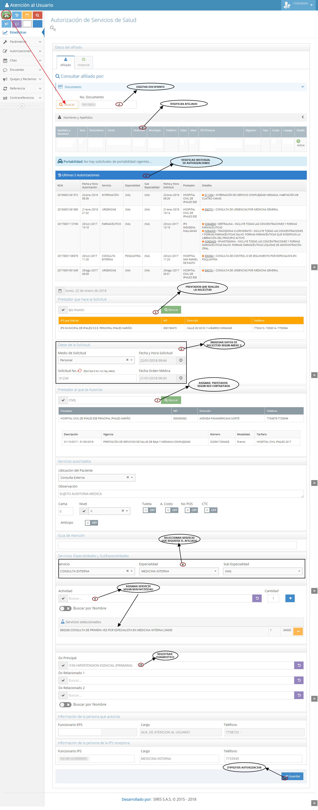

# SISTEMA DE INFORMACIÓN PAGO ANTICIPADO A PRESTADORES DE SERVICIOS DE SALUD.

Garantizar, controlar y legalizar los anticipos girados a los prestadores por concepto de prestación de servicios de salud 

## 1. MODELADO DEL SISTEMA DE INFORMACIÓN

### 1.1 ACTORES PAGO ANTICIPADO A PRESTADORES DE SERVICIOS DE SALUD.

### 1.2 IDENTIFICACIÓN DE LOS CASOS DE USO PAGO ANTICIPADO A PRESTADORES DE SERVICIOS DE SALUD.

| Número | Procesos del Sistema de Información |
| ------ | ----------------------------------- |
| 1      | Entregar documentación para anticipos. |
| 2      | Recibir documentacion para solicitar cotización.  |
| 3      | Entregar cotización. |
| 4      | Presentar documentacion y cotización.  |
| 5      | Analizar cotizaciones y determinar mejor opción.  |
| 6      | Analizar <5 millones.  |
| 7      | Analizar >5 millones. |
| 8      | Aprobar anticipo según cotización.  |
| 9      | Solicitar análisis de anticipo.  |
| 10     | Revisión y aprobación de anticipo.  |
| 11     | Analizar saldos anteriores para cruce de cuentas.  |
| 12     | Analizar disponibilidad de saldo.  |
| 13     | Direccionar para tramites pertinentes.  |
| 14     | Realizar cruce de cuentas.  |
| 15     | Analizar NO disponibilidad de saldo.  |
| 16     | Diligenciar formato de anticipo.  |
| 17     | Registrar en matriz de pago anticipado. |
| 18     | Direccionar y radicar documentación para anticipo.  |
| 19     | Realizar seguimiento al pago del anticipo.  |
| 20     | Entregar soportes de pago anticipado realizado.  |
| 21     | Enviar soportes de anticipo y confirmar pago.  |
| 22     | Confirmar efectividad de pago.  |
| 23     | Tramitar cita, generar autorización y dar información.  |
| 24     | Realizar seguimiento a la prestación del servicio.  |
| 25     | Enviar información para posible cruce de cuentas.  |
| 26     | Solicitar soportes para legalización de anticipo.  |
| 27     | Realizar y entregar informe mensual de los servicios prestados.  |

### 1.3 DESCRIPCIÓN DEL DIAGRAMA DE CASOS DE USO PAGO ANTICIPADO A PRESTADORES DE SERVICIOS DE SALUD.

| **1. Caso de Uso** | Pago anticipado a Prestadores de servicios de salud. |
| - | - |
| **2. Descripción** | Garantizar, controlar y legalizar los anticipos girados a los prestadores por concepto de prestación de servicios de salud. |
| **3. Actor(es)**   | Funcionarios AU, Auxiliar de anticipos, Coordinador AU, Auxiliar R.A.C, Tesorería, Red no adscrita, Dirección de salud, Comité C.E, Cartera, Afiliado y Coordinaciones EPS-I. |
| **4. Pre Condiciones** | Contar con base de datos de afiliados, contar con documentación y cotización y contar con disponibilidad financiera. |
| **5. Pos Condiciones** | Realizar pago anticipado de un servicio de salud para garantizar la atención del afiliado en red no adscrita.|
| **6. Flujo de Eventos** |
| *Actor(es)* | *Sistema* |
| 1. Funcionarios de atención al usuario o el afiliado entrega documentación para tramite de anticipo de la red no contratada por la EPS-I Mallamas.|  |
| 2. El Auxiliar de Anticipos recibe documentación y solicita al prestador cotización del servicio. |  |
| 3. El prestador de la red no adscrita envía cotización del servicio solicitado. |  |
| 4. El Auxiliar de Anticipos presenta documentación y cotizaciones al coordinador de atención al usuario. |  |
| 5. El coordinador de atención al usuario analiza cotizaciones recibidas y determina mejor opción y ubicación del afiliado, si cotización presentada es menor de 5 millones se procede a dar visto bueno y aprobar junto con dirección de salud, y si cotización es mayor de 5 millones se solicita análisis del caso en comité de casos especiales.  |  |
| 6. El comité de casos especiales se reúne para analizar solicitud de anticipos según valor de cotización y determinar y si es pertinente aprobar anticipo.   |  |
| 7. El Auxiliar de anticipos recibe documentación con cotización aprobada y junto con el área de cartera verifican disponibilidad de saldos anteriores para realizar cruce de cuentas.  |  |
| 8. El Auxiliar de Anticipos si confirma con el área de cartera la disponibilidad de saldo direcciona documentación para fines pertinentes de cruce de cuentas con el prestador. |  |
| 9. El Auxiliar de Anticipos si verifica que no hay disponibilidad de saldo diligencia formato para solicitud de anticipo y registra información en matriz de pago anticipado. |  |
| 10. El Auxiliar de Anticipos solicita visto bueno de coordinación de atención al usuario y dirección de salud con el fin de continuar con el tramite del anticipo. |  |
| 11. El Auxiliar de anticipos radica documentación para anticipo con el  auxiliar de radicación y auditoria de cuentas. | |
| 12. El Auxiliar de Anticipos realiza seguimiento a la documentación radicada y al pago del anticipo solicitado.  | |
| 13. Tesorería envía soporte de pago al prestador y a coordinación de atención al usuario.  | |
| 14. El Auxiliar de anticipo envía copia de soporte de pago al prestador y/o funcionario de Mallamas EPS-I y confirma el recibido de documentación.  | |
| 15. EL prestador confirma la efectividad del pago de anticipo según cotización.  | |
| 16. El Auxiliar de anticipos o funcionarios de la EPS-I tramitan cita con el prestador, se genera autorización justificando que el servicio autorizado es por pago anticipado y da información al afiliado de fecha y hora de la cita, institución que prestara el servicio solicitado, nombre del profesional de salud que prestara el servicio, preparación si amerita y documentación que debe presentar.    | |
| 17. El Auxiliar de Anticipos  realiza seguimiento a la prestación del servicio  confirmando la efectividad de la prestación o el motivo por el cual no se garantizo la atención del afiliado.  | |
| 18. En caso de no prestación de servicio solicitado por parte del prestador el Auxiliar de Anticipos informa al área de cartera la novedad con el fin de realizar descuentos o cruce de cuentas.  | |
| 19. El Auxiliar de Anticipos solicita soportes al prestador con el fin de legalizar el anticipo realizado cuando se halla confirmado la efectividad de la prestación del servicio solicitado.  | |
| 20. El Auxiliar de anticipos realiza y entrega informe mensual de los tramites realizados con la red no contratada.  | |
| **7. Requerimiento Asociado** | R001 y R002. |
| **8. Interfaz de Usuario Asociada** | I001. |
| **9. Formato de Usuario Asociado** | F001 y F002. |

### 1.4 MODELADO VISUAL DEL CASO DE USO PAGO ANTICIPADO A PRESTADORES DE SERVICIOS DE SALUD.

## 2. ESPECIFICACIÓN DEL SISTEMA DE INFORMACIÓN PAGO ANTICIPADO A PRESTADORES DE SERVICIOS DE SALUD.
| Término            | Descripción             |
| ------------------ | ----------------------- |
| EPS-I | Empresa Promotora de salud Indígena. |
| R.A.C | Radicación de auditoría de cuentas. |
| Comité C.E. | Comité de casos especiales. |
| Funcionarios AU | Funcionarios atención al usuario. |

## 3. ESPECIFICACIÓN DE REQUERIMIENTOS

| **N°** | **Tipo** | **Descripción** |
| - | - | - |
| R001 | Proceso | Base de datos de afiliados. |
| R002 | Físico  |  Documentos y cotización. |

## 4. ESPECIFICACIÓN DE LA INTERFACE DE USUARIO

| **1. Número** |
| - |
| I001 |
| **2. Propósito de la Interfaz** |
| Mostrar formulario de autorización. |
| **3. Gráfica de la Interfaz**|
|  |

### 4.1 IDENTIFICACIÓN DE PERFILES Y DIÁLOGOS

| **1. Nombre del Perfil** |
| - |
| Auxiliar del sistema de autorizaciones. |
| **2. Opciones a las que tiene Acceso**|
| Nueva autorización |
| **3. Tipo de Acceso** |
| Consultar, Imprimir, Ingresar y Anular. |

### 4.2 ESPECIFICACIÓN DE FORMATOS DE USUARIO

| Número | Nombre del Formato   |
| ------ | -------------------- |
| F001   | Matriz de registro diario de anticipos. |
| F002   | Anexo 4      |