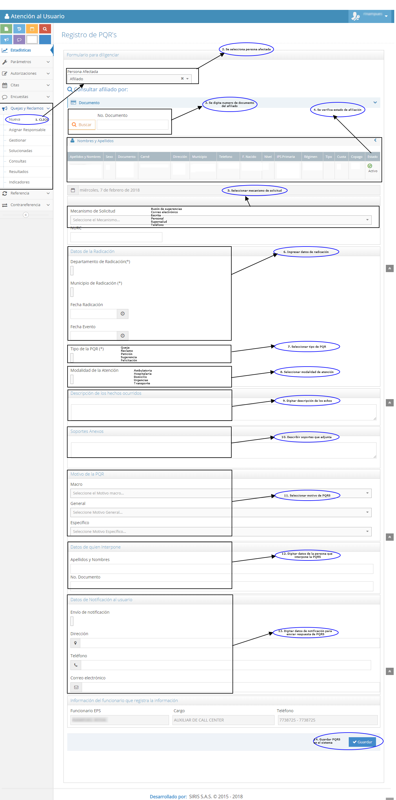

# SISTEMA DE INFORMACIÓN PETICIONES, QUEJAS Y RECLAMOS

Gestionar las respuestas a peticiones, quejas y reclamos de manera oportuna para contribuir al mejoramiento continuo en la prestación de los servicios de salud a los afiliados.

## 1. MODELADO DEL SISTEMA DE INFORMACIÓN

### 1.1 ACTORES PETICIONES, QUEJAS Y RECLAMOS.

### 1.2 IDENTIFICACIÓN DE LOS CASOS DE USO PETICIONES, QUEJAS Y RECLAMOS.

| Número | Procesos del Sistema de Información                  |
| ------ | ---------------------------------------------------- |
| 1      | Presentar PQR.                                       |
| 2      | Entregar PQR.                                        |
| 3      | Recibir PQR.                                         |
| 4      | Recibir personalmente.                               |
| 5      | Recibir por pagina web.                              |
| 6      | Recibir por via telefonica.                          |
| 7      | Recibir por plataforma de la supersalud.             |
| 8      | Recibir por Buzón.                                   |
| 9      | Recibir por correo electrónico.                      |
| 10     | Verificar afiliado en BD.                            |
| 11     | Dar  respuesta e informar al usuario.                    |
| 12     | Clasificar tipo de solicitud.                        |
| 13     | Clasificar si es petición.                           |
| 14     | Clasificar si es queja                               |
| 15     | Clasificar si es reclamo.                            |
| 16     | Ingresar PQR al sistema y clasificar en su eje temático.                    |
| 17     | Guardar PQR en el sistema.                          |
| 18     | Direccionar solicitud al área correspondiente.                           |
| 19     | Direccionar PQR  a las coordinaciones de la EPS-I Mallamas.       |
| 20     | Direccionar PQR de servicios.            |
| 21     | Direccionar PQR  de funcionarios.                        |
| 22     | Responder la PQR de manera oportuna.                 |
| 23     | Responder por correo. |
| 24     | Responder por orfeo.                                 |
| 25     | Direccionar PQR de funcionarios sin respuesta oportuna.                    |
| 26     | Analizar y responder la PRQ de funcionarios.                    |
| 27     | Direccionar PQR al prestador de servicios de salud.   |
| 28     | Solicitar descargos al prestador frente a la PQR.   |
| 29     | Informar tramite en curso.   |
| 30     | Direccionar PQR de prestadores de salud sin respuesta.   |
| 31     | Realizar requerimiento.   |
| 32     | Enviar respuesta a requerimiento.   |
| 33     | Entregar respuesta de PQR.   |
| 34     | Registrar gestión de PQR en sistema.   |
| 35     | Realizar y enviar informe de PQR.   |

### 1.3 DESCRIPCIÓN DEL DIAGRAMA DE CASOS DE USO PETICIONES, QUEJAS Y RECLAMOS

| **1. Caso de Uso** | Peticiones, quejas y reclamos. |
| - | - |
| **2. Descripción** | Gestionar las respuestas a peticiones, quejas y reclamos de manera oportuna para contribuir al mejoramiento continuo en la prestación de los servicios de salud a los afiliados. |
| **3. Actor(es)**   | P.U. Defensoría del usuario, Afiliado, Prestador, Dirección de Salud, Auxiliar de AU, Entes de C.I.V., P.U. de Trabajo social, Coordinaciones de EPS-I Mallamas, Contrataciones y Gestión Humana.  |
| **4. Pre Condiciones** | Contar con red contratada, Contar con BD de afiliados  y contar con medios de comunicación.|
| **5. Pos Condiciones** | Solucionar la inconformidad del afiliado frente a la prestación de un servicio.|
| **6. Flujo de Eventos** |
| *Actor(es)* | *Sistema* |
| 1. El afiliado presenta solicitud o inconformidad en la atención prestada por parte de la EPS-I Mallamas o prestadores de servicios de salud mediante PQR.||
| 2. Los entes de control, inspección y vigilancia, los Auxiliares AU y P.U. de Trabajo social entregan PQR recepcionadas a Defensoría del usuario. ||
| 3. La P.U. Defensoría del usuario recibe las PQR del afiliado, las recepcionadas por los entes de control, inspección y vigilancia, las recepcionadas por los Auxiliares de AU de las sedes de la EPS-I Mallamas y las direccionadas mediante el buzón de PQR. ||
| 4. P.U. defensoría del usuario verifica afiliado en BD. | 5. El sistema muestra estado de afiliación.  |
| 6. P.U. defensoría del usuario da respuesta adecuada e informa al usuario en caso no registrar en BD.  ||
| 7. P.U. Defensoría del usuario clasifica tipo de solicitud de PQR (Petición, queja y Reclamo).  ||
| 8. P.U. defensoría del usuario  ingresa al sistema de PQR y clasifica en su eje temático para obtener numero de radicado.  | 9. El sistema muestra formulario de registro de PQR (Ver interfaz I001). |
| 10. P.U. Defensoría del usuario  guarda PQR en sistema.   | 11. El sistema muestra numero de radicado de PQR ingresada (ver interfaz I002).|
| 12. P.U. defensoría del usuario direcciona a las coordinaciones de la EPS-I Mallamas según corresponda, las PQR presentadas por el afiliado en cuanto al servicio  prestado por la EPS y/o atención recibida por parte de los funcionarios.  ||
| 13. Las coordinaciones de la EPS-I Mallamas  responden a las PQR de manera oportuna con respuesta detallada, completa y con soportes pertinentes, a Defensoría del usuario por medio de orfeo o correo electrónico.  ||
| 14. P.U. Defensoría del usuario cuando las PQR son reiteradas y no se obtiene respuesta de los funcionarios implicados se direcciona a la coordinación de Gestión Humana para tramites pertinentes.  ||
| 15. Gestión Humana analiza y responde la PQR del funcionario de manera clara y acorde al caso y envía respuesta por correo electrónico o por orfeo a la Defensoría del usuario.  ||
| 16. P.U Defensoría del usuario direcciona a los prestadores de servicios de salud las PQR  presentadas por el afiliado en cuanto al servicio y/o atención recibida.   ||
| 17. P.U. Defensoría del usuario solicita descargos al prestador frente a la PQR y se informa por medio de un oficio al afiliado el tramite en curso.  ||
| 18. P.U. Defensoría del usuario direcciona la PQR al área de contrataciones cuando no se obtenga respuesta por parte del prestador frente a los requerimientos previos.  ||
| 19. P.U. Defensoría del usuario realiza el requerimiento al prestador en tiempo establecido de 5 días hábiles.  ||
| 20. P.U. Defensoría del usuario de acuerdo a descargos recibidos por parte de las coordinaciones de la EPS-I Mallamas o de los prestadores da respuesta de PQR, entrega al afiliado y enviá respuesta a los Entes de C.I.V donde el afiliado interponga la PQR.  ||
| 21. P.U. defensoría del usuario registra en sistema la gestión y el tramite realizado para la respuesta de la PQR y se cierra el caso. |22. El sistema muestra registro de gestión ( ver interfaz I003). |
| 23. P.U. Defensoría del usuario realiza consulta de PQR ingresadas al sistema y la gestión realizada. | 24. El sistema muestra consulta detallada de PQR ingresadas (ver interfaz I002, I005 y I006).|
| 25. P.U. Defensoría del usuario realiza informe de PQR presentadas y entrega información a Dirección de Salud de la EPS-I Mallamas cada 3 meses  y a los entes de C.I.V Cuando lo requieran.  | |
| **7. Requerimiento Asociado** | R001, R002, R003,R004 y R005. |
| **8. Interfaz de Usuario Asociada** | I001, I002, I003, I004, I005, I006. |
| **9. Formato de Usuario Asociado** | F001. |

### 1.4 MODELADO VISUAL DEL CASO DE USO PETICIONES, QUEJAS Y RECLAMOS

## 2. ESPECIFICACIÓN DEL SISTEMA DE INFORMACIÓN PETICIONES, QUEJAS Y RECLAMOS

| Término    | Descripción                          |
| ---------- | ------------------------------------ |
| BD         | Base de datos                        |
| PQR        | Peticiones, Quejas y Reclamos        |
| C.I.V.     | Control, Inspección y Vigilancia.    |
| P.U.       | Profesional universitario            |
| AU         | Atención al usuario.                 |
| Supersalud | Super Intendencia Nacional de Salud. |
| I.D.S      | Instituto departamental de salud.    |
| I.C.B.F.   | Instituto departamental de salud.    |

## 3. ESPECIFICACIÓN DE REQUERIMIENTOS

| **N°** | **Tipo** | **Descripción** |
| - | - | - |
| R001 | Proceso | Red prestadora. |
| R002 | Proceso | Base de datos. |
| R003 | Físico  | Formato de PQR. |
| R004 | Físico  | Buzón de PQRSF. |
| R005 | Proceso | Plataforma de la Supersalud. |

## 4. ESPECIFICACIÓN DE LA INTERFACE DE USUARIO

| **1. Número** |
| - |
| I001 |
| **2. Propósito de la Interfaz** |
| Mostrar formulario de PQR. |
| **3. Gráfica de la Interfaz**|
|  |

| **1. Número** |
| - |
| I002 |
| **2. Propósito de la Interfaz** |
| Mostrar consultas de PQR. |
| **3. Gráfica de la Interfaz**|
|  |

| **1. Número** |
| - |
| I003 |
| **2. Propósito de la Interfaz** |
| Mostrar la Gestión de PQR. |
| **3. Gráfica de la Interfaz**|
|  |

| **1. Número** |
| - |
| I004 |
| **2. Propósito de la Interfaz** |
| Mostrar PQR Solucionadas. |
| **3. Gráfica de la Interfaz**|
|  |

| **1. Número** |
| - |
| I005 |
| **2. Propósito de la Interfaz** |
| Mostrar resultado de PQR. |
| **3. Gráfica de la Interfaz**|
|  |

| **1. Número** |
| - |
| I006 |
| **2. Propósito de la Interfaz** |
| Mostrar Indicadores de PQR. |
| **3. Gráfica de la Interfaz**|
|  |

### 4.1 IDENTIFICACIÓN DE PERFILES Y DIÁLOGOS

| **1. Nombre del Perfil** |
| - |
| Auxiliar del sistema de PQR. |
| **2. Opciones a las que tiene Acceso**|
| Nueva PQR  y Consultar PQR.  |
| **3. Tipo de Acceso** |
| Ingresar, Consultar, Anular, Gestionar, Solucionar y Adjuntar. |

### 4.2 ESPECIFICACIÓN DE FORMATOS DE USUARIO

| Número | Nombre del Formato |
| ------ | ------------------ |
| F001   | Formato de PQR.    |

