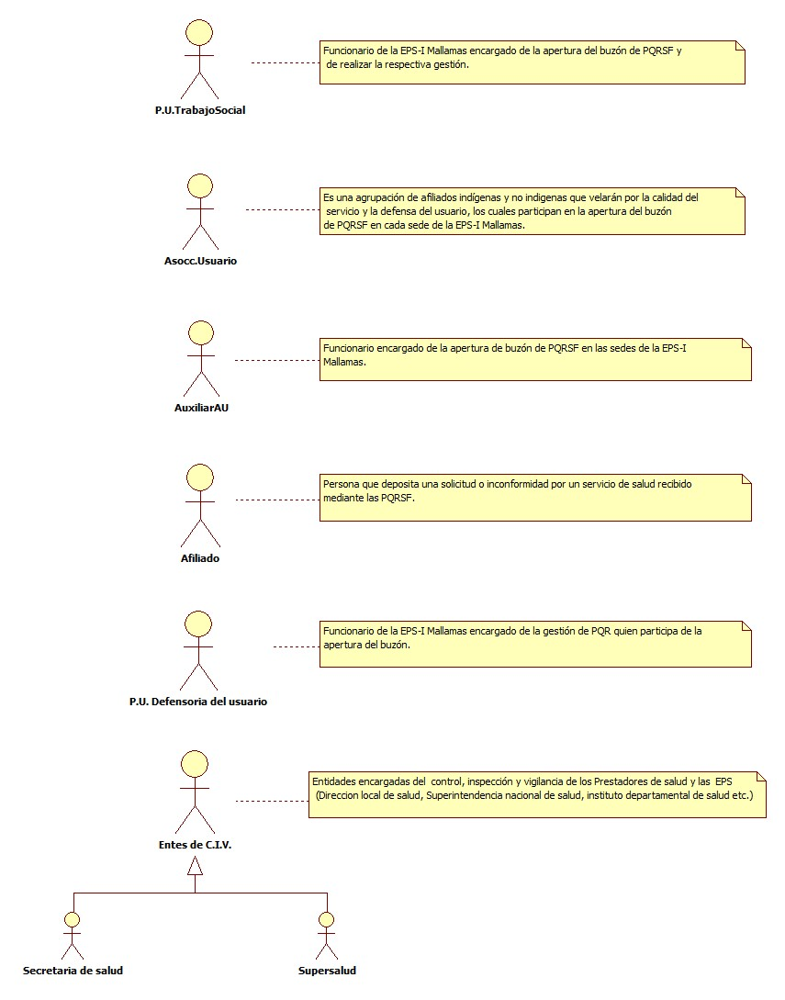
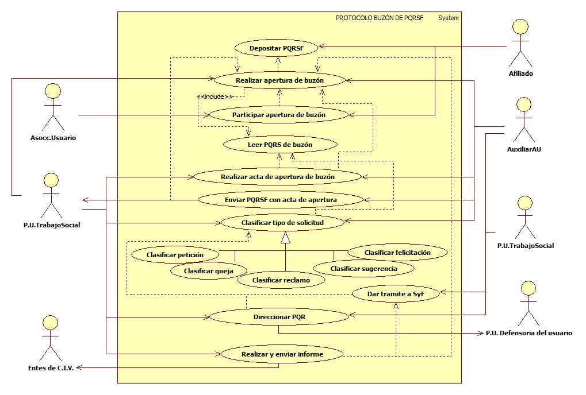

# SISTEMA DE INFORMACIÓN PROTOCOLO BUZON DE PQRSF

El buzón de peticiones, quejas, reclamos, sugerencias y felicitaciones es un instrumento puesto a disposición de los afiliados de la EPS-I para hacer llegar las observaciones y reclamaciones que estimen convenientes sobre el funcionamiento de la organización, asi como también para la mejora de la calidad de los servicios prestados.

## 1. MODELADO DEL SISTEMA DE INFORMACIÓN

### 1.1 ACTORES PROTOCOLO BUZÓN DE PQRSF

### 1.2 IDENTIFICACIÓN DE LOS CASOS DE USO PROTOCOLO BUZÓN DE PQRSF

| Número | Procesos del Sistema de Información  |
| ------ | ------------------------------------ |
| 1      | Depositar PQRSF.                     |
| 2      | Realizar apertura de buzón.          |
| 3      | Participar en la apertura del buzón. |
| 4      | Leer PQRSF encontradas en el Buzón.  |
| 5      | Realizar acta de apertura de buzón.  |
| 6      | Enviar PQRSF con acta de apertura.   |
| 7      | Clasificar tipo de solicitud.        |
| 8      | Clasificar petición.                 |
| 9      | Clasificar queja.                    |
| 10     | Clasificar reclamo.                  |
| 11     | Clasificar sugerencia.               |
| 12     | Clasificar felicitación.             |
| 13     | Dar tramite a SyF.                   |
| 14     | Direccionar PQR.                     |
| 15     | Realizar y enviar informe.           |

### 1.3 DESCRIPCIÓN DEL DIAGRAMA DE CASOS DE USO PROTOCOLO BUZÓN DE PQRSF.

| **1. Caso de Uso** | Protocolo Buzón de PQRSF. |
| - | - |
| **2. Descripción** | El buzón de peticiones, quejas, reclamos, sugerencias y felicitaciones es un instrumento puesto a disposición de los afiliados de la EPS-I para hacer llegar las observaciones y reclamaciones que estimen convenientes sobre el funcionamiento de la organización, asi como también para la mejora de la calidad de los servicios prestados.|
| **3. Actor(es)**   | P.U. de Trabajo social, Asociación de usuarios de la EPS, Auxiliar de atención al usuario, Afiliado, P.U. Defensoría del usuario y Entes de C.I.V. |
| **4. Pre Condiciones** | Contar con BD de afiliados, Contar con buzón de PQRSF en cada sede de la EPS y contar con formatos de PQRSF a la disponibilidad del afiliado. |
| **5. Pos Condiciones** | Disponer de un mecanismo de identificación de PQRSF que permitan a la EPS-I generar acciones preventivas, correctivas e incentivos.|
| **6. Flujo de Eventos** |
| *Actor(es)* | *Sistema* |
| 1. El afiliado  deposita las PQRSF en el buzón de cada una de las sedes donde EPS-I Mallamas hace presencia. ||
| 2. P.U. de Trabajo social realiza la apertura del buzón de PQRSF en la sede central de la EPS-I Mallamas y el Auxiliar AU en cada sede la apertura se realiza cada 15 días con la participación de un integrante de la asociación de usuarios o la presencia de un afiliado.||
| 3. P.U. de Trabajo social o el Auxiliar de atención al usuario realizan lectura en voz alta de las PQRSF encontradas en el buzón.  ||
| 4. P.U. de trabajo social o Auxiliar de AU clasifica las PQRSF encontradas en el buzón (Peticiones, Quejas, Reclamos, Sugerencias y Felicitaciones). ||
| 5. P.U. de trabajo social o el auxiliar de atención al usuario realizan acta de la apertura del buzón adjuntando las PQRSF encontradas y con la firma de los participantes. ||
| 6. El Auxiliar de atención al usuario envía las PQRSF encontradas en el buzón junto con el acta de apertura a P.U. de Trabajo social de la sede central.  ||
| 7. P.U. de Trabajo social o Auxiliar AU direcciona las PQR del buzón a la P.U. Defensoría del usuario para su respectivo tramite.  ||
| 8. P.U. de Trabajo social o el Auxiliar de AU realiza gestión de las Sugerencias y Felicitaciones encontradas en el buzón. ||
| 9. P.U. de trabajo social consolida actas de apertura de buzón de PQRSF a nivel nacional para entregar como soportes a los entes de C.I.V si lo requieren. ||
| **7. Requerimiento Asociado** | R001, R002, R003. |
| **8. Interfaz de Usuario Asociada** |  |
| **9. Formato de Usuario Asociado** | F001, F002, F003. |

### 1.4 MODELADO VISUAL DEL CASO DE USO PROTOCOLO BUZÓN DE PQRSF

## 2. ESPECIFICACIÓN DEL SISTEMA DE INFORMACIÓN PROTOCOLO BUZÓN DE PQRSF

| Término | Descripción                                                 |
| ------- | ----------------------------------------------------------- |
| EPS-I   | Empresa Promotora de Salud Indígena.                        |
| PQRSF   | Peticiones, Quejas, Reclamos, Sugerencias y Felicitaciones. |
| Asocc.  | Asociación.                                                 |
| P.U.    | Profesional Universitario.                                  |
| AU.     | Atención al usuario.                                        |
| C.I.V.  | Control, Inspección y Vigilancia.                           |
| PQR.    | Peticiones, Quejas y Reclamos.                              |
| SyF.    | Sugerencias y Felicitaciones.                               |

## 3. ESPECIFICACIÓN DE REQUERIMIENTOS

| **N°** | **Tipo** | **Descripción** |
| - | - | - |
| R001 | Físico | Buzón de PQRSF |
| R002 | Físico | Formato de PQRSF |
| R003 | Físico | Acta de apertura de Buzón. |

## 4. ESPECIFICACIÓN DE LA INTERFACE DE USUARIO

| - |
| **1. Número** |
| - |
|  |
| **2. Propósito de la Interfaz** |
|  |
| **3. Gráfica de la Interfaz**|

### 4.1 IDENTIFICACIÓN DE PERFILES Y DIÁLOGOS

| **1. Nombre del Perfil** |
| - |
|  |
| **2. Opciones a las que tiene Acceso**|
|  |
| **3. Tipo de Acceso** |
|  |

### 4.2 ESPECIFICACIÓN DE FORMATOS DE USUARIO

| Número | Nombre del Formato         |
| ------ | -------------------------- |
| F001   | Formato de PQRSF.          |
| F002   | Acta de apertura de Buzón. |