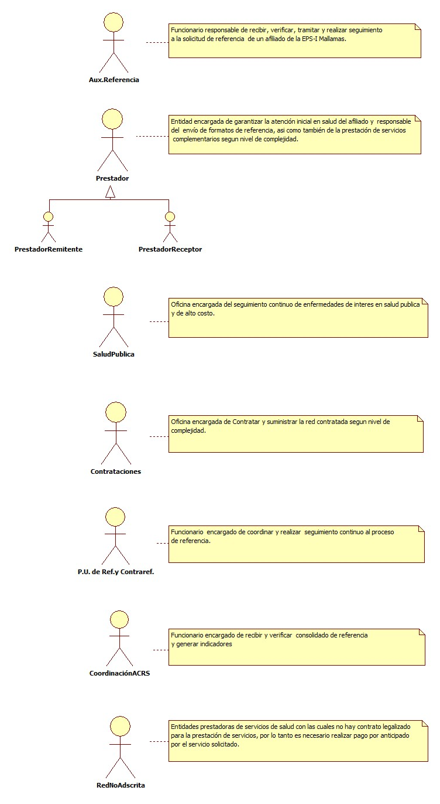
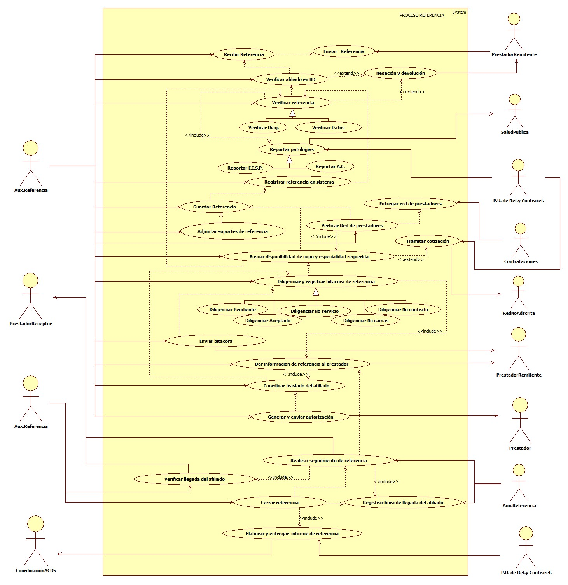
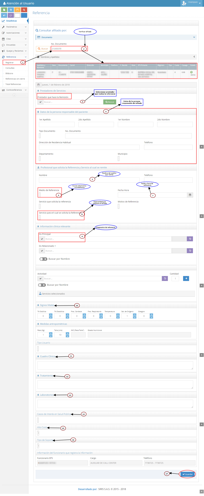

# SISTEMA DE INFORMACIÓN REFERENCIA

Garantizar a los afiliados de la EPS-I MALLAMAS que se encuentren internados en una institución de salud la referencia y traslado a otro prestador con la complejidad y servicio requerido.

## 1. MODELADO DEL SISTEMA DE INFORMACIÓN

### 1.1 ACTORES REFERENCIA

### 1.2 IDENTIFICACIÓN DE LOS CASOS DE USO REFERENCIA

| Número | Procesos del Sistema de Información                     |
| ------ | ------------------------------------------------------- |
| 1      | Enviar referencia.                                      |
| 2      | Recibir referencia.                                     |
| 3      | Verificar afiliado en BD.                               |
| 4      | Verificar referencia.                                   |
| 5      | Verificar Diagnóstico.                                  |
| 6      | Verificar Datos.                                        |
| 7      | Negar y devolver referencia.                            |
| 8      | Reportar patologías.                                    |
| 9      | Reportar E.I.S.P.                                       |
| 10     | Reportar Alto Costo.                                    |
| 11     | Registrar referencia en sistema.                        |
| 12     | Guardar referencia.                                     |
| 13     | Adjuntar soportes de referencia.                        |
| 14     | Entregar red de prestadores.                            |
| 15     | Verificar red de prestadores.                           |
| 16     | Buscar disponibilidad de cupo y especialidad requerida. |
| 17     | Tramitar cotización. |
| 18     | Diligenciar bitácora de referencia.                     |
| 19     | Diligenciar pendiente.                                  |
| 20     | Diligenciar aceptado.                                   |
| 21     | Diligenciar no servicio.                                |
| 22     | Diligenciar no camas                                    |
| 23     | Diligenciar no contrato.                                |
| 24     | Enviar bitácora de referencia al prestador remitente.   |
| 25     | Dar información de referencia al prestador remitente.   |
| 26     | Coordinar traslado del afiliado.                        |
| 27     | Generar y enviar autorización de traslado.              |
| 28     | Realizar seguimiento de referencia.                     |
| 29     | Verificar llegada del afiliado al prestador receptor.   |
| 30     | Registrar hora de llegada en sistema.                   |
| 31     | Cerrar referencia.                                      |
| 32     | Elaborar y entregar informe de referencia.              |

### 1.3 DESCRIPCIÓN DEL DIAGRAMA DE CASOS DE USO REFERENCIA

| **1. Caso de Uso** | Referencia |
| - | - |
| **2. Descripción** | Garantizar a los afiliados de la EPS-I MALLAMAS que se encuentren internados en una institución de salud la referencia y traslado a otro prestador con la complejidad y servicio requerido. |
| **3. Actor(es)**   | Aux. Referencia, P.U. de Ref. y Contraref., Prestadores (Remitente y Receptor), Coordinación ACRS, Salud Pública y Contrataciones.   |
| **4. Pre Condiciones** | Contar con red contratada, Contar con equipos de telecomunicaciones.  |
| **5. Pos Condiciones** | Referencia y traslado del afiliado a un nivel superior de complejidad. |
| **6. Flujo de Eventos** |
| *Actor(es)* | *Sistema* |
| 1. El Prestador Remitente enviá formato de referencia (Anexo 9, Remisión, Historia clínica, Ayudas diagnosticas, Reportes de paraclinicos) al área de referencia de la EPS-I Mallamas, el reporte se realiza por via telefonica o por correo electrónico.||
| 2. El Aux. de Referencia recibe formato de referencia por correo electrónico o recibe notificación de referencia por via telefonica. ||
| 3. El Aux. de Referencia verifica el afiliado en BD | 4. El sistema muestra estado de afiliación del afiliado.|
| 5. El Aux.de Referencia verifica datos de referencia (fecha de referencia, signos vitales, cuadro clínico, datos del prestador remitente, datos del afiliado, entre otros), se verifica la pertinencia de la referencia evaluando diagnostico del usuario con especialidad requerida.  ||
| 6. El Aux.de Referencia verifica diagnósticos de enfermedades de interés en salud publica y de alto costo y entrega a P.U. de Referencia. ||
| 7. El Aux. de Referencia realiza la negación y devolución de referencia al prestador remitente según sea el caso (Afiliado no registra en BD, Formato de referencia no cumple con el diligenciamiento de todos los campos requeridos, accidente de transito). || 
| 8. P.U. de Ref. y Contraref. reporta patologías de enfermedades de interés en salud pública y de alto costo al área de salud pública de la EPS-I Mallamas). || 
| 9. El Aux. de Referencia ingresa al sistema  referencia. | 10. El sistema muestra formulario de referencia.|
| 11. El Aux. de Referencia digita datos de afiliado y diligencia campos del formulario de referencia según reporte del prestador. | 12. El sistema muestra formulario de referencia diligenciado.| 
| 13. El Aux. de Referencia guarda formulario de referencia. | 14. El sistema muestra Anexo 9 diligenciado.| 
| 15. El Aux. de Referencia adjunta soportes de referencia en sistema (historia clínica,paraclinicos, ayudas diagnosticas, evoluciones).| 16. El sistema guarda soportes de referencia.| 
| 17. El Aux. de Referencia verifica red de prestadores según nivel de complejidad y especialidad requerida por el afiliado. || 
| 18. El Aux. de Referencia busca disponibilidad de cupo y especialidad requerida en red contratada haciendo uso del sistema de comunicaciones (teléfono o correo Electrónico), en caso de no contar con la especialidad requerida en la red contratada se tramita cotización en red no adscrita para realizar pago por anticipado y garantizar la atención del afiliado. || 
| 19. El Aux. de Referencia diligencia bitácora de referencia con las respuestas obtenidas de los prestadores en donde fue reportada la referencia. | 20. El sistema muestra bitácora del afiliado.| 
| 21. El Aux. de Referencia envía bitácora de referencia al prestador remitente para informar el tramite que se esta realizando a la referencia del afiliado. || 
| 22. El Aux. de Referencia  en caso de aceptación del afiliado informa al prestador remitente datos de aceptación (prestador que acepta, nombre del profesional en salud que acepta la referencia, código de aceptación y servicio por el cual ingresara el afiliado) y solicita justificación medica para el traslado (traslado aereo, fluvial o terrestre, Basico o medicalizado). || 
| 23. El Aux. de Referencia coordina traslado del afiliado según justificación enviada por el prestador remitente (en caso de aceptación del afiliado). || 
| 24. El Aux. de Referencia genera y envía autorización y justificación  al prestador que realiza el traslado.  || 
| 25. El Aux. de Referencia informa al prestador remitente fecha y hora en que se realizara el traslado. || 
|26. El Aux. de Referencia realiza seguimiento continuo a la referencia del afiliado confirmando la llegada del afiliado hasta el prestador receptor o confirmando motivo de no traslado con el prestador remitente.||
| 27. El Aux. de Referencia ingresa datos de llegada del afiliado o cancelación de referencia en el sistema y guarda información. | 28. El sistema muestra cierre de referencia. | 
| 29. P.U. de Ref. y Contraref. realiza consolidado mensual de referencia. | | 
| 30. P.U. de Ref. y Contraref. entrega consolidado de referencia a Coordinación de ACRS.||
| **7. Requerimiento Asociado** | R001, R002, R003 y R004. |
| **8. Interfaz de Usuario Asociada** | I001, I002, I003, I004, I005 y I006. |
| **9. Formato de Usuario Asociado** | F001 y F002. |

### 1.4 MODELADO VISUAL DEL CASO DE USO REFERENCIA

## 2. ESPECIFICACIÓN DEL SISTEMA DE INFORMACIÓN REFERENCIA

| Término                   | Descripción                                                                                                                                   |
| ------------------------- | --------------------------------------------------------------------------------------------------------------------------------------------- |
| E.I.S.P.                  | Enfermedades de Interés en Salud, Pública.                                                                               |
| Aux.                      | Auxiliar.                                                                                                                                   |
| ACRS                      | Auditoria de calidad red de servicios.                                                                                                    |
| P.U. de Ref. y Contraref. | Profesional Universitario de Referencia y Contrareferencia.                                                                                 |
| Diag.                     | Diagnostico.                                                                                                                                |
| Esp.                      | Especialidad.                                                                                                                                |
| A.C.                      | Alto Costo.                                                                                                                                 |
| B.D.                      | Base de Datos.                                                                                                                              |
| Red de Prestadores        | Conjunto de Instituciones.                                                                                                                   |
| EPS-I                     | Empresa Promotora de Salud Indígena                                                                                                          |
| Bitácora                  | Es un registro cronológico.                                                                                                                  |
| Anexo 9                  | Formato de referencia presentar un resumen de la historia clínica del afiliado el cual se remite para atención o complementación diagnostica. |

## 3. ESPECIFICACIÓN DE REQUERIMIENTOS

| **N°** | **Tipo** | **Descripción** |
| - | - | - |
| R001 | Proceso | Red prestadora |
| R002 | Proceso | Base de datos |
| R003 | Físico  | Anexo 9   |
| R004 | Físico  | Anexo 4  |

## 4. ESPECIFICACIÓN DE LA INTERFACE DE USUARIO

| **1. Número** |
| - |
| I001 |
| **2. Propósito de la Interfaz** |
| Mostrar Formulario de referencia |
| **3. Gráfica de la Interfaz**|
|  |

| **1. Número** |
| - |
| I002 |
| **2. Propósito de la Interfaz** |
| Mostrar el registro de referencia diligenciada y guardada |
| **3. Gráfica de la Interfaz**|
|  |

| **1. Número** |
| - |
| I003 |
| **2. Propósito de la Interfaz** |
| Adjuntar soportes de referencia |
| **3. Gráfica de la Interfaz**|
|  |

| **1. Número** |
| - |
| I004 |
| **2. Propósito de la Interfaz** |
| Registrar Bitácora |
| **3. Gráfica de la Interfaz**|
|  |

| **1. Número** |
| - |
| I005 |
| **2. Propósito de la Interfaz** |
| Cerrar Referencia |
| **3. Gráfica de la Interfaz**|
|  |

| **1. Número** |
| - |
| I006 |
| **2. Propósito de la Interfaz** |
| Consultar Referencia |
| **3. Gráfica de la Interfaz**|
|  |

### 4.1 IDENTIFICACIÓN DE PERFILES Y DIÁLOGOS

| **1. Nombre del Perfil** |
| - |
| Auxiliar del sistema de Referencia |
| **2. Opciones a las que tiene Acceso**|
| Nueva referencia, Consultar referencias, Ingresar bitácora.
| **3. Tipo de Acceso** |
| Ingresar, modificar, anular, consultar, cancelar, imprimir,cerrar, adjuntar y verificar.|

### 4.2 ESPECIFICACIÓN DE FORMATOS DE USUARIO

| Número | Nombre del Formato |
| ------ | ------------------ |
|  F001  | Anexo 9    |
|  F002  | Anexo 4    |