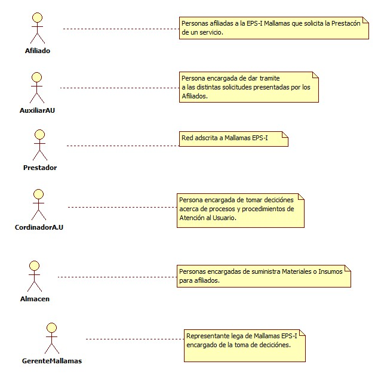
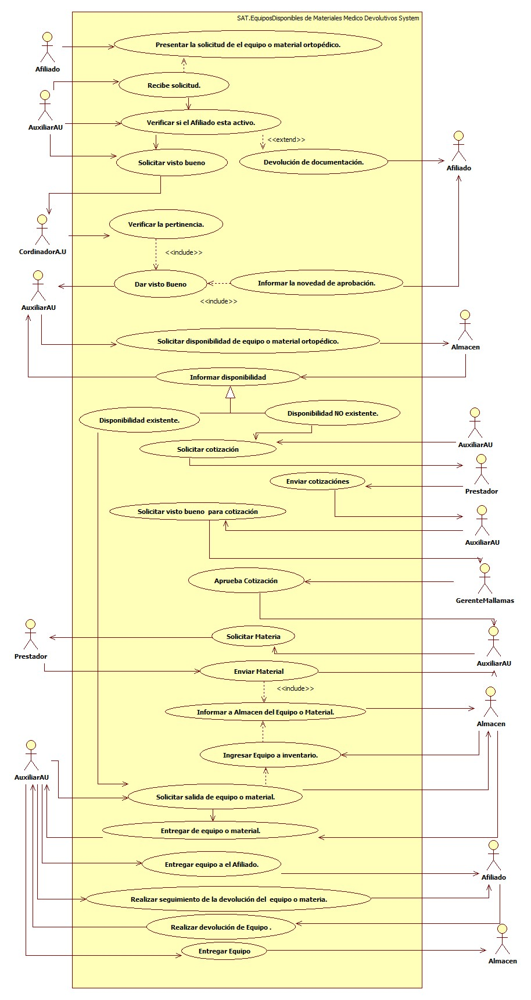

# SISTEMA DE INFORMACIÓN SAT.EQUIPOS DISPONIBLES DE MATERIALES MEDICO DEVOLUTIVOS.
Garantizar el seguimiento y control de los equipos y/o materiales médicos en calidad de préstamo a los afiliados de Mallamas EPS-I.

## 1. MODELADO DEL SISTEMA DE INFORMACIÓN

### 1.1 ACTORES SAT.EQUIPOS DISPONIBLES DE MATERIALES MEDICO DEVOLUTIVOS.

### 1.2 IDENTIFICACIÓN DE LOS CASOS DE USO SAT.EQUIPOS DISPONIBLES DE MATERIALES MEDICO DEVOLUTIVOS.

| Número | Procesos del Sistema de Información |
| ------ | ----------------------------------- |
| 1      | Presentar la solicitud de el equipo o material ortopédico.              |
| 2      | Recibe solicitud.             |
| 3      | Verificar si el Afiliado esta activo.             |
| 4      | Solicitar visto bueno             |
| 5      | Devolución de documentación.             |
| 6      | Verificar la pertinencia.             |
| 7      | Dar visto Bueno             |
| 8      | Informar la novedad de aprobación.           |
| 9      | Solicitar disponibilidad de equipo o material ortopédico.           |
| 10     | Informar disponibilidad             |
| 11     | Disponibilidad existente.             |
| 12     | Disponibilidad NO existente.           |
| 13     | Solicitar cotización           |
| 14     | Enviar cotizaciónes             |
| 15     | Solicitar visto bueno  para cotización             |
| 16     | Aprueba Cotización            |
| 17     | Solicitar Materia             |
| 18     | Enviar Material            |
| 19     | Informar a Almacen del Equipo o Material.             |
| 20     | Ingresar Equipo a inventario.             |
| 21     | Solicitar salida de equipo o material.            |
| 22     | Entregar de equipo o material.            |
| 23     | Entregar equipo a el Afiliado.            |
| 24     | Realizar seguimiento de la devolución del  equipo o materia.            |
| 25     | Realizar devolución de Equipo .             |
| 26     | Entregar Equipo

### 1.3 DESCRIPCIÓN DEL DIAGRAMA DE CASOS DE USO SAT.EQUIPOS DISPONIBLES DE MATERIALES MEDICO DEVOLUTIVOS.

| **1. Caso de Uso** | SAT.EQUIPOS DISPONIBLES DE MATERIALES MEDICO DEVOLUTIVOS. |
| - | - |
| **2. Descripción** |  Aplica a los equipos y/o materiales médicos en calidad de préstamo por parte de los afiliados de Mallamas EPS-I para su reutilización |
| **3. Actor(es)**   | Afiliado, AuxiliarAU, Prestador, CordinadorA.U, Almacén y Gerente de Mallamas.  |
| **4. Pre Condiciones** | Contar con la solicitud del afiliado de un equipo o material.|
| **5. Pos Condiciones** | Poder suministrar al afiliado el equipo solicitado.|
| **6. Flujo de Eventos** ||
| *Actor(es)* | *Sistema* |
| 1. El afiliado presenta la solicitud del Material o equipo quirurgico.|  |
| 2. EL Auxiliar de Atención al Usuario recibe la solicitud del Material | 3. Se verifica si el afiliado pertenece a Mallamas EPS-I. |
| 4. El Auxiliar de Atención al Usuario de ser necesario devuelve la documentación al afiliado para que se dirija hasta su EPS. |  |
| 5. El Auxiliar de Atención al Usuario solicita el visto bueno para la entrega del Material al Coordinador de Atención al Usuario. |  |
| 6. El Coordinador de Atención al Usuario revisa la pertinencia y da la aprobación para la entrega del Material e informa al Auxiliar de Atención al Usuario.  | |
| 7. El Auxiliar de Atención al Usuario informa la novedad al afiliado. |  |
| 8. El Auxiliar de Atención al Usuario solicita la disponibilidad del Material o Equipo en almacén. |  |
| 9. Almacén verifica en su stok que **NO** hay disponibilidad del equipo e informa al Auxiliar de Atención al Usuario.  | |
| 9.1.El Auxiliar de Atención al Usuario si no hay disponibilidad en almacén del equipo solicita cotización del equipo a la red contratada.  |  |
| 9.2. El Prestador envia cotizaciónes de la solicitud enviada por El Auxiliar de Atención al Usuario.  | |
| 9.3. El Auxiliar de Atención al Usuario recibe las cotizaciónes y solicita la aprobación por gerencia.||
|  9.4. Gerencia da visto bueno e informa Atención al Usuario. | |
|  9.4. El Auxiliar de Atención al Usuario solicita el envió del equipo al Prestador. | |
| 9.5. El Prestador enviá Material o Equipo solicitado.| | 
| 9.6. El Auxiliar de Atención al Usuario informa a Almacén de la llegada del Equipo o Material. | | 
| 9.7. Almacén ingresa el Equipo al Inventario. | |
| 10. Almacén verifica en su stok que **SI** hay disponibilidad del equipo e informa al Auxiliar de Atención al Usuario.||
| 11. El Auxiliar de Atención al Usuario solicita a almacén la salida del equipo para entregar al afiliado. | | 
| 12. Almacén entrega equipo a Atención al Usuario para posterior entrega al afiliado. | | 
| 13. El Auxiliar de Atención al Usuario realiza acta de entrega del equipo al Afiliado. | | 
| 14. El Auxiliar de Atención al Usuario realiza seguimiento constante a la devolución del equipo entregado en calidad de Préstamo al Afiliado. | |  
| 15. El Afiliado realiza la devolución del equipo a Atención al Usuario una vez haya cumplido el tratamiento. | | 
| 16. El Auxiliar de Atención al Usuario realiza devolución del equipo a Almacén. ||
| **7. Requerimiento Asociado** | R001, R002, R003. |
| **8. Interfaz de Usuario Asociada** | I001. |
| **9. Formato de Usuario Asociado** | F001. |

### 1.4 MODELADO VISUAL DEL CASO DE USO SAT.EQUIPOS DISPONIBLES DE MATERIALES MEDICO DEVOLUTIVOS.

## 2. ESPECIFICACIÓN DEL SISTEMA DE INFORMACIÓN SAT.EQUIPOS DISPONIBLES DE MATERIALES MEDICO DEVOLUTIVOS.

| Término | Descripción |
| ------- | ----------- |
| SAT | Solicitud, Adquisición o Tramité.             |
| Cotización | Solicitud de costo.         |

## 3. ESPECIFICACIÓN DE REQUERIMIENTOS

| **N°** | **Tipo** | **Descripción** |
| - | - | - |
| R001 | Físico | Formula Medica. |
| R002 | Proceso | Red prestadora. |
| R003 | Proceso | Solicitud de base de datos. |

## 4. ESPECIFICACIÓN DE LA INTERFACE DE USUARIO

| **1. Número** |
| - |
| I001 |
| **2. Propósito de la Interfaz** |
| Consulta de afiliado. |
| **3. Gráfica de la Interfaz**|
|  |

### 4.1 IDENTIFICACIÓN DE PERFILES Y DIÁLOGOS

| **1. Nombre del Perfil** |
| - |
| Auxiliar Atención al Usuario. |
| **2. Opciones a las que tiene Acceso**|
| Consultar Afiliado. |
| **3. Tipo de Acceso** |
| Consultar. |

### 4.2 ESPECIFICACIÓN DE FORMATOS DE USUARIO

| Número | Nombre del Formato |
| ------ | ----------------------------------- |
| F001   | Acta de solicitud de equipo.            |
