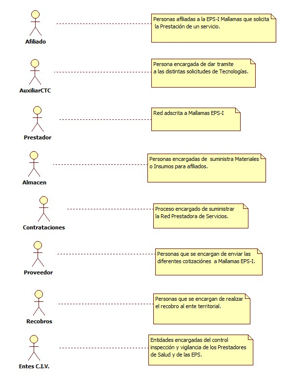
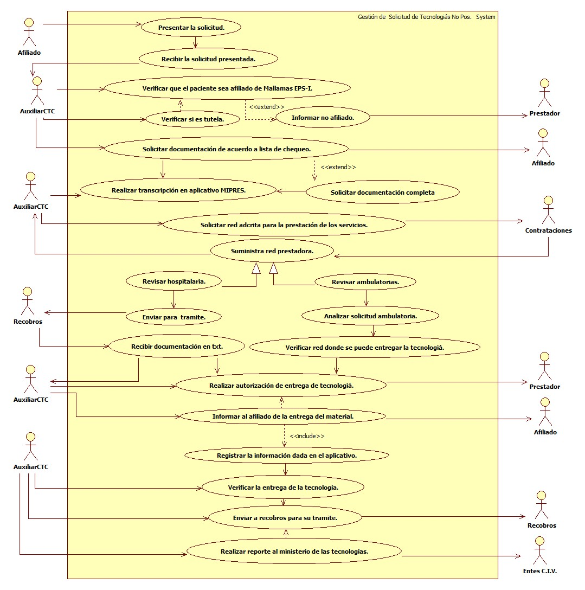

# SISTEMA DE INFORMACIÓN GESTIÓN DE SOLICITUDES DE TECNOLOGÍAS NO CUBIERTAS EN EL POS CONTRIBUTIVO.

Garantizar la entrega oportuna de TECNOLOGIAS NO POS a los afiliados  de MALLAMAS EPSI del Regimen Contributivo.

## 1. MODELADO DEL SISTEMA DE INFORMACIÓN

### 1.1 ACTORES GESTIÓN DE SOLICITUDES DE TECNOLOGÍAS NO CUBIERTAS EN EL POS CONTRIBUTIVO.>

### 1.2 IDENTIFICACIÓN DE LOS CASOS DE USO GESTIÓN DE SOLICITUDES DE TECNOLOGÍAS NO CUBIERTAS EN EL POS CONTRIBUTIVO.

| Número | Procesos del Sistema de Información |
| ------ | ----------------------------------- |
| 1 | Presentar la solicitud. |
| 2 | Recibir la solicitud presentada. |
| 3 | Verificar que el paciente sea afiliado de Mallamas EPS-I. | 
| 4 | Verificar si es tutela. |
| 5 | Informar no afiliado. |
| 6 | Solicitar documentación de acuerdo a lista de chequeo. | 
| 7 | Realizar transcripción en aplicativo MIPRES. |
| 8 | Solicitar documentación completa |
| 9 | Solicitar red adcrita para la prestación de los servicios. |
| 10 | Suministra red prestadora. |
| 11 | Revisar hospitalaria. |
| 12 | Revisar ambulatorias. |
| 13 | Enviar para  tramite. |
| 14 | Analizar solicitud ambulatoria. |
| 15 | Recibir documentación en txt.
| 16 | Verificar red donde se puede entregar la tecnología.|
| 17 | Realizar autorización de entrega de tecnología. |
| 18 | Informar al afiliado de la entrega del material. |
| 19 | Registrar la información dada en el aplicativo |
| 20 | Verificar la entrega de la tecnología |
| 21 | Enviar a recobros para su tramite. |
| 22 | Realizar reporte al ministerio de las tecnologías. |

### 1.3 DESCRIPCIÓN DEL DIAGRAMA DE CASOS DE USO GESTIÓN DE SOLICITUDES DE TECNOLOGÍAS NO CUBIERTAS EN EL POS CONTRIBUTIVO.

| **1. Caso de Uso** | GESTIÓN DE SOLICITUDES DE TECNOLOGÍAS NO CUBIERTAS EN EL POS CONTRIBUTIVO.|
| - | - |
| **2. Descripción** | Garantizar a los Afiliados de Mallamas EPS-I que necesiten tecnologías NO POS, Contributivo|
| **3. Actor(es)**   | Auxiliar CTC, Afiliado, Recobros, Entes C.I.V, Prestadores, Contrataciones, Proveedore, Almacén. |
| **4. Pre Condiciones** | Tener solicitud del afiliado para tecnología NO POS. |
| **5. Pos Condiciones** | Entregar al afiliado la tecnología NO POS.|
| **6. Flujo de Eventos** |
| *Actor(es)* | *Sistema* |
| 1. El Afiliado contributivo presenta la solicitud de la tecnología no pos.|  |
| 2. El Auxiliar de Comité Técnico Científico recibe la solicitud presentada por el afiliado.  | 3. Se verifica que el afiliado este activo con Mallamas EPS-I en base de datos. |
| 4. El Auxiliar de Comité Técnico Científico informa al Prestador que el afiliado no esta activo con Mallamas EPS-I.  | |
| 5. El Auxiliar de Comité Técnico Científico verifica si es Tutela. |  |
| 6. El Auxiliar de Comité Técnico Científico solicita la documentación de acuerdo al listado de chequeo |7. Realizar la transcripción de la formula en el aplicativo MIPRES.|
| 8. El Auxiliar de Comité Técnico Científico solicita la documentación completa de ser necesaria. |  |
| 9. El Auxiliar de Comité Técnico Científico Solicita la red adcrita para la prestación de los servicios. |  |
| 10. Contrataciones suministra la red de servicios para revisión de dodne se puede enviar a cotizar. |  |
| 11.  El Auxiliar de Comité Técnico Científico revisa si el procedimiento es **HOSPITALARIO.**  | |
| 11.1 El Auxiliar de Comité Técnico Científico enviá documentación a recobros para su tramite pertinente. | |
| 11.2 Recobros recibe documentación en txt para tramitar.  | |
|  12. El Auxiliar de Comité Técnico Científico revisa si el procedimiento es **AMBULATORIO.** | |
|  12.1 Analizar la solicitud ambulatoria presentada por el afiliado. | |
| 12.2 El Auxiliar de Comité Técnico Científico verifica la red donde se puede enviar a pedir la Tecnología, | |
| 13. El Auxiliar de Comité Técnico Científico realiza autorización de la entrega de la tecnología y se la enviá al Prestador.||
| 14. El Auxiliar de Comité Técnico Científico informa al afiliado la entrega del material de Tecnología no pos.|15. El Auxiliar de Comité Técnico Científico registra los datos en el aplicativo.| 
| 16. El Auxiliar de Comité Técnico Científico verifica la entrega de la tecnología | | 
| 17. El Auxiliar de Comité Técnico Científico enviá la documentación a recobros para el tramite pertinente. | | 
| 18. El Auxiliar de Comité Técnico Científico realiza el reporte al ministerio de las tecnologías. | |
| **7. Requerimiento Asociado** | R001, R002, R003. |
| **8. Interfaz de Usuario Asociada** | I001,I002. |
| **9. Formato de Usuario Asociado** | F001. |

### 1.4 MODELADO VISUAL DEL CASO DE USO GESTIÓN DE SOLICITUDES DE TECNOLOGÍAS NO CUBIERTAS EN EL POS CONTRIBUTIVO.

## 2. ESPECIFICACIÓN DEL SISTEMA DE INFORMACIÓN GESTIÓN DE SOLICITUDES DE TECNOLOGÍAS NO CUBIERTAS EN EL POS CONTRIBUTIVO.

| Término | Descripción |
| ------- | ----------- |
| CTC |Comité Técnico Científico.              |
| MIPRES | Plataforma Mi prescripción.  |
| HOSPITALARIO | Cuando el afiliado esta hospitalizado. |
| AMBULATORIO | Cuando el afiliado pasa por consulta externa ambulatoria |

## 3. ESPECIFICACIÓN DE REQUERIMIENTOS

| **N°** | **Tipo** | **Descripción** |
| - | - | - |
| R001 | Físico | Formula Medica. |
| R002 | Proceso | Red prestadora. |
| R003 | Proceso | Solicitud de base de datos. |

## 4. ESPECIFICACIÓN DE LA INTERFACE DE USUARIO

| **1. Número** |
| - |
| I001 |
| **2. Propósito de la Interfaz** |
| Consulta de afiliado |
| **3. Gráfica de la Interfaz**|
|  |
| **1. Número** |
| I002 |
| **2. Propósito de la Interfaz** |
| Generar Autorización |
| **3. Gráfica de la Interfaz**|
|  |

### 4.1 IDENTIFICACIÓN DE PERFILES Y DIÁLOGOS

| **1. Nombre del Perfil** |
| - |
| Auxiliar de Atención |
| **2. Opciones a las que tiene Acceso**|
| Consultar Afiliado,Nueva autorización y Cosultar Autorizaciones|
| **3. Tipo de Acceso** |
| Ingresa, Consultar, Anular, Registar e imprimir. |

### 4.2 ESPECIFICACIÓN DE FORMATOS DE USUARIO

| Número | Nombre del Formato |
| ------ | ----------------------------------- |
| F001   | Anexo cuatro.             |
