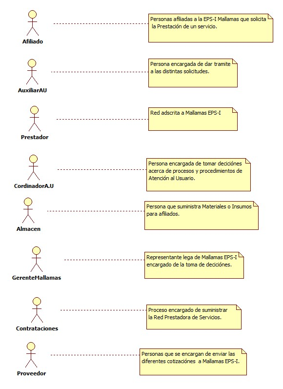
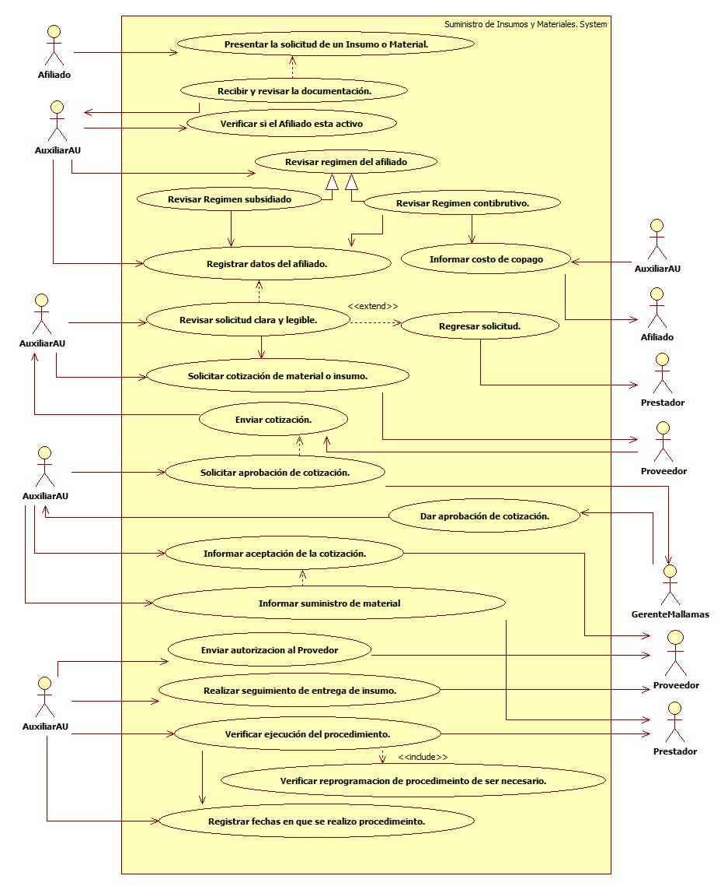

 # SISTEMA DE INFORMACIÓN SUMINISTRO DE INSUMOS Y MATERIALES.

Gestionar de manera oportuna el suministro de materiales e insumos necesarios en los procedimientos quirurgicos programados por la red de salud contratada para la efectiva intervención y mejora de la calidad de vida de nuestros afiliados.

## 1. MODELADO DEL SISTEMA DE INFORMACIÓN

### 1.1 ACTORES SUMINISTRO DE INSUMOS Y MATERIALES.

### 1.2 IDENTIFICACIÓN DE LOS CASOS DE USO SUMINISTRO DE INSUMOS Y MATERIALES.

| Número | Procesos del Sistema de Información |
| ------ | ----------------------------------- |
| 1      | Presentar la solicitud de el Insumo o Material.             |
| 2      | Recibir y revisar la documentación.           |
| 3 | Verificar si el afiliado esta activo. |
| 4 | Revisar régimen del afiliado. |
| 5 | Revisar régimen subsidiado |
| 6 | Revisar régimen contributivo. |
| 7 | Informar costo de copago al afiliado. |
| 8 | Registrar datos del afiliado. |
| 9 | Revisar solicitud clara y legible.
| 10 | Regresar solicitud para posibles correcciones. |
| 11 | Solicitar cotización de Material |
| 12 | Enviar cotización de Material. |
| 13 | Solicitar aprobación de cotización |
| 14 | Dar aprobación de cotización.|
| 15 | Informar aprobación de cotización.|
| 16 | Informar suministro de material. |
| 17 | Enviar autorización al proveedor.|
| 18 | Realizar seguimiento de entrega de insumo.|
| 19 | Verificar ejecución del procedimiento. |
| 20 | Verificar reprogramación de procedimiento de ser necesario. |
| 21 | Registrar fecha en que se realiza procedimiento. |

### 1.3 DESCRIPCIÓN DEL DIAGRAMA DE CASOS DE USO SUMINISTRO DE INSUMOS Y MATERIALES.

| **1. Caso de Uso** | Suministro de insumos y materiales. |
| - | - |
| **2. Descripción** | Realizar la entrega del material para los procedimientos quirurgicos programados a los afiliados a Mallamas EPS-I |
| **3. Actor(es)**   | Afiliado, Auxiliar de Atención al Usuario, Prestadores, Coordinador de Atención al Usuario, Almacén, Contrataciones, Proveedor y Gerente.  |
| **4. Pre Condiciones** | Contar con la solicitud de el material quirurgico. |
| **5. Pos Condiciones** | Entregar Material quirurgico para procedimiento necesario.|
| **6. Flujo de Eventos** |
| *Actor(es)* | *Sistema* |
| 1. El Afilido presenta la solicitud de el Material o Insumo.|  |
| 2. El Auxiliar de Atención al Usuario recibe y revisa la documentación.  | 3. El Auxiliar de Atención al Usuario verifica si el afiliado esta activo. | 
| 4. El Auxiliar de Atención al Usuario Revisar Régimen del afiliado **RÉGIMEN CONTIBUTIVO.** |   |
| 4.1  El Auxiliar de Atención al Usuario informa el costo del copago al afiliado. |  |
| 5.El Auxiliar de Atención al Usuario Revisar Régimen del afiliado **RÉGIMEN SUBSIDIADO.** |  |
| 6.El Auxiliar de Atención al Usuario  Registrar en base de datos la solicitud del afilaido. |  |
| 7. El Auxiliar de Atención al Usuario revisa que la solicitud este clara y legible. |  |
| 8. El Auxiliar de Atención al Usuario regresa la solicitud para posibles correcciónes de ser necesario.  |  |
| 9. El Auxiliar de Atención al Usuario solicita la cotización al Proveedor del Insumo o Material. | |
| 10. El Proveedor envia cotización solicitada. | |
| 11.. El Auxiliar de Atención al Usuario solicita solicita el visto bueno a gerencia de la cotización. |  |
| 12.. Gerencia da la aprobación de las cotizaciones presentadas e informa atención al Usuario. | |
| 13.  El Auxiliar de Atención al Usuario informa de la entrega del Material al Prestador.| |
| 14. El Auxiliar de Atención al Usuario envia autorización al proveedor para el envió del Material. | |
| 15. El Auxiliar de Atención al Usuario realiza seguimiento a la entrega del insumo que debe realizar el Proveedor a el Presatdor. | |
| 16. El Auxiliar de Atención al Usuario verifica reprogramación de procedimiento de ser necesario. | |
| 17. El Auxiliar de Atención al Usuario registra la fecha en que se realizo el procedimiento al afiliado. | |
| **7. Requerimiento Asociado** | R001, R002, R003, R004. |
| **8. Interfaz de Usuario Asociada** | I001,I002. |
| **9. Formato de Usuario Asociado** | F001. |

### 1.4 MODELADO VISUAL DEL CASO DE USO SUMINISTRO DE INSUMOS Y MATERIALES.

## 2. ESPECIFICACIÓN DEL SISTEMA DE INFORMACIÓN SUMINISTRO DE INSUMOS Y MATERIALES.

| Término | Descripción |
| ------- | ----------- |
| Copago | es un concepto que se utiliza en el ámbito de la medicina privada para definir la diferencia que existe entre el precio de un servicio y el valor del mismo que cubre un plan de salud.          |
| Cotización | Solicitar el costo real de algo.               |
| Reprogramación | Acción de reformular los programas mediante la verificación y análisis del proceso de programación que permite la selección adecuada y oportuna de las medidas correctivas |

## 3. ESPECIFICACIÓN DE REQUERIMIENTOS

| **N°** | **Tipo** | **Descripción** |
| - | - | - |
| R001 | Físico | Formula Medica. |
| R002 | Proceso | Red prestadora. |
| R003 | Físico | Cotización. |
| R004 | Proceso | Solicitud de base de datos. |

## 4. ESPECIFICACIÓN DE LA INTERFACE DE USUARIO

| **1. Número** |
| - |
| I001 |
| **2. Propósito de la Interfaz** |
| Consulta de afiliado |
| **3. Gráfica de la Interfaz**|
|  |
| **1. Número** |
| I002 |
| **2. Propósito de la Interfaz** |
| Generar Autorización |
| **3. Gráfica de la Interfaz**|
|  |

### 4.1 IDENTIFICACIÓN DE PERFILES Y DIÁLOGOS

| **1. Nombre del Perfil** |
| - |
| Auxiliar de Atención |
| **2. Opciones a las que tiene Acceso**|
| Consultar Afiliado,Nueva autorización y Cosultar Autorizaciones|
| **3. Tipo de Acceso** |
| Ingresa, Consultar, Anular, Registar e imprimir. |

### 4.2 ESPECIFICACIÓN DE FORMATOS DE USUARIO

| Número | Nombre del Formato |
| ------ | ----------------------------------- |
| F001   | Anexo cuatro.             |
