# SISTEMA DE INFORMACIÓN TECNOLOGÍA NO POS SUBSIDIADO

Garantizar la prestación de servicios de manera oportuna a través de la realización de autorizaciones en los tiempos establecidos para los servicios No POS Subsidiado

## 1. MODELADO DEL SISTEMA DE INFORMACIÓN

### 1.1 ACTORES TECNOLOGÍA NO POS SUBSIDIADO

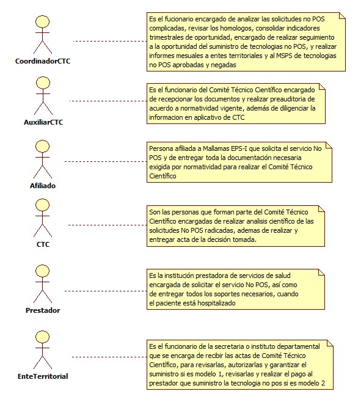

### 1.2 IDENTIFICACIÓN DE LOS CASOS DE USO TECNOLOGÍA NO POS SUBSIDIADO

| Número | Procesos del Sistema de Información |
| ------ | ----------------------------------- |
| 1      | Entregar Solicitud              |
| 2      | Recepcionar solicitud           |
| 3      | Verificar base de datos              |
| 4      | Devolver solicitud              |
| 5      | Verificar documentos              |
| 6      | Devolver para corrección              |
| 7      | Imprimir documentos              |
| 8      | Revisar lista chequeo en aplicativo              |
| 9      | Radicar tecnología No POs              |
| 10     | Ingresar a Modulo CTC              |
| 11     | Analizar No POS              |
| 12     | Generar acta              |
| 13     | Informar decisión usuario              |
| 14     | Verificar modelo 1              |
| 15     | Verificar modelo 2              |
| 16     | Enviar respuesta              |
| 17     | Recepcionar respuesta              |
| 18     | Analizar y enviar devolución              |
| 19     | Corregir y enviar              |
| 20     | Informar quien asume el suministro              |
| 21     | Ingresar información módulo CTC              |
| 22     | Verificar si es procedimiento o medicamento              |
| 23     | Informar fecha cita o entrega med             |
| 24     | Realizar seguimiento de oportunidad              |
| 25     | Reportar a ET o MSPS              |

### 1.3 DESCRIPCIÓN DEL DIAGRAMA DE CASOS DE USO TECNOLOGÍA NO POS SUBSIDIADO

| **1. Caso de Uso** | Tecnología No Pos Subsidiado |
| - | - |
| **2. Descripción** | Realizar el trámite y la entrega oportuna de las Tecnologías sin cobertura en el Plan Obligatorio de Salud, previo análisis de la pertinencia de las mismas, a los usuarios Régimen Subsidiado |
| **3. Actor(es)**   | Coordinador CTC, Auxiliar CTC, Afiliado, CTC, Prestadores y Ente Territorial|
| **4. Pre Condiciones** | Solicitud No POS  |
| **5. Pos Condiciones** | Informe de seguimiento|
| **6. Flujo de Eventos** |
| *Actor(es)* | *Sistema* |
| 1. El afiliado realiza la solicitud No POS | 2. El prestador enviá por correo electrónico la solicitud No POS |
| 3. El auxiliar de CTC recepciona las solicitudes del afiliado y del prestador | 4. Verifica si el afiliado esta activo en base de datos de afiliados |
| 5. El auxiliar de CTC devuelve al afiliado los soportes por no estar afiliado | 6. Devuelve el correo electrónico al prestador informando el motivo|
| 7. El auxiliar de CTC verifica si los documentos de solicitud estén completos |  |
| 8. El auxiliar de CTC devuelve al afiliado y solicita corrección| 9. Informa por correo electrónico al prestador para que realice la corrección |
| 10. El auxiliar de CTC imprime los documentos enviados por el prestador | 11. Radica la tecnología No Pos en el modulo de CTC (ver I001, I002, I003) |
|  | 12. Diligenciar lista de chequeo del modulo CTC (Ver I004) |
|  | 13. Realizar encabezado de acta CTC (ver I005, I006) |
|  | 14. Diligencia los campos requerido en el acta de CTC de acuerdo a los soportes (ver I007) |
| 15. El CTC analizá los soportes | 16. Diligencia datos científicos en el formato de acta (ver I007, I008) |
|  | 17. Genera Acta CTC |
|  | 18. Imprime acta (ver I009) |
| 19. El CTC firma y entrega acta al auxiliar CTC |  |
| 20. El auxiliar CTC informa decisión al usuario |  |
| 21. El auxiliar CTC verifica si es modelo 1  |  |
| 22. El auxiliar CTC enviá al ente territorial el acta y soportes cuando es modelo 1 |  |
| 23. El Ente territorial enviá respuesta |  |
| 24. El auxiliar CTC verifica la respuesta del ente territorial, si es negada informa a CTC para la corrección |  |
| 25. El CTC recibe y verifica lo manifestado por el ente territorial | 26. Corrige, genera e imprime acta |
| 27. El auxiliar CTC verifica que fue aceptada se informa al afiliado quien asume el procedimiento o entrega de medicamentos |  |
| 28. El auxiliar CTC verifica si es modelo 2 |  |
| 29. El auxiliar CTC verifica si es procedimiento o medicamento | 30. Ingresa al modulo CTC (ver I001) |
| 31. El auxiliar CTC busca en la red contratada cita si es procedimiento o informa para que disponga del medicamento |  |
| 32. El auxiliar CTC llama al afiliado y confirma fecha de cita y/o fecha suministro medicamento | 33. Se registra en modulo la fecha de cita y/o fecha de suministro de medicamento  |
| 34. El Coordinador CTC realiza seguimiento a la oportunidad en la entrega de medicamentos y a la fecha de cita | 35. Elabora informe de seguimiento |
|  | 36. Reporta a ente territorial los medicamentos y procedimientos aprobados |
|  | 37. Reporta al Ministerio de Salud y Protección Social los medicamentos o procedimientos negados  |
| **7. Requerimiento Asociado** | R001, R002,  |
| **8. Interfaz de Usuario Asociada** | I001, I002, I003, I004, I005, I006, I007, I008, I009, I010, I011 |
| **9. Formato de Usuario Asociado** |  |

### 1.4 MODELADO VISUAL DEL CASO DE USO TECNOLOGÍA NO POS SUBSIDIADO

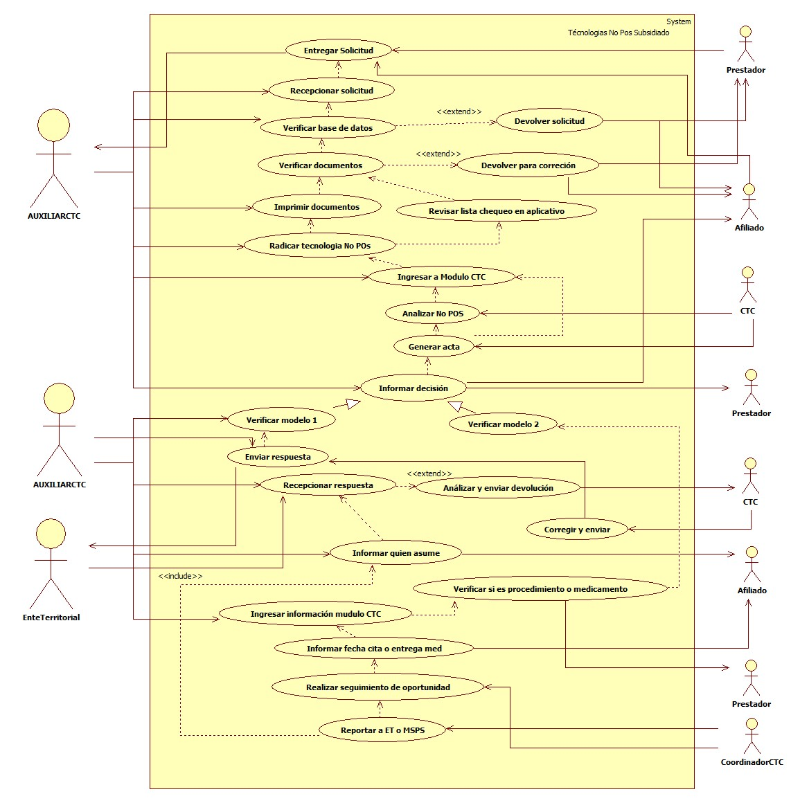

## 2. ESPECIFICACIÓN DEL SISTEMA DE INFORMACIÓN TECNOLOGÍA NO POS SUBSIDIADO

| Término | Descripción |
| ------- | ----------- |
| CTC | Comité Técnico Científico               |
| MSPS | Ministerio de Salud y Protección Social       |
| Med. | Medicamentos               |
| ET | Ente Territorial              |
| No POS | No cubierto en el Plan Obligatorio de Salud             |

## 3. ESPECIFICACIÓN DE REQUERIMIENTOS

| **N°** | **Tipo** | **Descripción** |
| - | - | - |
| R001 | Proceso | Base de datos de afiliados |
| R002 | Proceso | Solicitudes No POS |

## 4. ESPECIFICACIÓN DE LA INTERFACE DE USUARIO

| **1. Número** |
| - |
| I001 |
| **2. Propósito de la Interfaz** |
| Mostrar las opciones del modulo CTC |
| **3. Gráfica de la Interfaz**|
| 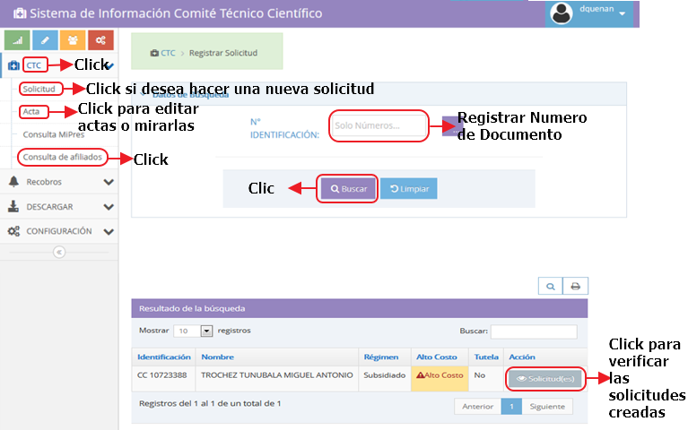 |

| **1. Número** |
| - |
| I002 |
| **2. Propósito de la Interfaz** |
| Mostrar ediciones de un acta |
| **3. Gráfica de la Interfaz**|
| 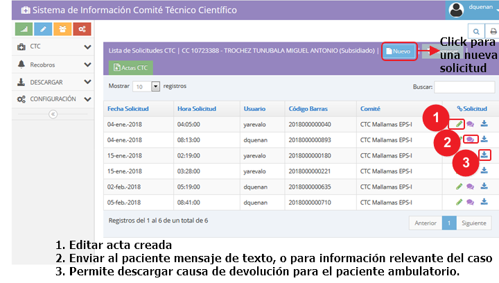 |

| **1. Número** |
| - |
| I003 |
| **2. Propósito de la Interfaz** |
| Crear un acta nueva CTC |
| **3. Gráfica de la Interfaz**|
| 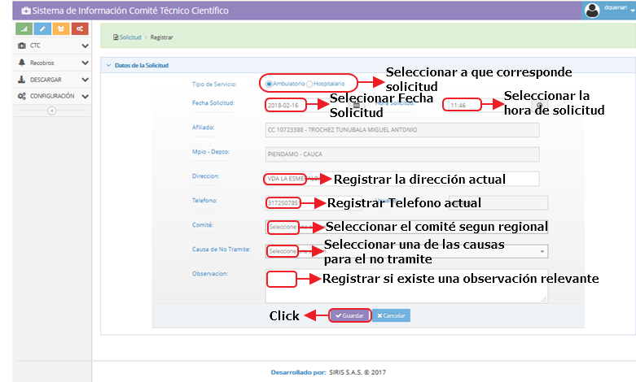 |

| **1. Número** |
| - |
| I004 |
| **2. Propósito de la Interfaz** |
| Mostrar lista de chequeo |
| **3. Gráfica de la Interfaz**|
|  |

| **1. Número** |
| - |
| I005 |
| **2. Propósito de la Interfaz** |
| Mostrar opciones para editar encabezado de acta |
| **3. Gráfica de la Interfaz**|
| 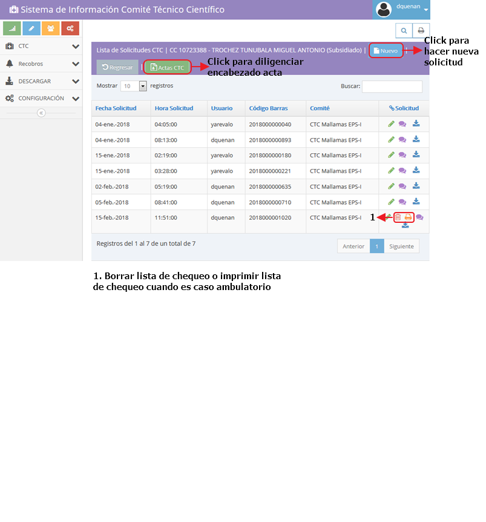 |

| **1. Número** |
| - |
| I006 |
| **2. Propósito de la Interfaz** |
| Mostrar opciones para editar, eliminar acta |
| **3. Gráfica de la Interfaz**|
| 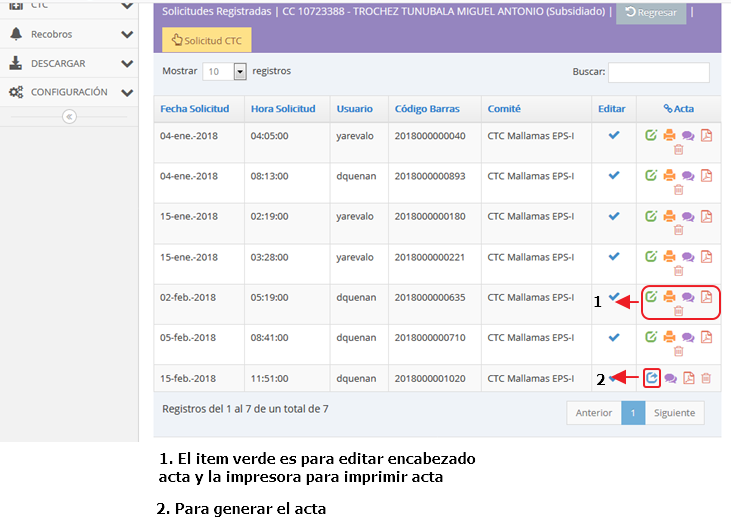 |

| **1. Número** |
| - |
| I007 |
| **2. Propósito de la Interfaz** |
| Mostrar hasta donde diligencia el auxiliar el acta CTC |
| **3. Gráfica de la Interfaz**|
| 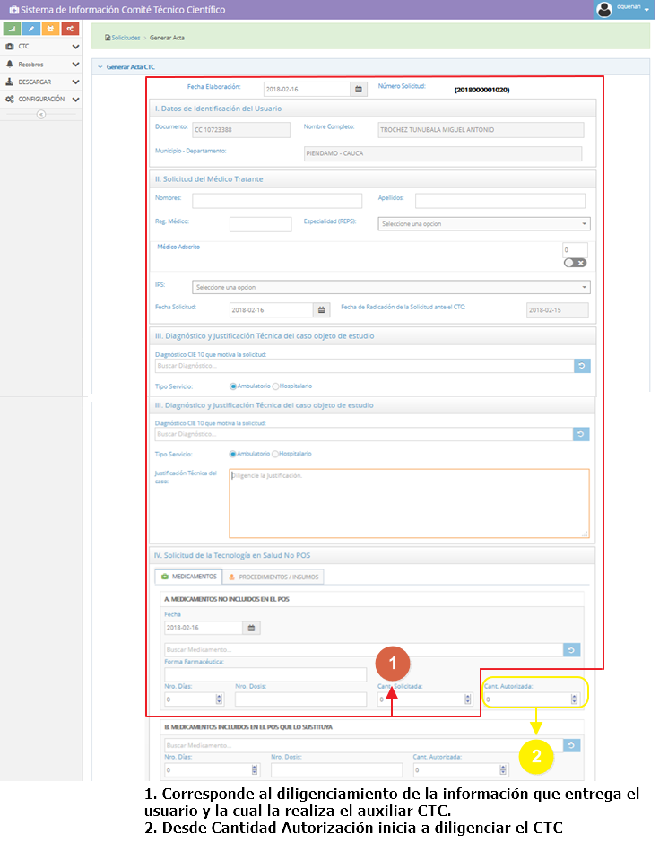 |

| **1. Número** |
| - |
| I008 |
| **2. Propósito de la Interfaz** |
| Mostrar las partes del acta que diligencia el acta el CTC |
| **3. Gráfica de la Interfaz**|
| 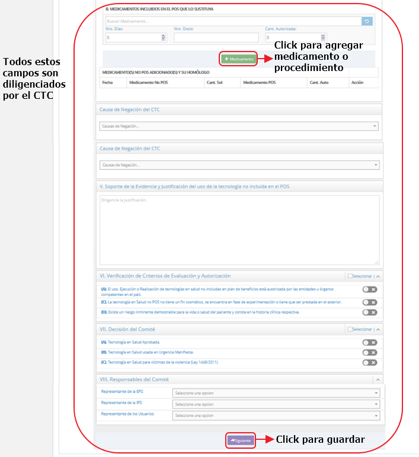 |

| **1. Número** |
| - |
| I009 |
| **2. Propósito de la Interfaz** |
| Mostrar las opciones de edición, imprimir, eliminar acta CTC |
| **3. Gráfica de la Interfaz**|
| 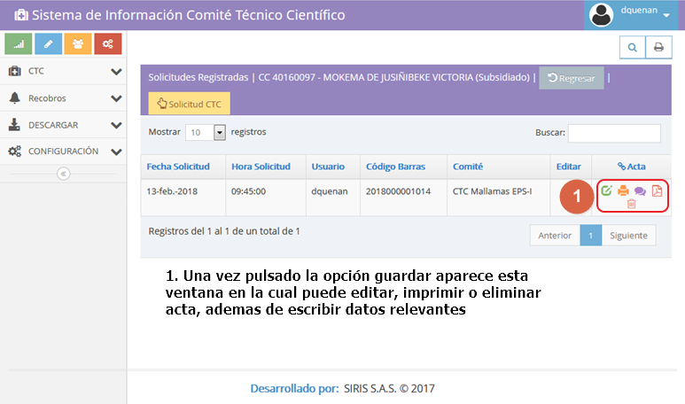 |

| **1. Número** |
| - |
| I010 |
| **2. Propósito de la Interfaz** |
| Mostrar las opciones de digitalizar y subir acta y soportes |
| **3. Gráfica de la Interfaz**|
| 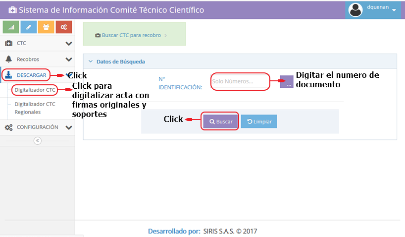 |

| **1. Número** |
| - |
| I011 |
| **2. Propósito de la Interfaz** |
| Mostrar las opciones de configuración del sistema |
| **3. Gráfica de la Interfaz**|
| 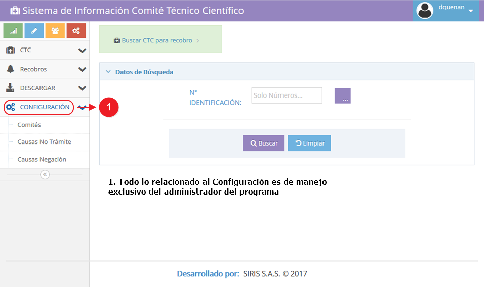 |

### 4.1 IDENTIFICACIÓN DE PERFILES Y DIÁLOGOS

| **1. Nombre del Perfil** |
| - |
| Auxiliar y Coordinador CTC |
| **2. Opciones a las que tiene Acceso**|
| Nueva solicitud |
| **3. Tipo de Acceso** |
| Consultar, anular, crear |

| **1. Nombre del Perfil** |
| - |
|  CTC |
| **2. Opciones a las que tiene Acceso**|
| Diligenciar acta |
| **3. Tipo de Acceso** |
| Consultar, anular |

### 4.2 ESPECIFICACIÓN DE FORMATOS DE USUARIO

| Número | Nombre del Formato |
| ------ | ----------------------------------- |
|  |             |
