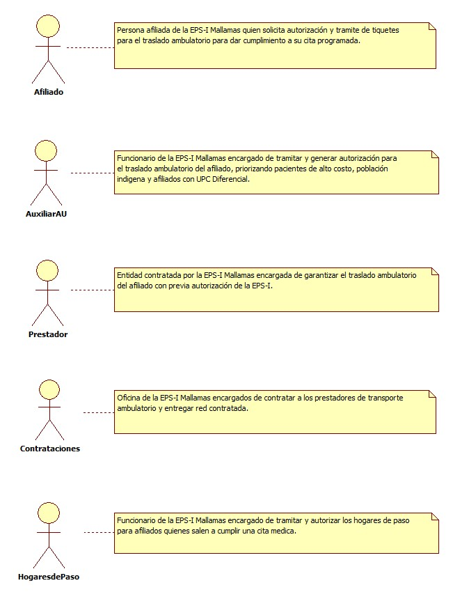
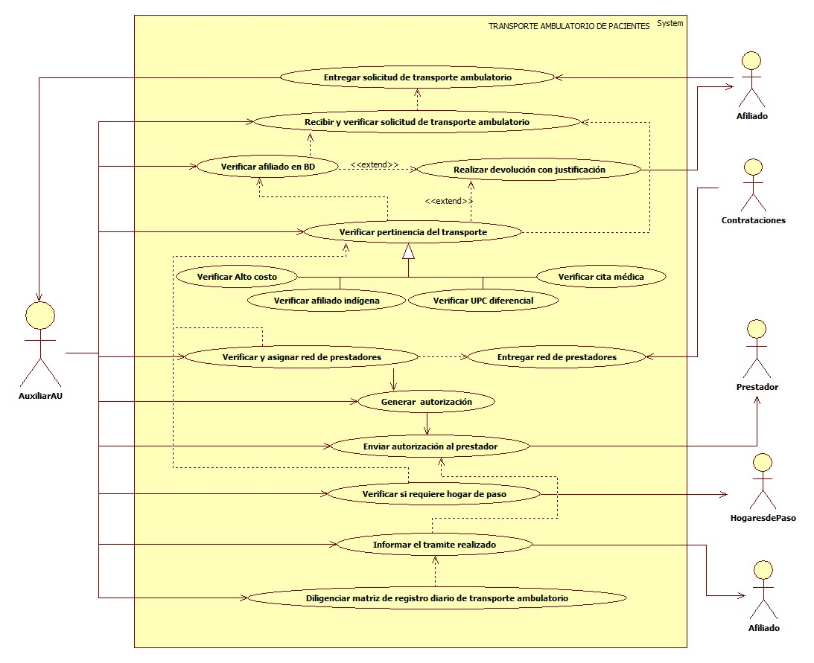

# SISTEMA DE INFORMACIÓN TRANSPORTE AMBULATORIO DE PACIENTES.

Garantizar de manera oportuna a las afiliados de la EPS-I Mallamas el servicio de transporte ambulatorio con base en la normatividad vigente y de acuerdo a los casos que amerite.

## 1. MODELADO DEL SISTEMA DE INFORMACIÓN

### 1.1 ACTORES TRANSPORTE AMBULATORIO DE PACIENTES

### 1.2 IDENTIFICACIÓN DE LOS CASOS DE USO TRANSPORTE AMBULATORIO DE PACIENTES.

| Número | Procesos del Sistema de Información                              |
| ------ | ---------------------------------------------------------------- |
| 1      | Entregar solicitud de transporte ambulatorio.                    |
| 2      | Recibir y verificar solicitud de transporte ambulatorio.         |
| 3      | Verificar afiliado en base de datos.                             |
| 4      | Realizar devolución con justificación.                           |
| 5      | Verificar pertinencia del traslado.                              |
| 6      | Verificar alto costo.                                            |
| 7      | Verificar afiliado indígena.                                     |
| 8      | Verificar UPC diferencial.                                       |
| 9      | Verificar cita médica.                                           |
| 10     | Entregar red de prestadores.                                     |
| 11     | Verificar y asignar red de prestadores.                          |
| 12     | Generar autorización.                                            |
| 13     | Enviar autorización al prestador.                                |
| 14     | Verificar si requiere hogar de paso.                             |
| 15     | Informar el tramite realizado.                                   |
| 16     | Diligenciar matriz de registro diario de transporte ambulatorio. |

### 1.3 DESCRIPCIÓN DEL DIAGRAMA DE CASOS DE USO TRANSPORTE AMBULATORIO DE PACIENTES.

| **1. Caso de Uso** | Transporte Ambulatorio de Pacientes. |
| - | - |
| **2. Descripción** | Garantizar de manera oportuna a las afiliados de la EPS-I Mallamas el servicio de transporte ambulatorio con base en la normatividad vigente y de acuerdo a los casos que amerite. |
| **3. Actor(es)**   | Afiliado, Auxiliar AU, Prestador, Contrataciones y Hogares de paso. |
| **4. Pre Condiciones** | Contar con red contratada, contar con base de datos de afiliados, contar con documentación y contar con normatividad vigente. |
| **5. Pos Condiciones** | Tramitar y autorizar transporte ambulatorio de afiliados.|
| **6. Flujo de Eventos** |
| *Actor(es)* | *Sistema* |
| 1. El afiliado entrega documentos para la solicitud de transporte ambulatorio. |  |
| 2. El Auxiliar AU recibe y verifica solicitud de transporte para afiliados ambulatorios priorizando a pacientes de alto costo, menores de 18 años, adulto mayor de 60 años y gestantes. |  |
| 3. El Auxiliar de AU verifica afiliado en base de datos. | 4. EL sistema muestra estado de afiliación. |
| 5. El Auxiliar de AU realiza la devolución de documentos en caso de que el afiliado no registre en base de datos.|
| 6. El Auxiliar AU verifica pertinencia de la solicitud (paciente de alto costo, afiliado indígena, si cuenta con UPC diferencial y si el afiliado cuenta con cita medica asignada).  | |
| 7. El Auxiliar AU realiza devolución  de documentacion con formato de negación de servicios en caso de verificar no pertinencia de autorizar el transporte.  | |
| 8. El Auxiliar AU inicia sesión en sistema y genera autorización de transporte justificando la ruta y fecha del traslado. | 9. El sistema muestra autorización.|
| 10. El Auxiliar AU envía autorización de transporte ambulatorio al prestador contratado. | |
| 11. El Auxiliar AU informa al afiliado el tramite realizado y el nombre del prestador quien realizara el transporte hasta el lugar de la cita programada. | |
| 12. El Auxiliar AU verifica si de acuerdo a solicitud presentada el afiliado requiere de hogar de paso. | |
| 13. El Auxiliar AU direcciona al afiliado o documentación hasta la oficina de hogares de paso de la EPS-I Mallamas para su tramite respectivo (ver caso de uso Hogares de paso). | |
| 14. EL Auxiliar AU diligencia matriz de registro diario de transporte de afiliados ambulatorios. | |
| **7. Requerimiento Asociado** | R001, R002 y R003. |
| **8. Interfaz de Usuario Asociada** | I001 y I002. |
| **9. Formato de Usuario Asociado** | F001. |

### 1.4 MODELADO VISUAL DEL CASO DE USO TRANSPORTE AMBULATORIO DE PACIENTES.

## 2. ESPECIFICACIÓN DEL SISTEMA DE INFORMACIÓN TRANSPORTE AMBULATORIO DE PACIENTES.

| Término            | Descripción             |
| ------------------ | ----------------------- |
| UPC | Unidad de pago por capitación. |
| BD  | Base de datos de afiliados. |

## 3. ESPECIFICACIÓN DE REQUERIMIENTOS

| **N°** | **Tipo** | **Descripción** |
| - | - | - |
| R001 | Proceso | Red prestadora |
| R002 | Proceso | Base de datos de afiliados. |
| R003 | Físico  | Documentos. |

## 4. ESPECIFICACIÓN DE LA INTERFACE DE USUARIO

| **1. Número** |
| - |
| I001 |
| **2. Propósito de la Interfaz** |
| Mostrar verificación del afiliado en base de datos. |
| **3. Gráfica de la Interfaz**|
|  |

| **1. Número** |
| - |
| I002 |
| **2. Propósito de la Interfaz** |
| Mostrar Autorización de transporte ambulatorio. |
| **3. Gráfica de la Interfaz**|
|  |

### 4.1 IDENTIFICACIÓN DE PERFILES Y DIÁLOGOS

| **1. Nombre del Perfil** |
| - |
| Auxiliar del sistema de autorización de transporte ambulatorio. |
| **2. Opciones a las que tiene Acceso**|
| Nueva autorización y consultar autorización. |
| **3. Tipo de Acceso** |
| Ingresar, Consultar, Imprimir y Eliminar. |

### 4.2 ESPECIFICACIÓN DE FORMATOS DE USUARIO

| Número | Nombre del Formato   |
| ------ | -------------------- |
| F001   | Seguimiento traslado de pacientes. |