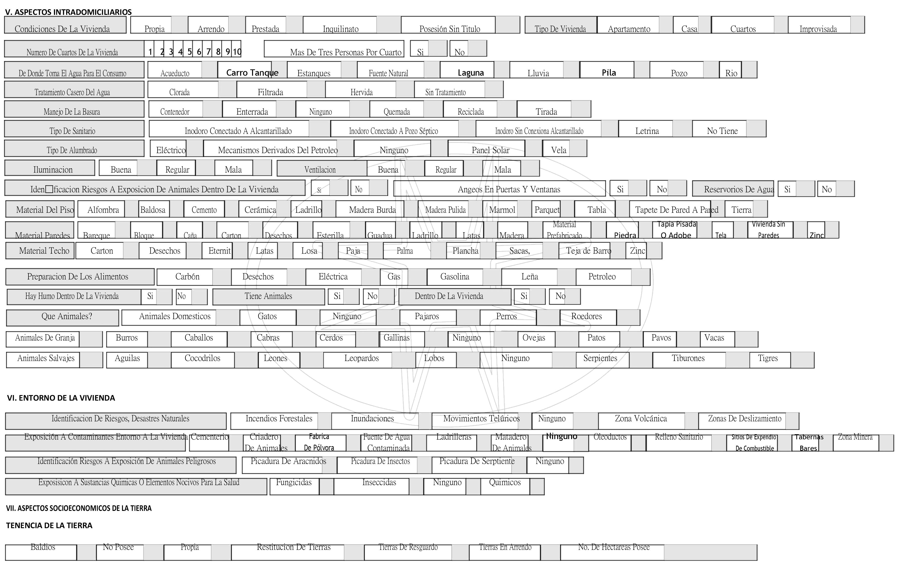

# CARACTERIZACION CON ENFOQUE DIFERENCIAL			

Sistema Propio de Información ficha de Identificación de los Factores Socioculturales y de Riesgo en Salud "IFASORIS".

## 1. MODELADO DEL SISTEMA DE INFORMACIÓN

### 1.1 ACTORES 

### 1.2 IDENTIFICACIÓN DE LOS CASOS DE USO

| N° | Procesos del Sistema de Información |
| ------ | ----------------------------------- |
| 1 |Identificar Prestadores Contratadas  |
| 2 |Realizar Cronograma para Capacitación |
| 3 |Entregar y Capacitar al Prestador Ficha IFASORIS |
| 4 |Control de usuarios |
| 5 |Seguimiento a los Prestadores  |
| 6 |Consolidar Información |
| 7 |Identificación de Riesgos Población Indigena|
| 8 |Identificar Estrategias|
| 9 |Ejecutar Estrategias a cada Prestador|
| 10 |Seguimiento Estrategias |
| 11 |Entregar Informe|
### 1.3 DESCRIPCIÓN DE LOS CASOS DE USO CARACTERIZACIÓN CON ENFOQUE DIFERENCIAL

| | |
| - | - |
| **1. Caso de Uso** | CARACTERIZACIÓN CON ENFOQUE DIFERENCIAL|
| **2. Descripción** | Identificar las condiciones Socioculturales y de salud de cada usuario al momento del ingreso a la EPS I MALLAMAS y los  factores de riesgos  en la Población Afiliada, para direccionar el acceso a los servicios de salud y mejorar la Calidad de Vida.|
| **3. Actor(es)**   | CoordinaciónAdecuaciónSocioCultural, Prestadores, Afiliado, Gerencia, Salud Publica |
| **4. Pre Condiciones** | Prestadores Contratados |
| **5. Pos Condiciones** | Evaluar el Nivel de satisfacción de la Prestación de Servicios de Salud por parte de los Prestadores Contratados a los Afiliados de Mallamas EPS-I |
| **6. Flujo de Eventos** ||
| *Actor(es)* | *Sistema* |
|1.CoordinaciónAdecuaciónSocioCultural, Identifica los Prestadores Contratados para la aplicación de la ficha IFASORIS. ||
| 2.CoordinaciónAdecuaciónSocioCultural, Realiza Cronograma de Capacitación del Instructivo de la Ficha IFASORIS.||
|3.CoordinaciónAdecuaciónSocioCultural, Entrega y Capacita a los Prestadores la Ficha IFASORIS suministrando el usuario y contraseña para acceso a la plataforma por cada Prestador. ||
|4.CoordinaciónAdecuaciónSocioCultural, Genera control de usuarios a tráves del Sistema.|5. Muestra Ventana para el Contro de Usuarios| 
|6.CoordinaciónAdecuaciónSocioCultural, Realiza seguimiento a las metas asignadas a cada Prestador en el Diligenciamiento de la Ficha.||
| |7. Consolida Información suministrada por los Prestadores de la Ficha IFASORIS|
| 8.CoordinaciónAdecuaciónSocioCultural, Realiza Identificaión de Riesgos en la Salud  de la Población Indigena Focalizada | 9.Identifica estrategias deacuerdo a riesgos por reguardo Indigena.|
|10.CoordinaciónAdecuaciónSocioCultural, Ejecuta estrategias a travez de planes de acción en cada Prestador.||
|11.CoordinaciónAdecuaciónSocioCultural, Realiza Seguimiento a las estrategias asignadas a cada prestador desde el Enfoque Diferencial.|12. Se Genera Informe de Enfoque Diferencial en Excel
|13.CoordinaciónAdecuaciónSocioCultural, Entrega Informe Final de las Actividades con Enfoque Diferencial a Salud Pública y Gerencia.||
| **7. Requerimiento Asociado** | R001 |
| **8. Interfaz de Usuario Asociada** | I001, I002|

### 1.4 MODELADO VISUAL DE LOS CASOS DE USO CARACTERIZACIÓN CON ENFOQUE DIFERENCIAL

## 2. ESPECIFICACIÓN DEL SISTEMA DE INFORMACIÓN

| Término | Descripción |
| ------- | ----------- |
| BD | Base de datos  |
| IFASORIS |Identificación de los Factores Socioculturales y del Riesgo en Salud |

## 3. ESPECIFICACIÓN DE REQUERIMIENTOS

| | | |
| - | - | - |
| **N°** | **Tipo** | **Descripción** |
| R001 | Físico | Ficha IFASORIS |
## 4. ESPECIFICACIÓN DE LA INTERFACE DE USUARIO

| |
| - |
| **1. Número** |
| I001 |
| **2. Propósito de la Interfaz** |
| Mostrar Módulo del Sistema|
| **3. Gráfica de la Interfaz**|
| |
| 

| |
|-|
| **1. Número** |
| I002 |
| **2. Propósito de la Interfaz** |
| Ficha IFASORIS|
| **3. Gráfica de la Interfaz**|
| 
| 
|  
| 
| 

### 4.1 IDENTIFICACIÓN DE PERFILES Y DIÁLOGOS

| |
| - |
| **1. Nombre del Perfil** |
| CoordinadorAdecuaciónSocioCultural|
| **2. Opciones a las que tiene Acceso**|
| Familia, Ficha, Soporte Ficha, Descargar|
| **3. Tipo de Acceso** |
| Ingresar, Descargar, Imprimir |