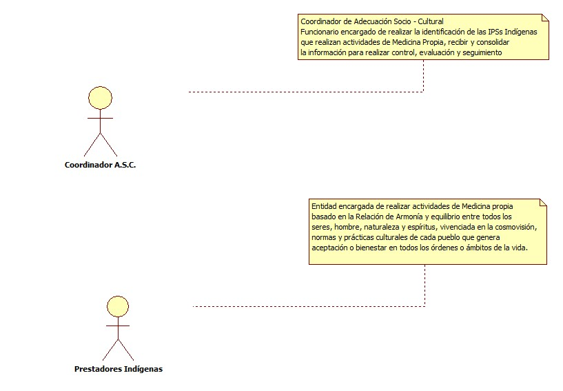
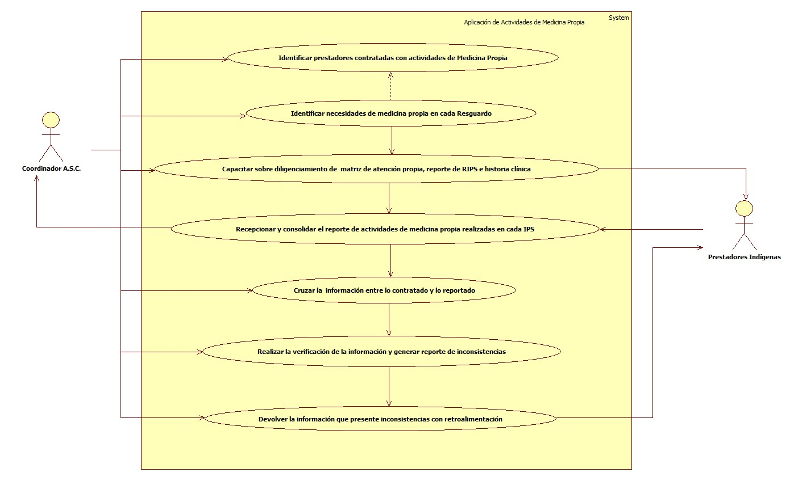

# SISTEMA DE INFORMACIÓN  APLICACIÓN ACTIVIDADES DE MEDICINA PROPIA

Sistema de información encargado de  Recibir, consolidar y verificar oportunamente las diferentes Actividades reportadas por las IPS Indígenas por concepto de aplicación de procedimientos de medicina Propia a afiliados de la E.P.S-I MALLAMAS, basado en la Relación de Armonía y equilibrio entre todos los seres, hombre, naturaleza y espíritus, vivenciada en la cosmovisión, normas y prácticas culturales de cada pueblo.
## 1. MODELADO DEL SISTEMA DE INFORMACIÓN

### 1.1 ACTORES APLICACIÓN APLICACIÓN ACTIVIDADES DE MEDICINA PROPIA

### 1.2 IDENTIFICACIÓN DE LOS CASOS DE USO APLICACIÓN ACTIVIDADES DE MEDICINA PROPIA
| Número | Procesos del Sistema Aplicación de actividades de Medicina propia
| ------ | ----------------------------------- |
| 1  | Identificar las IPS´s contratadas con actividades de medicina propia     |
| 2  | Identificar necesidades de medicina propia en cada Resguardo|
| 3  | Capacitar a IPSs sobre diligenciamiento de  matriz de atención propia, reporte de RIPS e historia clínica |
| 4  | Recepcionar y consolidar el reporte de actividades de medicina propia realizadas en cada IPS |
| 5  | Cruzar la  información entre lo contratado y lo reportado |
| 6  | Realizar la verificación de la información y generar reporte de inconsistencias |
| 7  | Devolver la información que presente inconsistencias con retroalimentación a la IPS Indígena |

### 1.3 DESCRIPCIÓN DEL DIAGRAMA DE CASOS DE USO APLICACIÓN ACTIVIDADES MEDICINA PROPIA

| | | 
| - | - |
| **1. Caso de Uso** | Aplicación de Actividades de Medicina Propia|
| **2. Descripción** |Recibir, consolidar y verificar oportunamente las diferentes Actividades reportadas por los IPSs Indígenas por concepto de aplicación de procedimientos de medicina Propia a afiliados de la E.P.S-I MALLAMAS |
| **3. Actor(es)**| Coordinador de Adecuación Socio - Cultural,prestadores Indígenas|
| **4. Pre Condiciones** |Pertenecer a la población Indígena|
| **5. Pos Condiciones** | Actividades de medicina propia realizadas y consolidadas en la base Empresarial|
| **6. Flujo de Eventos** |
| *Actor(es)* | *Sistema* |
|1 . El Coordinador de Adecuación Socio - Cultural identifica las IPS´s contratadas con actividades de medicina propia|   |
|2. El Coordinador de Adecuación Socio - Cultural identifica necesidades de medicina propia en cada resguardo|  |
|3. El Coordinador de Adecuación Socio - Cultural realiza capacitación a IPS sobre diligenciamiento de la matriz de atención propia, reporte de RIPS e historia  clínica de medicina propia|  |
|4. El Coordinador de Adecuación Socio - Cultural Recibe y hace la  consolidación del reporte de actividades de medicina propia realizadas en cada IPS|  | 
|5. El Coordinador de Adecuación Socio - Cultural realiza el cruce de información entre lo contratado y lo reportado|   |
|6. El Coordinador de Adecuación Socio - Cultural Realiza la verificación de la información y generar reporte de inconsistencias|   |
|7. El Coordinador de Adecuación Socio - Cultural Devuelve la información que presente inconsistencias  con retroalimentación a la IPS Indígena|    |
|8. El Coordinador de Adecuación Socio - Cultural realiza Informe con estrategias de fortalecimiento de Medicina Propia|   |
| **7. Requerimiento Asociado** | R001 |
|**8. Interfaz de Usuario Asociada** | Ninguno   |
|**9. Formato de Usuario Asociado** | F001 |

### 1.4 MODELADO VISUAL DE LOS CASOS DE USO

## 2. ESPECIFICACIÓN DEL SISTEMA DE INFORMACIÓN

| Término | Descripción |
| ------- | ----------- |
|Medicina Propia|ES un sistema médico de salud y como tal, tiene su propia manera de determinar las enfermedades, de elegir sus propios métodos  y  medios  de  curación,  tanto  físicos  como  espirituales,  que  tienen  como fundamento la experiencia hereditaria, transmitida verbalmente o por escrito de una generación a otra.       |
|RIPS     |Registro Individual de Prestación de Servicios de Salud          |
|Cosmovisión  |Es el conjunto de creencias, valores y sistemas de conocimiento que articulan la vida social de los grupos indígenas.                 |
|Historia Clínica |Es un documento privado, de tipo técnico, clínico, legal obligatorio y sometido a reserva, en el cual se registran cronológicamente las condiciones de salud del paciente, los actos médicos y los demás procedimientos ejecutados por el equipo de salud que interviene en su atención.                   |
|Coordinador A.S.C |Coordinador de Adecuación Socio - Cultural 
|IPS  |Institución Prestadora de Servicios de Salud|

## 3. ESPECIFICACIÓN DE REQUERIMIENTOS

| | | |
| - | - | - |
| **N°** | **Tipo** | **Descripción** |
|R001| físico |Registro de IPSs con contrato de medicina Propia|

## 4. ESPECIFICACIÓN DE LA INTERFACE DE USUARIO

| |
| - |
| **1. Número** |
| - |
| **2. Propósito de la Interfaz** |
| - |
| **3. Gráfica de la Interfaz**|
|  |

### 4.1 IDENTIFICACIÓN DE PERFILES Y DIÁLOGOS

| |
| - |
| **1. Nombre del Perfil** |
| Administrador sistema  Actividades de Medicina Propia |
| **2. Opciones a las que tiene Acceso**|
| Recibir información|
| **3. Tipo de Acceso** |
| Registrar, recibir, imprimir informes|

### 4.2 ESPECIFICACIÓN DE FORMATOS DE USUARIO 
| Número | Nombre del formato|
| ------ | ----------------------- |
| F001     |Matriz de Registros de Atención Propia    |