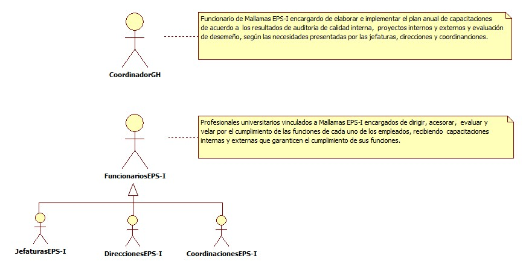
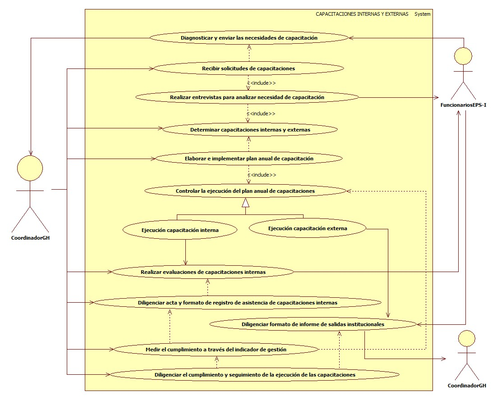

# SISTEMA DE INFORMACIÓN CAPACITACIONES INTERNAS Y EXTERNAS.

Lograr una formación eficaz del personal de la EPS-I Mallamas, que permite optimizar el desempeño laboral y personal permitiendo el incremento del potencial de la organización.

## 1. MODELADO DEL SISTEMA DE INFORMACIÓN

### 1.1 ACTORES CAPACITACIONES INTERNAS Y EXTERNAS

### 1.2 IDENTIFICACIÓN DE LOS CASOS DE USO CAPACITACIONES INTERNAS Y EXTERNAS.

| Número | Procesos del Sistema de Información |
| ------ | ----------------------------------- |
| 1      | Diagnosticar y enviar las necesidades de capacitación.   |
| 2      | Recibir solicitudes de capacitación.   |
| 3      | Realizar entrevistas para analizar necesidad de capacitación.  |
| 4      | Determinar capacitaciones internas y externas.   |
| 5      | Elaborar e implementar plan anual de capacitaciones.   |
| 6      | Controlar la ejecución del plan anual de capacitaciones.   |
| 7      | Ejecución capacitación interna.   |
| 8      | Ejecución capacitación externa.   |
| 9      | Realizar evaluaciones de capacitaciones internas.   |
| 10     | Diligenciar acta y formato de registro de asistencia de capacitación internas.   |
| 11     | Diligenciar formato de informe de salidas institucionales.   |
| 12     | Medir el cumplimiento a través del indicador de gestión.   |
| 13     | Diligenciar el cumplimiento y seguimiento de la ejecución de las capacitaciones.   |

### 1.3 DESCRIPCIÓN DEL DIAGRAMA DE CASOS DE USO CAPACITACIONES INTERNAS Y EXTERNAS

| **1. Caso de Uso** | Capacitaciones Internas y Externas. |
| - | - |
| **2. Descripción** | Lograr una formación eficaz del personal de la EPS-I Mallamas, que permite optimizar el desempeño laboral y personal permitiendo el incremento del potencial de la organización. |
| **3. Actor(es)**   | coordinador GH y Funcionarios EPS-I (Jefaturas, Direcciones y coordinaciones). |
| **4. Pre Condiciones** | Contar con disponibilidad de los funcionarios y contar con material informativo de capacitación. |
| **5. Pos Condiciones** | Capacitar a los funcionarios de la EPS-I Mallamas en temas de importancia que garantice el desarrollo de sus funciones.|
| **6. Flujo de Eventos** |
| *Actor(es)* | *Sistema* |
| 1. Los Jefes y Directores de cada área de la EPS-I Mallamas diagnostican la necesidad de capacitación. |  |
| 2. EL Coordinador GH Solicita y recepciona solicitudes, resultados de auditorias internas de calidad, proyectos internos y externos y resultados de evaluación de desempeño.  |  |
| 3. El Coordinador GH realiza entrevista con  jefaturas, direcciones y coordinaciones para analizar necesidad de capacitación. |  |
| 4. El Coordinador GH determina capacitaciones internas y externas. |  |
| 5. El Coordinador GH elabora el plan anual de capacitaciones. |  |
| 6. El Coordinador GH realiza implementación del plan anual de capacitaciones. |  |
| 7. El Coordinador GH controla la ejecución del plan anual de capacitaciones. |  |
| 8. El Coordinador GH realiza evaluación dependiendo de la capacitación realizada, la cual se realiza una vez terminada la capacitación o se evaluá en conjunto con otros temas. |  |
| 9. El Coordinador GH lleva control de la realización de las capacitaciones programadas y los recursos invertidos para su desarrollo. |  |
| 10. El Coordinador GH diligencia formato de asistencia. | |
| 11. El Coordinador GH diligencia acta de  capacitaciones especificando la información solicitada.  | |
| 12. En caso de recibir capacitaciones externas o invitaciones por parte de entes externos, el funcionario que asiste debe diligenciar el formato de informe de salidas institucionales. | |
| 13. El Coordinador GH realiza medición de cumplimiento a través del indicador de gestión.| |
| 14. El Coordinador GH diligencia el cumplimiento y seguimiento de la ejecución de las capacitaciones. | | 
| **7. Requerimiento Asociado** | R001 y R002. |
| **8. Interfaz de Usuario Asociada** |  |
| **9. Formato de Usuario Asociado** | F001, F002 y F003. |

### 1.4 MODELADO VISUAL DEL CASO DE USO CAPACITACIONES INTERNAS Y EXTERNAS.

## 2. ESPECIFICACIÓN DEL SISTEMA DE INFORMACIÓN CAPACITACIONES INTERNAS Y EXTERNAS.

| Término | Descripción |
| ------- | ----------- |
| Coordinador GH | Coordinador de gestión humana. |

## 3. ESPECIFICACIÓN DE REQUERIMIENTOS

| **N°** | **Tipo** | **Descripción** |
| - | - | - |
| R001 | Físico | Plan anual de capacitaciones. |
| R002 | Físico | Contratación de funcionarios. |

## 4. ESPECIFICACIÓN DE LA INTERFACE DE USUARIO

| **1. Número** |
| - |
|  |
| **2. Propósito de la Interfaz** |
|  |
| **3. Gráfica de la Interfaz**|
|  |

### 4.1 IDENTIFICACIÓN DE PERFILES Y DIÁLOGOS

| **1. Nombre del Perfil** |
| - |
|  |
| **2. Opciones a las que tiene Acceso**|
|  |
| **3. Tipo de Acceso** |
|  |

### 4.2 ESPECIFICACIÓN DE FORMATOS DE USUARIO

| Número | Nombre del Formato |
| ------ | ----------------------------------- |
| F001   | Plan anual de capacitación. |
| F002   | Formato de registro de asistencia.  |
| F003   | Acta de capacitación.        |