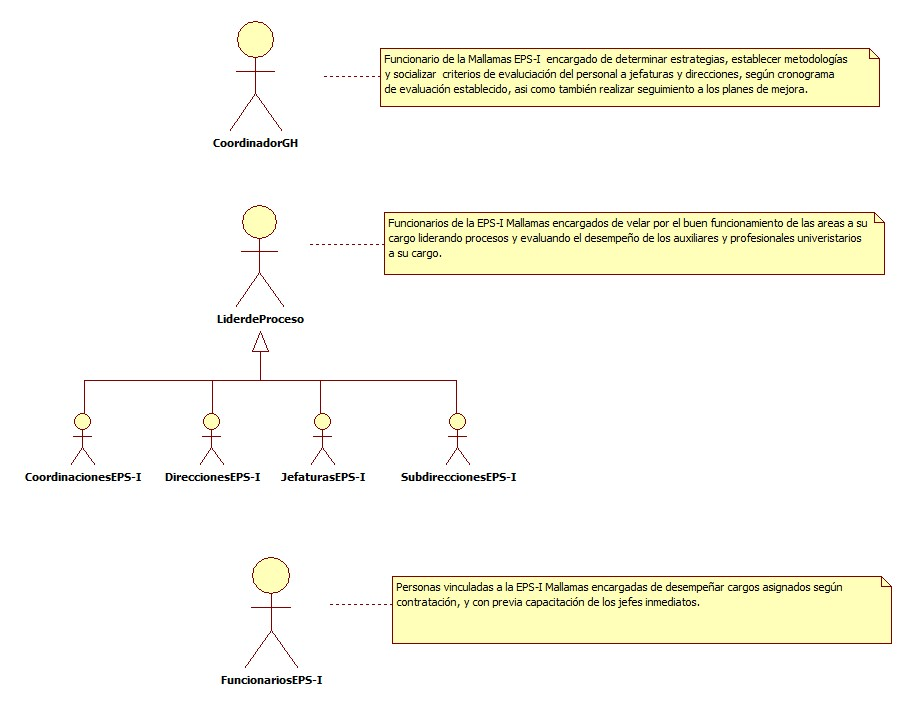
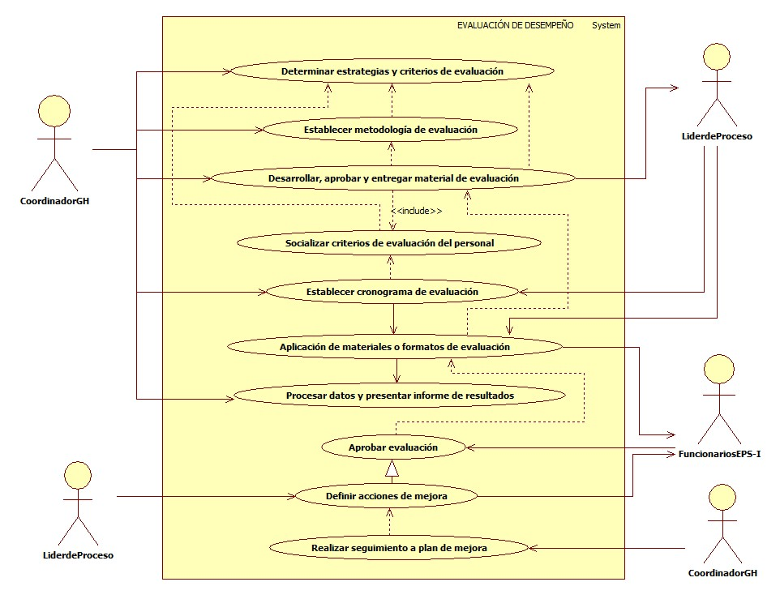

# SISTEMA DE INFORMACIÓN EVALUACIÓN DE DESEMPEÑO

Analizar el rendimiento y cumplimiento del personal de la EPS-I Mallamas a través de evaluaciones que nos permitan identificar, medir y tomar decisiones sobre el mejoramiento de su desempeño.

## 1. MODELADO DEL SISTEMA DE INFORMACIÓN

### 1.1 ACTORES EVALUACIÓN DE DESEMPEÑO

### 1.2 IDENTIFICACIÓN DE LOS CASOS DE USO EVALUACIÓN DE DESEMPEÑO

| Número | Procesos del Sistema de Información                     |
| ------ | ------------------------------------------------------- |
| 1      | Determinar estrategias y criterios de evaluación.        |
| 2      | Establecer metodología de evaluación.                   |
| 3      | Desarrollar, aprobar y entregar material de evaluación. |
| 4      | Socializar criterios de evaluación del personal.        |
| 5      | Establecer cronograma de evaluación.                    |
| 6      | Aplicación de materiales o formatos de evaluación.      |
| 7      | Procesar datos y presentar informe de resultados.       |
| 8      | Aprobar evaluación.                                     |
| 9      | Definir acciones de mejora.                             |
| 10     | Realizar seguimiento a plan de mejora.                  |

### 1.3 DESCRIPCIÓN DEL DIAGRAMA DE CASOS DE USO EVALUACIÓN DE DESEMPEÑO.

| **1. Caso de Uso** | Evaluación de desempeño. |
| - | - |
| **2. Descripción** | Analizar el rendimiento y cumplimiento del personal de la EPS-I Mallamas a través de evaluaciones que nos permitan identificar, medir y tomar decisiones sobre el mejoramiento de su desempeño. |
| **3. Actor(es)**   | Coordinador GH, Líder de proceso y Funcionarios. |
| **4. Pre Condiciones** | Contar con la contratación de personal capacitado para desempeñar un cargo. |
| **5. Pos Condiciones** | Evaluar las capacidades de los funcionarios según el cargo que desempeñan.|
| **6. Flujo de Eventos** |
| *Actor(es)* | *Sistema* |
| 1. El Coordinador GH determina estrategias y criterios de evaluación. |  |
| 2. El Coordinador GH establece metodologías de evaluación. |  |
| 3. El Coordinador GH desarrolla, aprueba y entrega material de evaluación. | |
| 4. El Líder del proceso (Jefaturas, direcciones, subdirecciones y coordinaciones) recibe materiales o formatos de evaluación. | |
| 5. El Coordinador GH socializa criterios de evaluación del personal a jefaturas y direcciones.  |  |
| 6. El Coordinador GH establece cronograma de evaluación  y da a conocer al líder de cada proceso.  |  |
| 7. El Líder del proceso realiza la aplicación de los materiales o formatos de evaluación a los funcionarios de cada área según corresponda. |  |
| 8. El Funcionario de cada área presenta la evaluación. |  |
| 9. El Coordinador GH realiza procesamiento de datos con base a las evaluaciones aplicadas. |  |
| 10. El Coordinador GH presenta informe de los resultados y solicita plan de mejora en caso de lo requiera.  |  |
| 11. El líder del proceso junto con el funcionario definen acciones de mejora, en caso de ser necesario.  | |
| 12. En el caso de presentarse un plan de mejora, el Coordinador GH realiza el  seguimiento pertinente.  | |
| **7. Requerimiento Asociado** | R001 y R002. |
| **8. Interfaz de Usuario Asociada** |  |
| **9. Formato de Usuario Asociado** | F001 y F002.|

### 1.4 MODELADO VISUAL DEL CASO DE USO EVALUACIÓN DE DESEMPEÑO.

## 2. ESPECIFICACIÓN DEL SISTEMA DE INFORMACIÓN EVALUACIÓN DE DESEMPEÑO.

| Término            | Descripción             |
| ------------------ | ----------------------- |
| Coordinador GH | Coordinador Gestión Humana. |

## 3. ESPECIFICACIÓN DE REQUERIMIENTOS

| **N°** | **Tipo** | **Descripción** |
| - | - | - |
| R001 | Físico | Formato de evaluación. |
| R002 | Físico | Cronograma de evaluación. |

## 4. ESPECIFICACIÓN DE LA INTERFACE DE USUARIO

| **1. Número** |
| - |
|  |
| **2. Propósito de la Interfaz** |
| |
| **3. Gráfica de la Interfaz**|
|  |

### 4.1 IDENTIFICACIÓN DE PERFILES Y DIÁLOGOS

| **1. Nombre del Perfil** |
| - |
|  |
| **2. Opciones a las que tiene Acceso**|
| |
| **3. Tipo de Acceso** |
|  |

### 4.2 ESPECIFICACIÓN DE FORMATOS DE USUARIO

| Número | Nombre del Formato   |
| ------ | -------------------- |
| F001   | Formato de Evaluación. |
| F002   | Cronograma de evaluación.  |