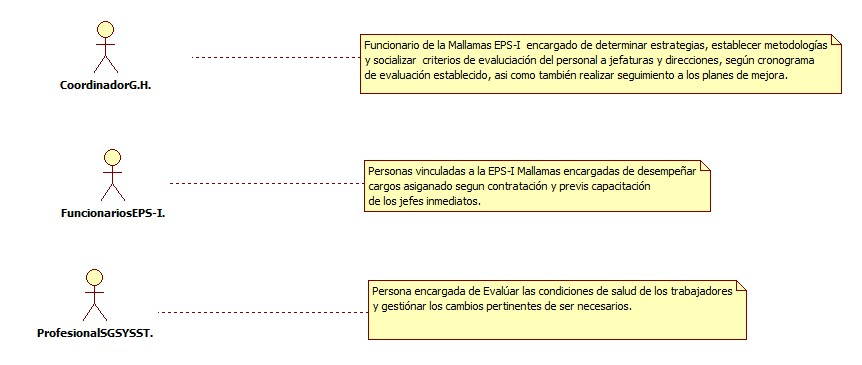
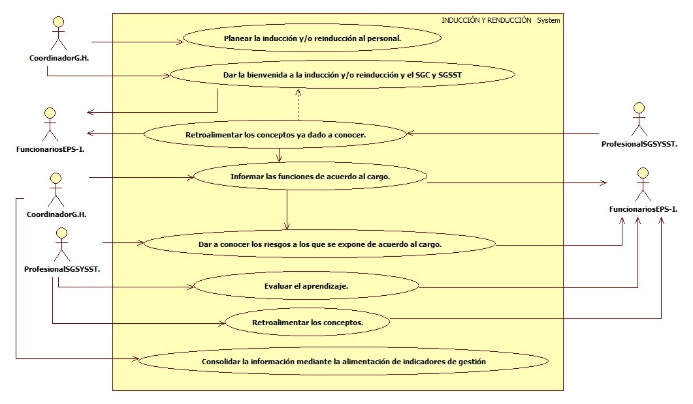

# SISTEMA DE INFORMACIÓN INDUCCIÓN Y RENDUCCION.
Socializar y evaluar de forma permanente los conceptos del SST, SGC, funciones, riesgos y demás aspectos de MALLAMAS que permitan la formación, aprendizaje y la toma de conciencia permanente para el logro de los objetivos empresariales. 

## 1. MODELADO DEL SISTEMA DE INFORMACIÓN

### 1.1 ACTORES INDUCCIÓN Y RENDUCCION.

### 1.2 IDENTIFICACIÓN DE LOS CASOS DE USO INDUCCIÓN Y RENDUCCION.

| Número | Procesos del Sistema de Información |
| ------ | ----------------------------------- |
| 1      | Planear la inducción y/o reinducción al personal.             |
| 2      | Dar la bienvenida a la inducción y/o reinducción y el SGC y SGSST             |
| 3      | Retroalimentar los conceptos ya dado a conocer.             |
| 4      | Informar las funciones de acuerdo al cargo.             |
| 5      | Dar a conocer los riesgos a los que se expone de acuerdo al cargo.          |
| 6      | Evaluar el aprendizaje.            |
| 7      | Retroalimentar los conceptos.            |
| 8      |Consolidar la información mediante la alimentación de indicadores de gestión          |

### 1.3 DESCRIPCIÓN DEL DIAGRAMA DE CASOS DE USO INDUCCIÓN Y RENDUCCION.

| **1. Caso de Uso** | INDUCCIÓN Y RENDUCCION. |
| - | - |
| **2. Descripción** |   Socializar y evaluar de forma permanente los conceptos del SST, SGC, funciones, riesgos y demás aspectos de MALLAMAS que permitan la formación, aprendizaje y la toma de conciencia permanente para el logro de los objetivos empresariales. |
| **3. Actor(es)**   | Coordinador G.H, Funcionarios EPS-I Mallamas, Profesional SGSYSST.  |
| **4. Pre Condiciones** | Contar el personal para capacitar.|
| **5. Pos Condiciones** | Tener claro las funciones y los conceptos de SST.|
| **6. Flujo de Eventos** ||
| *Actor(es)* | *Sistema* |
| 1. El Coordinador de Gestión Humana planea la inducción y renduccion del personal.|  |
| 2. El Coordinador de Gestión Humana Da la bienvenida a la inducción y/o reinducción y el SGC y SGSST al personal.|
| 3. El ProfesionalSGSYSST retroalimenta los conceptos ya dado a conocer anteriormente. |  |
| 4. El Coordinador de Gestión Humana informa al personal de sus funciones que se tienen acargo. |  |
| 5. El ProfesionalSGSYSST Da a conocer los riesgos a los que se expone de acuerdo al cargo de cada funcionario.  | |
| 6. El ProfesionalSGSYSST Evalua el aprendizaje de los funcionarios de acuerdo a las capacitaciones impartidas. |  |
| 7. El ProfesionalSGSYSST Retroalimentar los conceptos a los funcionarios de ser necesario. |  |
| 8. El Coordinador de Gestión Humana Consolida la información mediante la alimentación de indicadores de gestión de la reinducción del personal. | |

| **7. Requerimiento Asociado** |  |
| **8. Interfaz de Usuario Asociada** |  |
| **9. Formato de Usuario Asociado** |  |

### 1.4 MODELADO VISUAL DEL CASO DE USO INDUCCIÓN Y RENDUCCION.

## 2. ESPECIFICACIÓN DEL SISTEMA DE INFORMACIÓN INDUCCIÓN Y RENDUCCION.

| Término | Descripción |
| ------- | ----------- |
| G.H. | Gestión Humana.             |
| SGS | Sistema General de Salud.         |
| SST | Salud y Seguridad en el Trabajo.

## 3. ESPECIFICACIÓN DE REQUERIMIENTOS

| **N°** | **Tipo** | **Descripción** |
| - | - | - |
|  |  |  |
|  |  |  |
|  |  |  |

## 4. ESPECIFICACIÓN DE LA INTERFACE DE USUARIO

| **1. Número** |
| - |
|  |
| **2. Propósito de la Interfaz** |
| |
| **3. Gráfica de la Interfaz**|
|  |

### 4.1 IDENTIFICACIÓN DE PERFILES Y DIÁLOGOS

| **1. Nombre del Perfil** |
| - |
| |
| **2. Opciones a las que tiene Acceso**|
|  |
| **3. Tipo de Acceso** |
| |

### 4.2 ESPECIFICACIÓN DE FORMATOS DE USUARIO

| Número | Nombre del Formato |
| ------ | ----------------------------------- |
|    |           |
