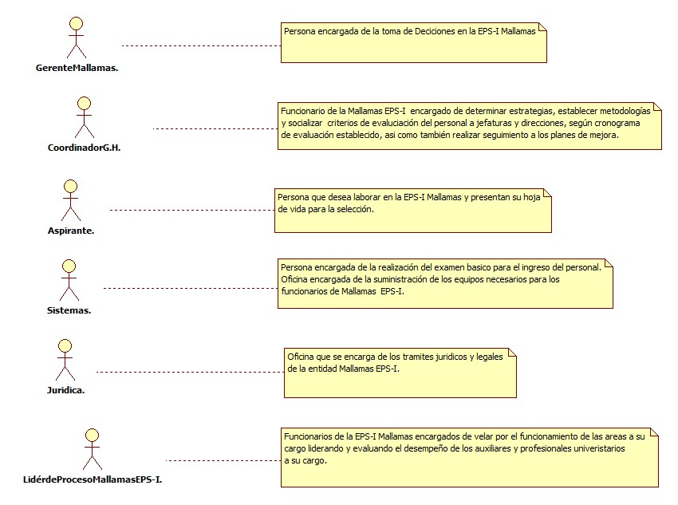
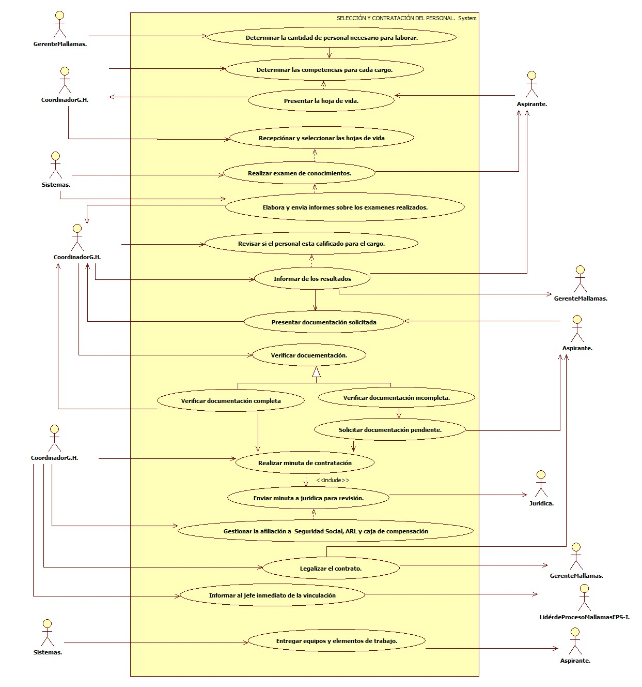

# SISTEMA DE INFORMACIÓN SELECCIÓN Y CONTRATACIÓN DEL PERSONAL.
Seleccionar el personal con las mejores conocimientos, experiencia, competencia y habilidades posibles.

## 1. MODELADO DEL SISTEMA DE INFORMACIÓN

### 1.1 ACTORES SELECCIÓN Y CONTRATACIÓN DEL PERSONAL.

### 1.2 IDENTIFICACIÓN DE LOS CASOS DE USO SELECCIÓN Y CONTRATACIÓN DEL PERSONAL.

| Número | Procesos del Sistema de Información |
| ------ | ----------------------------------- |
| 1      | Determinar la cantidad de personal necesario para laborar.              |
| 2      | Determinar las competencias para cada cargo.             |
| 3      | Presentar la hoja de vida.          |
| 4      | Recepciónar y seleccionar las hojas de vida            |
| 5      | Realizar examen de conocimientos.            |
| 6      | Elabora y envia informes sobre los examenes realizados.             |
| 7      | Revisar si el personal esta calificado para el cargo.           |
| 8      | Informar de los resultados.           |
| 9      | Presentar documentación solicitada.       |
| 10     | Verificar docuementación.          |
| 11     | Verificar documentación completa            |
| 12     | Verificar documentación incompleta.           |
| 13     | Solicitar documentación pendiente.          |
| 14     | Realizar minuta de contratación          |
| 15     | Enviar minuta a juridica para revisión.            |
| 16     | Gestionar la afiliación a  Seguridad Social, ARL y caja de compensación           |
| 17     | Legalizar el contrato.          |
| 18     | Informar al jefe inmediato de la vinculación           |
| 19     | Entregar equipos y elementos de trabajo.            |

### 1.3 DESCRIPCIÓN DEL DIAGRAMA DE CASOS DE USO SELECCIÓN Y CONTRATACIÓN DEL PERSONAL.
| **1. Caso de Uso** | SELECCIÓN Y CONTRATACIÓN DEL PERSONAL. |
| - | - |
| **2. Descripción** | El procedimiento aplica para la convocatoria y selección de personal de la EPS - I MALLAMAS. |
| **3. Actor(es)**   | Coordinador de Gestión Humana, Aspirante, Sistemas, Juridica, Lidér del Proceso de Mallamas EPS-I, Gerente de Mallamas.  |
| **4. Pre Condiciones** | Contar con la solicitud de nuevo personal.|
| **5. Pos Condiciones** | Realizar la contratación del nuevo personal.|
| **6. Flujo de Eventos** ||
| *Actor(es)* | *Sistema* |
| 1. El Gerente de Mallamas determina la cantidad del personal que se solicita para la prestación de servicios.|  |
| 2. El Coordinador de Gestión Humana determina las competencias y los perfiles para cada cargo solicitado. | |
| 3. El Aspirante presenta la hoja de vida para su revición. |  |
| 4. El Coordinador de Gestión Humana recepciona y selecciona las hojas de vida. |  |
| 5. Sistemas realiza el examen correspondiente a los conocimientos básico.  | |
| 6. Sistemas Elabora y enviá informes sobre los examenes realizados. |  |
| 7. El Coordinador de Gestión Humana revisa si el personal esta calificado para desempeñar las funciones asignar. |  |
| 8. El Coordinador de Gestión Humana informa de los resultado al aspirante y al gerente de Mallamas EPS-I.  | |
| 9. El Aspirante presenta la documentación solicitada para la contratación a Gestión Humana.   |  |
| 10. El Coordinador de Gestión Humana verifica la documentación   | |
| 11. El Coordinador de Gestión Humana verifica documentación completa.||
| 12. El Coordinador de Gestión Humana verifica documentación incompleta. y solicita a el aspirante completar la información. | |
| 13.El Coordinador de Gestión Humana realiza la minuta de contratación y enviá a jurídica para su revisión.. | |
| 14. El Coordinador de Gestión Humana Gestiona la afiliación a  Seguridad Social, ARL y caja de compensación del nuevo personal.| | 
| 15. El Coordinador de Gestión Humana legaliza el contrato entre el nuevo funcionario y el gerente de Mallamas EPS-I.. | | 
| 16. El Coordinador de Gestión Humana informa al jefe inmediato del nuevo funcionario que ya esta hecha la vinculación. | |
| 17 Sistemas entrega equipos y elementos de trabajo al nuevo funcionario de Mallamas EPS-I.||
| **7. Requerimiento Asociado** | R001, R002, R003. |
| **8. Interfaz de Usuario Asociada** |  |
| **9. Formato de Usuario Asociado** | F001. |

### 1.4 MODELADO VISUAL DEL CASO DE USO SELECCIÓN Y CONTRATACIÓN DEL PERSONAL.

## 2. ESPECIFICACIÓN DEL SISTEMA DE INFORMACIÓN SELECCIÓN Y CONTRATACIÓN DEL PERSONAL.

| Término | Descripción |
| ------- | ----------- |
| G.H. | Gestión Humana.             |
| ARL | Administración de Riesgos Laborales.         |

## 3. ESPECIFICACIÓN DE REQUERIMIENTOS

| **N°** | **Tipo** | **Descripción** |
| - | - | - |
| R001 | Físico | Hoja de vida. |
| R002 | Proceso | Revisión de necesidad de personal. |
| R003 | Físisco | Contrato legalizado. |

## 4. ESPECIFICACIÓN DE LA INTERFACE DE USUARIO

| **1. Número** |
| - |
||
| **2. Propósito de la Interfaz** |
| |
| **3. Gráfica de la Interfaz**|
|  |

### 4.1 IDENTIFICACIÓN DE PERFILES Y DIÁLOGOS

| **1. Nombre del Perfil** |
| - |
|  |
| **2. Opciones a las que tiene Acceso**|
| |
| **3. Tipo de Acceso** |
|  |

### 4.2 ESPECIFICACIÓN DE FORMATOS DE USUARIO

| Número | Nombre del Formato |
| ------ | ----------------------------------- |
| F001   | Contrato.            |
