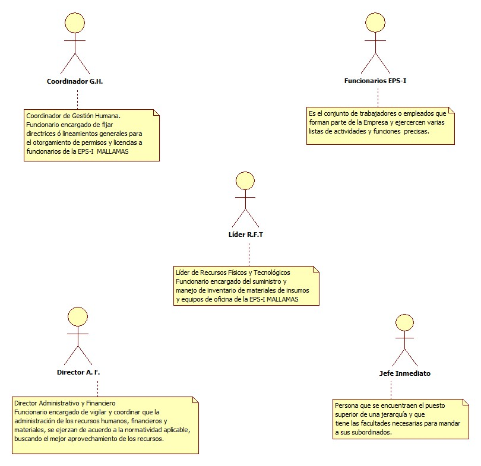
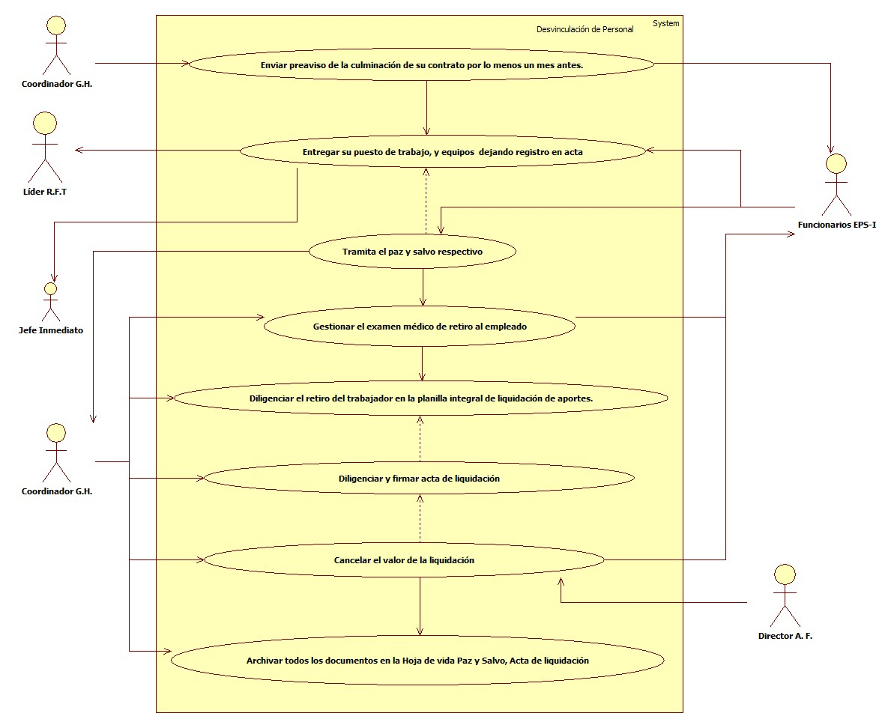

# SISTEMA DE INFORMACIÓN  DESVINCULACIÓN DEL PERSONAL
Sistema de información encargado asegurar que la desvinculación del personal cumpla con los requisitos exigidos por la ley y los requerimientos internos de  la EPS - I MALLAMAS.

## 1. MODELADO DEL SISTEMA DE INFORMACIÓN

### 1.1 ACTORES APLICACIÓN DESVINCULACIÓN DEL PERSONAL

### 1.2 IDENTIFICACIÓN DE LOS CASOS DE USO DESVINCULACIÓN DEL PERSONAL
| Número |Desvinculación del personal |
| ------ | ----------------------------------- |
| 1  | Enviar preaviso de la culminación de su contrato por lo menos un mes antes.     |
| 2  | Entregar su puesto de trabajo, y equipos  dejando registro en acta|
| 3  | Tramita el paz y salvo respectivo|
| 4  | Gestionar el examen médico de retiro al empleado|
| 5  | Diligenciar el retiro del trabajador en la planilla integral de liquidación de aportes.|
| 6  |Diligenciar y firmar acta de liquidación |
| 7  |Cancelar el valor de la liquidación|
| 8  |Archivar todos los documentos en la Hoja de vida Paz y Salvo, Acta de liquidación|

### 1.3 DESCRIPCIÓN DEL DIAGRAMA DE CASOS DE USO DESVINCULACIÓN DEL PERSONAL

| | | 
| - | - |
| **1. Caso de Uso** |Desvinculación del personal |
| **2. Descripción** | Asegurar que la desvinculación del personal cumpla con los requisitos exigidos por la ley y los requerimientos internos de  la EPS - I MALLAMAS.|
| **3. Actor(es)**| Coordinador de Gestión Humana ,Funcionarios EPS-I,Colaborador,Dirección Administrativa y Financiera,Líder de Recursos Físicos y tecnológicos,Jefe Inmediato|
| **4. Pre Condiciones** |Preaviso de culminación de su contrato |
| **5. Pos Condiciones** | Trabajador Desvinculado de la Empresa|
| **6. Flujo de Eventos** |
| *Actor(es)* | *Sistema* |
|1. El Coordinador de Gestión Humana  Informar al funcionario por medio de preaviso de la culminación de su contrato por lo menos un mes antes.|   |
|2. El funcionario EPS-I entrega su puesto de trabajo, equipos, elementos entregados al momento de la vinculación, ademas de la información a su cargo dejando registro en acta de entrega. |  |
|3. El Coordinador de Gestión Humana tramita el paz y salvo respectivo |  |
|4. El Coordinador de Gestión Humana gestiona el examen médico de retiro al empleado|  | 
|5.  El Coordinador de Gestión Humana diligencia el retiro del trabajador en la planilla integral de liquidación de aportes (PILA).|   |
|6. El Coordinador de Gestión Humana diligencia y firmar acta de liquidación |
|7. Dirección Administrativa y Financiera Cancela el valor de la liquidación |
|8. El Coordinador de Gestión Humana archiva todos los documentos en la Hoja de vida de cada colaborador Paz y Salvo, Acta de liquidación |
| **7. Requerimiento Asociado** | R001 |
|**8. Interfaz de Usuario Asociada** | Ninguno   |
|**9. Formato de Usuario Asociado** | F001,F002,F003 |

### 1.4 MODELADO VISUAL DE LOS CASOS DE USO

## 2. ESPECIFICACIÓN DEL SISTEMA DE INFORMACIÓN

| Término | Descripción |
| ------- | ----------- |
|Reglamento Interno de Trabajo| Es un documento de suma importancia en toda empresa, debido a que se convierte en norma reguladora de las relaciones internas de la empresa con el trabajador |
| PILA |La Planilla Integrada de Liquidación de Aportes (Pila) es un formato inteligente que le permite, a todas las personas y empresas, liquidar y pagar sus aportes al Sistema de la Protección Social, es decir, a los sistemas de salud, pensiones, riesgos profesionales, cajas de compensación, Sena e ICBF.|
| Desvinculación laboral |Es el proceso mediante el cual se procede a despedir o finalizar el contrato, ya sea de una o más personas que cumplen alguna labor dentro de una organización.|
| Liquidación |Se realiza cuando el trabajador se desvincula definitivamente de la empresa, y  se liquidan todos los conceptos que el empleador le sale a deber al trabajador al momento de su retiro definitivo.|
| Preaviso  | Es una obligación de ambas partes en el contrato de trabajo, existe pues el preaviso del trabajador, o preaviso por renuncia y el preaviso por despido, en este último caso la obligación de preavisar le corresponde al empleador. En ambos casos tiene como finalidad extinguir el contrato de trabajo|
|Coordinador G.H.|Coordinador de Gestión Humana |
|Líder R.F.T |Líder de Recursos Físicos y tecnológicos|
|Director A. F.| Director Administrativo y Financiero |

 

## 3. ESPECIFICACIÓN DE REQUERIMIENTOS

| | | |
| - | - | - |
| **N°** | **Tipo** | **Descripción** |
|R001| físico |La Planilla Integrada de Liquidación de Aportes (Pila)|

## 4. ESPECIFICACIÓN DE LA INTERFACE DE USUARIO

| |
| - |
| **1. Número** |
| - |
| **2. Propósito de la Interfaz** |
| - |
| **3. Gráfica de la Interfaz**|
|  |

### 4.1 IDENTIFICACIÓN DE PERFILES Y DIÁLOGOS

| |
| - |
| **1. Nombre del Perfil** |
| Administrador sistema de desvinculación del personal |
| **2. Opciones a las que tiene Acceso**|
| Recibir información|
| **3. Tipo de Acceso** |
| Registrar, recibir,autorizar,liquidar, imprimir informes|

### 4.2 ESPECIFICACIÓN DE FORMATOS DE USUARIO 
| Número | Nombre del formato|
| ------ | ----------------------- |
| F001   |Oficio Preaviso  Laboral    |
| F002   |Acta de entrega de puesto de trabajo |
| F003   |Acta de Liquidación | 