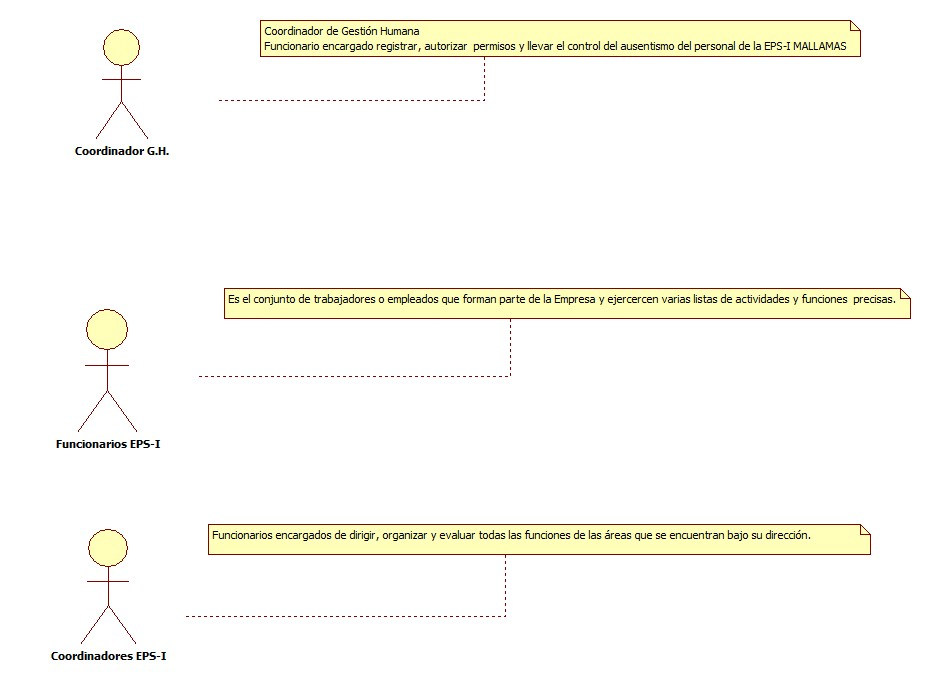
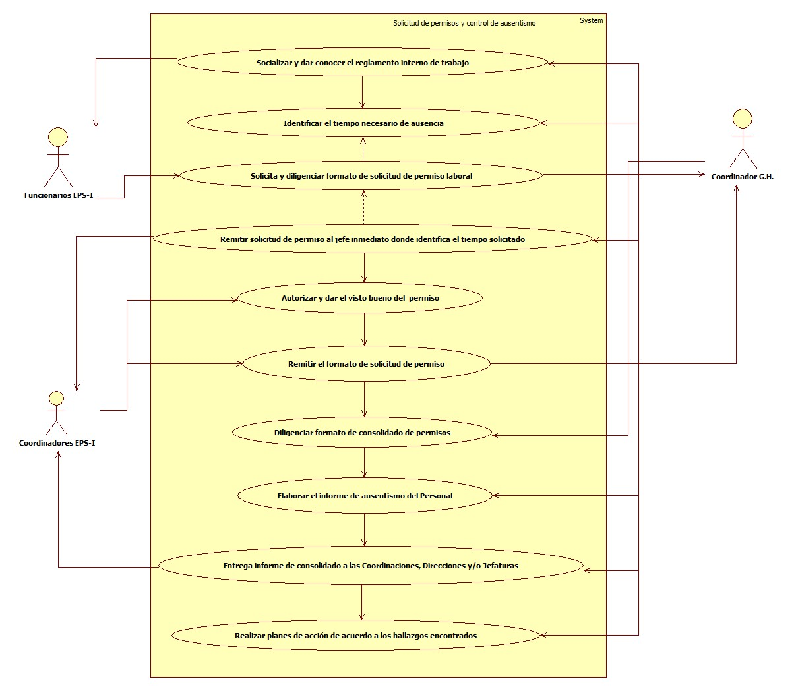

# SISTEMA DE INFORMACIÓN  SOLICITUD DE PERMISOS Y CONTROL DE AUSENTISMO
Sistema de información encargado de Registrar y Permitir a los trabajadores acceder a permisos debidamente justificados en casos de calamidad domestica, caso fortuito o fuerza mayor que ameriten abandonar el sitio de trabajo.

## 1. MODELADO DEL SISTEMA DE INFORMACIÓN

### 1.1 ACTORES APLICACIÓN SOLICITUD DE PERMISOS Y CONTROL DE AUSENTISMO

### 1.2 IDENTIFICACIÓN DE LOS CASOS DE USO SOLICITUD DE PERMISOS Y CONTROL DE AUSENTISMO
| Número | Procesos del Sistema solicitud de permisos y control de ausentismo
| ------ | ----------------------------------- |
| 1  | Socializar y dar conocer el reglamento interno de trabajo     |
| 2  | Identificar el tiempo necesario de ausencia|
| 3  | Solicita y diligenciar formato de solicitud de permiso laboral|
| 4  | Remitir solicitud de permiso al jefe inmediato donde identifica el tiempo solicitado|
| 5  | Autorizar y dar el visto bueno del  permiso|
| 6  | Remitir el formato de solicitud de permiso |
| 7  | Diligenciar formato de consolidado de permisos|
| 8  | Elaborar el informe de ausentismo del Personal|
| 9  | Entrega informe de consolidado a las Coordinaciones, Direcciones y/o Jefaturas|
| 10 | Realizar planes de acción de acuerdo a los hallazgos encontrados |

### 1.3 DESCRIPCIÓN DEL DIAGRAMA DE CASOS DE USO SOLICITUD DE PERMISOS Y CONTROL DE AUSENTISMO

| | | 
| - | - |
| **1. Caso de Uso** |Solicitud de permisos y control de ausentismo |
| **2. Descripción** |Registrar y Permitir a los trabajadores acceder a permisos debidamente justificados en casos de calamidad domestica, gestión empresarial, consulta médica, incapacidad o licencia, caso fortuito o Fuerza mayor que ameriten abandonar el sitio de trabajo. |
| **3. Actor(es)**| Coordinador de Gestión Humana ,Funcionarios EPS-I, Coordinadores EPS-I|
| **4. Pre Condiciones** |Contrato  Laboral de Trabajo |
| **5. Pos Condiciones** | Solicitud de permiso aprobada|
| **6. Flujo de Eventos** |
| *Actor(es)* | *Sistema* |
|1 .El Coordinador de Gestión Humana  da a conocer el reglamento interno de trabajo |   |
|2. El Coordinador de Gestión Humana identifica el tiempo necesario de ausencia|  |
|3. El Funcionario EPS-I solicita y diligencia formato de solicitud de permiso laboral|  |
|4. El Coordinador de Gestión Humana Remite solicitud de permiso al jefe inmediato donde identifica el tiempo solicitado|  | 
|5. El Coordinador EPS-I da el visto bueno y autorizar el permiso|   |
|6. El Coordinador EPS-I Remite el formato de solicitud de permiso Completamente diligenciado a Coordinación de Gestión Humana.|   |
|7.  El Coordinador de Gestión Humana Diligencia formato de consolidado de permisos|    |
|8.  El Coordinador de Gestión Humana elaborar el informe de ausentismo de colaboradores por motivo (Personal, gestión empresarial, consulta médica, incapacidad o licencia u otros)|   |
|9.  El Coordinador de Gestión Humana entrega informe de consolidado a las Coordinaciones, Direcciones y/o Jefaturas|   |
|10. El Coordinador de Gestión Humana realiza planes de acción de acuerdo a los hallazgos encontrados |   |
| **7. Requerimiento Asociado** | R001 |
|**8. Interfaz de Usuario Asociada** | Ninguno   |
|**9. Formato de Usuario Asociado** | F001,F002 |

### 1.4 MODELADO VISUAL DE LOS CASOS DE USO

## 2. ESPECIFICACIÓN DEL SISTEMA DE INFORMACIÓN

| Término | Descripción |
| ------- | ----------- |
|Reglamento Interno de Trabajo| Es un documento de suma importancia en toda empresa, debido a que se convierte en norma reguladora de las relaciones internas de la empresa con el trabajador |
|Incapacidad laboral|Es la incapacidad que afronta un trabajador para laborar como consecuencia de una enfermedad o un accidente de trabajo. |
|Licencia| Es un beneficio que la ley laboral ha reconocido a la mujer que ha dado a luz un hijo e incluso en caso de aborto, siempre que este sea cotizante del sistema de salud, y que además cumpla con algunos requisitos.|
|Calamidad Domestica|  Todo suceso familiar cuya gravedad afecte el normal desarrollo de las actividades del funcionario, como el fallecimiento, enfermedad o lesión grave de sus parientes hasta el cuarto grado de consanguinidad, segundo de afinidad o primero civil, del cónyuge, compañero o compañera permanente.|

## 3. ESPECIFICACIÓN DE REQUERIMIENTOS

| | | |
| - | - | - |
| **N°** | **Tipo** | **Descripción** |
|R001| físico |Registro de solicitud de permiso laboral|

## 4. ESPECIFICACIÓN DE LA INTERFACE DE USUARIO

| |
| - |
| **1. Número** |
| - |
| **2. Propósito de la Interfaz** |
| - |
| **3. Gráfica de la Interfaz**|
|  |

### 4.1 IDENTIFICACIÓN DE PERFILES Y DIÁLOGOS

| |
| - |
| **1. Nombre del Perfil** |
| Administrador sistema de Solicitud de permisos y control de ausentismo |
| **2. Opciones a las que tiene Acceso**|
| Recibir información|
| **3. Tipo de Acceso** |
| Registrar, recibir,autorizar, imprimir informes|

### 4.2 ESPECIFICACIÓN DE FORMATOS DE USUARIO 
| Número | Nombre del formato|
| ------ | ----------------------- |
| F001     |Formato de Solicitud de permiso laboral    |
| F002     |formato de consolidado de permisos  |