# SISTEMA DE INFORMACIÓN AUDITORIA DE CUENTAS PROVEEDORES

Sistema encargado de Contribuir a mantener la suficiencia de recursos económicos mediante auditorias a las cuentas radicadas en Mallamas EPS - I por la red prestadora, tendientes a garantizar una efectiva prestación de servicios de salud y eficiencia en el manejo de recursos financieros. 

## 1. MODELADO DEL SISTEMA DE INFORMACIÓN

### 1.1 ACTORES  AUDITORIA DE CUENTAS PROVEEDORES

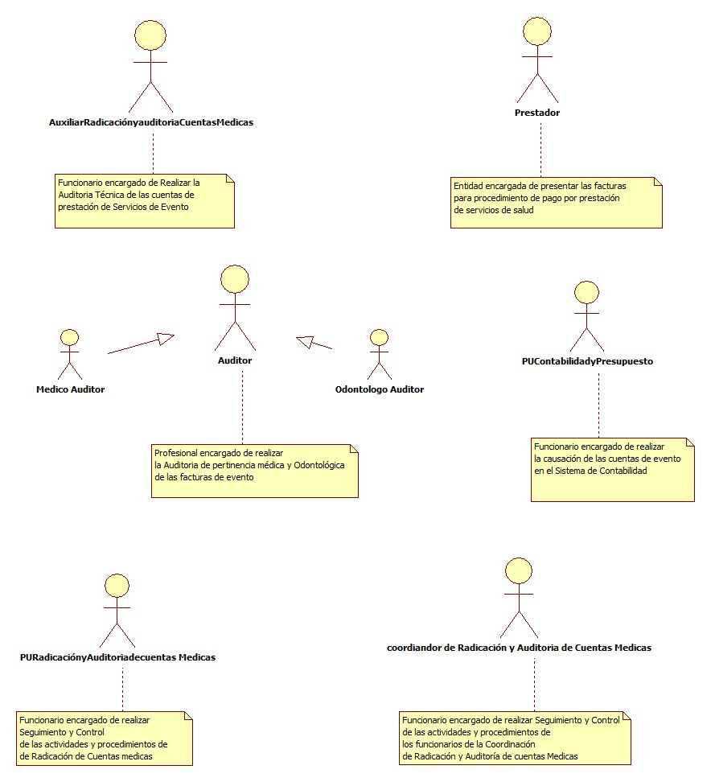

### 1.2 IDENTIFICACIÓN DE LOS CASOS DE USO AUDITORIA DE CUENTAS PROVEEDORES
| Número | Procesos del Sistema de Información |
| ---- | ----------------------------------- |
| 1      | consultar en sistema de trazabilidad  radicado para auditar|
| 2      | Diligenciar la matriz  cuentas        |
| 3      | Realizar auditoria técnica de acuerdo a la normatividad |
| 4      | Verificar  datos de  RIPS con Relación de facturas |
| 5      | Ingresar glosa encontrada en pre-auditoria y guardar en el sistema |
| 6      | Realizar auditoria médica y odontologíca de pertinencia a las facturas  |
| 7      |Guardar glosa de facturas auditadas |
| 8      |Reportar los casos  de eventos adversos e incidentes|
| 9      |Identificar  facturas  de cruces según contratos de capitado y realizar  notificación de descuento |
| 10     |Realizar cierre de auditoria de cuentas en el modulo conciliación de glosas |
| 11     |Generar oficio de reporte de glosa Notificar y enviar  a los proveedores auditados |
| 12     |Informar al área contable mediante oficio las glosas encontradas |
| 13     |Escoger facturas glosadas para dejar como soporte de conciliación |
| 14     |Recepcionar del prestador respuesta de glosa dentro de los términos|
| 15      |Acepta la Glosa|
| 16      |Acepta Glosa Parcial |
| 17      |No acepta glosa |
| 18      |Enviar la  relación factura a factura  de ratificación de glosa al proveedor |
| 19     |Enviar oficio  de extemporaniedad  al prestador |
| 20     |Citar al prestador |
| 21     |Firmar acta de conciliación|
| 22     |Enviar al área de contabilidad el resultado final de la conciliación |
| 23     |Enviar al área de contabilidad el resultado final de la conciliación |
| 24     |Ingresar a base de datos el valor conciliado a favor y en contra de mallamas EPS.I |

### 1.3 DESCRIPCIÓN DEL DIAGRAMA DE CASOS DE USO AUDITORIA DE CUENTAS PROVEEDORES
| | |
| - | - |
| **1. Caso de Uso** | Auditoria de Cuentas Proveedores |
| **2. Descripción** | Realiza proceso de Auditoria de facturas de cuentas evento de la Red de prestadores |
| **3. Actor(es)**   | Auxiliar de Radicación y auditoria de cuentas Medicas, Auditor,Prestador,Coordinador de radicación y auditoria de cuentas, PURadicación y auditoria de cuentas Medicas,PUContabilidad y Presupuesto |
| **4. Pre Condiciones** | Cuenta Radicada y cerrada |
| **5. Pos Condiciones** | Cuenta auditada y entregada a Contabilidad|
| **6. Flujo de Eventos** |
| *Actor(es)* | *Sistema* |
|1. El Auxiliar de Radicación y auditoria de cuentas Medicas consultar en sistema de trazabilidad de facturas la cuenta a auditar dando clik en auditar cuenta |2. Presenta pantalla con numero de radicación y facturas para auditar  |
|3. El Auxiliar de Radicación y auditoria de cuentas Medicas Realizar auditoria técnica de acuerdo a Resolución 3047 de 2008 y acuerdo de voluntades |   |
|4. El Auxiliar de Radicación y auditoria de cuentas Medicas revisa los  soportes de las facturas radicadas y verifica que están completos y las tarifas  acordes a la normatividad y al contrato? |5. Presenta pantalla con facturas por auditar y conceptos únicos de glosa,   generales y específicos  |
|6. El Auxiliar de Radicación y auditoria de cuentas Medicas Registrar glosa de acuerdo a novedad presentada,  con base en la normatividad vigente y contrato actual, ingresar glosa encontrada en pre-auditoria|   |
|7.  El Auxiliar de Radicación y auditoria de cuentas Medicas Consulta en sistema de trazabilidad de facturas la cuenta a auditar |8.  presenta pantalla con motivos de glosa  y icono guardar |
|9. Los Auditores Realizan auditoria médica y odontologíca (cuando aplique) de pertinencia de las facturas asignadas de acuerdo a Resolución 3047 de 2008,acuerdo de voluntades, guiás y protocolos de atención| |
|10. Los Auditores Registran glosa de acuerdo a los hallazgos encontrados |11. presenta pantalla con causales de Glosa generales y especificas, guardar glosa y enviar a facturas auditadas
|12. Los Auditores identifican y reportan los casos  de eventos adversos e incidentes, y otros para estos a su vez ser notificados a la oficina de calidad|  |
|13. Los Auditores revisan los casos que se detecte, o identifique las facturas objeto de cruces según contratos de capitado y realiza la correspondiente notificación de descuento|   |
|14. Los Auditores analizan  los casos que se detecten remisiones u ordenes médicas no pertinentes desde un prestador se identifica las facturas y se realiza el respectivo descuento |   |
|15. Los Auditores Realizar cierre de auditoria de cuentas en el modulo conciliación de glosas|16. presenta pantalla trazabilidad conciliar y cerrar   |
|17. El Auxiliar de Radicación y auditoria de cuentas Medicas exporta el reporte de glosa factura a factura en el modulo de conciliación de glosas|18. Presenta pantalla opción  reporte de glosa |
|19. El Auxiliar de Radicación y auditoria de cuentas Medicas ingresa al  modulo de conciliación de glosas y da clik  en reporte |20. Generar oficio de reporte de glosa   |
|21. El Auxiliar de Radicación y auditoria de cuentas Medicas notifica y enviá  el oficio de reporte de glosa y reporte factura a factura,  a los proveedores auditados, da clik en generar reporte  |22. presenta pantalla Reporte oficio para IPS  |
|23. El Auxiliar de Radicación y auditoria de cuentas Medicas informa al área contable mediante oficio las glosas encontradas durante la auditoria de cada proveedor, digitalizar soporte y subirlo a la nube del radicado correspondiente|   |   
|24. El Auxiliar de Radicación y auditoria de cuentas Medicas escoge facturas glosadas para dejar como soporte de conciliación y las no glosadas ser archivadas a archivo general de la EPS|   |
|25. El Auxiliar de Radicación y auditoria de cuentas Medicas recepcioná las  respuestas por parte de los proveedores a glosas formuladas, dentro de los términos estipulados por la norma |    |
|26. El Auxiliar de Radicación y auditoria de cuentas Medicas enviá respuesta a la glosa  si esta dentro de los términos|    |
|27. El Auxiliar de Radicación y auditoria de cuentas Medicas enviá oficio  de extemporaniedad  al prestador, digitalizar este soporte para subirlo a la nube de cada radicado |    |
|28. El Auxiliar de Radicación y auditoria de cuentas Medicas cita al prestador a firma del acta de conciliación a favor de Mallamas ESP - I |     |
|29. El Auxiliar de Radicación y auditoria de cuentas Medicas envía al área de contabilidad el resultado final de la conciliación para lo pertinente |    |
|30.  El proveedor acepta la glosa formulada|     |
|31.  El Auxiliar de Radicación y auditoria de cuentas Medicas realiza revisión, análisis de respuesta de glosa y levantamiento de glosas soportadas|   |
|32. El Auxiliar de Radicación y auditoria de cuentas Medicas realiza oficio  y envío de relación factura a factura  de ratificación de glosa al proveedor, dentro de los términos normativos |   |
|33. Los Auditores Médicos u Odontologos  hacen citación a conciliación en el día y hora programada por MALLAMAS por medio de correo electrónico|  |
|34. Los Auditores Médicos u Odontologos Reunión entre las partes para proceso de conciliación de glosas |   |
|35. Los Auditores Médicos u Odontologos   firmar el acta de conciliación en el modulo conciliación de glosas |36. Genera pantalla de Generar Acta de Conciliación    | 
|37. El Auxiliar de Radicación y auditoria de cuentas Medicas elabora oficio del resultado de  la conciliación y copia del acta para enviar a contabilidad|    |
|38. El Auxiliar de Radicación y auditoria de cuentas Medicas ingresan a base de datos el valor conciliado a favor y en contra de mallamas EPS.I|   |
|39. El Auxiliar de Radicación y auditoria de cuentas Medicas digitaliza los soportes y archivar en la sube con el radicado correspondiente|
| **7. Requerimiento Asociado** | R001, R002, R003
| **8. Interfaz de Usuario Asociada** | I001,I002,I003,I004,I005,I006,I007,I008,I009,I010|
| **9. Formato de Usuario Asociado** | F001,F002,F003,F004,F005 |

### 1.4 MODELADO VISUAL DEL CASO DE USO AUDITORIA DE CUENTAS POR EVENTO

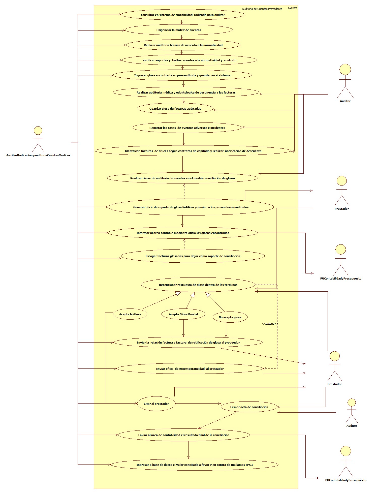

## 2. ESPECIFICACIÓN DEL SISTEMA DE INFORMACIÓN AUDITORIA DE CUENTAS POR EVENTO
| Término | Descripción |
| ----- | ---------- |
| RIPS | Registro Individual prestador de Servicios de Salud |
| Base de Datos |Conjunto de datos ordenados en filas y columnas|
| Auditoria medica    |Es un proceso interdisciplinario , que permite  realizar la evaluación del acto médico, con los objetivos de: Mejorar la práctica médica, Ser un medio de educación continua, y mejorar la calidad de la atención |
| Trazabilidad  |Consiste en un conjunto de medidas, acciones y procedimientos que permiten registrar e identificar cada producto desde su origen hasta su destino final.|
| Glosa        |Las glosas son objeciones a las cuentas de cobro presentadas por las Instituciones prestadoras de servicios de salud – IPS, originadas en las inconsistencias detectadas en la revisión de las facturas y sus respectivos soportes
| Conciliación    |Es un mecanismo de resolución de glosas a través del cual se da la solución a las objeciones realizadas a los procedimientos médicos.|
## 3. ESPECIFICACIÓN DE REQUERIMIENTOS

| | | |
| - | - | - |
| **N°** | **Tipo** | **Descripción** |
| R001 |Físico | Contratos  |
| R002 |Físico | Facturas |
| R003 |Físico | RIPS |

## 4. ESPECIFICACIÓN DE LA INTERFACE DE USUARIO

| |
| - |
| **1. Número** |
| I001 |
| **2. Propósito de la Interfaz** |
| Ingresar al Aplicativo Trazabilidad de facturas |
| **3. Gráfica de la Interfaz**|
| 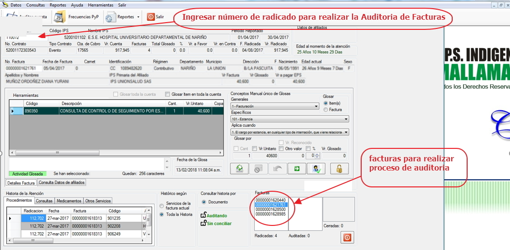 |

| |
| - |
| **1. Número** |
| I002 |
| **2. Propósito de la Interfaz** |
| Glosar facturas|
| **3. Gráfica de la Interfaz**|
| 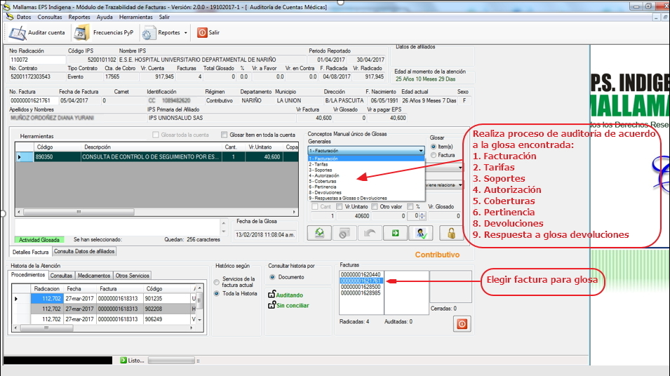 |

| |
| - |
| **1. Número** |
| I003 |
| **2. Propósito de la Interfaz** |
| Glosas generales y especificas|
| **3. Gráfica de la Interfaz**|
| 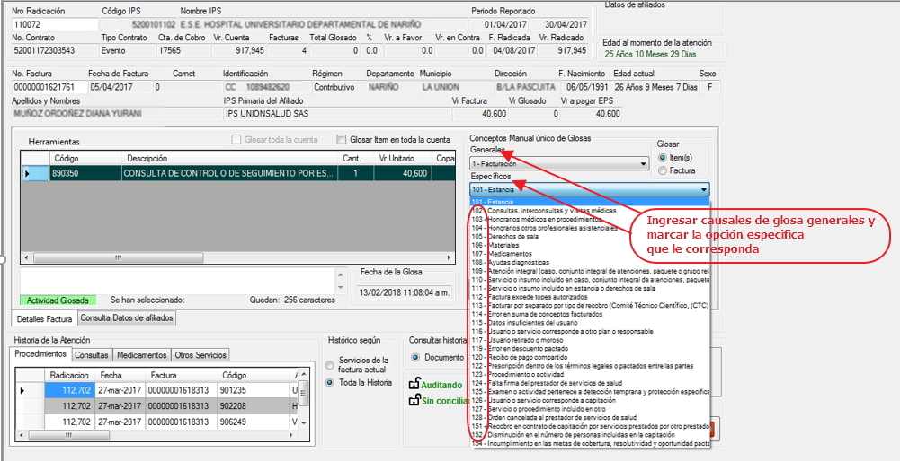|

| |
| - |
| **1. Número** |
| I004 |
| **2. Propósito de la Interfaz** |
| ingresar radicado para generar reporte|
| **3. Gráfica de la Interfaz**|
| 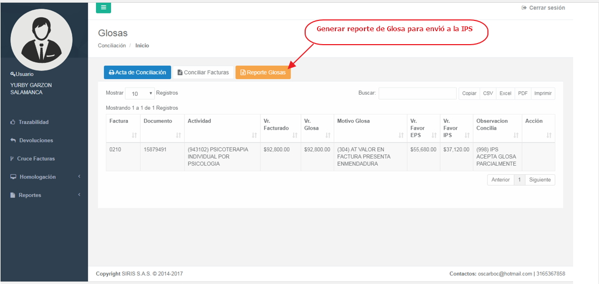 |

| |
| - |
| **1. Número** |
| I005 |
| **2. Propósito de la Interfaz** |
| ingresar radicado para generar reporte|
| **3. Gráfica de la Interfaz**|
| 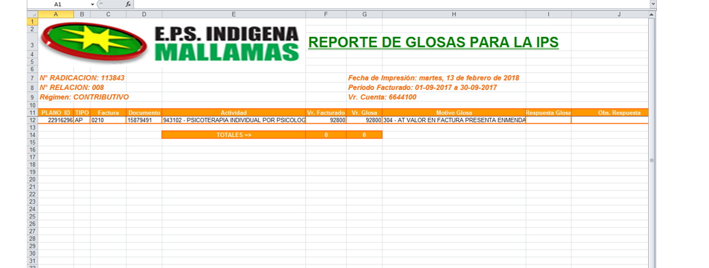 |

| |
| - |
| **1. Número** |
| I006 |
| **2. Propósito de la Interfaz** |
| Cerrar auditoria de Glosas|
| **3. Gráfica de la Interfaz**|
| 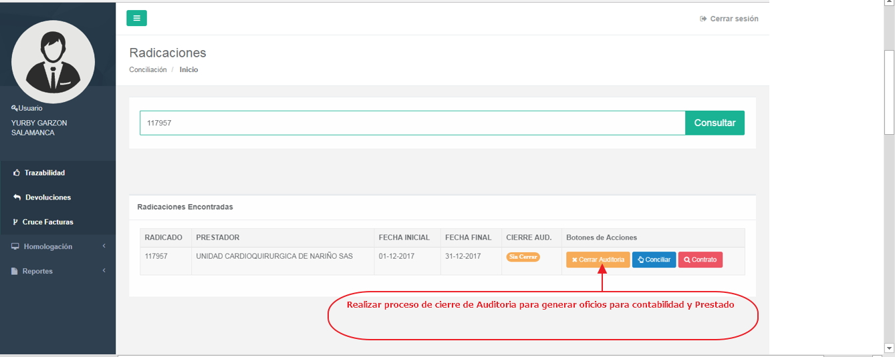 |

| |
| - |
| **1. Número** |
| I007 |
| **2. Propósito de la Interfaz** |
| Ingresar radicado para generar reporte|
| **3. Gráfica de la Interfaz**|
| 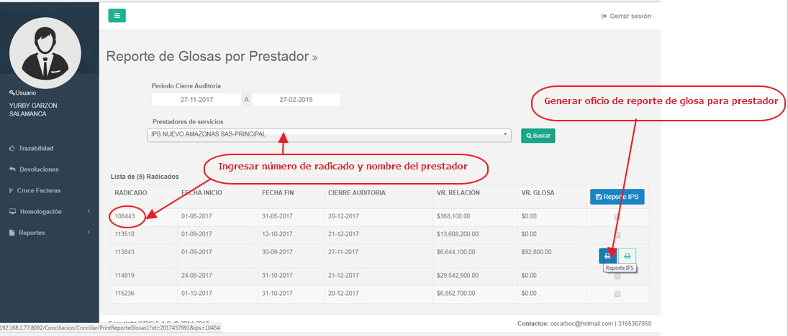 |

| |
| - |
| **1. Número** |
| I008 |
| **2. Propósito de la Interfaz** |
| Oficio de  Reporte de glosa prestador |
| **3. Gráfica de la Interfaz**|
| 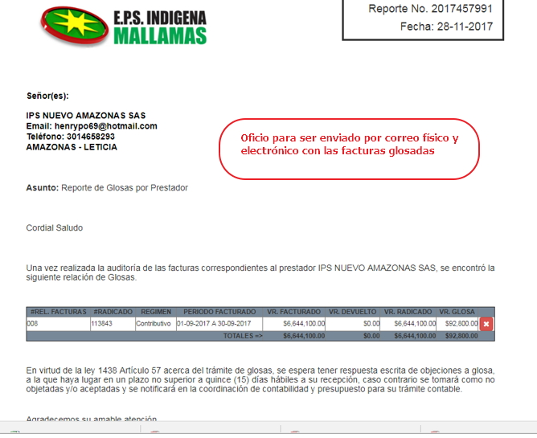 |

| |
| - |
| **1. Número** |
| I009 |
| **2. Propósito de la Interfaz** |
| Generar Reporte de contabilidad |
| **3. Gráfica de la Interfaz**|
| 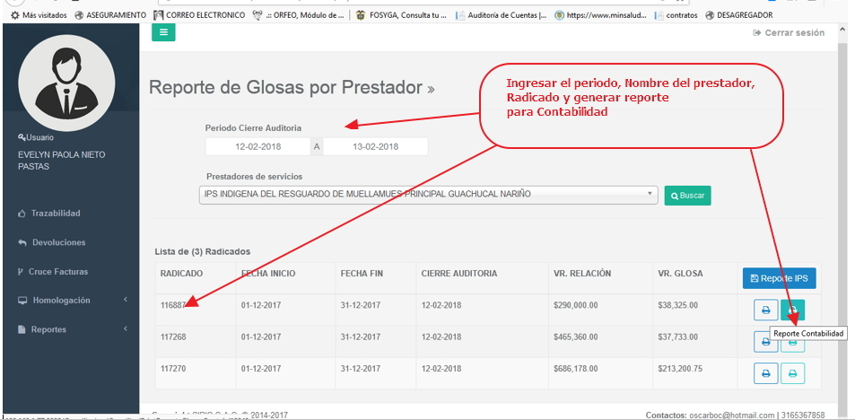 |

| |
| - |
| **1. Número** |
| I010 |
| **2. Propósito de la Interfaz** |
| Generar Reporte de contabilidad |
| **3. Gráfica de la Interfaz**|
| 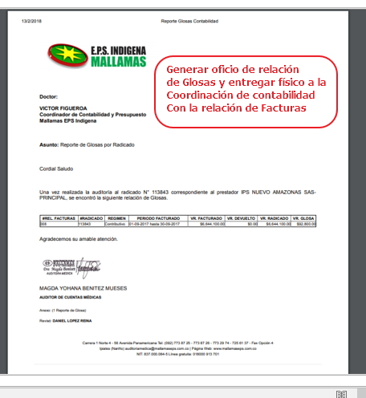 |

### 4.1 IDENTIFICACIÓN DE PERFILES Y DIÁLOGOS

| |
| - |
| **1. Nombre del Perfil** |
| Administrador del sistema de radicación y Auditoria de cuentas Medicas |
| **2. Opciones a las que tiene Acceso**|
| Auditoria de Cuentas Medicas|
| **3. Tipo de Acceso** |
| Registrar, recibir,imprimir informes,auditar,glosar, conciliar |

### 4.2 ESPECIFICACIÓN DE FORMATOS DE USUARIO
| Número | Nombre del Formato |
| ------ | ----------------------------------- |
| F001   | Matriz de Registro de Auditoria de Cuentas |
| F002   | Reporte de Glosas |
| F003   | Acta de Conciliación |
| F004   | Respuesta de Glosa |      
| F005   | Oficio de Extemporaniedad |