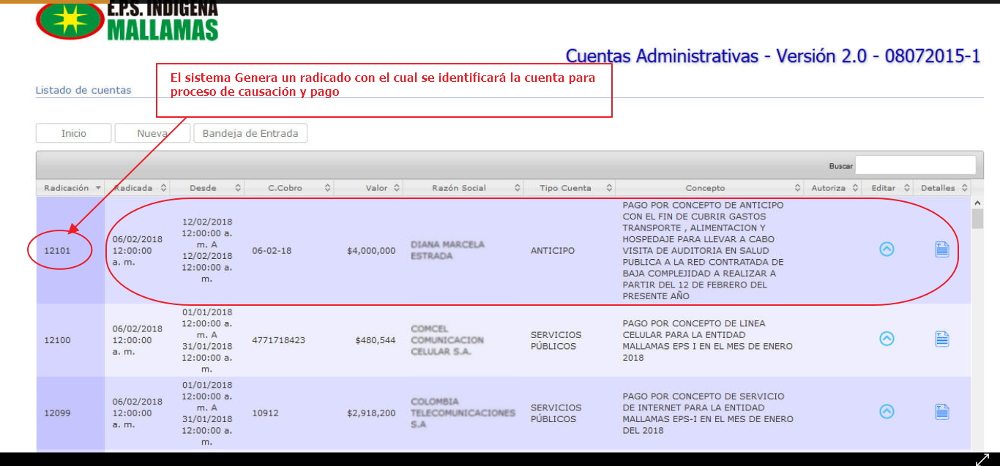

# SISTEMA DE INFORMACIÓN RADICACIÓN DE CUENTAS ADMINISTRATIVAS

Sistema de información encargado de  Recibir, verificar, radicar y tramitar oportunamente las diferentes cuentas por concepto de servicios administrativos suministrados por los proveedores internos y externos a la E.P.S-I MALLAMAS  

## 1. MODELADO DEL SISTEMA DE INFORMACIÓN

### 1.1 ACTORES RADICACIÓN DE CUENTAS ADMINISTRATIVAS

### 1.2 IDENTIFICACIÓN DE LOS CASOS DE USO RADICACIÓN DE CUENTAS ADMINISTRATIVAS
| Número | Procesos del Sistema Radicación de Cuentas Administrativas
| ------ | ----------------------------------- |
| 1  |Solicitar Radicación de cuenta Administrativa      |
| 2  |Recepcionar  documentación de proveedores de clientes internos y externos|
| 3  |Verificar en el aplicativo  si el proveedor ya se encuentra registrado |
| 4  |Registrar proveedor si es nuevo en el sistema    |
| 5  |Solicitar al proveedor nuevo  los  requisitos para ingreso al sistema   |
| 6  |Devolver al proveedor la cuenta en caso de inconsistencias   |
| 7  |Ingresar y  guardar en aplicativo los datos del  nuevo proveedor   |
| 8 |Registrar datos  y generar  numero de Radicado de la cuenta administrativa|
| 9  |Verificar requisitos de cuenta según la lista de chequeo, dando el visto bueno  |
| 10  |Realizar la entrega de la cuenta y los soportes al área de Contabilidad   |

### 1.3 DESCRIPCIÓN DEL DIAGRAMA DE CASOS DE USO VALIDACIÓN DE RIPS

| | | 
| - | - |
| **1. Caso de Uso** |  Radicación de Cuentas Administrativas|
| **2. Descripción** |Procedimiento en el cual se  realiza la radicación cuentas por concepto de servicios administrativos suministrados por los proveedores internos y externos a la E.P.S-I MALLAMAS|
| **3. Actor(es)**| Auxiliar de cuentas Administrativas , Proveedores internos y externos, PURadicación cuentas|
| **4. Pre Condiciones** |Pertenecer a la Base Usuarios de Mallamas EPS-I, Tener vinculo laboral como Funcionario de Mallamas EPS-I, Proveedor con contrato de servicios Públicos, Proveedor con contrato de suministro de bienes y servicios
| **5. Pos Condiciones** | Cuenta Radicada |
| **6. Flujo de Eventos** |
| *Actor(es)* | *Sistema* |
|1. El proveedor Solicita Radicación de cuenta Administrativa|   |
|2. Auxiliar de radicación de cuentas Administrativas, recepcioná la  documentación: cuentas de cobro, soportes, apoyos por calamidad domestica, caja menor, viáticos, documentos varios de proveedores, de clientes internos y externos|  |
|3. Auxiliar de radicación de cuentas Administrativas verifica en el aplicativo  si el proveedor ya se encuentra registrado ó es  nuevo en el sistema|4. presenta pantalla con lista de Proveedores  registrados y casilla en blanco para los no existentes |
|5. Auxiliar de radicación de cuentas Administrativas solicita al proveedor nuevo  los  requisitos como: Fotocopia del NIT, RUT, cedula representante legal, certificación bancaria, Cámara de comercio aplicando lista de chequeo y registrar los datos  en el aplicativo cuentas administrativas |  |
|6. El Auxiliar de radicación de cuentas Administrativas  devuelve al proveedor la cuenta en caso de inconsistencias ó falta de soportes.
|7. Auxiliar de radicación de cuentas Administrativas ingresa aplicativo los datos del  nuevo proveedor y da  clik en guardar   |8. Genera ingreso de nuevo proveedor en el sistema | 
|9. Auxiliar de radicación de cuentas Administrativas Ingresa al aplicativo llenando los campos valor cuenta, periodo, proveedor ,selecciona el tipo de cuenta y da clik en guardar |10. Genera pantalla con Numero de Radicado de la cuenta administrativa|
|11. El Profesional Universitario de Radicación y Auditoria de cuentas Verificar el cumplimiento de los requisitos de cuentas administrativas según la lista de chequeo, dando el visto bueno a cada cuenta|   |
|12. Auxiliar de radicación de cuentas Administrativas realiza la entrega de la cuenta y los soportes al área de Contabilidad y presupuesto para causación y pago|  |
| **7. Requerimiento Asociado** | Ninguno |
|**8. Interfaz de Usuario Asociada** | I001, I002, I003, I004, I005, I006   |
|**9. Formato de Usuario Asociado** | F001 |

### 1.4 MODELADO VISUAL DE LOS CASOS DE USO

## 2. ESPECIFICACIÓN DEL SISTEMA DE INFORMACIÓN

| Término | Descripción |
| ------- | ----------- |
|Calamidad domestica| Ayuda económica por fallecimiento de afiliados a Mallamas EPS-I      |
|Viáticos |Son sumas de dinero que el empleador reconoce a los trabajadores para cubrir los gastos en que estos incurren para el cumplimiento de sus funciones fuera de la sede habitual de trabajo: reconociendo, principalmente, gastos de transporte, de manutención y alojamiento |
| Caja Menor |Es una cantidad pequeña de fondos en dinero efectivo que se usa para gastos en aquellas situaciones en que desembolsos por cheque son inconvenientes debido al costo de escribirlos, firmarlos y convertirlos en efectivo

## 3. ESPECIFICACIÓN DE REQUERIMIENTOS

| | | |
| - | - | - |
| **N°** | **Tipo** | **Descripción** |
|R001| físico |Cuenta de Cobro|
|R002| físico |Soportes cuenta de cobro|

## 4. ESPECIFICACIÓN DE LA INTERFACE DE USUARIO
| |
| - |
| **1. Número** |
| I001 |
| **2. Propósito de la Interfaz** |
| validación Usuario y Contraseña|
| **3. Gráfica de la Interfaz**|
|  |

| |
| - |
| **1. Número** |
| I002 |
| **2. Propósito de la Interfaz** |
| Buscar si ya se encuentra registrado proveedor|
| **3. Gráfica de la Interfaz**|
|  |

| |
| - |
| **1. Número** |
| I003 |
| **2. Propósito de la Interfaz** |
| Crear nuevo proveedor|
| **3. Gráfica de la Interfaz**|
|  |

| |
| - |
| **1. Número** |
| I004 |
| **2. Propósito de la Interfaz** |
| Buscar proveedor en el sistema |
| **3. Gráfica de la Interfaz**|
|  |

| |
| - |
| **1. Número** |
| I005 |
| **2. Propósito de la Interfaz** |
| Ingresar datos y Generar Radicado|
| **3. Gráfica de la Interfaz**|
|  |

| |
| - |
| **1. Número** |
| I006 |
| **2. Propósito de la Interfaz** |
| visualizar registro de cuenta radicada|
| **3. Gráfica de la Interfaz**|
|  |

### 4.1 IDENTIFICACIÓN DE PERFILES Y DIÁLOGOS

| |
| - |
| **1. Nombre del Perfil** |
| Administrador sistema  radicación cuentas Administrativas
| **2. Opciones a las que tiene Acceso**|
| Auxiliar de Radicación|
| **3. Tipo de Acceso** |
| Registrar, recibir,radicar, imprimir informes|

### 4.2 ESPECIFICACIÓN DE FORMATOS DE USUARIO 
| Número | Nombre del formato|
| ------ | ----------------------- |
| F001     |Lista de chequeo     |