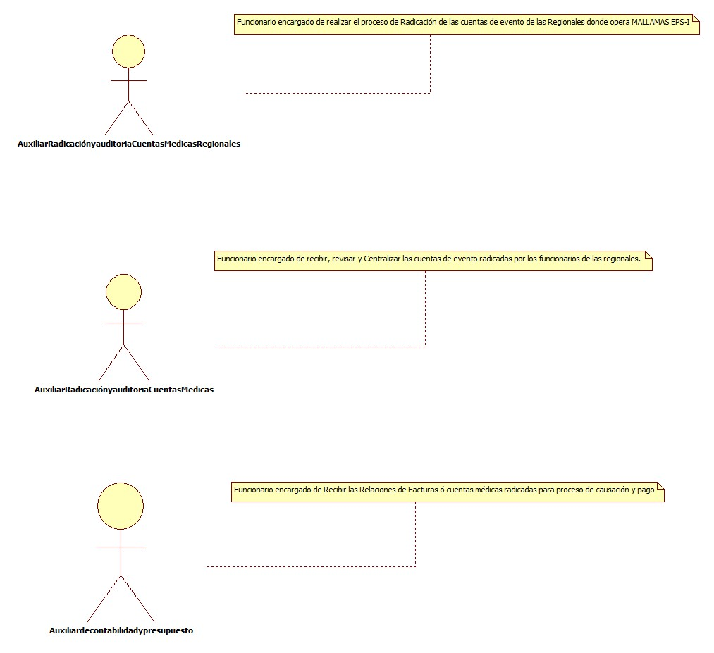
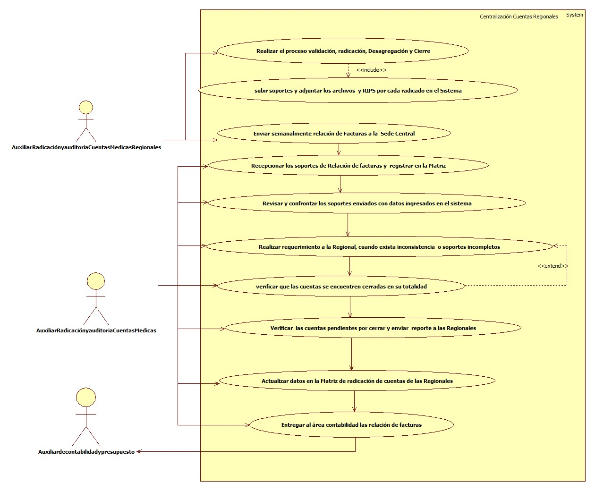
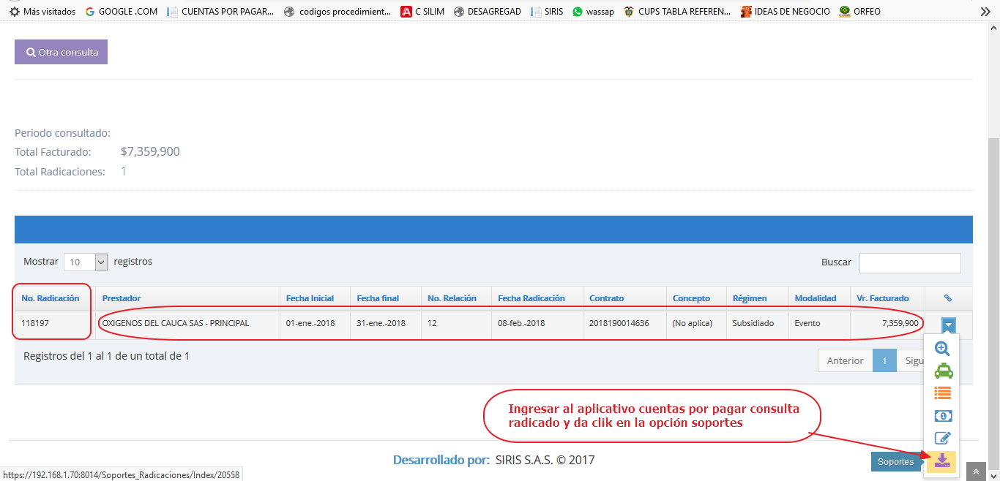
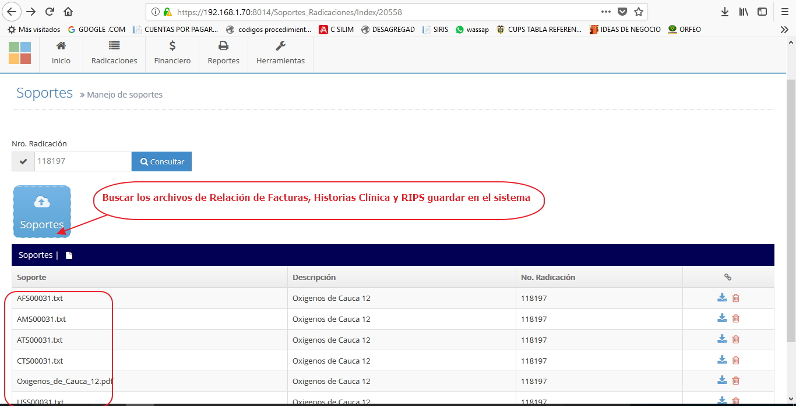
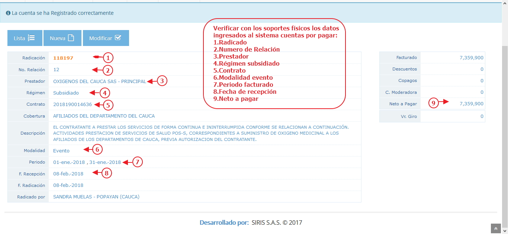

# SISTEMA DE INFORMACIÓN CENTRALIZACIÓN CUENTAS REGIONALES

Centralizar las relaciones de facturas recibidas y radicadas en las Regionales: Pasto, Cali, Villavicencio, Caldas, Amazonas, Popayán, donde opera Mallamas EPS-I para el trámite correspondiente, garantizando la consistencia de la información para el pago de las cuentas.

## 1. MODELADO DEL SISTEMA DE INFORMACIÓN

### 1.1 ACTORES CENTRALIZACIÓN CUENTAS REGIONALES

### 1.2 IDENTIFICACIÓN DE LOS CASOS DE USO CENTRALIZACIÓN CUENTAS REGIONALES

| Número | Procesos del Sistema de Información |
| ------ | ----------------------------------- |
| 1      | Realizar el proceso validación, radicación, Desagregación y Cierre            |
| 2      | subir soportes y adjuntar los archivos  y RIPS por cada radicado en el Sistema       |
| 3      | Enviar semanalmente relación de Facturas a la  Sede Central |
| 4      |Recepcionar los soportes de Relación de facturas y  registrar en la Matriz |
| 5      | Revisar y confrontar los soportes enviados con datos ingresados en el sistema    |
| 6      | Realizar requerimiento a la Regional, cuando exista inconsistencia  o soportes incompletos |
| 7      | verificar que las cuentas se encuentren cerradas en su totalidad |
| 8      | Verificar  las cuentas pendientes por cerrar y enviar  reporte a las Regionales |
| 9      | Actualizar datos en la Matriz de radicación de cuentas de las Regionales |
| 10     | Entregar al área contabilidad las relación de facturas |

### 1.3 DESCRIPCIÓN DEL DIAGRAMA DE CASOS DE USO CENTRALIZACIÓN CUENTAS REGIONALES

| | |
| - | - |
| **1. Caso de Uso** | Centralización cuentas Regionales |
| **2. Descripción** | Realizar proceso centralización de Relaciones de Facturas de las Regionales |
| **3. Actor(es)**   | Auxiliar de Radicación y Auditoria de Cuentas Medicas,Auxiliar de Radicación y Auditoria de Cuentas Medicas Regionales |
| **4. Pre Condiciones** | Cuentas Radicadas y soportes subidos al sistema |
| **5. Pos Condiciones** | Relación de Facturas entregadas a Contabilidad|
| **6. Flujo de Eventos** |
| *Actor(es)* | *Sistema* |
|1. El auxiliar de Radicación y Auditoria de cuentas  de las regionales Realizan el proceso validación, radicación, desagregación y Cierre |    |
|2. El auxiliar de Radicación y Auditoria de cuentas  de las regionales ingresa al aplicativo Cuentas por Pagar  consulta el radicado y da clik en opción subir soportes y adjunta los archivos  de Relación de Facturas y RIPS de todas las cuentas radicadas| 3. Presenta pantalla Subir soportes seleccionar archivos y enviar|
|4. El auxiliar de Radicación y Auditoria de cuentas  de las regionales envían semanalmente a la coordinación  de Radicación y Auditoria de cuentas Medicas Ipiales los soportes originales de las Relaciones de facturas| 
|5.  El auxiliar de Radicación y Auditoria de cuentas Recepcioná los soportes de Relación de facturas originales y registra en la Matriz de Radicación de cuentas Regionales|  |
|6. El auxiliar de Radicación y Auditoria de cuentas hace Revisión y confrontación de: Soportes enviados, valor radicado con el valor reportado, IPS Registrada con  IPS de la Relación de Facturas, actas de devolución  y verifica  en el aplicativo Cuentas Por Pagar dando clik en la opción Consultar radicado|7.  Genera pantalla con todos los datos con que se ingreso al radicar la cuenta |
|8. El auxiliar de Radicación y Auditoria de cuentas Realiza requerimiento a la sede de origen, cuando se presenta inconsistencia en los datos ingresados o soportes incompletos y enviá un correo electrónico con la solicitud pertinente y deja la cuenta en espera|
|9.  El auxiliar de Radicación y Auditoria de cuentas ingresa al aplicativo desagregación de valores y verifica que las cuentas se encuentren cerradas en su totalidad ingresando al desagregador en la opción desagregar valores  |10. Presenta pantalla desagregación cerrada|
|11. El auxiliar de Radicación y Auditoria de cuentas verifica las cuentas pendientes por cerrar y enviá el reporte a las Regionales por correo electrónico|  |
|12. El auxiliar de Radicación y Auditoria de cuentas ingresa el numero de radicado, fecha de radicación, fecha de recepción en la sede Central y la fecha de envió a la coordinación de Contabilidad y presupuesto el la matriz de radicación de cuentas de las Regionales   |
|13. El auxiliar de Radicación y Auditoria de cuentas imprime la relación de facturas revisadas y  hace entrega al área de contabilidad para proceso de Causación y pago|  |
| **7. Requerimiento Asociado** | R001, R002
| **8. Interfaz de Usuario Asociada** | I001,I002,I003,I004 |
| **9. Formato de Usuario Asociado** | F001 |

### 1.4 MODELADO VISUAL DEL CASO DE USO CENTRALIZACIÓN CUENTAS REGIONALES

## 2. ESPECIFICACIÓN DEL SISTEMA DE INFORMACIÓN CENTRALIZACIÓN CUENTAS REGIONALES
| Término | Descripción |
| ------- | ----------- |
| RIPS | Registro Individual prestador de Servicios de Salud             |
| MATRIZ |Conjunto de datos ordenados en filas y columnas              |

## 3. ESPECIFICACIÓN DE REQUERIMIENTOS

| | | |
| - | - | - |
| **N°** | **Tipo** | **Descripción** |
| R001 | Físico | Relación de Facturas  |
| R002 | Físico | Actas de devolución |

## 4. ESPECIFICACIÓN DE LA INTERFACE DE USUARIO

| |
| - |
| **1. Número** |
| I001 |
| **2. Propósito de la Interfaz** |
| Ingresar al sistema buscar radicado|
| **3. Gráfica de la Interfaz**|
|  |

| |
| - |
| **1. Número** |
| I002 |
| **2. Propósito de la Interfaz** |
| Subir y Guardar soportes en el sistema |
| **3. Gráfica de la Interfaz**|
|  |

| |
| - |
| **1. Número** |
| I003 |
| **2. Propósito de la Interfaz** |
| Verificar datos con soportes en sistema |
| **3. Gráfica de la Interfaz**|
|  |

| |
| - |
| **1. Número** |
| I004 |
| **2. Propósito de la Interfaz** |
| Verificar cierre de desagregación |
| **3. Gráfica de la Interfaz**|
|  |

### 4.1 IDENTIFICACIÓN DE PERFILES Y DIÁLOGOS

| |
| - |
| **1. Nombre del Perfil** |
| Administrador del sistema de Radicación y Auditoria de cuentas |
| **2. Opciones a las que tiene Acceso**|
| Radicación de Cuentas Medicas|
| **3. Tipo de Acceso** |
| Registrar, recibir,imprimir informes, radicar,validar,desagregar |

### 4.2 ESPECIFICACIÓN DE FORMATOS DE USUARIO

| Número | Nombre del Formato |
| ------ | ----------------------------------- |
| F001   | Matriz de Registro de cuentas Radicadas Regionales        
