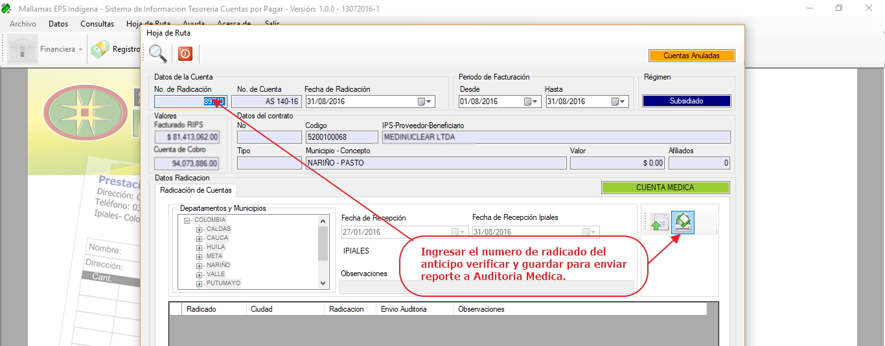

# SISTEMA DE INFORMACIÓN CUENTAS POR PAGO ANTICIPADO

Sistema de información encargado de Generar, controlar y Legalizar los anticipos girados a los prestadores por concepto de prestación de servicios de salud.  

## 1. MODELADO DEL SISTEMA DE INFORMACIÓN

### 1.1 ACTORES RADICACIÓN DE CUENTAS POR PAGO ANTICIPADO

### 1.2 IDENTIFICACIÓN DE LOS CASOS DE USO RADICACIÓN DE CUENTAS POR PAGO ANTICIPADO

| Número | Procesos del Sistema Radicación de Cuentas por pago anticipado|
| ------ | ----------------------------------- |
| 1  |Enviar cotización y autorización de la realización de procedimientos por anticipo      |
| 2  |Entregar  documentación del anticipo con todos los soportes reglamentarios|
| 3  |Verificar soportes con lista de chequeo |
| 4  |Revisar si  los soportes están  completos de lo contrario realiza devolución|
| 5   |Registrar los datos  en la Matriz de anticipos
| 6  |Registrar  en el módulo de radicación de cuentas  y genera radicado|
| 7  |Actualizar  en la Matriz de anticipos el número de radicado |
| 8  |Entregar  los anticipos con los soportes y continué con al procedimiento de auditoría

### 1.3 DESCRIPCIÓN DEL DIAGRAMA DE CASOS DE USO CUENTAS POR PAGO ANTICIPADO

| | | 
| - | - |
| **1. Caso de Uso** |  Radicación de Cuentas por pago anticipado|
| **2. Descripción** |Procedimiento encargado de Generar, controlar  anticipos girados a los prestadores por concepto de prestación de servicios de salud.|
| **3. Actor(es)**| Auxiliar de radicación y Auditoria de Cuentas Medicas,Profesional Universitario de Radicación y Auditoria de Cuentas, Auxiliar de atención al Usuario, Coordinador de Radicación y Auditoria de Cuentas, Prestador|
| **4. Pre Condiciones** |Solicitud Servicio de salud por Anticipo 
| **5. Pos Condiciones** | Cuenta  radicada y enviada a Auditoria |
| **6. Flujo de Eventos** |
| *Actor(es)* | *Sistema* |
|1. El auxiliar de radicación y Auditoria de Cuentas Medicas recepcioná documentación del anticipo de funcionario de Atención al Usuario y verificar soportes  de acuerdo a lista de chequeo|
|2. El auxiliar de radicación y Auditoria de Cuentas Medicas revisa si  los soportes están  completos de lo contrario devolver documentación informando las novedades presentadas|  |
|3. El auxiliar de radicación y Auditoria de Cuentas Medicas registra en la Matriz de anticipos los datos de usuario, prestador, valor anticipado, diagnostico, fecha de entrega. |  |
|4. El auxiliar de radicación y Auditoria de Cuentas Medicas registra  en el módulo de radicación de cuentas   los datos básicos  como Numero de anticipo, fecha de radicación, periodo, valor, prestador   |5. presenta pantalla  radicar nuevo  y genera el número de radicación |
|6. El auxiliar de radicación y Auditoria de Cuentas Medicas actualiza  en la Matriz de anticipos el número de radicado|
|7. El auxiliar de radicación y Auditoria de Cuentas Medicas ingresa al aplicativo hoja de ruta ingresar el radicado y dar clik en nuevo | 8. presenta pantalla radiación cerrada |
|9. El auxiliar de radicación y Auditoria de Cuentas Medicas entrega  el anticipos con los soportes para que continué con al procedimiento de auditoría de cuentas para lo pertinente confrontando los físicos con el reporte de entrega |
| **7. Requerimiento Asociado** | R001,R002,R003,R004|
|**8. Interfaz de Usuario Asociada** | I001, I002  |
|**9. Formato de Usuario Asociado** | F001 |

### 1.4 MODELADO VISUAL DE LOS CASOS DE USO CUENTAS POR PAGO ANTICIPADO

## 2. ESPECIFICACIÓN DEL SISTEMA DE INFORMACIÓN

| Término | Descripción |
| ------- | ----------- |
| Anticipo | Adelantos efectuados en dinero  por la Entidad con el fin de recibir  contraprestación futura de Servicios de Salud de acuerdo con las condiciones pactadas     |
| RIPS     | Registro Individual del Prestación de Servicios de Salud      |
| POSS     | Plan Obligatorio de Salud Subsidiado    |
| NO POS   | Eventos No contemplados en el Plan Obligatorio de Salud   |
|Auxiliar R.A.C.|Auxiliar de radicación y Auditoria de Cuentas|
|P.U.R.A.C  |Profesional Universitario de Radicación y Auditoria de Cuentas|
|Coordinador R.A.C.|Coordinador de Radicación y Auditoria de Cuentas|

## 3. ESPECIFICACIÓN DE REQUERIMIENTOS

| | | |
| - | - | - |
| **N°** | **Tipo** | **Descripción** |
|R001| físico |Solicitud de Anticipo|
|R002| físico |Cotización|
|R003| físico |Historia Clínica|
|R004| físico |Autorización de Servicios|

## 4. ESPECIFICACIÓN DE LA INTERFACE DE USUARIO
| |
| - |
| **1. Número** |
| I001 |
| **2. Propósito de la Interfaz** |
| Radicar anticipo|
| **3. Gráfica de la Interfaz**|
|  |

| |
| - |
| **1. Número** |
| I002 |
| **2. Propósito de la Interfaz** |
| Registrar en Hoja de ruta y guardar para enviar Auditoria|
| **3. Gráfica de la Interfaz**|
|  |

### 4.1 IDENTIFICACIÓN DE PERFILES Y DIÁLOGOS

| |
| - |
| **1. Nombre del Perfil** |
| Administrador sistema  Radicación de cuentas por Pago Anticipado
| **2. Opciones a las que tiene Acceso**|
| Radicación|
| **3. Tipo de Acceso** |
| Registrar, recibir,radicar, imprimir informes|

### 4.2 ESPECIFICACIÓN DE FORMATOS DE USUARIO 
| Número | Nombre del formato|
| ------ | ----------------------- |
| F001     |Lista de chequeo     |