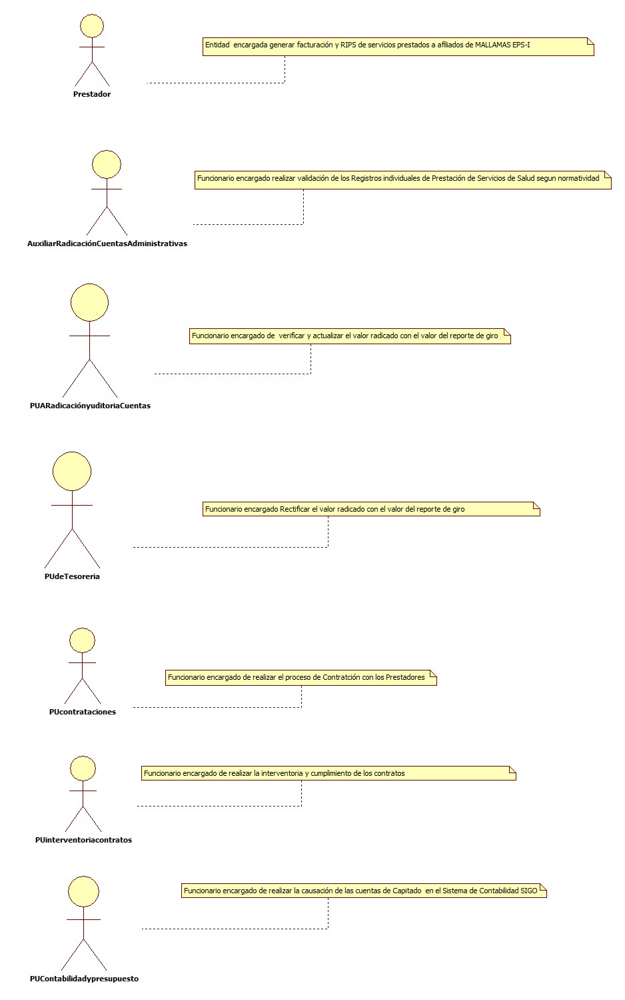
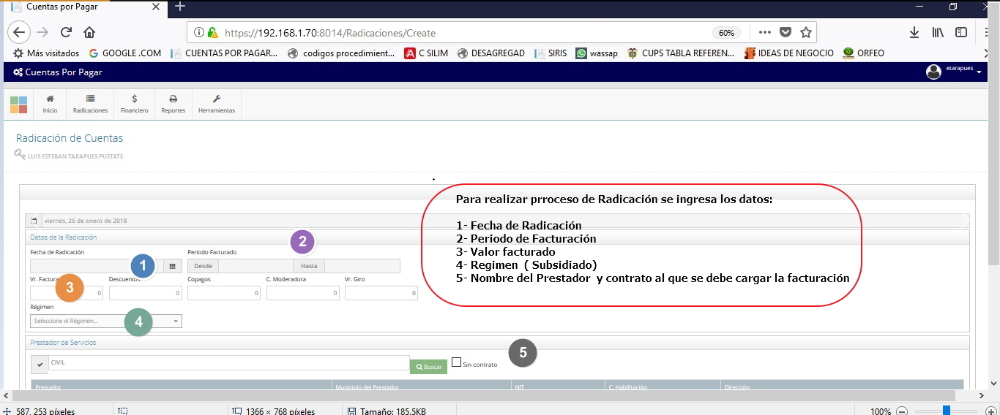
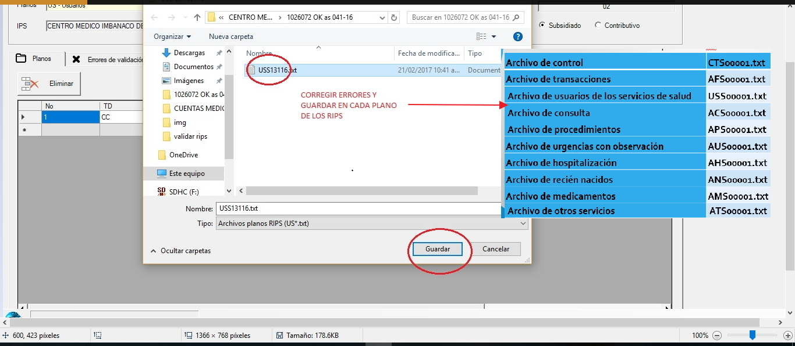
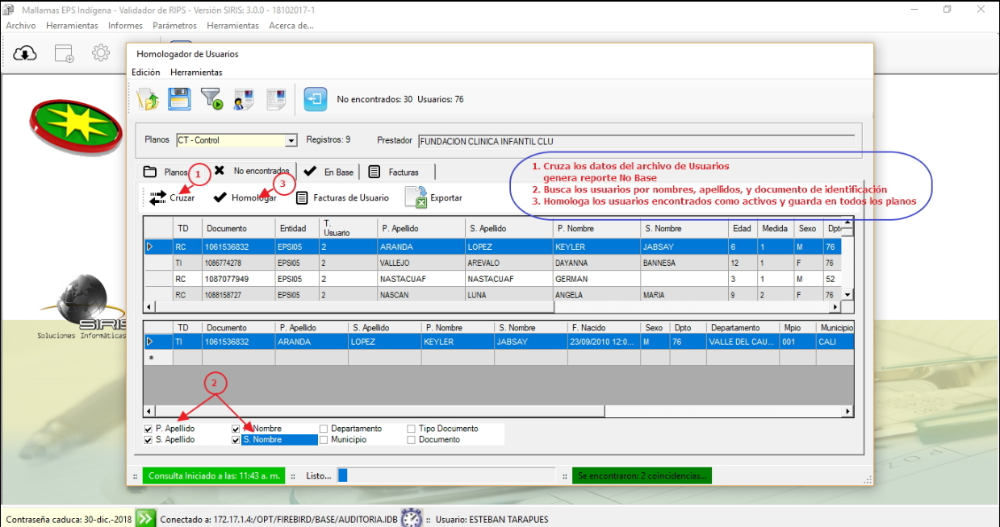
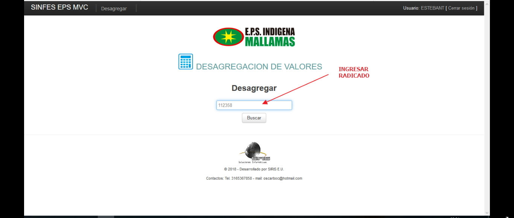

# SISTEMA DE INFORMACIÓN RADICACIÓN DE CUENTAS MEDICAS

Sistema de información encargado de Legalizar el giro directo por capitación, garantizando que la información se encuentre disponible en el sistema para su consulta y procesamiento.

## 1. MODELADO DEL SISTEMA DE INFORMACIÓN

### 1.1 ACTORES LEGALIZACIÓN Y AUDITORIA DE CUENTAS CAPITADO

### 1.2 IDENTIFICACIÓN DE LOS CASOS DE USO LEGALIZACIÓN Y AUDITORIA DE CUENTAS CAPITADO

| Número | Procesos del Sistema de Información |
| ------ | ----------------------------------- |
| 1      | Enviar Formato Reporte de Giro            |
| 2      | Consolidar valores a  radicar        |
| 3      | Radicar y  Registrar la cuentas en el software cuentas por pagar |
| 4      | Entregar formato de giro con radicados a contabilidad y presupuesto     |
| 5      | Enviar RIPS para validación |
| 6      | Recepecionar RIPS de la red  los 10 primeros días hábiles de cada mes |
| 7      |Descargar y  Guardar  RIPS Realizar validación|
| 8      |Validar RIPS|
| 9      |Realiza auditoria de calidad del dato, corregir errores permitidos|
| 10     | Hacer el cruce Homologador Usuarios, generar reporte de afiliados NO BASE |
|11      |Generar reporte de errores e inconsistencias y  enviar a prestador|
|12      |Enviar correcciones para nueva validación|
|13      |Acepta los Rips validados|
|14      |Unificar archivo plano de RIPS, cuando exista mas de uno.|
|15      |Cargar RIPS a través del software de auditoria de RIPS al radicado existente|
|16      |Desagregar facturas  en aplicativo Desagregación de Valores|
|17      |Verificar valor legalizado con RIPS si cumple con el 80% del realizado en el Giro|
|18      |Realizar informe  de las IPS con incumplimiento a contrataciones Interventoria|
|19      |Enviar oficios de Incumplimiento en la entrega de RIPS dirigido al prestador|
|20      |Enviar informe mensual de las IPS con incumplimiento a  contrataciones|

### 1.3 DESCRIPCIÓN DEL DIAGRAMA DE CASOS DE USO LEGALIZACIÓN Y AUDITORIA DE CUENTAS CAPITADO

| | |
| - | - |
| **1. Caso de Uso** | LEGALIZACIÓN Y AUDITORIA DE CUENTAS CAPITADO |
| **2. Descripción** | Realizar proceso de legalización y Auditoria de Cuentas Capitado  |
| **3. Actor(es)**   | Auxiliar de Radicación y Auditoria de cuentas, Prestadores, Profesional universitario de Radicación y Auditoria  de cuentas, Interventor y/o Supervisor de contratos, Profesional universitario de Tesorería, PUContabilidad y Presupuesto, PUContrataciones |
| **4. Pre Condiciones** | Envió Giro desde área de Tesorería |
| **5. Pos Condiciones** | Legalizar con RIPS  el 80% de Giro Realizado|
| **6. Flujo de Eventos** |
| *Actor(es)* | *Sistema* |
|1. Auxiliar de radicación Recibe el reporte de giro desde el área de tesorería|  |
|2. Auxiliar de radicación Consolida  el valor a radicar en la columna correspondiente de formato reporte de giro|  |
|3. Auxiliar de radicación Registrar en el software  cuentas por pagar los datos del giro para obtener numero de radicado |4. Guarda los datos y genera Numero de Radicación |
|5. Auxiliar de radicación Registra numero de radicado en el formato reporte de giro|  |
|6. Auxiliar de radicación entrega formato de giro con numero de radicado al área de contabilidad y presupuesto|
|7. Auxiliar de radicación recepcioná por correo electrónico RIPS de la red prestadora los 10 primeros días hábiles de cada mes  |
|8. Auxiliar de radicación descarga  y grava en la base General de RIPS e ingresa a Validador ingresando a la opción validar nuevo|9. Ingresa a la pantalla abrir Rips
|10. El Auxiliar radicación Ingresa  a pantalla nueva validación|11. Carga archivo CT y demás  generando listado de errores por cada plano de acuerdo a la normatividad
|12. Auxiliar de radicación Realiza  auditoria de calidad del dato, corrige errores  que se permitan en los planos  y da clik en guardar|13. Guarda la corrección y elimina los errores  
|  |14. Genera reporte de errores que no se pueden corregir|
|15. Auxiliar de radicación Realiza entrega del reporte de errores según normatividad al proveedor, estableciendo los motivos de devolución|  |
|16.  Auxiliar de radicación ingresa  al Icono Homologar  usuarios NO BASE |17. Presenta pantalla Homologar usuarios,nueva validación con las opciones de buscar en el plano de control y hacer el cruce inicial
|18. Auxiliar de radicación ingresa nueva validación,busca el archivo de control y realiza el cruce inicial|19. Realiza  el cruce y genera reporte de afiliados NO BASE|
|20. Auxiliar de radicación selecciona el tipo de dato del afiliado para hacer el cruce y da la opción cruzar, verifica si se encuentra activo,y da clik en el icono homologar  de acuerdo a la Base General de Afiliados |21. Guarda los usuarios homologados y genera  informe final de usuarios NO BASE|
|22. Auxiliar de radicación guarda reporte para realizar proceso de devolución de facturas|   |
|23. Auxiliar de radicación Realizar entrega del reporte de errores y/o usuarios no base al proveedor, estableciendo los motivos de devolución|   |
|24. El prestador enviá correcciones de acuerdo las recomendaciones enviadas y acorde a la normatividad.
|25. El Auxiliar de radicación revisa correcciones |  |
|26. El Auxiliar de radicación acepta los Rips validados notificando al prestador por correo electrónico | |
|27. Auxiliar de radicación  unifica en un solo archivo plano los RIPS que tengan actividades que deban ser ser vistas en un archivo cuando aplique |  |
|28. Auxiliar de radicación carga RIPS a través del software de auditoria de RIPS a la radicación existente
|29.  Auxiliar de radicación Registra  información  en la matriz de control de RIPS 
|30. El profesional Universitario de Radicación y Auditoria de Cuentas Desagrega los RIPS recepcionados en aplicativo Desagregación de Valores |31. Presenta pantalla desagregar valores|
|32. El profesional Universitario de Radicación y Auditoria de Cuentas ingresa al aplicativo y desagrega factura por factura enviando los items a los centros de costos definidos de acuerdo Plan Único de cuentas y da clik en enviar item| 33. Guarda y actualiza el reporte de desagregación|
|34. El profesional Universitario de Radicación y Auditoria de Cuentas Confronta el valor registrado en base de giro con valor legalizado con reporte de RIPS|  |
|35. El profesional Universitario de Radicación y Auditoria de Cuentas verifica si El valor legalizado con RIPS  cumple con el 80% del realizado en el giro directo| 
|36.  El profesional Universitario de Radicación y Auditoria de Cuentas Realizar informe mensual de las IPS con incumplimiento a la coordinación de contrataciones (Interventoria de contratos) |
|37. El profesional Universitario de Radicación y Auditoria de Cuentas Verificar mensualmente  matriz de control de  RIPS |  |
|38 . El profesional Universitario de Radicación y Auditoria de Cuentas Realizar oficio dirigido al prestador indicando el incumplimiento en la entrega, y dando como ultima prorroga 3 días hábiles después del aviso |  |
|39. El profesional Universitario de Radicación y Auditoria de Cuentas Realizar oficio dirigido al prestador indicando el incumplimiento en la entrega, y dando como ultima prorroga 3 días hábiles después del aviso|  |
|40. El profesional Universitario de Radicación y Auditoria de Cuentas Recepcioná del prestador los  RIPS  y/o devoluciones en los 3 días hábiles después de realización del oficio de incumplimiento|   |
|41. El profesional Universitario de Radicación y Auditoria de Cuentas En caso de incumplimiento, realiza hasta dos (2) oficios de solicitud de cumplimiento en la entrega de RIPS dirigido al prestador |   |
|42. El profesional Universitario de Radicación y Auditoria de Cuentas Realiza informe mensual de las IPS con incumplimiento a la coordinación de contrataciones|  |
| **7. Requerimiento Asociado** | R001, R002,
| **8. Interfaz de Usuario Asociada** | I001,I002,I003,I004,I005,I006,I007,I008,I009,I010,I011,I012|
| **9. Formato de Usuario Asociado** | F001 |

### 1.4 MODELADO VISUAL DEL CASO DE USO LEGALIZACIÓN Y AUDITORIA DE CUENTAS CAPITADO

## 2. ESPECIFICACIÓN DEL SISTEMA DE INFORMACIÓN LEGALIZACIÓN Y AUDITORIA DE CUENTAS CAPITADO
| Término | Descripción |
| ------- | ----------- |
| RIPS | Registro Individual prestador de Servicios de Salud     |
| MATRIZ |Conjunto de datos ordenados en filas y columnas        |
| GIRO DIRECTO|Es un mecanismo previsto por la Ley 1438 de 2011 a través del cual el Ministerio de Salud y Protección Social gira directamente los recursos del Régimen Subsidiado a los prestadores sin que los recursos pasen por las Administradoras|
|CAPITADO |Pago anticipado de una suma fija que se hace por persona que tendrá derecho a ser atendida por un periodo de tiempo a partir de un grupo de servicios de salud preestablecidos                              |

## 3. ESPECIFICACIÓN DE REQUERIMIENTOS

| | | |
| - | - | - |
| **N°** | **Tipo** | **Descripción** |
| R001 | <Físico/Proceso> | Contratos  |
| R002 |<Físico/Proceso>| RIPS |

## 4. ESPECIFICACIÓN DE LA INTERFACE DE USUARIO

| |
| - |
| **1. Número** |
| I001 |
| **2. Propósito de la Interfaz** |
| Ingreso datos para radicar cuentas capitado |
| **3. Gráfica de la Interfaz**|
| |

| |
| - |
| **1. Número** |
| I002 |
| **2. Propósito de la Interfaz** |
| Guardar y generar Radicado cuenta capitado |
| **3. Gráfica de la Interfaz**|
| |

| |
| - |
| **1. Número** |
| I003 |
| **2. Propósito de la Interfaz** |
| Ingresa aplicativo Validador de RIPS y busca los Archivos planos para validación|
| **3. Gráfica de la Interfaz**|
|  |

| |
| - |
| **1. Número** |
| I004 |
| **2. Propósito de la Interfaz** |
| Visualizar errores de validación |
| **3. Gráfica de la Interfaz**|
|  |

| |
| - |
| **1. Número** |
| I005 |
| **2. Propósito de la Interfaz** |
| Corregir y guardar errores permitidos |
| **3. Gráfica de la Interfaz**|
| |

| |
| - |
| **1. Número** |
| I006 |
| **2. Propósito de la Interfaz** |
| Realizar proceso de nueva Homologación de Usuarios  |
| **3. Gráfica de la Interfaz**|
| |

| |
| - |
| **1. Número** |
| I007 |
| **2. Propósito de la Interfaz** |
| Buscar afiliados activos y Homologar  |
| **3. Gráfica de la Interfaz**|
| |

| |
| - |
| **1. Número** |
| I008 |
| **2. Propósito de la Interfaz** |
| Buscar y Cargar Rips para validación |
| **3. Gráfica de la Interfaz**|
| |

| |
| - |
| **1. Número** |
| I009 |
| **2. Propósito de la Interfaz** |
| Subir y guardar los RIPS al radicado existente |
| **3. Gráfica de la Interfaz**|
| |

| |
| - |
| **1. Número** |
| I010 |
| **2. Propósito de la Interfaz** |
| Ingresar con el radicado al aplicativo Desagregación de Valores |
| **3. Gráfica de la Interfaz**|
| |

| |
| - |
| **1. Número** |
| I011 |
| **2. Propósito de la Interfaz** |
| Desagregar las facturas por Centros de Costo |
| **3. Gráfica de la Interfaz**|
| |

| |
| - |
| **1. Número** |
| I012 |
| **2. Propósito de la Interfaz** |
| Generar Desagregación de Valores  y cerrar Radicación|
| **3. Gráfica de la Interfaz**|
| |

### 4.1 IDENTIFICACIÓN DE PERFILES Y DIÁLOGOS

| |
| - |
| **1. Nombre del Perfil** |
| Administrador radicación y Auditoria de cuentas Medicas |
| **2. Opciones a las que tiene Acceso**|
| Radicación de Cuentas |
| **3. Tipo de Acceso** |
| Registrar,modificar,imprimir reportes,validar,radicar,desagregar |

### 4.2 ESPECIFICACIÓN DE FORMATOS DE USUARIO

| Número | Nombre del Formato |
| ------ | ----------------------------------- |
| F001   | Formato Reporte de Giro         
